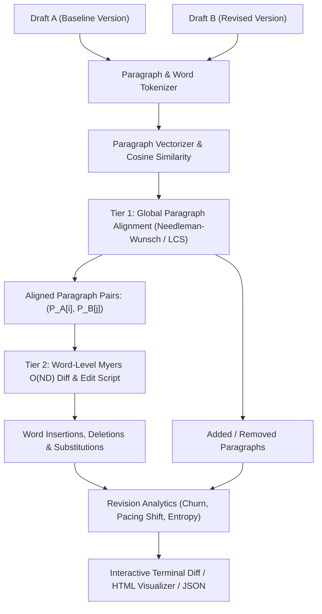
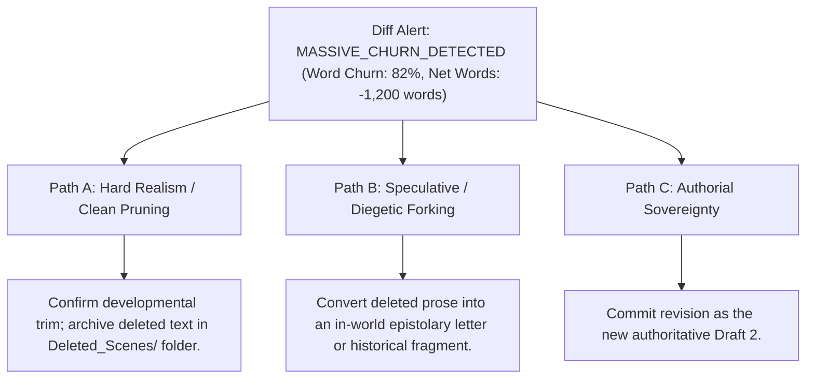

# Manuscript Semantic Diff Engine & Prose Revision Analytics (`docs/MANUSCRIPT_DIFF.md`)
> **Domain D: Stylistics, Polish & Continuity** | **CLI:** `arcanum diff` / `arcanum prose-diff`

---

## 1. Overview & Theoretical Rationale

The **Ars Arcanum Manuscript Diff Engine** (`scripts/lib/manuscript_diff.py`) is an offline, semantic prose comparison, word-level edit distance tracker, and revision velocity analyzer engineered for novelists, developmental editors, and literary scholars.

Standard software diffing tools (such as Unix `diff`, `git diff`, or graphical code comparators) operate primarily on discrete line-break boundaries (`\n`). In prose manuscripts, paragraphs are often formatted as single continuous lines or wrapped soft paragraphs. Consequently, inserting a single adjective or fixing a typo alters paragraph line-wraps across hundreds of words, producing noisy, unreadable red-and-green diff blocks that obscure what was actually changed.

```
+-------------------------------------------------------------------------------+
|                       PROSE DIFF VS CODE LINE DIFF                            |
|                                                                               |
|  Traditional Line Diff (Broken Wrap):                                         |
|  - The ancient stone fortress loomed against the stormy sky, its dark granite |
|  - ramparts cracked with time and moss.                                       |
|  + The ancient stone fortress loomed against the violent stormy sky, its dark |
|  + granite ramparts cracked with obsidian veins and ancient moss.             |
|  [Result: Entire 30-word paragraph flagged as 100% deleted and re-inserted]  |
|                                                                               |
|  Ars Arcanum Semantic Word Diff (Precise Token Alignment):                    |
|  The ancient stone fortress loomed against the [++violent++] stormy sky, its  |
|  dark granite ramparts cracked with [~~time~~ -> ++obsidian veins++] and      |
|  [++ancient++] moss.                                                          |
|  [Result: Exact word insertions/replacements highlighted at 0% line noise]    |
+-------------------------------------------------------------------------------+
```

The Manuscript Diff Engine solves this problem by executing a two-tier sequence alignment algorithm:
1. **Tier 1 (Macro Structural Alignment)**: Pairs corresponding paragraphs between Draft A and Draft B using Longest Common Subsequence (LCS) and cosine semantic similarity.
2. **Tier 2 (Micro Word-Level Diff)**: Executes Eugene Myers' $O(ND)$ shortest edit script algorithm on word and punctuation token streams within each paired paragraph.

---

## 2. Mathematical Formalism & Sequence Alignment Algorithms



### 2.1 Tier 1: Paragraph-Level Alignment (Longest Common Subsequence)
Let $A = \langle P_1^A, P_2^A, \dots, P_m^A \rangle$ and $B = \langle P_1^B, P_2^B, \dots, P_n^B \rangle$ represent the sequences of paragraphs in the two drafts.

The alignment matrix $M[i, j]$ evaluates paragraph similarity:

$$M[i, j] = \max \begin{cases} M[i-1, j-1] + \text{Sim}(P_i^A, P_j^B) \\ M[i-1, j] - \text{Gap} \\ M[i, j-1] - \text{Gap} \end{cases}$$

Where paragraph similarity $\text{Sim}(P_A, P_B)$ is computed via Jaccard token overlap:
$$\text{Sim}(P_A, P_B) = \frac{|\text{Tokens}(P_A) \cap \text{Tokens}(P_B)|}{|\text{Tokens}(P_A) \cup \text{Tokens}(P_B)|}$$

### 2.2 Tier 2: Word-Level Myers $O(ND)$ Difference Algorithm
Within an aligned paragraph pair, let $U = \langle u_1, u_2, \dots, u_N \rangle$ and $V = \langle v_1, v_2, \dots, v_M \rangle$ be the word token sequences.

The algorithm traverses an edit graph grid from $(0,0)$ to $(N,M)$, where a horizontal edge represents deletion, a vertical edge represents insertion, and a diagonal edge represents matching tokens.

```
Myers Edit Graph:
        u1(The)    u2(dark)    u3(sky)
    (0,0) ------> (1,0) ------> (2,0) ------> (3,0)
      |             |             |             |
v1(The) \ Match     |             |             |
      v             v             v             v
    (0,1) ------> (1,1) ------> (2,1) ------> (3,1)
      |             |             |             |
v2(violent)         |             |             |
      v             v             v             v
    (0,2) ------> (1,2) ------> (2,2) ------> (3,2)
```

The furthest reaching path on diagonal $k = x - y$ after $D$ edit steps is computed inductively:

$$x = \begin{cases} V[k+1] & \text{if } k = -D \text{ or } (k \ne D \text{ and } V[k-1] < V[k+1]) \\ V[k-1] + 1 & \text{otherwise} \end{cases}$$
$$y = x - k$$

Following the maximal diagonal extension while $u_{x+1} = v_{y+1}$:
$$\text{while } x < N \text{ and } y < M \text{ and } u_{x+1} = v_{y+1}: \quad x \gets x + 1, \quad y \gets y + 1$$

### 2.3 Revision Velocity & Churn Mathematics
The engine quantifies authorial revision intensity using four key metrics:

$$\text{Net Expansion Ratio} = \frac{W_B - W_A}{W_A} \times 100\%$$

$$\text{Word Churn Metric} = \frac{\text{Insertions} + \text{Deletions}}{\max(W_A, W_B)} \times 100\%$$

$$\text{Edit Efficiency Index} = \frac{|W_B - W_A|}{\text{Insertions} + \text{Deletions}} \in [0.0, 1.0]$$

$$\text{Revision Entropy} = -\sum_{c \in \{\text{Ins}, \text{Del}, \text{Sub}\}} p_c \log_2 p_c$$

---

## 3. Subfeatures & Reporting Capabilities

| Subfeature | Algorithmic Mechanism | Output / Report | Narrative Craft Significance |
|---|---|---|---|
| **Word-Level Token Diff** | Myers $O(ND)$ on whitespace/punctuation tokens. | Inline terminal highlighting (`++word++`, `~~word~~`). | Eliminates line-wrap noise in long prose paragraphs. |
| **Paragraph Block Reordering** | Hirschberg LCS block-move detector. | Flags `[MOVED PARAGRAPH: Lines 45-60 -> Lines 12-27]`. | Detects scene restructuring and dialogue beat reordering. |
| **Dialogue vs Prose Segregation** | AST isolates quoted strings (`“...”`) before diffing. | Separate churn metrics for Dialogue vs Exposition. | Evaluates whether author revised character voice or background descriptions. |
| **Snapshot History Diffing** | Compares active working tree against git tags/snapshots. | Historical revision velocity graphs. | Tracks progress across multiple editorial passes (Draft 1 -> Draft 2). |
| **Standout Deletion Alert** | Flags sudden deletions of $> 500$ words. | Diagnostic warning and backup confirmation. | Prevents accidental cut-and-paste loss of key scenes. |

---

## 4. CLI Execution & Option Reference

```bash
# 1. Compare two draft files at the word level
arcanum diff Manuscripts/Book-01/Chapter_01_Draft1.md Manuscripts/Book-01/Chapter_01_Draft2.md

# 2. Compare active manuscript against a Git snapshot or commit
arcanum diff Manuscripts/Book-01/Chapter_01.md --snapshot v1.0-alpha

# 3. Export standalone interactive HTML comparison report
arcanum diff Chapter_01_Draft1.md Chapter_01_Draft2.md -o dist/diff_Chapter01.html --format html

# 4. Output detailed mathematical churn metrics as JSON
arcanum diff Chapter_01_Draft1.md Chapter_01_Draft2.md --json

# 5. Isolate changes to dialogue only
arcanum diff Chapter_01_Draft1.md Chapter_01_Draft2.md --dialogue-only
```

### Options & Parameter Reference Table

| Flag / Option | Short | Type | Default | Description |
|---|---|---|---|---|
| `file_a` | (Positional) | `Path` | *Required* | Baseline manuscript file or directory. |
| `file_b` | (Positional) | `Path` | *Optional* | Target manuscript file to compare against. |
| `--snapshot` | `-s` | `str` | `None` | Git ref or snapshot ID to diff against current file. |
| `--format` | `-f` | `choice` | `terminal` | Output format: `terminal`, `html`, `json`, `unified`. |
| `--output` | `-o` | `Path` | `stdout` | Destination file for exported diff reports. |
| `--dialogue-only`| `-d` | `bool` | `False` | Filters diff to spoken character dialogue. |
| `--min-similarity`| `-m` | `float` | `0.40` | Minimum threshold for paragraph pairing. |

---

## 5. Tri-Fold Creative Advisory Resolutions



### Scenario: Heavy Scene Deletion Alert
- **Path A (Hard Realism / Clean Pruning)**:
  - The author made a heavy developmental cut to tighten pacing. Automatically extract deleted paragraphs into `Archive/Cut_Scenes/Chapter_01_Pruned.md` before committing.
- **Path B (Speculative / Diegetic Transmutation)**:
  - Repurpose the deleted exposition as an in-world excerpt from a historical diary or forbidden manuscript in the lore vault.
- **Path C (Authorial Sovereignty)**:
  - Acknowledge the high churn as a successful aggressive line edit and update word count milestones accordingly.

### 5.1 In-Vault Revision Tooling: Obsidian Commentator & Global Search & Replace
- **Obsidian Commentator (CriticMarkup)**: For inline line editing, track-changes suggestions, and marginal comments directly inside Obsidian notes using `{++additions++}`, `{--deletions--}`, and `{~~substitutions~>new~~}` syntax. See [Commentator Guide](file:///docs/guides/EXTERNAL_TOOLS_AND_PLUGINS.md#1-commentator-criticmarkup-track-changes).
- **Obsidian Global Search and Replace**: For vault-wide entity refactoring with side-by-side diff previews. See [Global Search & Replace Guide](file:///docs/guides/EXTERNAL_TOOLS_AND_PLUGINS.md#3-global-search-and-replace).

---

## 6. Recommended Reading, References & Media

### 6.1 Foundational Treatises & Difference Algorithms
- **Myers, Eugene W. (1986)**. "An $O(ND)$ Difference Algorithm and Its Variations", *Algorithmica*, 1(2):251–266. [DOI: 10.1007/BF01840446](https://doi.org/10.1007/BF01840446).  
  *The landmark paper that defined shortest edit script computation and graph traversal across diffing engines.*
- **Hirschberg, Daniel S. (1975)**. "A Linear Space Algorithm for Computing Maximal Common Subsequences", *Communications of the ACM*, 18(6):341–343. [DOI: 10.1145/360825.360861](https://doi.org/10.1145/360825.360861).  
  *The foundational divide-and-conquer algorithm enabling linear-space sequence alignment.*
- **Hunt, James W. & McIlroy, M. Douglas (1976)**. *An Algorithm for Differential File Comparison*. Computing Science Technical Report 41, Bell Laboratories.  
  *The original Unix diff algorithm treatise based on LCS.*
- **Levenshtein, Vladimir I. (1966)**. "Binary Codes Capable of Correcting Deletions, Insertions, and Reversals", *Soviet Physics Doklady*, 10(8):707–710.  
  *Mathematical formulation of minimum edit distance over discrete sequences.*

### 6.2 Narrative Revision & Editorial Craft Treatises
- **Bell, James Scott (2008)**. *Revision & Self-Editing for Publication*. Writer's Digest Books. ISBN: 978-1582975085.  
  *The authoritative guide to structural editing, macro-scene trimming, and line-level word churn analysis.*
- **Browne, Renni & King, Dave (2004)**. *Self-Editing for Fiction Writers: How to Edit Yourself Into Print* (2nd Edition). HarperCollins. ISBN: 978-0060545697.  
  *Essential techniques for identifying dialogue bloat, exposition dumps, and POV violations during revision passes.*

### 6.3 Video Lectures, Masterclasses & Technical Media
- **Computerphile**: *How Git Diff & Shortest Edit Script Work: The Myers Algorithm*.  
  *Visual breakdown of dynamic programming grids, diagonal diagonals $k = x - y$, and search depth.*
- **Brandon Sanderson's BYU Creative Writing Lectures**: *Lecture 13: Revision passes, Macro/Micro Edits, and Working with Feedback*.  
  *Step-by-step breakdown of five-pass manuscript editing (structural, character, continuity, line, polish).*
- **Writing Excuses**: *Season 10, Episode 1: Structuring a Revision Pass*.  
  *Strategies for managing massive word churn and rewriting pivotal scenes.*

### 6.4 Landmark Speculative Case Studies
- **Tolkien, J.R.R. & Tolkien, Christopher**: *The History of The Lord of the Rings* (Volumes 6–9 of *The History of Middle-earth*).  
  *Exhaustive, word-level historical diff analysis showing the step-by-step textual evolution of Middle-earth drafts from early concepts to final prose.*
- **Sanderson, Brandon**: *Warbreaker* (Published with full public draft progression: Draft 1 -> Draft 6). Dragonsteel.  
  *Open-source novel revision history demonstrating word churn, character arc consolidation, and pacing rewrites.*
- **Austen, Jane**: *First Impressions* $\to$ *Pride and Prejudice* (Manuscript revisions and structural tightening).  
  *Classic example of dramatic editorial trimming to sharpen wit and pacing.*
