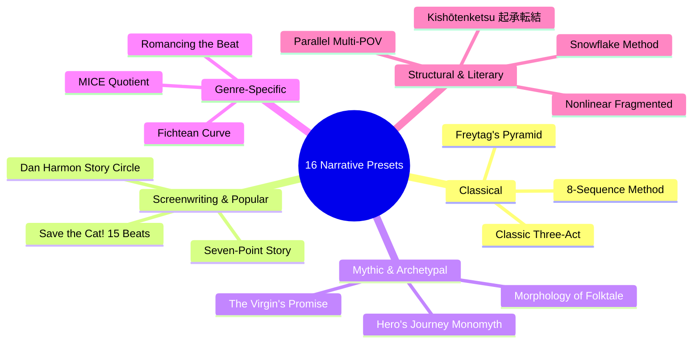
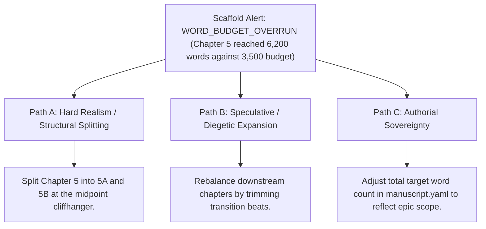

# Manuscript Architecture Scaffolder & Archetype Presets (`docs/MANUSCRIPT_SCAFFOLD.md`)
> **Domain B: Narrative Architecture, Structure & Dynamics** | **CLI:** `arcanum scaffold` / `arcanum init-book`

---

## 1. Overview & Architectural Rationale

The **Ars Arcanum Manuscript Scaffolding Engine** (`scripts/lib/manuscript_scaffold.py`) is an offline project bootstrapping suite, narrative architecture generator, structural beat calculator, and chapter metadata initializer engineered for novelists, serial fiction authors, screenwriters, and multi-volume series architects.

Starting a long-form novel from an empty folder frequently leads to common structural pathologies:
1. **Pacing Debt & Structural Drift**: Writing without predetermined pacing milestones leads to bloated first acts, sagging middles ("Act II depression"), and rushed, unearned climaxes.
2. **Metadata Incoherence**: Drafting chapters with inconsistent frontmatter headers (`@pov`, `@timeline`, `@thread`, `@status`) breaks downstream timeline synchronization, story canvas rendering, and revision heatmaps.
3. **Blank-Page Paralysis**: Starting a new chapter without explicit dramatic goals, obstacles, and thematic questions stalls creative velocity.
4. **Filesystem Security Flaws**: Naive scaffolding tools that accept unvalidated user input can introduce directory traversal vulnerabilities (`../`) or invalid POSIX characters.

```
+-------------------------------------------------------------------------------+
|                    ARS ARCANUM MANUSCRIPT SCAFFOLDER                          |
|                                                                               |
|  +--------------------+     POSIX Path Sanitizer      +--------------------+  |
|  | User Input: Title, | ----------------------------> | Clean Target Path  |  |
|  | Target Words W_tgt |                               | Directory Tree     |  |
|  +--------------------+                               +--------------------+  |
|            |                                                    |             |
|            v                                                    v             |
|  [Select 1 of 16 Presets]                             [Beat Math Calculator]  |
|  (Save the Cat, Monomyth)                             (Target Word Allocations|
|            |                                                    |             |
|            +----------------------------------------------------+             |
|                                     |                                         |
|                                     v                                         |
|                   +-----------------------------------+                       |
|                   |  Atomic Chapter Scaffold Files    |                       |
|                   |  Pre-Seeded YAML Frontmatter      |                       |
|                   |  Dramatic Objectives & Milestones |                       |
|                   +-----------------------------------+                       |
|                                     |                                         |
|                                     v                                         |
|                     [Production-Ready Manuscript Tree]                        |
|                     [Zero-Cloud Sovereign Generation]                         |
+-------------------------------------------------------------------------------+
```

The Scaffolding Engine generates atomic, POSIX-compliant project directory hierarchies pre-populated with chapter templates, structural prompts, and standardized YAML metadata across **16 canonical narrative paradigms**.

---

## 2. Mathematical Formalism & Beat Proportion Equations

### 2.1 Target Word Count Allocation
For a manuscript with total target word count $W_{\text{target}}$ and $N$ structural acts/divisions with fractional weights $\{w_1, w_2, \dots, w_N\}$ where $\sum_{i=1}^N w_i = 1.0$:

$$\text{Target Words}(\text{Division}_i) = \lfloor W_{\text{target}} \times w_i \rfloor$$

For any specific dramatic beat $B_k$ situated at canonical milestone percentage $p_k \in [0.0, 1.0]$:

$$\text{Target Cumulative Milestone}(B_k) = \lfloor W_{\text{target}} \times p_k \rfloor$$

If Division $i$ is planned for $C_i$ discrete chapters, the target word budget per chapter is:

$$\overline{W}_{\text{chapter}}(i) = \frac{\text{Target Words}(\text{Division}_i)}{C_i}$$

```
Word Allocation Waveform (e.g. 100,000-word novel):
Cumulative Words
 100k |                                                        [Climax / Res]
      |                                              [All Hope Lost]
  50k |                              [Midpoint Shift]
      |               [Catalyst / Break into Two]
   0k +-------+--------------+---------------+---------------+---------------> Beats
             0%             20%             50%             75%           100%
```

---

## 3. The 16 Pluggable Narrative Framework Presets



### Preset Breakdown & Beat Proportions

| Preset ID | Paradigm Name | Core Focus / Philosophy | Key Milestones & Proportions |
|---|---|---|---|
| `three_act` | **Classic Three-Act Structure** | Universal dramatic setup, confrontation, resolution. | Act I (25%), Act II-A (25%), Act II-B (25%), Act III (25%). |
| `save_the_cat` | **Save the Cat! (Blake Snyder)** | 15 commercial beats with emotional arc progression. | Catalyst (10%), Break into Two (20%), Midpoint (50%), All Hope Lost (75%), Finale (85–100%). |
| `heros_journey` | **Hero's Journey / Monomyth** | Campbell/Vogler 12-stage archetypal transformation. | Ordinary World (0%), Threshold (25%), Ordeal (50%), Resurrection (85%). |
| `story_circle` | **Dan Harmon Story Circle** | 8-step psychological individuation loop. | 1.You, 2.Need, 3.Go, 4.Search, 5.Find, 6.Take, 7.Return, 8.Change (12.5% each). |
| `freytag` | **Freytag's Dramatic Pyramid** | Classical tragedy / dramatic tension curve. | Exposition (15%), Rising Action (35%), Climax (50%), Falling Action (75%), Catastrophe (100%). |
| `sequence_8` | **8-Sequence Method (Gulino)** | Screenplay-driven 15-minute narrative mini-dramas. | 8 balanced sequences (~12.5% each), two sequences per half-act. |
| `seven_point` | **Seven-Point Structure (Dan Wells)**| Symmetrical plot turn and pinch-point architecture. | Hook (0%), Plot Turn 1 (15%), Pinch 1 (30%), Midpoint (50%), Pinch 2 (70%), Plot Turn 2 (85%), Resolution (100%). |
| `kishotenketsu`| **Kishōtenketsu (起承転結)** | Conflict-free Eastern narrative progression. | Ki/Intro (25%), Shō/Development (25%), Ten/Twist (25%), Ketsu/Reconciliation (25%). |
| `fichtean` | **Fichtean Curve** | Escalating series of crises building directly to climax. | Crisis 1 (20%), Crisis 2 (40%), Crisis 3 (60%), Crisis 4 (80%), Master Climax (90%), Denouement (100%). |
| `romance_beat` | **Romancing the Beat (Gwen Hayes)**| Phased romantic emotional bonding and vulnerability. | Meet (5%), No Way (20%), Falling (40%), Inkling of Doubt (60%), Deep Doo-Doo (75%), HEA (95%). |
| `mice_quotient`| **MICE Quotient (Orson Scott Card)**| Nested narrative threads by category. | Milieu (outermost), Idea, Character, Event (innermost) - FIFO / LIFO thread closure. |
| `virgins_promise`| **The Virgin's Promise (Kim Hudson)**| Feminine archetypal individuation arc. | Dependent World (10%), Secret World (30%), Secret Discovered (60%), Kingdom Transformed (90%). |
| `snowflake` | **Snowflake Method (Randy Ingermanson)**| Iterative top-down structural expansion. | Core Sentence $\to$ Paragraph $\to$ Character Arcs $\to$ 4-Page Synopsis $\to$ Scene Table. |
| `multi_pov` | **Parallel / Multi-POV Braided Matrix**| Synchronized multi-character POVs with temporal anchors.| Alternating POV swimlanes converging at major plot turns (33%, 66%, 100%). |
| `episodic` | **Episodic / Picaresque Structure**| Standalone episodic quests with macro-arc growth. | Self-contained 5k-8k word episodes unified by overarching faction goals. |
| `nonlinear` | **Nonlinear / Anachronic Timeline**| Dual-track Fabula vs Syuzhet timeline matrix. | Present Day Framing (50%) interleaved with Historical Flashbacks (50%). |

---

## 4. Chapter Template Architecture & Frontmatter Schema

When a project is scaffolded, each generated chapter file is pre-populated with standard YAML frontmatter:

```markdown
---
title: "Chapter 01: The Ashen Threshold"
chapter_number: 1
part: "Act I: Departure"
beat: "Opening Image / Inciting Catalyst"
target_words: 3500
current_words: 0
pov_character: "Kaelen Vane"
setting: "The Broken Spire of High Vale"
timeline_day: 1
timeline_time: "06:00 Solar"
plot_threads:
  - "main_quest_seal"
  - "kaelen_brother_mystery"
status: "draft"
---

# Chapter 01: The Ashen Threshold

> **Dramatic Beat Objective**: Establish the protagonist's Ordinary World, demonstrate their core flaw, and introduce the disruptive anomaly that shatters normalcy.

## Scene 1: The Ritual of the Dawn

<!-- Draft scene prose below -->

```

---

## 5. CLI Command Reference & Workflows

```bash
# 1. Initialize a new novel using Save the Cat preset (90,000 words target)
arcanum scaffold Manuscripts/The-Solar-Crown --preset save_the_cat --target-words 90000

# 2. Scaffold a fantasy trilogy with Three-Act structure and custom author metadata
arcanum scaffold Manuscripts/Chronicles-of-Vaelen --preset three_act --author "Valerius Vance"

# 3. Scaffold using Eastern Kishōtenketsu structure (4 acts, 60,000 words)
arcanum scaffold Manuscripts/Silent-Mountain --preset kishotenketsu --target-words 60000

# 4. Scaffold romance novel with Romancing the Beat preset
arcanum scaffold Manuscripts/Heart-of-Aether --preset romance_beat --target-words 75000

# 5. Dry-run preview of folder hierarchy without creating files
arcanum scaffold Manuscripts/Test-Project --preset heros_journey --dry-run
```

### CLI Option Reference Table

| Parameter | Short | Type | Default | Description |
|---|---|---|---|---|
| `project_dir` | (Positional) | `Path` | *Required* | Destination directory for new manuscript. |
| `--preset` | `-p` | `choice` | `three_act` | Structural preset (one of the 16 canonical paradigms). |
| `--target-words` | `-w` | `int` | `80000` | Target total manuscript word count. |
| `--chapters` | `-c` | `int` | `30` | Target number of chapters to scaffold. |
| `--author` | `-a` | `str` | `""` | Author name for manuscript metadata. |
| `--dry-run` | `-d` | `bool` | `False` | Prints file tree layout without writing to disk. |

---

## 6. Tri-Fold Creative Advisory Resolutions



### Scenario: Chapter Word Budget Overrun
- **Path A (Hard Realism / Structural Splitting)**:
  - The scene expanded beyond standard chapter bounds. Locate the scene climax at word 3,200 and split into two chapters (`Chapter 5: The Incursion` and `Chapter 6: The Aftermath`).
- **Path B (Pacing Rebalance)**:
  - Keep the extended chapter as an intentional "Tentpole Setpiece" and reduce target word counts for adjacent reflective cool-down chapters.
- **Path C (Authorial Sovereignty)**:
  - Update `target_words` in `manuscript.yaml` to accommodate an organic increase in story scope.

---

## 7. Recommended Reading, References & Media

### 7.1 Foundational Narrative Theory & Structural Treatises
- **Aristotle (c. 335 BCE)**. *Poetics* (trans. Malcolm Heath, Penguin Classics, 1996).  
  *The foundational treatise on dramatic unity, mimesis, hamartia, and three-part beginning-middle-end architecture.*
- **Campbell, Joseph (1949)**. *The Hero with a Thousand Faces*. Pantheon Books.  
  *The defining comparative mythology work establishing the universal 12-stage Monomyth.*
- **Field, Syd (1979)**. *Screenplay: The Foundations of Screenwriting*. Dell Publishing.  
  *The foundational paradigm establishing Act I (25%), Act II (50%), and Act III (25%) structural proportions.*
- **Snyder, Blake (2005)**. *Save the Cat! The Last Book on Screenwriting You'll Ever Need*. Michael Wiese Productions.  
  *The definitive 15-beat narrative pacing sheet used widely across fiction and film.*
- **Vogler, Christopher (2007)**. *The Writer's Journey: Mythic Structure for Writers* (3rd Edition). Michael Wiese Productions.  
  *Practical translation of Campbellian myth into fiction novel crafting.*

### 7.2 Advanced Narrative Archetypes & Craft Handbooks
- **Gulino, Paul Joseph (2004)**. *Screenwriting: The Sequence Approach*. Continuum.  
  *The 8-sequence paradigm breaking down dramatic feature length into sustainable mini-arcs.*
- **Card, Orson Scott (1988)**. *Characters & Viewpoint*. Writer's Digest Books.  
  *Codification of the MICE Quotient (Milieu, Idea, Character, Event) for structural story nesting.*
- **Hayes, Gwen (2016)**. *Romancing the Beat: Story Structure for Romance Writers*.  
  *The gold standard for romantic progression and emotional vulnerability milestones.*
- **Hudson, Kim (2010)**. *The Virgin's Promise: Writing Stories of Feminine Creative and Spiritual Awakening*. Michael Wiese Productions.  
  *The archetypal structural counterpart to the Hero's Journey focusing on self-actualization.*
- **Ingermanson, Randy (2014)**. *How to Write a Novel Using the Snowflake Method*. Advanced Fiction Writing.  
  *Systematic fractal expansion from one sentence to complete manuscript.*
- **Propp, Vladimir (1928)**. *Morphology of the Folktale*. University of Texas Press.  
  *Structuralist analysis of narrative functions and character dramatis personae roles.*

### 7.3 Video Lectures, Masterclasses & Writing Media
- **Brandon Sanderson's BYU Creative Writing Lectures**: *Lecture 2: Plotting and Narrative Structure (Three-Act, Seven-Point, Hero's Journey)*.  
  *Exhaustive masterclass on structural archetypes, promise-progress-payoff loops, and pacing curves.*
- **Dan Wells**: *Seven-Point Story Structure Masterclass (WorldCon / YouTube)*.  
  *The famous lecture series detailing how to structure novels starting from the resolution backwards.*
- **Tale Foundry**: *The 7 Basic Plots & Story Anatomy*.  
  *Narrative deep dive into Christopher Booker's basic plot archetypes and story circles.*
- **Hello Future Me (Tim Hickson)**: *On Writing: Story Structure, Pacing, and Dramatic Tension*.  
  *Practical video essays on act breaks, midpoints, and subplot braiding.*

### 7.4 Landmark Speculative Case Studies
- **Sanderson, Brandon**: *Mistborn: The Final Empire*. Tor Books.  
  *Masterclass implementation of the Seven-Point Story Structure combined with a classic heist/revolution paradigm.*
- **Lucas, George**: *Star Wars: Episode IV – A New Hope* (1977).  
  *The quintessential textbook cinematic realization of Joseph Campbell's Hero's Journey.*
- **Miyazaki, Hayao**: *Spirited Away* (Studio Ghibli, 2001).  
  *Exemplar of Eastern Kishōtenketsu narrative structure prioritizing character journey and tonal harmony over binary Western conflict.*
