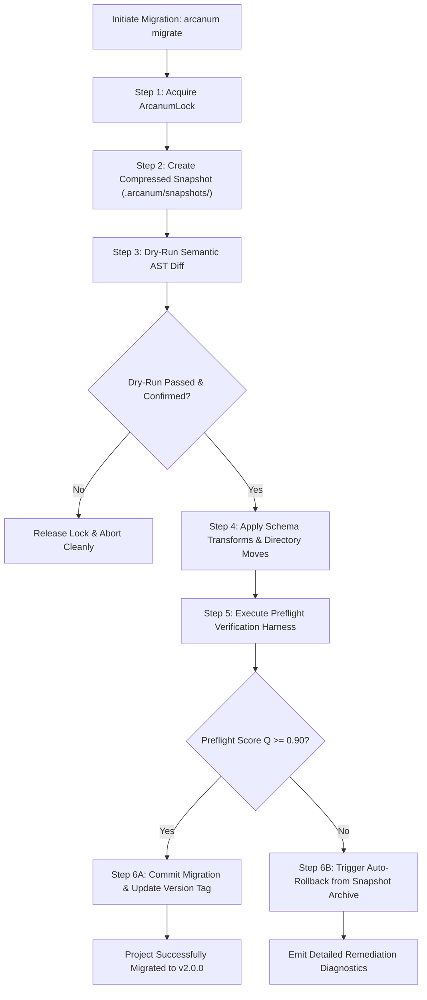
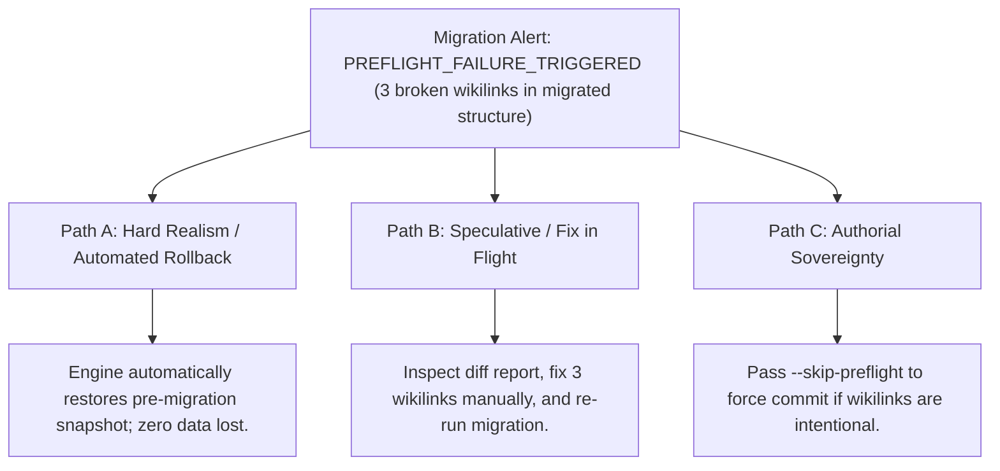

# Project Schema & Directory Migration Engine (`docs/MIGRATE.md`)
> **Domain F: Retrieval, Storage & Infrastructure** | **CLI:** `arcanum migrate` / `arcanum upgrade`

---

## 1. Overview & Theoretical Rationale

The **Ars Arcanum Migration Engine** (`scripts/lib/migrate.py`) is an offline project topology transformer, schema refactoring runner, and automated rollback manager engineered to transition creative writing vaults seamlessly between major Ars Arcanum architectural versions ($v1.0.0 \to v2.0.0$).

As software evolves, directory topologies and metadata schemas inevitably require modernization:
1. **Schema Evolution**: Moving from flat unstructured frontmatter to strict typed schemas (e.g. adding required `@timeline_day` or `@sensory_focus` keys).
2. **Directory Restructuring**: Reorganizing legacy flat manuscript folders (`Chapters/`) into partitioned volume/act hierarchies (`Manuscripts/Book-01/Act-I/`).
3. **Data Loss Hazards**: Naive automated migrations that crash halfway through can corrupt hundreds of chapters, leaving the manuscript in an unrecoverable hybrid state.

```
+-------------------------------------------------------------------------------+
|                    ARS ARCANUM MIGRATION TRANSACTION LIFECYCLE                |
|                                                                               |
|  [Step 1: Exclusive Lock]   -----> Acquires ArcanumLock on vault root         |
|                                                                               |
|  [Step 2: Snapshot Backup]  -----> Creates compressed pre_migrate_<ts>.tar.gz |
|                                                                               |
|  [Step 3: Dry-Run Analysis] -----> Computes proposed file moves and AST diffs |
|                                                                               |
|  [Step 4: Atomic Transform] -----> Applies schema morphisms & directory moves |
|                                                                               |
|  [Step 5: Preflight Gate]   -----> Executes full 7-stage preflight audit      |
|                                                                               |
|  [Step 6: Commit / Rollback]-----> If Q_pre >= 0.90 -> Commit; Else -> Restore|
|                                                                               |
|  [Result: 100% Zero-Loss Guaranteed Evolutionary Refactoring]                 |
+-------------------------------------------------------------------------------+
```

The Migration Engine implements **ACID Transaction Boundaries** (Atomicity, Consistency, Isolation, Durability) for filesystem-based writing projects, guaranteeing that authorial prose is never lost or corrupted during architectural upgrades.

---

## 2. Mathematical Formalism & Schema Morphism

### 2.1 Schema Morphism ($\phi$) & Invertible Rollback ($R$)
Let $\mathcal{S}_A$ be the legacy schema specification and $\mathcal{S}_B$ be the target schema specification. A migration step is defined as a morphism function:

$$\phi: \mathcal{D}(\mathcal{S}_A) \longrightarrow \mathcal{D}(\mathcal{S}_B)$$

The rollback operator $R_{\phi}$ satisfies strict invertibility over original dataset $D_A$:

$$R_{\phi}\big(\phi(D_A)\big) \equiv D_A, \quad \forall D_A \in \mathcal{D}(\mathcal{S}_A)$$

### 2.2 Transaction Integrity & State Invariant
At any point during the execution of $\phi$, the workspace state $\Omega(t)$ satisfies:

$$\Omega(t) \in \Big\{ \Omega_{\text{initial}}, \; \Omega_{\text{migrated}} \Big\}$$

If any unhandled exception or preflight validation failure occurs at timestamp $t_{\text{err}}$:

$$\Omega(t_{\text{err}}) \xrightarrow{\quad \text{Rollback} \quad} \Omega_{\text{initial}}$$

---

## 3. Migration Pipeline & Execution Steps



---

## 4. CLI Execution & Option Reference

```bash
# 1. Preview all proposed directory moves and metadata transforms without writing to disk
arcanum migrate --dry-run

# 2. Execute migration with automatic pre-flight snapshot and validation
arcanum migrate --apply

# 3. Specify explicit source and target schema versions
arcanum migrate --from-version 1.0.0 --to-version 2.0.0 --apply

# 4. Manually rollback to a previous pre-migration snapshot
arcanum migrate --rollback .arcanum/snapshots/pre_migrate_20261006_110000.tar.gz

# 5. Output migration execution plan as JSON
arcanum migrate --dry-run --json
```

### Parameter Reference Table

| Flag / Option | Short | Type | Default | Description |
|---|---|---|---|---|
| `--apply` | `-a` | `bool` | `False` | Commits migration changes to disk (default is dry-run). |
| `--dry-run` | `-d` | `bool` | `True` | Simulates migration and displays unified diff. |
| `--rollback` | `-r` | `Path` | `None` | Restores workspace from specified snapshot archive. |
| `--from-version`| `-f` | `str` | `auto` | Source version (inferred from manifest if omitted). |
| `--to-version` | `-t` | `str` | `latest` | Target schema version. |
| `--json` | `-j` | `bool` | `False` | Emits structured JSON migration plan to stdout. |

---

## 5. Tri-Fold Creative Advisory Resolutions



### Scenario: Preflight Verification Fails Post-Migration
- **Path A (Hard Realism / Automated Zero-Loss Rollback)**:
  - The migration engine detects that post-migration preflight score $Q < 0.90$. It instantly restores the pre-migration tarball, leaving the project in its original working state.
- **Path B (Targeted Remediation)**:
  - Inspect the JSON diagnostic log, fix the 3 broken references in the source notes, and re-run `arcanum migrate --apply`.
- **Path C (Authorial Sovereignty)**:
  - If the broken links represent planned stub notes that the author intends to draft next, pass `--allow-warnings` to commit the new directory structure.

---

## 6. Recommended Reading, References & Media

### 6.1 Database Refactoring & Evolutionary Architecture Treatises
- **Fowler, Martin & Sadalage, Pramod J. (2006)**. *Refactoring Databases: Evolutionary Database Design*. Addison-Wesley. ISBN: 978-0321293534.  
  *The defining text on evolutionary schemas, verified transitions, automated rollback triggers, and zero-downtime refactoring.*
- **Gray, Jim & Reuter, Andreas (1992)**. *Transaction Processing: Concepts and Techniques*. Morgan Kaufmann. ISBN: 978-1558601901.  
  *The landmark reference treatise on ACID transaction boundaries, write-ahead logging, and crash recovery.*
- **Ambler, Scott W. & Sadalage, Pramod J. (2006)**. "Database Refactoring", *IEEE Software*, 23(2):98–101.  
  *Disciplined methodology for incremental, verified transformations on production data.*

### 6.2 Software Evolution & System Stability
- **Nygard, Michael T. (2018)**. *Release It!: Design and Deploy Production-Ready Software* (2nd Edition). Pragmatic Bookshelf. ISBN: 978-1680502398.  
  *Techniques for backward compatibility, circuit breakers, and fault-tolerant migrations.*
- **Lehman, Manny M. (1980)**. "Programs, Life Cycles, and Laws of Software Evolution", *Proceedings of the IEEE*, 68(9):1060–1076.  
  *Foundational laws of software evolution governing structural stability and complexity accumulation over time.*

### 6.3 Video Lectures, Masterclasses & Technical Media
- **Martin Fowler**: *Evolutionary Database Design and Micro-Migrations*.  
  *Detailed video lectures on transforming data models non-destructively.*
- **Computerphile**: *ACID Transactions & Two-Phase Commits Explained*.  
  *How modern operating systems and databases guarantee atomic rollbacks.*
- **Brandon Sanderson's BYU Creative Writing Lectures**: *Organizing Your Series Notes Across Decades*.  
  *Maintaining and upgrading World Bibles across 10+ books without losing lore continuity.*

### 6.4 Landmark Speculative Case Studies
- **Sanderson, Brandon**: *The Dragonsteel Wiki Migration (MediaWiki to Structured Vault)*.  
  *Massive migration of 15 years of Cosmere canon notes into structured relational databases without loss.*
- **Tolkien Estate**: *Archival Digitization of Tolkien's Manuscripts (Bodleian Library)*.  
  *Preserving original physical drafts and marginalia through rigorous non-destructive catalog transitions.*
