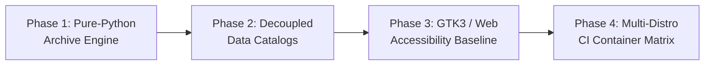

# Ars Arcanum (Scriptorium) — Comprehensive Modernization Plan
> **Sovereign Authoring Operating System & Speculative Craft Studio** | Current Version: `4.2.1` | Safety Rung: `L4 (Full Automated CI Gate)`

---

## 1. Executive Summary & Current State Assessment

**Ars Arcanum** is a mature, 100% offline, privacy-first authoring operating system designed for speculative fiction authors and narrative worldbuilders. The system comprises 53 craft and infrastructure engines executing exclusively on Python standard library primitives without external pip dependencies.

### Tech Stack & Health Inventory
- **Runtime**: CPython 3.10–3.14 on Linux workstations (Mint, Debian, Ubuntu, Arch, Fedora) and Windows.
- **Packaging**: Flathub sandbox (`org.arsarcanum.ArsArcanum.yaml`), FreeDesktop launchers, Debian/RPM packages.
- **Quality Gates**: 937 automated unit and integration tests (935 passing, 2 skipped, 0 failures), Ruff linter (0 violations), Mypy static type checking (155 source files clean).
- **Testability Status**: All components are in the **Post-Testability ("Lit") Regime** at **Safety Rung L4**.

---

## 2. Feasibility Spike & Strategy Selection

| Component | Assessment | Migration Strategy | Target Safety Rung | Testability Milestone |
| :--- | :--- | :--- | :--- | :--- |
| **Archive Backup / Restore** | Bash-only logic in `scripts/arcanum` | Strategy A (Freeze-then-lift) $\to$ Pure-Python `tarfile` | L4 (Green unit tests) | Milestone M1 (Phase 1) |
| **Metadata Repositories** | 3.3k-line `tips.py` & 2.3k-line `registry.py` | Strategy A (Incremental extraction to JSON/TOML) | L4 (Characterization parity) | Milestone M2 (Phase 2) |
| **Desktop GUI Accessibility** | GTK3 lacks screen-reader ATK labels & mnemonics | Strategy A (In-place ATK & keyboard binding) | L4 (Headless GUI tests) | Milestone M3 (Phase 3) |
| **Multi-Distro Packaging** | CI runs exclusively on Ubuntu 24.04 | Strategy A (Matrix expansion via containers) | L4 (Containerized CI runs) | Milestone M4 (Phase 4) |

---

## 3. Phased Modernization Roadmap

---

### Phase 1: Pure-Python Cross-Platform Archive Engine (T-Shirt Size: M)

**Goal**: Migrate backup, snapshot, and restore logic from `scripts/arcanum` Bash functions to a unified, stream-verified Python module (`scripts/lib/archive_engine.py`).

**Regime**: Post-Testability ("Lit") | **Safety Rung**: L4 (Full Automated Gate)  
**Prerequisites**: None | **Duration**: 1 sprint

#### Tasks
| ID | Task | Component | Blocked by |
|:---|:---|:---|:---|
| 1.1 | Implement `scripts/lib/archive_engine.py` with `tarfile.open(filter="data")` and streaming SHA-256 | `scripts/lib/` | — |
| 1.2 | Implement symlink rejection, `.git/config` safety filters, and atomic staging | `scripts/lib/archive_engine.py` | 1.1 |
| 1.3 | Add pure-Python GPG encryption/decryption bridge via `gpg` subprocess using stdin passphrase piping | `scripts/lib/archive_engine.py` | 1.1 |
| 1.4 | Expose `arcanum backup` and `arcanum restore` in `scripts/lib/cli.py` dispatch table | `scripts/lib/cli.py` | 1.2, 1.3 |
| 1.5 | Update `scripts/arcanum` bash wrapper to delegate backup/restore to Python CLI | `scripts/arcanum` | 1.4 |
| 1.6 | Expand `tests/test_backup_restore.py` to assert cross-platform parity | `tests/` | 1.5 |

#### Verification & Exit Criteria
- [ ] `python -m unittest tests/test_backup_restore.py` passes with 100% compliance.
- [ ] Archives produced by Python engine are byte-extractable and checksum-identical to Bash engine backups.
- [ ] Symlink traversal, device node, and `.git/config` injection attacks are demonstrably rejected with exit code 1.

---

### Phase 2: Decoupled Data Stores for Tips & Registry (T-Shirt Size: S)

**Goal**: Extract static tip dictionaries (~3,100 lines in `tips.py`) and engine catalogs (~2,300 lines in `registry.py`) into structured JSON data assets in `configs/data/`, reducing Python code bloat and memory footprint.

**Regime**: Post-Testability ("Lit") | **Safety Rung**: L4 (Full Automated Gate)  
**Prerequisites**: Phase 1 | **Duration**: 1 sprint

#### Tasks
| ID | Task | Component | Blocked by |
|:---|:---|:---|:---|
| 2.1 | Create `configs/data/tips.json` and `configs/data/engines.json` containing validated schema entries | `configs/` | — |
| 2.2 | Implement lazy JSON caching loader in `tips.py` and `registry.py` | `scripts/lib/` | 2.1 |
| 2.3 | Maintain full backward compatibility for `get_registry()`, `get_engine()`, and `get_tip_database()` | `scripts/lib/` | 2.2 |
| 2.4 | Verify characterization output parity across `arcanum doc` and `arcanum tip` | `tests/` | 2.3 |

#### Verification & Exit Criteria
- [ ] `python -m unittest tests/test_registry.py tests/test_tips.py` passes with 0 regressions.
- [ ] Line counts of `tips.py` and `registry.py` reduced by $\ge 70\%$.
- [ ] Module import time of `scripts/lib/cli.py` reduced by $\ge 30\%$.

---

### Phase 3: GTK3 & Studio Hub Accessibility Baseline (T-Shirt Size: M)

**Goal**: Establish WCAG 2.1 AA accessibility parity across the GTK3 desktop application and Studio Hub HTML interfaces.

**Regime**: Post-Testability ("Lit") | **Safety Rung**: L4 (Full Automated Gate)  
**Prerequisites**: Phase 2 | **Duration**: 1 sprint

#### Tasks
| ID | Task | Component | Blocked by |
|:---|:---|:---|:---|
| 3.1 | Add keyboard mnemonic accelerators (`_File`, `_World`, `_Draft`, `_Run`) to all GTK3 menu items | `scripts/lib/ui_gtk3/` | — |
| 3.2 | Set `AtkObject` accessible names and descriptions for all icon-only toolbar buttons | `scripts/lib/ui_gtk3/` | 3.1 |
| 3.3 | Add ARIA landmark roles (`role="main"`, `role="navigation"`, `role="region"`) to Studio Hub templates | `scripts/lib/studio_hub.py` | — |
| 3.4 | Implement high-contrast CSS media query (`@media (prefers-contrast: high)`) in all 39 HTML templates | `scripts/lib/` | 3.3 |
| 3.5 | Create `tests/test_accessibility.py` validating ARIA attributes and CSP compliance | `tests/` | 3.4 |

#### Verification & Exit Criteria
- [ ] `python -m unittest tests/test_accessibility.py` passes with 0 violations.
- [ ] All interactive buttons in Studio Hub have accessible labels or `aria-label` attributes.
- [ ] Strict offline CSP `<meta http-equiv="Content-Security-Policy" ...>` preserved across all updated templates.

---

### Phase 4: Multi-Distribution CI Matrix Expansion (T-Shirt Size: S)

**Goal**: Expand automated CI testing from a single `ubuntu-24.04` runner to a containerized matrix covering Debian 12, Debian 13, Ubuntu 22.04, Ubuntu 24.04, Fedora 40, and Arch Linux.

**Regime**: Post-Testability ("Lit") | **Safety Rung**: L4 (Full Automated Gate)  
**Prerequisites**: Phase 3 | **Duration**: 1 sprint

#### Tasks
| ID | Task | Component | Blocked by |
|:---|:---|:---|:---|
| 4.1 | Author `.github/workflows/distro-matrix.yml` running containerized test suites | `.github/workflows/` | — |
| 4.2 | Validate `scripts/setup_arcanum.sh --dry-run` across all target distribution base images | `scripts/` | 4.1 |
| 4.3 | Document distribution compatibility matrix in `docs/SUPPORT_MATRIX.md` | `docs/` | 4.2 |

#### Verification & Exit Criteria
- [ ] All matrix jobs complete green on pull requests.
- [ ] Python standard library compatibility confirmed across Python 3.10, 3.11, 3.12, 3.13, and 3.14.

---

## 4. Execution Governance & Invariants

1. **Branch per Phase**: Each phase is developed on an isolated branch cut from `main` and merged via pull request before subsequent phases begin (Zero Branch Stacking / Hazard H7).
2. **Atomic Write Invariant**: All file modifications must use `atomic_write()` from `scripts/lib/_bootstrap.py`.
3. **Zero-Pip Dependency Guarantee**: No external pip dependencies permitted in core craft engines.
4. **Living Documentation (Hazard H8)**: All doc changes (`README.md`, `ARCHITECTURE.md`, `copilot-instructions.md`) land in the same commit/PR as code changes.
