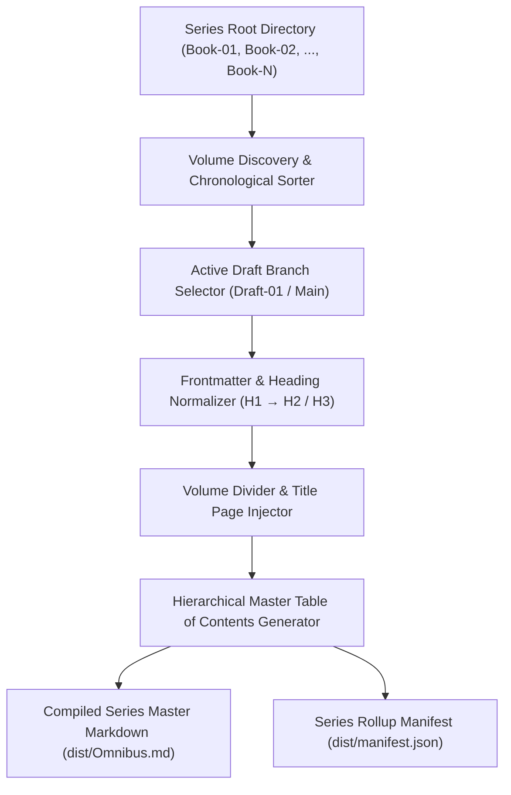
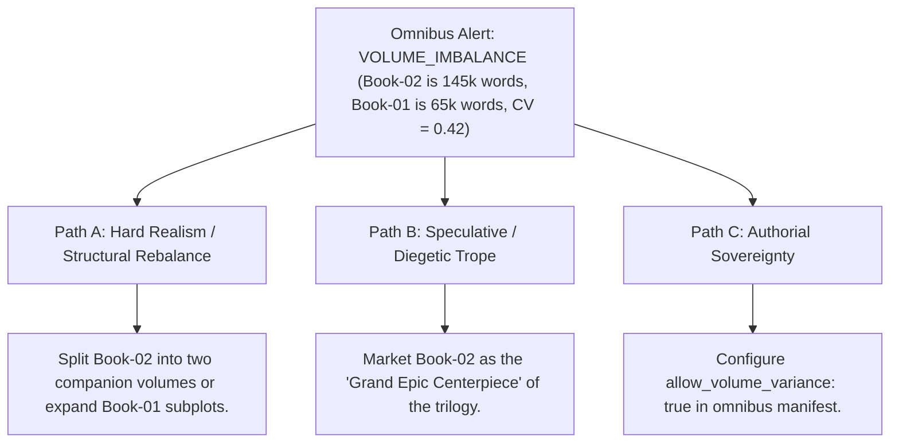

# Multi-Volume Series Omnibus Compiler (`docs/OMNIBUS.md`)
> **Domain F: Corpus Analytics, Diff, Continuity, RAG & Search** | **CLI:** `arcanum omnibus` / `arcanum series-compile`

---

## 1. Overview & Theoretical Rationale

The **Ars Arcanum Omnibus Engine** (`scripts/lib/omnibus.py`) is an offline multi-volume manuscript compiler, series table-of-contents harmonizer, frontmatter normalizer, and publication release bundler engineered for epic fantasy sagas, space opera series, and serialized fiction authors.

Compiling a multi-book series (3 to 10 volumes, spanning 300,000 to 1,000,000+ words) into a unified master manuscript presents formidable structural challenges:
1. **Frontmatter Inconsistencies**: Each book having differing title formats, unstandardized draft branches, or conflicting chapter numbering.
2. **Broken Cross-Volume Links**: Inter-book references failing when concatenated into a single linear publication file.
3. **Missing Volume Dividers & Master Navigation**: Lack of formal book partitions, subtitles, and hierarchical series Table of Contents.

The Omnibus Engine discovers all volume directories (`Book-01`, `Book-02`, etc.), sorts them chronologically, inserts standardized page breaks and volume divider title pages, harmonizes chapter numbering, calculates total series reading metrics, and bundles publication-ready Markdown, JSON manifests, and appendices.

---

## 2. Compilation Pipeline & Mathematical Metrics



### 2.1 Reading Time Estimation
For a compiled omnibus of $K$ volumes containing total word count $W_{\text{series}} = \sum_{k=1}^K W_k$:

$$T_{\text{reading}} (\text{hours}) = \frac{W_{\text{series}}}{\text{WPM}_{\text{reading}} \times 60}$$

Where standard fiction reading speed $\text{WPM}_{\text{reading}} = 250 \text{ words per minute}$.

### 2.2 Volume Balance Ratio & Dispersion
To evaluate whether individual volumes maintain consistent narrative length within the series:

$$\mu_W = \frac{W_{\text{series}}}{K}, \qquad \sigma_W = \sqrt{\frac{1}{K} \sum_{k=1}^K (W_k - \mu_W)^2}, \qquad \text{CV} = \frac{\sigma_W}{\mu_W}$$

A low coefficient of variation ($\text{CV} \le 0.15$) indicates well-balanced volume lengths across the series.

---

## 3. Subfeatures Matrix

| Subfeature | Algorithmic Mechanism | Diagnostic Output / Rule | Narrative Significance |
|---|---|---|---|
| **Volume Auto-Discovery** | Scans filesystem for `Book-*`, `Volume-*`, or `Part-*` folders. | Discovers all canonical volumes and metadata. | Automatically adapts to varying folder structures. |
| **Active Branch Selector** | Identifies the latest or declared active draft branch per volume. | Selects authoritative chapters while ignoring scratch drafts. | Prevents deprecated draft fragments from entering publication. |
| **Hierarchical Master TOC** | Builds linked Markdown Table of Contents grouped by volume. | Emits navigable series TOC with anchor links. | Provides effortless navigation across hundreds of chapters. |
| **Volume Title Dividers** | Injects `\newpage` and decorative volume title banners. | Formats publication-standard book dividers. | Ensures clean page breaks in PDF and EPUB renderers. |
| **Concordance & Cast Appendix** | Aggregates characters and locations across all volumes. | Appends unified series-wide *Dramatis Personae* and Lore Glossary. | Delivers comprehensive back matter for series readers. |

---

## 4. Author Extension & Configuration Guide

### 4.1 Series Volume Manifest (`Book-01/manuscript.yaml`)
```yaml
title: "The Sun-Cleaver"
subtitle: "Chronicles of Aethelgard: Book One"
volume_index: 1
target_words: 90000
status: "completed"
draft: "Draft-02"
synopsis: "The ancient solar blade is unsealed in the high northern spires."
```

---

## 5. Command-Line Interface (CLI) Reference

```bash
# Compile entire multi-book series into omnibus markdown
arcanum omnibus ~/Manuscripts/The-Solar-Saga/

# Specify custom output path
arcanum omnibus ~/Manuscripts/The-Solar-Saga/ --output dist/Solar_Saga_Omnibus.md

# Include series-wide concordance and dramatis personae appendix
arcanum omnibus ~/Manuscripts/The-Solar-Saga/ --with-concordance

# Output series rollup metrics as JSON
arcanum omnibus ~/Manuscripts/The-Solar-Saga/ --json

# Query omnibus compilation theory and reading time formulas
arcanum doc omnibus --math --why
```

---

## 6. Tri-Fold Creative Advisory Resolutions



### Scenario: Severe Volume Imbalance Alert ($\text{CV} > 0.35$)
- **Path A (Hard Realism / Commercial Series Publishing)**:
  - Split the oversized middle volume into two tightly paced books (*Book 2: The Siege*, *Book 3: The Counterstrike*), normalizing word count distribution.
- **Path B (Speculative / Diegetic Epic)**:
  - Embrace the expanded volume as the dramatic centerpiece of the saga (similar to *A Storm of Swords* in *A Song of Ice and Fire*).
- **Path C (Authorial Sovereignty)**:
  - Suppress volume balance warnings by setting `volume_balance_check: false` in `arcanum.yaml`.

---

## 7. Content Security Policy & Offline Isolation

All compiled omnibus bundles and series metadata files are generated 100% offline with zero cloud telemetry:

```html
<meta http-equiv="Content-Security-Policy" content="default-src 'none'; style-src 'unsafe-inline'; script-src 'unsafe-inline'; img-src data:; media-src data: blob:;">
```
