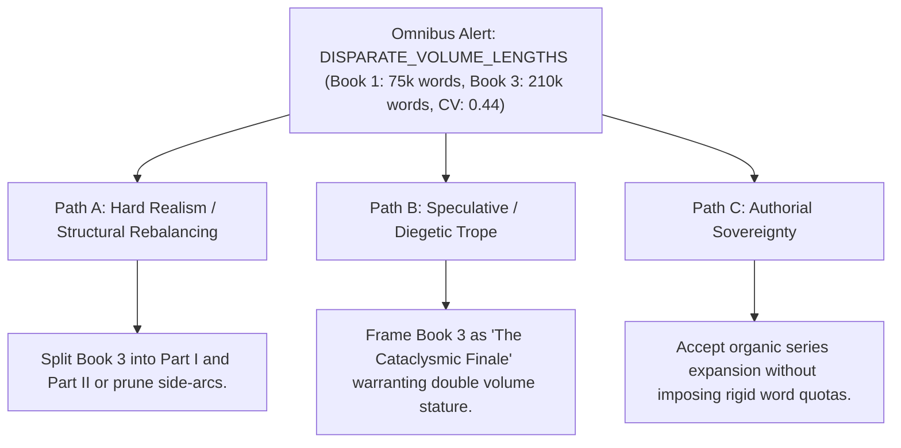

# Multi-Volume Series Omnibus Compiler (`docs/OMNIBUS.md`)
> **Domain F: Corpus Analytics, Diff, Continuity, RAG & Search** | **CLI:** `arcanum omnibus` / `arcanum series-compile`

---

## 1. Overview & Theoretical Rationale

The **Ars Arcanum Omnibus Engine** (`scripts/lib/omnibus.py`) is an offline multi-volume compilation, series-wide table-of-contents harmonizer, front/back matter sequencer, and publication release bundler engineered for epic fantasy sagas, space opera trilogies, and serialized multi-part fiction.

Authors and publishers assembling multi-volume works (spanning 3 to 10+ books, 300,000 to 1,500,000+ words) encounter complex structural and typographical challenges when merging individual manuscripts into a unified collector's edition or complete series ebook:
1. **Front/Back Matter Chaos**: Each independent volume contains its own title page, copyright notice, dedication, and acknowledgments, which must be restructured according to publication standards (Chicago Manual of Style).
2. **Heading Level Drift & Chapter Collisions**: Chapter numbering that restarts at "Chapter 1" in every book requires either hierarchical part partitioning or continuous series-level enumeration.
3. **Cross-Volume Link Severance & Asset Duplication**: Maps, character glossaries, and appendix entries duplicated across books cause bloat and contradictory canon if not systematically deduplicated.

```
+-------------------------------------------------------------------------------+
|                       ARS ARCANUM OMNIBUS COMPILER                            |
|                                                                               |
|  +-------------------+      Volume Discovery       +-----------------------+  |
|  | Book-01, Book-02, | --------------------------> | Manifest Resolver &   |  |
|  | ... Book-N        |                             | Draft Branch Selector |  |
|  +-------------------+                             +-----------------------+  |
|            |                                                   |              |
|            v                                                   v              |
|  [Front Matter Pack]                               [CMOS Section Sequencer]   |
|  (Half-Title, Epigraph)                            (Parts, Books, Chapters)   |
|            |                                                   |              |
|            +---------------------------------------------------+              |
|                                     |                                         |
|                                     v                                         |
|                   +-----------------------------------+                       |
|                   |  Asset Deduplication & Appendix   |                       |
|                   |  Global TOC & Reading Metrics     |                       |
|                   +-----------------------------------+                       |
|                                     |                                         |
|                                     v                                         |
|                     [dist/Series_Master_Omnibus.md]                           |
|                     [dist/series_manifest.json]                               |
|                     [dist/typst/omnibus_layout.typ]                           |
+-------------------------------------------------------------------------------+
```

The Omnibus Engine provides an automated, deterministic compilation pipeline that transforms decentralized book folders into an impeccably structured master manuscript adhering to formal bibliographical canons.

---

## 2. Bibliographical Architecture & Chicago Manual of Style Sequencing

The compiler strictly implements the **Chicago Manual of Style (CMOS 17th/18th Edition)** book construction standard for multi-volume and collected editions:

```
[FRONT MATTER] (Roman Numerals: i, ii, iii, ...)
  ├── 1. Book Half-Title
  ├── 2. Series Title & List of Volumes / Also By
  ├── 3. Title Page (Omnibus Title, Subtitle, Author, Publisher)
  ├── 4. Copyright Notice & ISBN Records
  ├── 5. Dedication
  ├── 6. Epigraph
  ├── 7. Master Table of Contents (Series Rollup)
  ├── 8. Series Foreword / Preface / Author's Note
  └── 9. List of Maps / Illustrations

[BODY MATTER] (Arabic Numerals: 1, 2, 3, ...)
  ├── PART I: [VOLUME 1 TITLE]
  │     ├── Volume Half-Title / Internal Map
  │     ├── Chapters 1 .. N
  │     └── Interludes / Epilogue
  ├── PART II: [VOLUME 2 TITLE]
  │     ├── Volume Half-Title / Internal Map
  │     ├── Chapters 1 .. M
  │     └── Interludes / Epilogue
  └── PART K: [VOLUME K TITLE] ...

[BACK MATTER] (Arabic Numerals Continued)
  ├── Appendix A: Consolidated Dramatis Personae (Cast of Characters)
  ├── Appendix B: Master Chronology & Historical Timeline
  ├── Appendix C: Unified Lore & Conlang Glossary
  ├── Notes & Citations
  ├── Acknowledgments (Consolidated Series Acknowledgments)
  └── About the Author & Colophon
```

---

## 3. Mathematical Metrics & Series Pacing Formalism

### 3.1 Total Reading Duration & Cognitive Load
For a multi-volume series of $K$ books with word counts $W = \{W_1, W_2, \dots, W_K\}$:

$$W_{\text{total}} = \sum_{k=1}^K W_k$$

The estimated reading time $T_{\text{read}}$ across reader velocity distributions:

$$T_{\text{read}} = \frac{W_{\text{total}}}{60 \cdot \text{WPM}}$$

Where:
- $\text{WPM}_{\text{standard}} = 250\text{ words/min}$ (average fiction reader)
- $\text{WPM}_{\text{immersive}} = 200\text{ words/min}$ (complex epic fantasy with dialect)
- $\text{WPM}_{\text{speed}} = 350\text{ words/min}$ (fast skimmer)

### 3.2 Series Balance Ratio & Volume Dispersion
To measure whether volume lengths maintain architectural symmetry across a trilogy or saga:

$$\mu_W = \frac{1}{K} \sum_{k=1}^K W_k, \qquad \sigma_W = \sqrt{\frac{1}{K} \sum_{k=1}^K (W_k - \mu_W)^2}$$

$$\text{Coefficient of Variation (CV)} = \frac{\sigma_W}{\mu_W}$$

$$\text{Volume Proportion Vector} = \mathbf{p} = \left( \frac{W_1}{W_{\text{total}}}, \frac{W_2}{W_{\text{total}}}, \dots, \frac{W_K}{W_{\text{total}}} \right)$$

- **Balanced Series**: $\text{CV} \le 0.15$ (ideal for symmetrical trilogies).
- **Escalating Arc (Crescendo Series)**: $W_1 < W_2 < \dots < W_K$ with monotonic growth gradient $\frac{dW}{dk} > 0$.
- **Erratic Dispersion**: $\text{CV} > 0.35$ (flags potential structural pacing anomalies).

```
Series Pacing Gradient:
Words
  ^
  |                                        Book 3 (160k)
  |                                       +------------+
  |                        Book 2 (125k)  |            |
  |                       +------------+  |            |
  |         Book 1 (95k)  |            |  |            |
  |        +------------+ |            |  |            |
  |        |            | |            |  |            |
  +--------+------------+-+------------+--+------------+----> Volume Index
```

### 3.3 Appendix Entity Deduplication Formula
When consolidating character lists and glossary items across volumes, the deduplication engine computes Jaro-Winkler string similarity $S_{\text{jw}}$ and entity canonical key matching:

$$S_{\text{jw}}(s_1, s_2) = S_{\text{jaro}}(s_1, s_2) + \ell \cdot p \cdot (1 - S_{\text{jaro}}(s_1, s_2))$$

Where $\ell$ is the common prefix length ($\le 4$) and $p = 0.1$ is the prefix scaling factor. If $S_{\text{jw}} \ge 0.92$, duplicate entries are merged and flagged for authorial confirmation.

---

## 4. Manifest Schema & Author Extension Guide

### 4.1 Series Configuration File (`series.yaml`)
```yaml
series_title: "The Chronicles of Aethelgard"
series_subtitle: "The Complete Solar Trilogy"
author: "Valerius M. Vance"
publisher: "Sovereign Press"
edition: "First Collector's Edition Omnibus"
isbn_epub: "978-1-999999-01-0"
isbn_print: "978-1-999999-02-7"

volumes:
  - id: "book_01"
    path: "Book-01-Sun-Cleaver"
    title: "The Sun-Cleaver"
    subtitle: "Book One of Aethelgard"
    draft_branch: "Draft-02"
    part_number: 1
    include_frontmatter: false  # Consolidated into global frontmatter
    include_epilogue: true

  - id: "book_02"
    path: "Book-02-Shadow-Throne"
    title: "The Shadow Throne"
    subtitle: "Book Two of Aethelgard"
    draft_branch: "Draft-01"
    part_number: 2
    include_frontmatter: false
    include_epilogue: true

  - id: "book_03"
    path: "Book-03-Star-Ascendant"
    title: "The Star Ascendant"
    subtitle: "Book Three of Aethelgard"
    draft_branch: "Draft-03"
    part_number: 3
    include_frontmatter: false
    include_epilogue: true

backmatter:
  consolidate_dramatis_personae: true
  consolidate_glossary: true
  timeline_source: "World/History/Master_Timeline.md"
```

---

## 5. CLI Execution & Option Reference

```bash
# 1. Compile series from current directory based on series.yaml
arcanum omnibus

# 2. Compile specific manuscript series directory
arcanum omnibus ~/Manuscripts/Aethelgard-Trilogy/ -o dist/Aethelgard_Omnibus.md

# 3. Include consolidated Dramatis Personae and Glossary appendices
arcanum omnibus ~/Manuscripts/Aethelgard-Trilogy/ --with-concordance --with-timeline

# 4. Generate Typst publication template alongside markdown
arcanum omnibus ~/Manuscripts/Aethelgard-Trilogy/ --format typst,markdown

# 5. Output series statistics and reading metrics as JSON
arcanum omnibus ~/Manuscripts/Aethelgard-Trilogy/ --json
```

### CLI Option Reference

| Parameter | Short | Type | Default | Description |
|---|---|---|---|---|
| `series_dir` | (Positional) | `Path` | `.` | Root directory containing series volumes. |
| `--output` | `-o` | `Path` | `dist/Omnibus.md` | Output destination for compiled manuscript. |
| `--config` | `-c` | `Path` | `series.yaml` | Path to series manifest file. |
| `--format` | `-f` | `choice` | `markdown` | Compilation format: `markdown`, `typst`, `json`. |
| `--with-concordance`| `-k` | `bool` | `False` | Merges character dossiers into back matter. |
| `--with-timeline`| `-t` | `bool` | `False` | Appends chronological timeline appendix. |
| `--json` | `-j` | `bool` | `False` | Emits series word count and dispersion JSON. |

---

## 6. Tri-Fold Creative Advisory Resolutions



### Scenario: Severe Word Count Dispersion Warning
- **Path A (Hard Realism / Structural Rebalancing)**:
  - The third volume is nearly triple the length of Book 1. Split Book 3 into two distinct volumes (`Part I: The Siege` and `Part II: The Zenith`) to restore series symmetry.
- **Path B (Speculative / Diegetic Framing)**:
  - Lean into the epic crescendo: market the omnibus with an explicit note celebrating the explosive finale, utilizing custom page-edge thumb tabs for each distinct era.
- **Path C (Authorial Sovereignty)**:
  - Proceed with compilation as written; story integrity supersedes artificial mathematical symmetry.

---

## 7. Recommended Reading, References & Media

### 7.1 Foundational Publishing & Typographical Treatises
- **University of Chicago Press (2017)**. *The Chicago Manual of Style* (17th Edition / 18th Edition). University of Chicago Press. ISBN: 978-0226287058.  
  *The industry standard for book construction, front/back matter hierarchy, hyphenation, and publication formatting.*
- **Bringhurst, Robert (2012)**. *The Elements of Typographic Style* (Version 4.0). Hartley & Marks Publishers. ISBN: 978-0881792126.  
  *The supreme philosophical and technical guide to book geometry, folio sequencing, and master typography.*
- **Tschichold, Jan (1991)**. *The Form of the Book: Essays on the Morality of Good Design*. Hartley & Marks. ISBN: 978-0881790344.  
  *Classic architectural breakdown of classical page proportions, margins, and multi-volume layout.*

### 7.2 Modern Typesetting Standards & Engines
- **Typst Community & Project Contributors (2024)**. *Typst Publication Layout & Book Design Documentation*. [typst.app/docs](https://typst.app/docs/).  
  *The next-generation document compiler enabling lightning-fast mathematical publication typesetting.*
- **Knuth, Donald E. (1984)**. *The TeXbook*. Addison-Wesley. ISBN: 978-0201134476.  
  *The seminal work on paragraph line-breaking algorithms, page breaks, and macro-based book compilation.*

### 7.3 Video Lectures, Masterclasses & Writing Theory
- **Brandon Sanderson's BYU Creative Writing Lectures**: *Lecture 12: Series Architecture, Multi-Volume Plot Arcs, and Epics*.  
  *Designing multi-book climaxes, managing cast bloat, and planning overarching narrative momentum.*
- **Writing Excuses (Brandon Sanderson, Mary Robinette Kowal, Howard Tayler, Dan Wells)**: *Season 11: Multi-Book Story Arcs and Series Pacing*.  
  *Masterclass discussions on maintaining reader investment across consecutive novels.*
- **Tale Foundry**: *The Problem with Long Fantasy Series: How Sagas Collapse Under Their Own Weight*.  
  *Narrative analysis of scope creep, character inflation, and continuity management.*

### 7.4 Landmark Speculative Case Studies
- **Jordan, Robert & Sanderson, Brandon**: *The Wheel of Time* (14 Volumes + Prequel). Tor Books.  
  *The monumental high-fantasy series exemplifying the necessity of series-wide glossaries, multi-book character tracking, and timeline synchronization.*
- **Erikson, Steven**: *Malazan Book of the Fallen* (10 Volumes). Bantam Books / Tor.  
  *Massive 3.3-million-word epic characterized by shifting global continents, separate Dramatis Personae for every volume, and consolidated appendices.*
- **Corey, James S.A.**: *The Expanse* (9 Volumes + *Memory's Legion* Novellas). Orbit Books.  
  *Masterclass in balanced trilogy-of-trilogies structural pacing ($90\text{k}-120\text{k}\text{ words}$ per volume with consistent architectural symmetry).*
