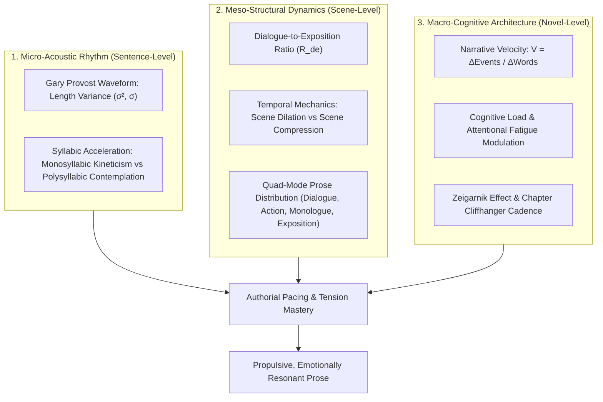
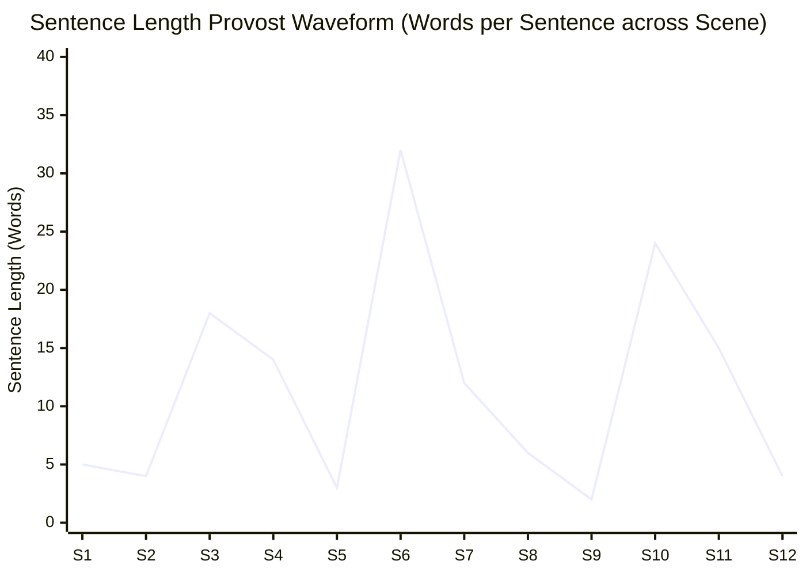

# Master Craft Reference: Narrative Pacing, Prose Rhythm & Tension Modulation (`docs/PACING.md`)
> **Craft Discipline: Narrative Dynamics, Pacing, Prose Cadence & Dramatic Waveforms** | **Master Craft Reference Manual**
> **Primary Active Toolchain:** [Sentence Rhythm](file:///templates/world-bible/.obsidian/plugins/sentence-rhythm) + [Write Good](file:///templates/world-bible/.obsidian/plugins/write-good) + [Readability Score](file:///templates/world-bible/.obsidian/plugins/readability-score) + [Vale CLI](https://vale.sh/) + [LanguageTool](https://languagetool.org/) | **Reference CLI:** `arcanum pacing`

---

## 1. Overview & Theoretical Rationale

This document serves as the **Master Craft Reference Manual** for prose rhythm, Gary Provost sentence waveforms, scene dilation/compression, and narrative velocity modulation. Active in-vault prose telemetry is powered by **Sentence Rhythm**, **Write Good**, **Readability Score**, and **Valeon / LanguageTool** (see [Master External Tools Guide](file:///docs/guides/EXTERNAL_TOOLS_AND_PLUGINS.md)).

Pacing is the temporal velocity at which a story moves through dramatic information, cognitive tension, and prose cadence. A 120,000-word novel can feel sluggish and bloated or electric and propulsive depending not merely on what events occur, but on the micro-level **syntactic waveforms**, the **syllabic compression ratios**, and the macro-level **dialogue-to-exposition density**.



---

## 2. Theoretical Foundations of Prose Rhythm & Cognitive Velocity

### 2.1 Gary Provost's Syntactic Waveform Theory
In *100 Ways to Improve Your Writing* (1985), Gary Provost immortalized the musicality of English prose with his iconic demonstration:

> *"This sentence has five words. Here are five more words. Five-word sentences are okay. No problem, but it’s dull. This sentence is quite boring. It is a slow read. See how it drones on?"*
> 
> *"Now listen. I vary the sentence length, and I create music. Music. The writing sings. It has a pleasant rhythm, a lilt, a harmony. I use short sentences. And I use sentences of medium length. And sometimes, when I see the reader is getting tired, I will engage him with a sentence of considerable length, a sentence that burns with energy and builds with all the impetus of a crescendo, the roll of the drums, the crash of the cymbals—sounds that say listen to this, it is important."*

Prose rhythm functions as an acoustic carrier wave for dramatic tension. When sentence lengths are uniform ($\sigma < 3.5$), the auditory cortex experiences neural habituation, inducing trance-like boredom or cognitive fatigue. Masterclass prose modulates between:
1. **Staccato Punches ($L \le 5\text{ words}$)**: Visceral impact, sharp physical shocks, sudden realizations.
2. **Medium Declaratives ($10 \le L \le 18\text{ words}$)**: Core narrative progression, efficient action sequences, dialogue exchanges.
3. **Sweeping Cumulative Periods ($L \ge 28\text{ words}$)**: Worldbuilding panoramas, psychological cascades, thematic revelations.

### 2.2 Polysyllabic vs. Monosyllabic Acceleration
The cognitive processing speed of English prose is directly tied to etymological and syllabic density:

- **Monosyllabic Anglo-Saxon Roots**: High kinetic velocity ($> 80\%$ monosyllables). Words like *run, strike, bleed, cold, dark, smash, grasp* bypass secondary phonological abstraction, triggering direct motor cortex activation. Essential for close-quarters combat, immediate flight, and visceral horror.
- **Polysyllabic Latinate/Hellenic Roots**: Low kinetic velocity, high cognitive depth ($> 30\%$ trisyllabic or quadrisyllabic terms). Words like *metamorphosis, incomprehensible, ecclesiastical, stratification* induce contemplative deceleration. Essential for arcane thaumaturgy, philosophical disputation, and high-altitude historical lore.

### 2.3 Dialogue-to-Exposition Density Ratio ($R_{\text{de}}$)
The ratio between spoken dialogue and static exposition governs perceived scene velocity:

$$R_{\text{de}} = \frac{W_{\text{dialogue}}}{W_{\text{exposition}} + 1.0}$$

- **Kinetic Dramatic Velocity ($R_{\text{de}} \ge 2.5$)**: The scene moves in objective real-time ($1\text{ s} \approx 1\text{ s}$). High interpersonal conflict, interrogation, banter.
- **Balanced Dramatic Velocity ($0.8 \le R_{\text{de}} \le 2.4$)**: Standard novelistic scene blending physical interaction with sensory observation.
- **Narrative Deceleration / Historical Stasis ($R_{\text{de}} < 0.3$)**: The narrative clock stops; authorial exposition or internal monologue dominates.

### 2.4 Temporal Mechanics: Scene Dilation vs. Scene Compression
- **Scene Dilation (Chronos Expansion)**: Slowing down narrative time during high-adrenaline climaxes. 10 seconds of physical time is rendered across 800 words of hyper-sensory detail (the glint of light on the blade, the slow arc of shattered glass, the exact contraction of the antagonist's pupil).
- **Scene Compression (Chronos Contraction)**: Accelerating narrative time across transitional intervals. Three years of maritime travel or ten months of academic training compressed into a single lyrical paragraph using temporal summary and representative vignettes.

### 2.5 Cognitive Load Theory & Reader Attentional Capacity
Human working memory operates under a finite attentional budget ($7 \pm 2$ discrete cognitive chunks, per George A. Miller). Continuous, unrelieved high-intensity action causes **sensory numbing**: when everything is an emergency, nothing is. Effective narrative architecture enforces rhythmic oscillation:

$$\text{Tension Waveform} = \sin(\omega t) \cdot \text{StakesGradient}(t)$$

Post-climax sequels and moments of humor or domestic tranquility reset the reader's neurological baseline, allowing the next crisis to strike with maximum amplitude.

### 2.6 The Zeigarnik Effect & Chapter Cliffhanger Cadence
Psychologist Bluma Zeigarnik established that human memory prioritizes interrupted, unresolved tasks over completed ones. Narrative momentum relies on maintaining open **Hermeneutic Loops** across chapter boundaries:
- **Micro-Cliffhanger**: An unresolved action or sensory anomaly at the chapter close (e.g., a hand knocking on the hull from the *outside* of a vacuum-sealed starship).
- **Epistemic Hook**: A shocking disclosure that overturns existing assumptions (e.g., finding the mentor's seal on the assassin's dispatch).
- **Moral / Tactical Dilemma**: The protagonist poised on the razor's edge of an irreversible decision.

---

## 3. Stylostatistical Telemetry & Reference Lenses
> **Craft Lineage Notice**: The models below draw on Gary Provost's syntactic waveform principles (*100 Ways to Improve Your Writing*, 1985) and modern commercial craft pacing theory (e.g., James Scott Bell, Larry Brooks). They are descriptive craft lenses intended to provide visibility into rhythm and tempo—never algorithmic constraints on literary voice.



### 3.1 Event Density Metric ($D_E$)
Event density provides an advisory measure of dramatic frequency per thousand words across a chapter or sequence:

$$D_E = \frac{\Delta \mathcal{E}}{W / 1000} = \frac{\sum_{i=1}^M \omega_i \cdot \delta_i}{W / 1000}$$

Where:
- $\delta_i \in \{0, 1\}$: Occurrence of dramatic event $i$ (secret revealed, character killed, goal failed, alliance broken).
- $\omega_i \in [1.0, 3.0]$: Dramatic magnitude weight of the event.
- $W$: Total word count of the section.

**Advisory Reference Ranges**:
- **High Density ($D_E \ge 4.0$)**: Kinetic set-pieces, thrillers, climactic sequences.
- **Moderate Density ($1.5 \le D_E \le 3.9$)**: Standard narrative progression and world discovery.
- **Contemplative Density ($D_E < 1.0$)**: Character reflection, pastoral slice-of-life, atmospheric mood-setting, or philosophical depth.

### 3.2 Sentence-Length Dispersion & Provost Variance ($\sigma_L$)
For a sentence sequence $L = [L_1, L_2, \dots, L_N]$:

$$\mu_L = \frac{1}{N} \sum_{i=1}^N L_i, \qquad \sigma_L = \sqrt{\frac{1}{N} \sum_{i=1}^N (L_i - \mu_L)^2}$$

- **High Variance ($\sigma_L \ge 7.0$)**: Dynamic Provost waveforms alternating between staccato punchlines and flowing periodic sentences.
- **Uniform Length ($\sigma_L < 3.5$)**: Useful for stylized hypnotic effects, liturgical chant, deadpan narration, or bureaucratic monotone; can be varied if dynamic tempo is desired.

### 3.3 Quad-Mode Prose Balance ($\vec{Q}$)
Every sentence in a drafted scene falls into one of four narrative modes:
$$\vec{Q} = \left[ \frac{W_{\text{Dialogue}}}{W_{\text{total}}}, \, \frac{W_{\text{Action}}}{W_{\text{total}}}, \, \frac{W_{\text{Monologue}}}{W_{\text{total}}}, \, \frac{W_{\text{Exposition}}}{W_{\text{total}}} \right]$$

$$\sum Q_i = 1.0$$

| Target Scenario | Reference Scenario Envelopes $[D, A, M, E]$ |
|---|---|
| **Urban Fantasy Set-Piece** | $[0.35, 0.45, 0.10, 0.10]$ |
| **Hard Sci-Fi Investigation** | $[0.30, 0.20, 0.25, 0.25]$ |
| **Epic Fantasy Battle** | $[0.15, 0.60, 0.15, 0.10]$ |
| **Gothic Psychological Horror** | $[0.10, 0.25, 0.40, 0.25]$ |

---

## 4. Author Self-Editing Rubric & Diagnostic Checklist

When reviewing a manuscript for pacing and rhythm, compare your draft against these craft observations:

| Pacing Observation | Textual Pattern | Optional Authorial Exploration |
|---|---|---|
| **Cadence Uniformity** | Sentences hover at similar lengths ($\sigma_L \le 3.2$). | If dynamic rhythm is desired: experiment with 1–4 word punchy lines interspersed with 25+ word rhythmic periods. |
| **Lore Concentration** | $> 450$ words of uninterrupted background lore or technical worldbuilding. | Consider dramatizing lore through live dialogue, immediate obstacles, or tactile character interaction. |
| **Low Event Frequency** | Long scene spans where few external state changes occur ($D_E < 0.8$). | Intentional for atmospheric/reflective scenes; for kinetic momentum, consider introducing an active impediment or ticking clock. |
| **Closed Chapter State** | Chapter concludes with all immediate tensions resolved. | If episodic forward pull is desired, experiment with an unresolved question, sensory shock, or impending decision. |
| **Expository Conflict** | Confrontation described in high-level summary rather than in-scene interaction. | Shift high-stakes conflict into subtext-laden dialogue or visceral kinetic beats. |
| **Latinate Density** | High density of abstract multi-syllable terms ($> 28\%$) in fast-paced action. | Consider punchy Germanic/Anglo-Saxon active verbs (*snuff, strike, bolt*) for physical immediacy. |

---

## 5. Practical Authorial Worksheets & Worked Masterclass Examples

### 5.1 Step-by-Step Pacing & Waveform Transformation Case Study

#### Flawed Amateur Draft (Monotonous Cadence, Syllabic Drag, Low Velocity):
> Kaelen walked toward the subterranean command center. The steel doors were exceedingly impenetrable and heavily reinforced. He examined the complex biometric console with great trepidation. The electronic display requested his authorization code immediately. He remembered the numerical sequence from his briefing. He typed the digits into the terminal carefully. The green light illuminated above the door frame. He walked inside the room to confront the enemy.

**Diagnostics:**
- Word count: 68 words | 8 sentences | $\mu = 8.5\text{ words}$ | $\sigma = 1.6\text{ words}$ (**Severe Monotony**).
- Syllabic profile: High polysyllabic density (*subterranean, impenetrable, trepidation, authorization, illuminated*).
- Dramatic velocity: Flatline ($V \approx 0.0$).

#### Masterclass Revision (Dynamic Provost Waveform, Monosyllabic Kineticism, High Velocity):
> The vault door loomed. *(4 words)*  
> Cold, riveted titanium, three feet thick, sealed against orbital bombardment. *(10 words)*  
> Kaelen pressed his trembling palm to the biometric scanner, smelling scorched copper as the laser sliced across his retina, reading the stolen retinal code that Inquisitor Vane had bled to give him. *(32 words)*  
> A red strobe pulsed. *(4 words)*  
> *Access Denied.* *(2 words)*  
> Down the steel corridor, boot-spikes scraped the grated floor; the Praetorian kill-squad was thirty seconds out, weapons charged, zero margin left for prayer. *(23 words)*  
> Kaelen drew his blade. *(4 words)*

**Improvements:**
- Word count: 79 words | 7 sentences | Sentence lengths: $[4, 10, 32, 4, 2, 23, 4]$.
- Mean $\mu = 11.3\text{ words}$ | Standard Deviation $\sigma = 10.9\text{ words}$ (**Virtuosic Provost Cadence**).
- Monosyllabic Anglo-Saxon bursts mixed with expansive sensory periods.

---

### 5.2 Chapter Pacing & Tension Blueprint (YAML Schema for Scene Planning)

```yaml
---
chapter_id: "CH-09-THE-BREACH"
word_count_target: 3200
target_velocity_grade: "HIGH"

rhythm_targets:
  provost_sigma_min: 7.0
  max_uninterrupted_exposition_words: 150
  target_r_de_ratio: 1.8

quad_mode_allocation:
  dialogue_pct: 0.35
  action_pct: 0.40
  monologue_pct: 0.15
  exposition_pct: 0.10

tension_curve_milestones:
  - position: "0% - 15%"
    tension: 40
    pacing_mode: "Atmospheric Setup & Looming Threat"
  - position: "15% - 60%"
    tension: 75
    pacing_mode: "Stealth Infiltration (Staccato Action + Urgent Dialogue)"
  - position: "60% - 85%"
    tension: 95
    pacing_mode: "Trap Sprung (Scene Dilation, Adrenaline Peaks)"
  - position: "85% - 100%"
    tension: 90
    pacing_mode: "Pyrrhic Escape & Zeigarnik Cliffhanger"

zeigarnik_hook:
  type: "EPISTEMIC_SHOCK"
  description: "Protagonist opens the recovery pod to find the target is already a cybernetic sleeper agent."
---
```

### 5.1 In-Vault Real-Time Cadence Telemetry: Obsidian Sentence Rhythm
Inside Obsidian, the pre-bundled [`sentence-rhythm`](file:///docs/guides/EXTERNAL_TOOLS_AND_PLUGINS.md#2-sentence-rhythm) plugin implements Gary Provost's syntactic waveform analysis in real time. It visually color-codes sentences by word length as you draft, immediately exposing monotone runs of similar sentence lengths. See [Sentence Rhythm Guide](file:///docs/guides/EXTERNAL_TOOLS_AND_PLUGINS.md#2-sentence-rhythm).

---

## 6. Recommended Reading, References & Media

### 6.1 Foundational Craft & Academic Books
- **Provost, Gary (1985)**. *100 Ways to Improve Your Writing*. Mentor / Penguin. ISBN: 978-0451627216.  
  *The foundational treatise introducing sentence length variance, acoustic prose waveforms, and dynamic rhythmic variety.*
- **Stein, Sol (1995)**. *Stein on Writing: A Master Editor of Some of the Most Successful Writers of Our Century Shares His Craft and Techniques*. St. Martin's Griffin. ISBN: 978-0312136086.  
  *Authoritative chapters on narrative pace, immediate scenes versus summary, triage of exposition, and increasing tension on every page.*
- **Clark, Roy Peter (2006)**. *Writing Tools: 55 Essential Strategies for Every Writer*. Little, Brown and Company. ISBN: 978-0316014984.  
  *Crucial insights on sentence branch topology (right-branching vs. periodic), speed-reading psychology, and verb-level acceleration.*
- **Bell, James Scott (2014)**. *Write Your Novel From The Middle: A New Approach for Plotters, Pantsers and Everyone in Between*. Compendium Press. ISBN: 978-0910355155.  
  *The structural mirror moment as the ultimate pacing pivot point in long-form speculative fiction.*
- **Murch, Walter (2001)**. *In the Blink of an Eye: A Perspective on Film Editing* (2nd ed.). Silman-James Press. ISBN: 978-1879505629.  
  *The landmark cinematic treatise on pacing, cut rhythms, blink-rate cognitive synchronization, and emotional velocity.*

### 6.2 Landmark Lectures, Video Masterclasses & Podcasts
- **Sanderson, Brandon (2020)**. *BYU Creative Writing Lecture 5: Pacing, Micro-Tension, and the Promise-Progress-Payoff Cycle*. Brigham Young University / YouTube.  
  *Explains how character sense of progress directly dictates perceived pacing, regardless of raw word count or page length.*
- **Writing Excuses (2010–2021)**. *Season 5 & Season 12: Pacing, Scene Dilation, and Narrative Momentum*. Featuring Brandon Sanderson, Mary Robinette Kowal, Howard Tayler, and Dan Wells.  
  *Workshops on managing multi-POV novel pacing, preventing the sagging middle, and editing for acoustic musicality.*
- **Film Courage (2018–2023)**. *Masterclass Series on Narrative Pacing, Suspense Waves, and Tension Escalation*. YouTube Video Essay Archive.  
  *Interviews with top Hollywood editors and script doctors on micro-cliffhangers, temporal compression, and eliminating narrative drag.*

### 6.3 Landmark Speculative Fiction Case Studies
- **Gibson, William (1984)**. *Neuromancer*. Ace Books.  
  *Masterclass in high-velocity monosyllabic prose rhythm, staccato syntax, and sensory density.*
- **Crichton, Michael (1990)**. *Jurassic Park*. Alfred A. Knopf.  
  *The gold standard of commercial thriller pacing: short chapters, accelerating Zeigarnik cliffhangers, and perfect oscillation between exposition and chaos.*
- **Leckie, Ann (2013)**. *Ancillary Justice*. Orbit.  
  *Virtuosic modulation between expansive, contemplative imperial space opera exposition and razor-sharp, staccato tactical combat.*
