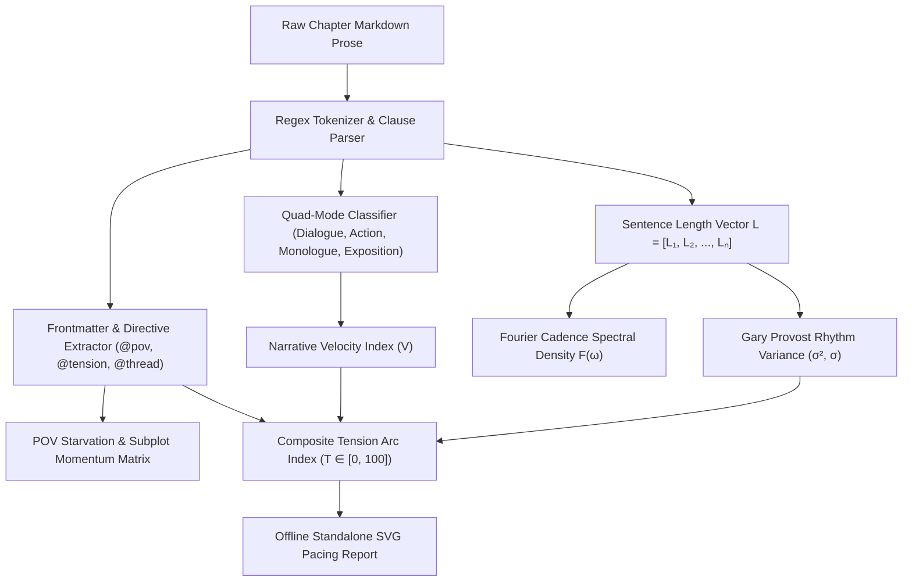
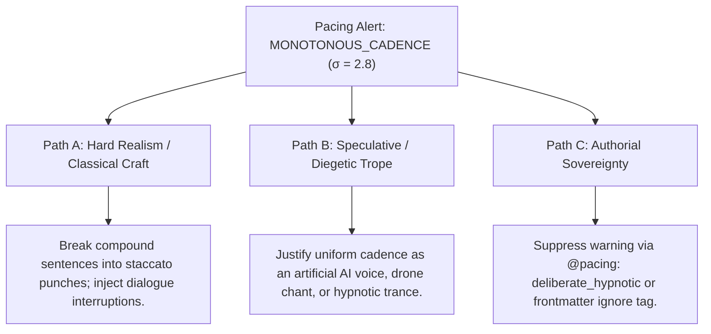

# Ars Arcanum Narrative Pacing, Prose Rhythm & Tension Arc Architecture (`docs/PACING.md`)
> **Domain E: Narrative Dynamics, Pacing, Structure & Branching** | **CLI:** `arcanum pacing` / `arcanum rhythm`

---

## 1. Overview & Theoretical Rationale

The **Ars Arcanum Pacing Engine** (`scripts/lib/pacing.py`) is an offline mathematical and stylostatistical prose analysis suite engineered for speculative fiction novelists, narrative architects, and structural editors.

Maintaining narrative momentum across a 100,000+ word manuscript is one of the most demanding cognitive tasks in long-form writing. Authors frequently encounter five critical architectural failure modes:
1. **Exposition Drag & Information Dumps**: Consecutive paragraphs of static worldbuilding or internal monologue that freeze narrative clock velocity.
2. **Monotonous Syntactic Cadence**: Uniform sentence lengths that fatigue the reader's neural processing—violating Gary Provost's foundational principle of prose rhythm ("*This sentence has five words...*").
3. **Point-of-View (POV) Starvation**: In multi-viewpoint novels, abandoning a primary protagonist for 4–10 chapters, leading to reader disengagement and fractured narrative continuity.
4. **Subplot Thread Decay**: Introducing secondary conflicts or B-stories in Act I that disappear until the climax without intermediate developmental milestones.
5. **Flat Emotional Tension Arcs**: Narratives that lack rhythmic oscillation between high-tension crises and contemplative recovery sequelae, depriving readers of cathartic emotional release.

The Pacing Engine solves these challenges deterministically using pure Python standard library routines, calculating sentence length variance, discrete Fourier cadence approximations, quad-mode prose distributions, and multi-track POV intervals.

---

## 2. Mathematical, Stylostatistical & Algorithmic Foundations



### 2.1 Gary Provost Sentence Length Variance & Standard Deviation
To quantify musicality and rhythmic variation, the engine parses every chapter into an array of sentence word counts $L = [L_1, L_2, \dots, L_N]$:

$$\mu = \frac{1}{N} \sum_{i=1}^{N} L_i, \qquad \sigma^2 = \frac{1}{N} \sum_{i=1}^{N} (L_i - \mu)^2, \qquad \sigma = \sqrt{\sigma^2}$$

- **Monotony Warning**: If $\sigma \le 3.5$ over a 500-word window, the engine flags a **Monotonous Syntax Warning**.
- **Ideal Musical Cadence**: A target $\sigma \ge 6.5$ with a multimodal distribution containing staccato punches ($L_i \le 5$), medium declarative clauses ($10 \le L_i \le 18$), and sweeping compound descriptions ($L_i \ge 28$).

### 2.2 Discrete Cadence Waveform & Fourier Spectral Density
To detect repetitive length pulses (e.g., alternating strictly between short and medium sentences), the engine computes a discrete spectral decomposition:

$$F(k) = \sum_{n=0}^{N-1} L_n \cdot e^{-i \frac{2\pi}{N} k n}$$

Peaks at high frequencies correspond to rhythmic staccato bursts, while dominance at zero frequency indicates flat prose density.

### 2.3 Quad-Mode Prose Distribution Model
Every sentence or paragraph chunk is classified into one of four narrative modes:
1. **Dialogue ($D$)**: Spoken words enclosed in straight or curly quotation marks (`"..."`, `“...”`).
2. **Action ($A$)**: Fast-moving kinetic prose dominated by active verbs, physical movement, and short clauses ($L_i \le 9$).
3. **Monologue ($M$)**: Internal focalized thoughts, interior reflections, and stream of consciousness.
4. **Exposition ($E$)**: Historical lore, sensory landscape description, and abstract exposition without immediate character physical agency.

The mode ratios satisfy:
$$D_r + A_r + M_r + E_r = 1.0, \quad \text{where } X_r = \frac{\text{Word Count in Mode } X}{\text{Total Chapter Word Count}}$$

### 2.4 Narrative Velocity Index ($V$)
The instantaneous velocity of a scene is calculated by balancing kinetic elements against descriptive friction:

$$V = \frac{\alpha \cdot A_r + \beta \cdot D_r}{\gamma \cdot E_r + \delta \cdot \bar{L}_{\text{clause}} + \epsilon}$$

Where $\alpha = 1.5$, $\beta = 1.2$, $\gamma = 2.0$, $\delta = 0.05$, and $\epsilon = 0.1$ are empirically calibrated weights. High velocity ($V > 2.5$) denotes rapid combat or escape sequences; low velocity ($V < 0.6$) signals quiet worldbuilding exposition or contemplative sequelae.

### 2.5 POV Starvation Distance Metric
For each viewpoint protagonist $p \in P$ appearing at chapter indices $C_p = [c_1, c_2, \dots, c_m]$ across total chapters $K$:

$$G_k(p) = c_{j} - c_{j-1} - 1$$

$$\text{POV Starvation Trigger} \iff \exists j \text{ s.t. } G_k(p) \ge \Theta_{\text{starve}} \quad (\text{Default } \Theta_{\text{starve}} = 3 \text{ chapters for major POVs})$$

### 2.6 Composite Narrative Tension Arc Index ($T \in [0, 100]$)
The composite tension score per chapter combines semantic conflict keywords, syntactic velocity, dialogue density, and explicit author directives:

$$T = \min\left(100.0, \max\left(0.0, \, w_1 \cdot K_d + w_2 \cdot S_{\text{staccato}} + w_3 \cdot D_f + \Omega_{\text{directive}}\right)\right)$$

Where:
- $K_d$: Conflict keyword density (battle, dread, peril, ticking clock, urgency lexemes).
- $S_{\text{staccato}}$: Percentage of sentences with $L_i < 8$ words.
- $D_f$: Dialogue friction (frequency of short, alternating verbal rejoinders and interruptions).
- $\Omega_{\text{directive}}$: Authorial frontmatter boosts (`@tension: 8.5` $\to +85.0$, `@climax: true` $\to +25.0$).

---

## 3. Subfeatures Matrix

| Subfeature | Algorithmic Mechanism | Diagnostic Output / Rule | Narrative Significance |
|---|---|---|---|
| **Provost Rhythm Variance** | Calculates rolling standard deviation $\sigma$ across sentence lengths. | Flags $\sigma < 3.5$ as `MONOTONOUS_CADENCE`. | Prevents reader fatigue by ensuring sentence lengths undulate dynamically. |
| **Quad-Mode Prose Classifier** | Tokenizes text into Dialogue, Action, Monologue, and Exposition buckets. | Generates four-bar proportional density breakdown per chapter. | Surfaces hidden exposition traps and dialogue droughts. |
| **POV Starvation Auditor** | Tracks inter-chapter intervals for all `@pov:` tags. | Flags gap $> 3$ chapters for characters with $>10\%$ word count share. | Prevents reader alienation caused by forgotten viewpoint characters. |
| **Subplot Momentum Tracker** | Constructs a 2D matrix of `@thread:` tags vs. chapter indices. | Detects stalled subplots unadvanced for $> 4$ consecutive chapters. | Guarantees balanced multi-strand narrative progression across all acts. |
| **Tension Arc Curve Modeler** | Synthesizes syntactic velocity and conflict keywords into a continuous curve. | Emits normalized SVG tension curve with peak/valley annotations. | Visualizes whether pacing aligns with structural climaxes and recovery phases. |
| **Staccato Action Burst Detector**| Identifies runs of $\ge 4$ sentences with word count $\le 7$. | Flags `STACCATO_BURST` with word-count timestamps. | Highlights high-impact moments of kinetic shock or physical crisis. |
| **Exposition Drag Flag** | Detects blocks of $> 400$ words without dialogue or action verbs. | Flags `EXPOSITION_DRAG_SAG` with line number references. | Highlights narrative bottlenecks where lore dumps stall plot momentum. |

---

## 4. Author Extension & Configuration Guide

### 4.1 In-Situ Scene Directives (Markdown)
Authors annotate chapter drafts with lightweight `@directives` placed in headers or comments:

```markdown
# Chapter 14: The Iron Breach
@pov: Seraphine Dusk
@thread: Siege-of-Kharos, Bloodline-Curse
@tension: 8.8
@mode: action
@climax: true

The gate shattered. Iron groaned. Wood split into jagged teeth.
Seraphine drew her blade. "Form the line!" she yelled.
No one moved. Fear had turned their boots to stone.
```

### 4.2 Project Configuration Manifest (`arcanum.yaml`)
Custom thresholds, keyword dictionaries, and POV tiers can be declared in `arcanum.yaml`:

```yaml
pacing:
  pov_starvation_threshold: 4          # Max allowable chapter gap before warning
  min_sentence_variance_std: 4.0        # Minimum Provost standard deviation
  staccato_threshold: 7                 # Max word count for staccato sentences
  exposition_max_block_words: 350       # Flag lore dumps exceeding this size
  custom_conflict_keywords:
    - "blood-tithe"
    - "breach"
    - "overcharge"
    - "containment"
  major_pov_share_threshold: 0.08      # Character is major if share > 8%
```

### 4.3 Pure Python API Integration
```python
from lib.pacing import analyze_manuscript_pacing, generate_pacing_report

# Run deterministic pacing audit across manuscript directory
report = analyze_manuscript_pacing("Manuscript/", gap_threshold=3)

for chapter in report.chapters:
    print(f"Chapter {chapter.number}: {chapter.title}")
    print(f"  Words: {chapter.word_count} | Provost StdDev: {chapter.sentence_std:.2f}")
    print(f"  Quad-Mode: D:{chapter.dialogue_pct:.1f}% A:{chapter.action_pct:.1f}% E:{chapter.exposition_pct:.1f}%")
    print(f"  Tension Index: {chapter.tension_score:.1f}/100")

# Generate standalone offline HTML/SVG report
html_content = generate_pacing_report(report)
with open("pacing_audit.html", "w", encoding="utf-8") as f:
    f.write(html_content)
```

---

## 5. Command-Line Interface (CLI) Reference

```bash
# Scan full manuscript pacing with terminal summary
arcanum pacing Manuscript/

# Set custom POV starvation gap threshold (e.g. 2 chapters for tight thrillers)
arcanum pacing Manuscript/ --gap 2

# Filter analysis to a specific volume in a multi-book series
arcanum pacing Manuscript/ --book Book-01

# Export standalone offline interactive HTML report with SVG curves
arcanum pacing Manuscript/ --html reports/pacing_report.html

# Output raw JSON stream for CI/CD linting or script pipelines
arcanum pacing Manuscript/ --json

# Query the Gary Provost mathematical logic and theoretical rationale
arcanum doc pacing --math --why
```

---

## 6. Tri-Fold Creative Advisory Resolutions

When the Pacing Engine triggers an alert, authors are offered three actionable resolution pathways:



### Scenario: Monotonous Cadence & Low Variance Warning ($\sigma < 3.5$)
- **Path A (Classical Craft / High Dynamic Range)**:
  - Deconstruct long compound sentences into sharp 3-to-5 word impact statements.
  - Insert abrupt physical actions or dialogue interjections to disrupt syntactic drone.
- **Path B (Speculative / Diegetic Trope)**:
  - Justify the monotone cadence as an in-world cognitive state: the viewpoint character is an automaton, under telepathic sedation, or reciting ancient liturgy.
- **Path C (Authorial Sovereignty)**:
  - Declare deliberate stylistic monotony (e.g., replicating biblical prose or bureaucratic legalism). Tag scene with `@pacing: chant_cadence` to mute warnings.

---

## 7. Content Security Policy & Air-Gap Offline Isolation

In strict compliance with the **Ars Arcanum Sovereign Authoring Operating System Manifesto**, all HTML pacing reports and SVG visualizations execute 100% offline with zero CDN dependencies:

```html
<meta http-equiv="Content-Security-Policy" content="default-src 'none'; style-src 'unsafe-inline'; script-src 'unsafe-inline'; img-src data:; media-src data: blob:;">
```
