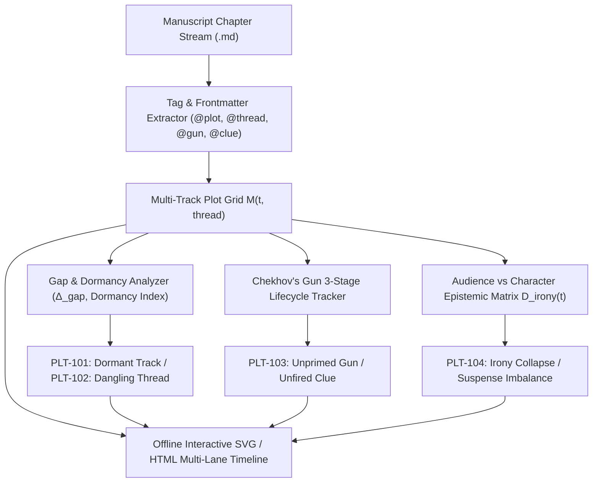

# Multi-Track Plot Matrix, Subplot Braiding & Narrative Irony (`docs/PLOT_MATRIX.md`)
> **Domain E: Narrative Dynamics, Pacing, Structure & Branching** | **CLI:** `arcanum plot-matrix` / `arcanum plot`

---

## 1. Overview & Theoretical Rationale

The **Ars Arcanum Plot Matrix Engine** (`scripts/lib/plot_matrix.py`) is an offline structural continuity tracker, subplot braiding auditor, and dramatic irony modeler designed for multi-POV epics, mystery novels, and branching speculative fiction.

In complex long-form storytelling, managing multiple interlocking narrative threads introduces severe combinatorial complexity:
1. **Subplot Abandonment / Dormancy (`PLT-101`)**: Secondary storylines or character arcs introduced in Act I that disappear for large chapter spans, losing emotional momentum.
2. **Dangling Plot Threads (`PLT-102`)**: Primary conflicts or investigative questions left unresolved at the manuscript's climax.
3. **Chekhov's Gun Malfunctions (`PLT-103`)**: Critical climax resolutions that lack prior introduction or priming, reading as unearned *Deus ex Machina*, or introduced items that never fire (*Chekhov Violations*).
4. **Dramatic Irony Asymmetry**: Mismatches between audience knowledge and character knowledge that inadvertently collapse tension or spoil mystery reveals.
5. **Clue Distribution Imbalance**: Clues bunched together at the finale or red herrings lacking internal diegetic plausibility.

The Plot Matrix maps every tagged plot thread, character arc, and clue across chapters, computes gap penalties, verifies Chekhov lifecycles, models audience vs character epistemic states, and renders interactive multi-lane visual timelines.



---

## 2. Multi-Thread Plotting Architectures

```
+-----------------------------------------------------------------------------------+
|                        CANONICAL PLOTTING ARCHITECTURES                           |
+-------------------+-------------------------------+-------------------------------+
| BRAIDED SUBPLOTS  | PARALLEL STORYLINES           | CONVERGING THREADS (NEXUS)    |
| Interleaved A/B/C | Independent tracks running in | Disparate characters/threads  |
| threads alternating | parallel with thematic echoes | funneled into a single        |
| across chapters.  | but zero physical contact.    | catastrophic climax arena.    |
+-------------------+-------------------------------+-------------------------------+
```

### 2.1 Braided Subplots (The A/B/C Plot Rhythm)
In braided narratives, chapters alternate between the primary driving quest (A-Plot), secondary romantic or political alliances (B-Plot), and tertiary comedic or introspective character arcs (C-Plot):
- **Harmonic Alternation**: Avoid running the same thread for more than 2 consecutive chapters unless entering a dedicated climax sequence.
- **Thematic Rhyming**: Events in the B-Plot reflect or invert the moral dilemmas faced in the A-Plot within the same structural act.

### 2.2 Parallel Storylines (The Polyphonic Architecture)
Multiple protagonist streams operate in isolation across geographic or temporal distances. Unity is maintained through:
- **Synchronized Milestone Pacing**: All parallel tracks hit their respective Midpoints or Dark Nights of the Soul within identical percentage bands ($W_{\text{cum}} \pm 5\%$).
- **Thematic Resonance**: Contrast in how different factions or cultural perspectives interpret the central macro crisis.

### 2.3 Converging Threads (The Funnel / Nexus Model)
Disparate, seemingly unrelated threads begin at maximum distance at $t = 0.0$ and gradually draw closer across narrative time until they physically collide at the Climax ($t \approx 0.88$):

$$\text{Distance}(T_A, T_B, t) = D_0 \cdot (1 - t)^\alpha \quad (\alpha \ge 1.0)$$

---

## 3. Mathematical Models & Algorithmic Formulations

### 3.1 Thread Gap Penalty & Dormancy Score
Let a manuscript have $K$ chapters. For a specific plot thread $T$, let its active scene occurrences be indices $\mathcal{S}_T = \{s_1, s_2, \dots, s_n\}$ where $1 \le s_1 < s_2 < \dots < s_n \le K$.

The gap between consecutive occurrences is:

$$g_j = s_{j+1} - s_j - 1 \quad \text{for } j \in \{1, \dots, n-1\}$$

The **Dormancy Index** $\mathcal{D}(T)$ penalizes gaps exceeding the threshold $G_{\text{max}}$ (default: 4 chapters):

$$\mathcal{D}(T) = \sum_{j=1}^{n-1} \max\left(0, \, g_j - G_{\text{max}}\right)^2$$

A dangling thread is flagged if $K - s_n > G_{\text{dangling}}$ and $T$ is not explicitly closed via an `@end-thread` or `@resolve` tag.

### 3.2 Chekhov's Gun 3-Stage Lifecycle Invariant
Every high-impact narrative element, relic, weapon, or forensic clue $G$ must traverse a deterministic 3-stage lifecycle:

```
[ Stage 1: Introduction ] --------> [ Stage 2: Priming / Reminder ] --------> [ Stage 3: Detonation / Payoff ]
   t_intro ∈ [0.0, 0.30]                  t_prime ∈ [0.40, 0.75]                      t_payoff ∈ [0.80, 0.95]
   Salience: Low (Naturalistic)           Salience: Moderate (Context Shift)          Salience: Decisive (Consequence)
```

$$\text{Chekhov Invariant}: \quad t_{\text{intro}} < t_{\text{prime}} < t_{\text{payoff}} \quad \land \quad (t_{\text{payoff}} - t_{\text{prime}}) \le \Delta t_{\text{memory}}$$

- If $t_{\text{intro}}$ exists but $t_{\text{payoff}}$ never occurs $\implies$ `PLT-103: UNFIRED_GUN` (Violates Chekhov's rule).
- If $t_{\text{payoff}}$ occurs without $t_{\text{intro}} \implies$ `PLT-103: DEUS_EX_MACHINA` (Unearned resolution).
- If $t_{\text{payoff}} - t_{\text{intro}} > 0.60$ with zero $t_{\text{prime}} \implies$ `PLT-103: AMNESIAC_PAYOFF` (Audience forgot the item).

### 3.3 Dramatic Irony Matrix & Suspense Metric
Let $\mathcal{K}_{\text{aud}}(t)$ be the set of propositions known to the audience at chapter $t$, and $\mathcal{K}_{\text{char}}(t)$ be the set known to character $C$:

$$\text{Epistemic Gap}: \quad \mathcal{E}_C(t) = \mathcal{K}_{\text{aud}}(t) \setminus \mathcal{K}_{\text{char}}(t)$$

$$\text{Dramatic Irony Index}: \quad I_D(C, t) = \frac{|\mathcal{E}_C(t)|}{|\mathcal{K}_{\text{aud}}(t)|} \in [0.0, 1.0]$$

- **Mystery / Puzzle Mode ($I_D \approx 0.0$)**: The audience and detective share identical knowledge; pleasure derives from cognitive deduction (*Whodunit*).
- **Suspense / Thriller Mode ($I_D \ge 0.50$)**: The audience knows the bomb is beneath the table, but the characters are calmly having dinner (Hitchcockian suspense).
- **Tragic Irony ($I_D \to 1.0$)**: The audience knows the prophecy or trap that the protagonist is actively running into (Sophoclean dread).

### 3.4 Mystery Clue Distribution & Fair-Play Matrix
In fair-play mysteries (Knox's Decalogue, Van Dine's 20 Rules), all clues must be presented prior to the deduction scene:

$$\text{Fair Play Invariant}: \quad \forall c \in \mathcal{C}_{\text{vital}}, \quad t_{\text{clue}}(c) \le t_{\text{deduction}} - \epsilon$$

$$\text{Red Herring Ratio}: \quad \mathcal{R}_{\text{herring}} = \frac{|\mathcal{C}_{\text{distractor}}|}{|\mathcal{C}_{\text{vital}}|} \in [0.5, 2.0]$$

If $\mathcal{R}_{\text{herring}} > 3.0$, the narrative risks alienating the reader through deceptive obfuscation; if $\mathcal{R}_{\text{herring}} < 0.3$, the mystery becomes transparent and trivial.

---

## 4. Subfeatures Matrix & Diagnostic Codes

| Code | Diagnostic Flag | Cause | Corrective Action |
|---|---|---|---|
| `PLT-101` | `DORMANT_SUBPLOT` | Thread absent for $> 4$ consecutive chapters. | Insert a brief B-story scene or weave thread reference into dialogue. |
| `PLT-102` | `DANGLING_THREAD` | Subplot remains unresolved after Chapter $K$. | Tag with `@resolve: thread_name` or add a resolution scene in Act III. |
| `PLT-103` | `CHEKHOV_VIOLATION` | Gun introduced but unfired, or fired without priming. | Plant introduction in Act I or remove irrelevant item emphasis. |
| `PLT-104` | `IRONY_COLLAPSE` | Secret revealed to audience with zero narrative exploitation. | Create dramatic near-misses or tension beats exploiting the gap. |
| `PLT-105` | `UNFAIR_CLUE_BURST` | $> 70\%$ of vital mystery clues dropped in final $15\%$ of text. | Distribute clues evenly across Act II investigation sequences. |
| `PLT-106` | `THREAD_COLLISION` | Two incompatible threads resolved in the same scene without causal link. | Disentangle resolution into sequential causal beats. |

---

## 5. Frontmatter Directives & YAML Schemas

### 5.1 Scene Frontmatter Directives (`Manuscript/Chapter-XX.md`)
```markdown
---
title: "The Poisoned Goblet"
chapter: 12
pov: "Lord Cassian"
plots:
  - "main_succession_war"
threads:
  - "poisoner_investigation"
  - "cassian_romance"
chekhov_actions:
  - gun: "vial_of_nightshade"
    stage: "prime"
    notes: "Cassian notices the vial missing from the apothecary desk."
clues:
  - id: "silver_stain"
    type: "real"
    salience: 0.4
  - id: "muddy_footprints"
    type: "red_herring"
    target: "Duke_Brandon"
irony:
  audience_knows: ["killer_is_lady_mira"]
  character_knows: []
---
```

### 5.2 Global Plot Matrix Registry (`arcanum.yaml`)
```yaml
plot_matrix:
  max_gap_threshold: 4
  dangling_threshold: 3
  fair_play_mystery: true
  tracks:
    main_succession_war:
      type: "plot"
      priority: "critical"
      expected_resolution: 0.95
    poisoner_investigation:
      type: "thread"
      priority: "high"
      expected_resolution: 0.85
    cassian_romance:
      type: "arc"
      priority: "medium"
      expected_resolution: 0.90
```

---

## 6. Worked Step-by-Step Example

### Scenario: Braiding a 3-Thread Murder Mystery in a Fantasy Citadel
1. **Thread A**: The Royal Assassination Investigation.
2. **Thread B**: The Alchemical Guild Strike (B-Story).
3. **Thread C**: The Detective's Relapse / Personal Debt (Character Arc).

```
Chapter Stream:
Ch 01: [A-Intro] [C-Intro]               -> Murder discovered; debt collector threatens detective.
Ch 02: [A-Investigate] [B-Intro]          -> Clue #1 found; Guild strike blocks trade.
Ch 03: [A-Investigate] [Gun-Plant: Ring]  -> Chekhov Stage 1: Ancient signet ring found in gutter.
Ch 04: [B-Strike] [C-Relapse]             -> A-Thread dormant for 1 chapter (Valid, gap = 1).
Ch 05: [A-Interrogate] [B-Strike]         -> Detective questions guild master; tensions escalate.
...
Ch 15: [A-Climax] [Gun-Payoff: Ring]     -> Ring unlocks hidden vault; murderer exposed!
Ch 16: [B-Resolve] [C-Resolve]           -> Guild strike settled; debt paid with reward money.
```

- **Gap Audit**: Maximum gap on Thread A is 1 chapter (Well below threshold 4).
- **Chekhov Validation**: Ring planted at Ch 03 ($t = 0.18$), primed at Ch 09 ($t = 0.56$), detonated at Ch 15 ($t = 0.93$). **Status: Fully Validated**.

---

## 7. Recommended Reading, References & Media

### 7.1 Foundational Craft & Academic Books
- **Tobias, Ronald B. (1993)**. *20 Master Plots: And How to Build Them*. Writer's Digest Books. ISBN: 978-1599635378.  
  *Exhaustive taxonomy of master plot archetypes (Quest, Pursuit, Rescue, Escape, Revenge, The Riddle, Rivalry, Underdog, etc.).*
- **Burroway, Janet (1982)**. *Writing Fiction: A Guide to Narrative Craft* (9th ed., 2014). Longman / Pearson. ISBN: 978-0205750344.  
  *The academic standard on story architecture, conflict, subplot integration, and pacing rhythm.*
- **Truby, John (2022)**. *The Anatomy of Genres: How Story Forms Explain the Way the World Works*. Farrar, Straus and Giroux. ISBN: 978-0374539306.  
  *Analyzes 14 major genres, showing how mystery, thriller, fantasy, and myth combine into composite multi-strand plots.*
- **Eco, Umberto (1984)**. *Postscript to The Name of the Rose*. Harcourt Brace Jovanovich. ISBN: 978-0156731157.  
  *Masterclass essays on designing a semiotic labyrinth, fair-play clue planting, and narrative irony in historical mysteries.*
- **Sayers, Dorothy L. (1946)**. *Unpopular Opinions: 21 Essays*. Victor Gollancz.  
  *Includes Sayers' seminal essays on Aristotle's Poetics applied to detective fiction and fair-play clue architecture.*

### 7.2 Landmark Scientific / Worldbuilding Papers & Textbooks
- **Knox, Ronald (1929)**. "The Ten Commandments of Detective Fiction", *The Best Detective Stories of the Year 1928*. Faber & Faber.  
  *The foundational rules of fair-play mystery construction, forbidding unearned contrivances and unprimed secrets.*
- **Van Dine, S. S. (1928)**. "Twenty Rules for Writing Detective Stories", *The American Magazine*.  
  *Codified the strict egalitarian contract between author and reader regarding clue visibility and red herrings.*
- **Moretti, Franco (2013)**. *Distant Reading*. Verso. ISBN: 978-1781680841.  
  *Computational network analysis of dramatic plots, measuring character interactions and subplot topology.*

### 7.3 Seminal Video Lectures, Masterclasses & Channels
- **Brandon Sanderson (2020)**. *Lecture #3: Plotting, Subplots & Promises*, BYU Creative Writing Lectures. YouTube.  
  *Covers multi-thread braiding, promise-progress-payoff matrices, and mystery clue distribution.*
- **Hello Future Me (Tim Hickson, 2019)**. *How to Write Satisfying Subplots & Multiple POVs*. YouTube.  
  *Examines the braiding mechanics of A/B/C plots, thematic mirroring, and avoidance of narrative drift.*
- **Tale Foundry (2018)**. *How Chekhov's Gun REALLY Works (and How to Subvert It)*. YouTube.  
  *Deep dramaturgical study of foreshadowing, priming, red herrings, and audience memory decay.*
- **Lessons from the Screenplay (2017)**. *Gone Girl — Don't Pitch the Twist, Plant It*. YouTube.  
  *Masterclass on dramatic irony manipulation and dual-perspective epistemic divergence.*

### 7.4 Landmark Speculative Case Studies
- **Agatha Christie, *The Murder of Roger Ackroyd* (1926)**: The pinnacle of fair-play clue distribution paired with revolutionary narrative irony.
- **George R.R. Martin, *A Storm of Swords* (2000)**: Masterclass in multi-thread converging plots culminating at the Red Wedding and the Battle of Castle Black.
- **Brandon Sanderson, *The Way of Kings* (2010)**: Tri-strand braided narrative (Kaladin, Shallan, Dalinar) converging at the Tower of the Shattered Plains.
