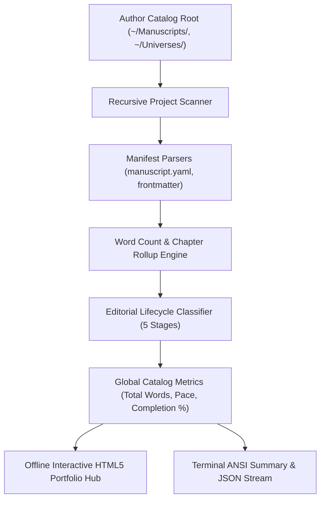
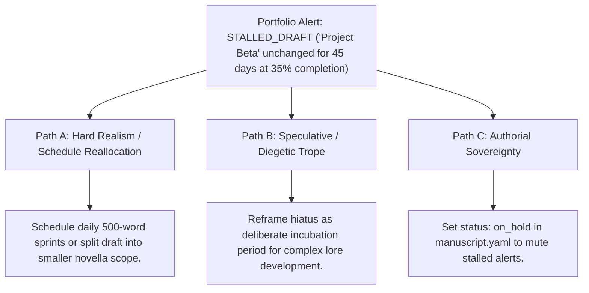

# Author Portfolio & Catalog Analytics Dashboard (`docs/PORTFOLIO.md`)
> **Domain F: Corpus Analytics, Diff, Continuity, RAG & Search** | **CLI:** `arcanum portfolio` / `arcanum catalog`

---

## 1. Overview & Theoretical Rationale

The **Ars Arcanum Portfolio Engine** (`scripts/lib/portfolio.py`) is an offline multi-project catalog aggregator, editorial lifecycle classifier, and series analytics dashboard engineered for professional speculative fiction authors, publishing collectives, and narrative designers.

Authors managing expansive literary universes or multi-novel backlists struggle with catalog-level visibility:
1. **Scattered Project State**: Word counts, active drafts, and revision stages locked away in disparate directories without unified progress tracking.
2. **Editorial Bottlenecks**: Inability to identify at a glance which manuscripts have reached revision milestones versus those stalled in early drafting.
3. **Series Volume Desynchronization**: Missing volume-level word count targets and deadline velocity trajectories across multi-book sagas.

The Portfolio Engine scans the author's root workspace, parses project manifests (`manuscript.yaml` and `world.yaml`), computes completion percentages relative to target word goals, classifies projects into standardized editorial stages, and compiles standalone offline HTML5 dashboards and JSON data streams.

---

## 2. Catalog Metrics & Lifecycle Mathematics



### 2.1 Completion Ratio & Volume Progress
For a project $p$ with current word count $W(p)$ and declared target word goal $T(p)$:

$$\text{Progress}(p) = \min\left(100.0, \, \frac{W(p)}{T(p)} \times 100\%\right)$$

### 2.2 Editorial Lifecycle Stage Classification Model
The engine deterministically assigns one of five standardized editorial lifecycle stages:

$$\text{Stage}(p) = \begin{cases} 
\text{Scaffolding} & \text{if } W(p) < 1,000 \lor \text{no chapter files} \\
\text{Drafting (Act I)} & \text{if } 1,000 \le W(p) < 0.50 \cdot T(p) \\
\text{Drafting (Act II/III)} & \text{if } 0.50 \cdot T(p) \le W(p) < T(p) \\
\text{Revisions / Pre-Flight} & \text{if } W(p) \ge T(p) \land \neg \text{HasExports}(p) \\
\text{Publication-Ready} & \text{if } W(p) \ge 0.90 \cdot T(p) \land \text{HasExports}(p)
\end{cases}$$

### 2.3 Estimated Reading Duration
$$\text{Reading Time (Hours)} = \frac{\sum_{p \in \mathcal{P}} W(p)}{\text{WPM}_{\text{reading}} \times 60} \quad (\text{Default } \text{WPM}_{\text{reading}} = 250 \text{ words/min})$$

---

## 3. Subfeatures Matrix

| Subfeature | Algorithmic Mechanism | Diagnostic Output / Rule | Narrative Craft Significance |
|---|---|---|---|
| **Multi-Project Vault Scanner** | Discovers all manuscript and world directories recursively. | Aggregates words, volumes, chapters, and scenes across projects. | Delivers bird's-eye visibility of entire publishing catalog. |
| **Editorial Stage Classifier** | Evaluates word counts against targets and export artifacts. | Classifies projects into 5 lifecycle tiers (Scaffolding $\to$ Publication).| Prevents early drafts from being prematurely pushed to release. |
| **Series Volume Rollup** | Aggregates sub-volumes within multi-book sagas. | Emits series-level word count sums and completion milestones. | Keeps multi-volume epics balanced and on schedule. |
| **Standalone HTML Portfolio Hub**| Compiles interactive dashboard with CSS progress bars. | Emits single-file offline `.html` hub. | Provides a modern visual control center for daily writing sessions. |
| **JSON Pipeline Dispatcher** | Emits machine-readable catalog statistics to stdout. | Generates JSON streams for external dashboards or CI/CD. | Enables custom automation scripts and backup metrics. |

---

## 4. Author Extension & Configuration Guide

### 4.1 Project Manifest Schema (`manuscript.yaml`)
```yaml
title: "The Silver Citadel"
author: "Aryan Singh Nagar"
series: "Chronicles of Aethelgard"
volume_index: 2
target_words: 95000
editorial_deadline: "2026-12-01"
genre: "Epic Fantasy"
status: "in_progress"
```

---

## 5. Command-Line Interface (CLI) Reference

```bash
# Scan default manuscript root directory and print terminal summary
arcanum portfolio

# Scan custom writing vault
arcanum portfolio ~/Writing-Vault/

# Export standalone interactive HTML dashboard
arcanum portfolio ~/Writing-Vault/ --html dist/portfolio.html

# Output structured JSON catalog metrics
arcanum portfolio ~/Writing-Vault/ --json

# Query portfolio logic and stage classification rules
arcanum doc portfolio --math --why
```

---

## 6. Tri-Fold Creative Advisory Resolutions



### Scenario: Stalled Drafting Alert (Project unchanged $>30$ days)
- **Path A (Hard Realism / Project Momentum)**:
  - Downscope the word count target from 100k to 50k (novella format) or schedule dedicated 25-minute writing sprints using `arcanum sprint`.
- **Path B (Speculative / Creative Incubation)**:
  - Reclassify the project as an "Active Worldbuilding Sandbox" while working on companion lore notes.
- **Path C (Authorial Sovereignty)**:
  - Update `status: hiatus` in `manuscript.yaml` to archive the project from active sprint metrics.

---

## 7. Content Security Policy & Offline Isolation

Generated portfolio dashboards are 100% offline and compliant with the Ars Arcanum manifesto:

```html
<meta http-equiv="Content-Security-Policy" content="default-src 'none'; style-src 'unsafe-inline'; script-src 'unsafe-inline'; img-src data:; media-src data: blob:;">
```
