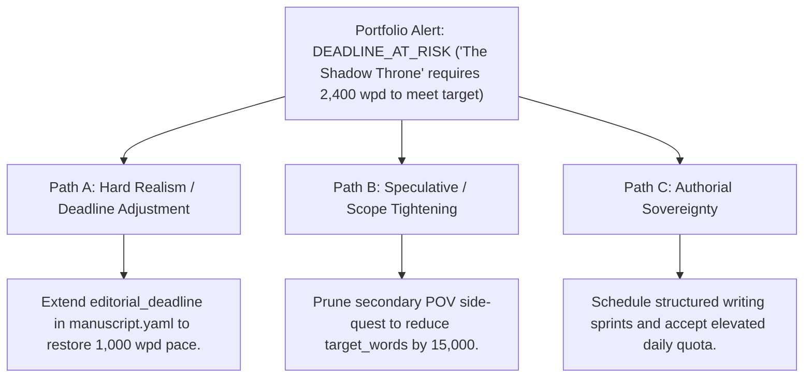

# Author Portfolio, Backlist Architecture & Catalog Analytics (`docs/PORTFOLIO.md`)
> **Domain F: Corpus Analytics, Diff, Continuity, RAG & Search** | **CLI:** `arcanum portfolio` / `arcanum catalog`

---

## 1. Overview & Theoretical Rationale

The **Ars Arcanum Portfolio Engine** (`scripts/lib/portfolio.py`) is an offline multi-project catalog aggregator, editorial lifecycle classifier, deadline forecasting model, and visual analytics dashboard engineered for career authors, speculative fiction worldbuilders, and independent publishing collectives.

Professional authors managing multi-volume backlists, concurrent trilogies, standalones, and collaborative anthologies face complex organizational overhead:
1. **Catalog Fragmentation**: Word counts, active draft branches, editorial deadlines, and revision milestones are scattered across dozens of individual directories and project folders without unified telemetry.
2. **Lifecycle Ambiguity**: Unclear project status leads to premature publication attempts on unpolished drafts or lingering in perpetual "development hell" on completed manuscripts.
3. **Capacity & Velocity Blindspots**: Lacking empirical historical writing velocity ($v_{\text{draft}} = \frac{\Delta W}{\Delta t}$), authors make unrealistic publishing commitments, leading to burnout and missed deadlines.

```
+-------------------------------------------------------------------------------+
|                    ARS ARCANUM PORTFOLIO ANALYTICS HUB                        |
|                                                                               |
|  +--------------------+     Workspace Discovery       +--------------------+  |
|  | Catalog Root Dir   | ----------------------------> | Manifest Evaluator |  |
|  | (~/Manuscripts/)   |                               | & YAML AST Parser  |  |
|  +--------------------+                               +--------------------+  |
|            |                                                    |             |
|            v                                                    v             |
|  [Word Count Rollup Engine]                           [5-Stage Lifecycle Model]|
|  (Manuscript + Lore Vaults)                           (Scaffold -> Published) |
|            |                                                    |             |
|            +----------------------------------------------------+             |
|                                     |                                         |
|                                     v                                         |
|                   +-----------------------------------+                       |
|                   |  Velocity & Deadline Forecasting  |                       |
|                   |  Catalog Shannon Diversity Metric |                       |
|                   |  Standalone Offline HTML5 Hub     |                       |
|                   +-----------------------------------+                       |
|                                     |                                         |
|                                     v                                         |
|                     [Master Portfolio Analytics Dashboard]                    |
|                     [Zero-Cloud Sovereign Generation]                         |
+-------------------------------------------------------------------------------+
```

The Portfolio Engine aggregates all project manifests (`manuscript.yaml` and `world.yaml`), calculates completion percentages against word count budgets, classifies manuscripts into standardized lifecycle stages, and generates a standalone offline HTML5 dashboard and machine-readable JSON telemetry.

---

## 2. Mathematical Formalism & Catalog Lifecycle Models

### 2.1 Project Completion & Capacity Allocation
For each manuscript project $p \in \mathcal{P}$ with current word count $W(p)$ and target word count $T(p)$:

$$\text{Completion Ratio}: \quad \mathcal{C}(p) = \min\left(1.0, \, \frac{W(p)}{T(p)}\right) \times 100\%$$

The total catalog word inventory $W_{\text{catalog}}$ and overall catalog progress $\overline{\mathcal{C}}_{\text{catalog}}$:

$$W_{\text{catalog}} = \sum_{p \in \mathcal{P}} W(p), \qquad \overline{\mathcal{C}}_{\text{catalog}} = \frac{\sum_{p \in \mathcal{P}} W(p)}{\sum_{p \in \mathcal{P}} T(p)} \times 100\%$$

### 2.2 Editorial Lifecycle Stage Classification Model
Projects are deterministically mapped into one of five rigorous editorial states:

$$\text{Stage}(p) = \begin{cases} 
\mathbf{S}_1: \text{Scaffolding} & \text{if } W(p) < 1,000 \lor \text{Chapters}(p) = 0 \\
\mathbf{S}_2: \text{Drafting (Act I)} & \text{if } 1,000 \le W(p) < 0.35 \cdot T(p) \\
\mathbf{S}_3: \text{Drafting (Acts II/III)} & \text{if } 0.35 \cdot T(p) \le W(p) < 0.90 \cdot T(p) \\
\mathbf{S}_4: \text{Developmental Revision} & \text{if } W(p) \ge 0.90 \cdot T(p) \land \neg \text{HasExports}(p) \\
\mathbf{S}_5: \text{Publication-Ready} & \text{if } W(p) \ge 0.90 \cdot T(p) \land \text{HasExports}(p)
\end{cases}$$

```
Lifecycle State Progression:
[ S1: Scaffolding ] ---> [ S2: Act I Drafting ] ---> [ S3: Acts II/III ]
                                                             |
                                                             v
[ S5: Published ] <--- [ S4: Preflight & Revisions ] <-------+
```

### 2.3 Velocity & Monte Carlo Deadline Forecasting
Given historical drafting velocity $\bar{v} = \frac{1}{K}\sum_{k=1}^K v_k$ words/day and daily standard deviation $\sigma_v$:

$$\text{Expected Days to Completion}: \quad \mathbb{E}[D_p] = \frac{T(p) - W(p)}{\bar{v}}$$

The 95% confidence interval deadline upper bound $D_{95\%}$:
$$D_{95\%} = \frac{T(p) - W(p)}{\max(1, \, \bar{v} - 1.96 \cdot \frac{\sigma_v}{\sqrt{K}})}$$

### 2.4 Catalog Diversity & Shannon Entropy
To evaluate balance across intellectual property franchises and genres:

$$\mathcal{H}_{\text{catalog}} = -\sum_{g \in \mathcal{G}} P(g) \log_2 P(g), \quad P(g) = \frac{W_g}{W_{\text{catalog}}}$$

Where $W_g$ represents total words authored within genre/franchise $g$.

---

## 3. Architecture & Subfeatures Matrix

| Subfeature | Algorithmic Mechanism | Output / Report | Narrative Craft Significance |
|---|---|---|---|
| **Multi-Project Vault Scanner** | Recursive AST traversal of root directory. | Aggregates words, scenes, and volumes across all projects. | Delivers executive visibility into lifetime author output. |
| **Editorial Stage Classifier** | Evaluates word counts against targets and export artifacts. | Badges projects (`Scaffolding` $\to$ `Publication-Ready`). | Enforces structural discipline and prevents half-finished releases. |
| **Series Rollup Engine** | Aggregates sub-volumes within multi-book sagas. | Calculates series-level word count sums and volume symmetry. | Ensures multi-book sagas maintain balanced volume arcs. |
| **Monte Carlo Deadline Engine**| Simulates completion timelines based on historical velocity. | Estimates median and 95th percentile completion dates. | Enables realistic publishing schedules without burnout. |
| **Standalone HTML5 Hub** | Single-file self-contained HTML dashboard with pure CSS charts. | Emits responsive portfolio dashboard (`dist/portfolio.html`). | Modern, distraction-free control center for writing sessions. |

---

## 4. Manifest Schema & Author Extension Guide

### 4.1 Project Manifest Specification (`manuscript.yaml`)
```yaml
id: "aethelgard_book_02"
title: "The Shadow Throne"
subtitle: "Chronicles of Aethelgard: Book Two"
author: "Valerius M. Vance"
series: "Chronicles of Aethelgard"
volume_index: 2
genre: "Epic Fantasy"
target_words: 95000
current_words: 62450
editorial_deadline: "2026-12-15"
active_draft: "Draft-02"
pov_characters:
  - "Kaelen Vane"
  - "Archon Aurelia"
  - "Theron Gray"
status: "in_progress"
tags:
  - "fantasy"
  - "political"
  - "sequel"
```

---

## 5. CLI Execution & Option Reference

```bash
# 1. Scan default workspace and emit terminal catalog summary table
arcanum portfolio

# 2. Scan custom root folder containing multiple novel projects
arcanum portfolio ~/Manuscripts/

# 3. Compile standalone interactive HTML5 portfolio dashboard
arcanum portfolio ~/Manuscripts/ --html dist/Portfolio_Dashboard.html

# 4. Generate machine-readable JSON portfolio analytics
arcanum portfolio ~/Manuscripts/ --json

# 5. CLI aliases
arcanum catalog
arcanum backlist
```

### Parameter Reference Table

| Flag / Option | Short | Type | Default | Description |
|---|---|---|---|---|
| `workspace_root` | (Positional) | `Path` | `.` | Root directory containing project folders. |
| `--html` | `-o` | `Path` | `None` | Output path for standalone HTML5 dashboard. |
| `--json` | `-j` | `bool` | `False` | Emits structured JSON summary to stdout. |
| `--velocity` | `-v` | `float` | `1000.0` | Assumed daily writing velocity in words/day. |
| `--genre-filter` | `-g` | `str` | `None` | Filters portfolio rollup to specific genres. |

---

## 6. Tri-Fold Creative Advisory Resolutions



### Scenario: Unrealistic Publishing Deadline Projected
- **Path A (Hard Realism / Schedule Recalibration)**:
  - The required writing velocity ($2,400\text{ words/day}$) is unsustainable. Update `editorial_deadline` in `manuscript.yaml` by 45 days to align with healthy sustainable output ($1,000\text{ words/day}$).
- **Path B (Scope & Subplot Tightening)**:
  - Identify non-essential subplots in the story canvas and reduce `target_words` from $95\text{k}$ to $80\text{k}$, maintaining the original deadline while sharpening narrative focus.
- **Path C (Authorial Sovereignty)**:
  - Maintain the deadline, activate `arcanum sprint`, and enter an intensive drafting residency.

---

## 7. Recommended Reading, References & Media

### 7.1 Author Backlist & Career Publishing Treatises
- **Smith, Dean Wesley (2014)**. *Writing into the Dark: How to Write a Novel without an Outline*. WMG Publishing. ISBN: 978-1561466337.  
  *Techniques for sustainable continuous output, managing massive backlists, and overcoming creative hesitation.*
- **Penn, Joanna (2018)**. *Successful Self-Publishing: How to Plan, Run, and Maintain a Multi-Book Publishing Business*. The Creative Penn. ISBN: 978-1912105991.  
  *Foundational manual on backlist catalog optimization, series metadata, and publishing schedules.*
- **Friedman, Jane (2018)**. *The Business of Being a Writer*. University of Chicago Press. ISBN: 978-0226393162.  
  *The defining academic and industry guide to author portfolio management, contracts, and career longevity.*

### 7.2 Quantitative Productivity & Visualization Theory
- **Tufte, Edward R. (1990)**. *Envisioning Information*. Graphics Press. ISBN: 978-0961392116.  
  *High-density visual design, macro-level catalog overviews, and small multiples visualization.*
- **Goldratt, Eliyahu M. (1984)**. *The Goal: A Process of Ongoing Improvement*. North River Press.  
  *The Theory of Constraints applied to editorial pipelines and creative bottlenecks.*

### 7.3 Video Lectures, Masterclasses & Author Interviews
- **Brandon Sanderson's BYU Creative Writing Lectures**: *Lecture 14: Career Management, Backlist Building, and Output Sustainability*.  
  *How Brandon tracks multiple projects simultaneously and structures his writing year.*
- **Writing Excuses**: *Season 13, Episode 20: Tracking Your Backlist and Career Health*.  
  *Masterclass discussions on tracking lifetime word counts and managing multi-project portfolios.*
- **The Creative Penn Podcast**: *Data-Driven Writing: Analytics and Backlist Catalog Architecture*.  
  *Industry interviews on using local databases and tracking metrics to sustain a multi-decade writing career.*

### 7.4 Landmark Speculative Case Studies
- **Sanderson, Brandon**: *The Cosmere Backlist (Dragonsteel Entertainment Portfolio)*.  
  *The gold standard of multi-series universe management, coordinating 20+ interconnected novels and novellas.*
- **Asimov, Isaac**: *The Opus 100 to Opus 500 Catalogs*.  
  *Historical exemplar of authorial catalog tracking, systematically documenting 500+ published volumes across genres.*
- **King, Stephen**: *On Writing: A Memoir of the Craft* (2000). Scribner.  
  *Daily 2,000-word discipline and long-term backlist portfolio maintenance.*
