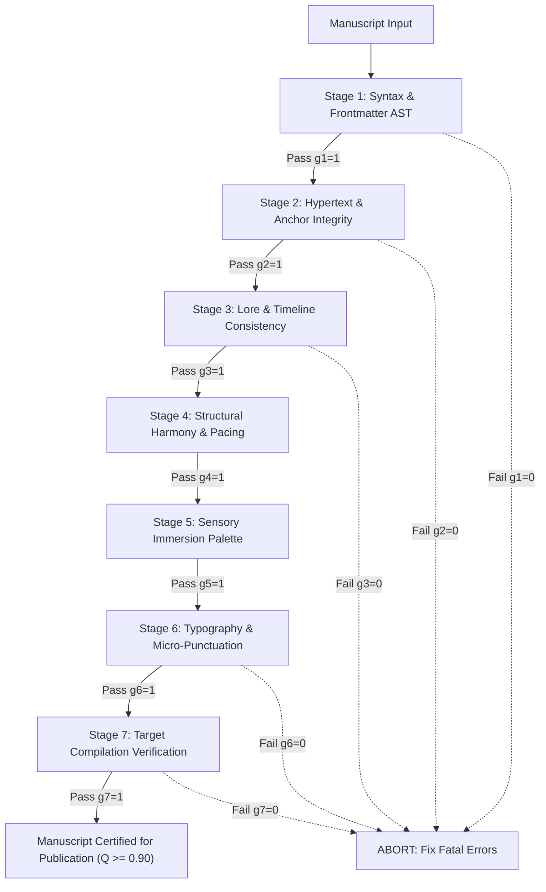
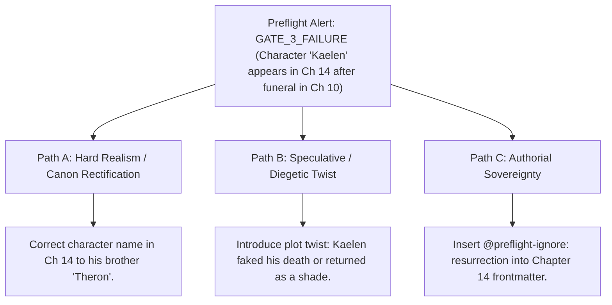

# Publication Preflight Verification Harness & Quality Gates (`docs/PREFLIGHT.md`)
> **Domain G: Publishing & Preflight** | **CLI:** `arcanum preflight` / `arcanum check`

---

## 1. Overview & Theoretical Rationale

The **Ars Arcanum Preflight Verification Harness** (`scripts/lib/preflight.py`) is an offline, multi-stage publishing quality gate, AST validator, lore continuity auditor, and compilation readiness tester engineered for novelists, independent publishers, and digital typesetters.

In traditional high-end print publishing and software engineering, assets must clear rigorous automated and human "Preflight" quality inspections before reaching the printing press or production deployment. In digital fiction writing, rushing an unverified manuscript directly to EPUB compilation or literary agent submission risks devastating defects:
1. **Broken Wikilinks & Unresolved Anchors**: References to `[[Deleted Note]]` rendering as broken text or missing anchors.
2. **Fatal Continuity Contradictions**: A character who was slain in Chapter 4 casually speaking in Chapter 12.
3. **Pacing Collapse & Structural Debt**: First acts that consume 60% of the word budget, suffocating the climax.
4. **Typographic Bleed & ASCII Clutter**: Straight quotes, double hyphens, and missing non-breaking spaces corrupting the professional reading aesthetic.

```
+-------------------------------------------------------------------------------+
|                    ARS ARCANUM PREFLIGHT QUALITY HARNESS                      |
|                                                                               |
|  +--------------------+     7-Stage Sequential Gate    +-------------------+  |
|  | Manuscript Working | -----------------------------> | Preflight Engine  |  |
|  | Tree (Chapters)    |                                | & AST Evaluators  |  |
|  +--------------------+                                +-------------------+  |
|            |                                                     |            |
|            v                                                     v            |
|  [Stage 1: Syntax & Frontmatter]                      [Stage 2: Wikilink AST] |
|  [Stage 3: Lore & Timeline Sync]                      [Stage 4: Pacing Curve] |
|  [Stage 5: Sensory Immersion]                         [Stage 6: Typography]   |
|  [Stage 7: Export Build Targets]                                              |
|            |                                                     |            |
|            +-----------------------------------------------------+            |
|                                         |                                     |
|                                         v                                     |
|                   +-----------------------------------+                       |
|                   |  Composite Preflight Score Q_pre  |                       |
|                   |  Pass / Remediation / Abort Gate  |                       |
|                   +-----------------------------------+                       |
|                                         |                                     |
|                                         v                                     |
|                     [Publication-Certified Release]                          |
|                     [Preflight Audit Certificate JSON]                        |
+-------------------------------------------------------------------------------+
```

The Preflight Harness executes a battery of deterministic inspection algorithms, calculating a mathematical readiness index and blocking deployment if non-negotiable quality gates are violated.

---

## 2. Mathematical Formalism & Multi-Stage Quality Gates

### 2.1 Composite Preflight Quality Score ($Q_{\text{preflight}}$)
The overall manuscript publication readiness $Q_{\text{preflight}} \in [0.0, 1.0]$ is governed by a conjunctive boolean barrier coupled with a weighted linear combination:

$$Q_{\text{preflight}} = \left( \prod_{k=1}^7 g_k \right) \times \left( \sum_{k=1}^7 w_k \cdot S_k \right)$$

Where:
- $g_k \in \{0, 1\}$ is the binary pass/fail condition for Stage $k$. If any single gate fails catastrophically ($g_k = 0$), $Q_{\text{preflight}} = 0.0$ and publication is aborted.
- $S_k \in [0.0, 1.0]$ is the continuous quality score for Stage $k$.
- $w_k$ are normalized stage weights ($\sum_{k=1}^7 w_k = 1.00$).

```
Preflight Stage Weights:
w1 (Syntax): 0.15 | w2 (Links): 0.15 | w3 (Continuity): 0.20 | w4 (Pacing): 0.15
w5 (Sensory): 0.10 | w6 (Typography): 0.10 | w7 (Build Target): 0.15
```

---

## 3. The 7-Stage Preflight Inspection Battery



### Stage-by-Stage Verification Specs

| Stage # | Inspection Target | Algorithmic Mechanism | Failure Trigger ($g_k = 0$) |
|:---:|---|---|---|
| **1** | **Syntax & Frontmatter** | Safe YAML parser and Markdown AST tree checker. | Malformed YAML delimiters, unclosed code blocks, missing `@title`. |
| **2** | **Hypertext & Wikilinks** | Inverted link resolver checking target anchor nodes. | Unresolved `[[Broken Link]]` references without fallback aliases. |
| **3** | **Lore & Timeline** | Entity attribute graph and chronological day sequence. | Temporal causal inversion (event happens before prerequisite cause). |
| **4** | **Structural Pacing** | Normalized cumulative word count vs paradigm curve. | Act I $> 45\%$ of total book, or missing climax milestone. |
| **5** | **Sensory Immersion** | Multi-sensory lexicon density extractor. | Chapter possesses $< 2$ sensory channels (pure white-room syndrome). |
| **6** | **Typography & Punctuation** | Micro-typography regex state machine. | Straight quotes, mismatched curly quotation pairs, double hyphens. |
| **7** | **Export Target Build** | Dry-run compilation to Typst, EPUB, and DOCX. | Missing cover image asset, invalid font references, broken CSS. |

---

## 4. CLI Execution & Option Reference

```bash
# 1. Run full 7-stage preflight quality audit on manuscript
arcanum preflight Manuscripts/Book-01/

# 2. Strict release mode (enforces Q >= 0.95 and zero warnings)
arcanum preflight Manuscripts/Book-01/ --strict --target typst,epub

# 3. Fast syntax and link check only (Stages 1-2)
arcanum preflight Manuscripts/Book-01/ --quick

# 4. Export machine-readable JSON preflight report for CI/CD pipelines
arcanum preflight Manuscripts/Book-01/ --json -o dist/preflight_report.json

# 5. Automatically repair fixable errors (Typography, Frontmatter keys)
arcanum preflight Manuscripts/Book-01/ --auto-fix
```

### Options & Parameter Reference Table

| Parameter | Short | Type | Default | Description |
|---|---|---|---|---|
| `manuscript_dir` | (Positional) | `Path` | `.` | Root directory of manuscript chapters. |
| `--strict` | `-s` | `bool` | `False` | Fails if any warning is detected ($Q < 0.95$). |
| `--quick` | `-q` | `bool` | `False` | Runs only Stages 1, 2, and 6 (syntax, links, typo). |
| `--target` | `-t` | `str` | `all` | Target formats to test: `typst`, `epub`, `docx`, `all`. |
| `--auto-fix` | `-a` | `bool` | `False` | Automatically invokes typography and frontmatter repair. |
| `--json` | `-j` | `bool` | `False` | Emits JSON telemetry summary to stdout. |

---

## 5. Tri-Fold Creative Advisory Resolutions



### Scenario: Fatal Character Continuity Violation in Preflight
- **Path A (Hard Realism / Mechanical Repair)**:
  - The author simply mistyped a character name during late-night drafting. Replace occurrences of `Kaelen` in Chapter 14 with `Theron`.
- **Path B (Speculative / Diegetic Narrative Twist)**:
  - Lean into the contradiction as an intentional dramatic reveal: Kaelen's funeral was a body-double deception orchestrated by the Silver Concordat.
- **Path C (Authorial Sovereignty)**:
  - If the scene is a surreal dream sequence or flashback, annotate the chapter frontmatter with `timeline_mode: flashback` or `@preflight-ignore: continuity` to override the gate.

---

## 6. Recommended Reading, References & Media

### 6.1 Foundational Prepress & Software Quality Treatises
- **ISO (2010)**. *ISO 15930-1:2001: Graphic Technology — Prepress Digital Data Exchange — Use of PDF (PDF/X-1a)*. International Organization for Standardization. [ISO 15930](https://www.iso.org/standard/29061.html).  
  *The international standard establishing multi-stage automated preflight quality verification for digital and print assets.*
- **World Wide Web Consortium (W3C) (2023)**. *EPUB 3.3 Specification & EPUB Accessibility 1.1*. W3C Recommendation. [W3C EPUB 3.3](https://www.w3.org/TR/epub-33/).  
  *The normative international standard for digital book packages, manifest verification, and navigation landmarks.*
- **Fagan, Michael E. (1976)**. "Design and Code Inspections to Reduce Errors in Program Development", *IBM Systems Journal*, 15(3):182–211.  
  *The seminal paper defining formal inspection gates, defect classification, and non-negotiable exit criteria.*
- **Deming, W. Edwards (1986)**. *Out of the Crisis*. MIT Center for Advanced Educational Services. ISBN: 978-0262541152.  
  *Foundational principles of quality engineering: building quality into every phase rather than relying solely on end-stage inspection.*

### 6.2 Editorial Rigor & Publishing Craft
- **The University of Chicago Press (2017)**. *The Chicago Manual of Style* (17th / 18th Edition). University of Chicago Press.  
  *The publisher's definitive standard for manuscript preparation, proofreading symbols, and mechanical editing passes.*
- **Einsohn, Amy & Schwartz, Marilyn (2019)**. *The Copyeditor's Handbook: A Guide for Book Publishing and Corporate Communications* (4th Edition). University of California Press. ISBN: 978-0520286726.  
  *Exhaustive textbook on mechanical editing, fact-checking, consistency queries, and editorial triage.*

### 6.3 Video Lectures, Masterclasses & Quality Control Media
- **Brandon Sanderson's BYU Creative Writing Lectures**: *Lecture 15: The Final Steps: Pre-Publication Polish, Proofing, and Typesetting*.  
  *Step-by-step masterclass on cold reads, gamma readers, and formatting validation.*
- **Typst Community**: *Publishing Pipelines: Automated Quality Verification and Preflight Checks in Typst*.  
  *Automating book compilation and layout validation.*
- **Writing Excuses**: *Episode 11.40: The Art of the Proofread: Catching the Uncatchable*.  
  *Techniques for catching layout glitches and continuity errors before public release.*

### 6.4 Landmark Speculative Case Studies
- **Rowling, J.K.**: *Harry Potter and the Goblet of Fire* ("The Wand Order Glitch").  
  *Famous preflight slip where James Potter emerged from Voldemort's wand before Lily Potter, requiring a reprint fix.*
- **Tolkien, J.R.R.**: *The Lord of the Rings* (Second Edition Textual Revisions by Tolkien, 1965).  
  *Decades-long preflight and proofing passes undertaken by Tolkien to fix lunar phase inconsistencies and travel distances.*
- **Pratchett, Terry**: *Discworld Series Continuity Audits*.  
  *Rigorous concordance proofing to reconcile Discworld geography and historical calendars across 41 novels.*
