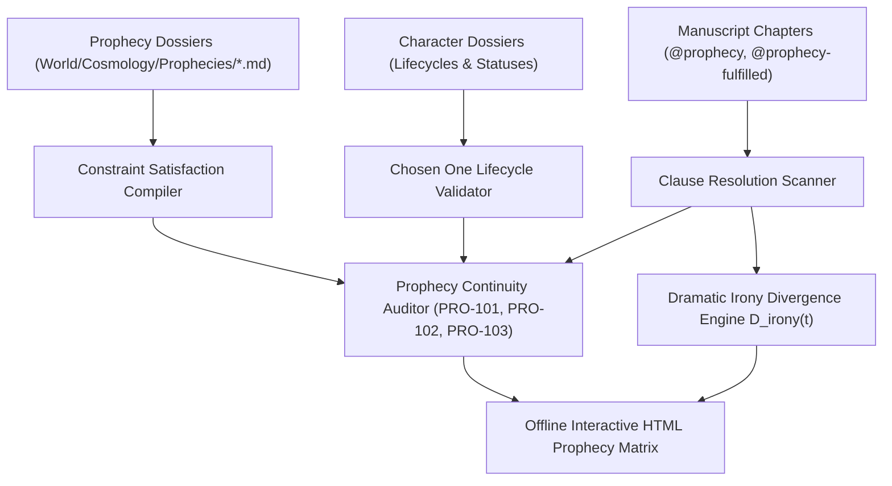
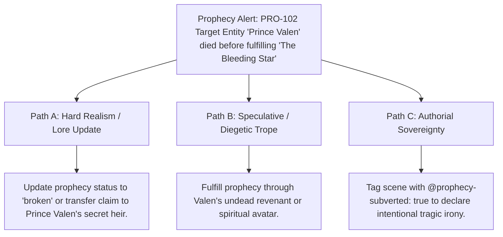

# Prophecy Resolution Matrix, Constraint Satisfaction & Dramatic Irony (`docs/PROPHECY.md`)
> **Domain C: Magic Systems, Metaphysics, Metasystems & Causality** | **CLI:** `arcanum prophecy` / `arcanum oracle`

---

## 1. Overview & Theoretical Rationale

The **Ars Arcanum Prophecy Engine** (`scripts/lib/prophecy.py`) is an offline predictive constraint validator, dramatic irony modeler, and narrative foreshadowing auditor engineered for epic fantasy authors, mythological worldbuilders, and tragedy dramatists.

In mythological and high-fantasy literature, prophecies are powerful structural promises that establish intense reader expectations. Authors encounter three major architectural failure modes:
1. **Unearned Declared Fulfillment (`PRO-101`)**: Labeling a prophecy as `fulfilled` in lore notes when zero corresponding fulfillment events occur in the manuscript.
2. **Dead Target Entity (`PRO-102`)**: The destined "Chosen One" dies prematurely before completing the prophecy's clauses without an explicit subversion tag.
3. **Orphan Lore Prophecies (`PRO-103`)**: Sprawling mythological prophecies created in the World Bible that never appear in prose or influence character actions.
4. **Dramatic Irony Decay**: Failing to track the epistemic gap between what the reader knows from the prophecy versus what the characters understand.

The Prophecy Engine extracts prophecy definitions (`World/Cosmology/Prophecies/*.md`), cross-validates them against character dossiers and manuscript `@prophecy:` tags, computes clause-level Boolean fulfillment vectors, models dramatic irony metrics, and generates interactive HTML audit reports.

---

## 2. Mathematical Modeling, CSP & Epistemic Theory



### 2.1 Prophecy as a Constraint Satisfaction Problem (CSP)
A prophecy $\Phi$ is formalized as a tuple $(X, D, C)$:
- $X = \{x_1, x_2, \dots, x_k\}$: Set of predictive condition variables (clauses).
- $D = \{\{0, 1\}\}^k$: Boolean domain of fulfillment states ($0 = \text{unresolved}, 1 = \text{fulfilled}$).
- $C = \{\phi_1, \phi_2, \dots, \phi_m\}$: Logical constraints linking clauses to temporal windows, locations, and actors.

The global prophecy fulfillment state vector $\vec{S}(\Phi) \in \{0, 1\}^k$:
$$\text{Status}(\Phi) = \begin{cases} 
\text{unfulfilled} & \text{if } \sum_{i=1}^k x_i = 0 \\
\text{partially\_fulfilled} & \text{if } 0 < \sum_{i=1}^k x_i < k \\
\text{fulfilled} & \text{if } \sum_{i=1}^k x_i = k \land \neg \text{Subverted} \\
\text{subverted} & \text{if } \sum_{i=1}^k x_i = k \land \text{IronicInversion} \\
\text{broken} & \text{if } \exists i \text{ s.t. } x_i \text{ is rendered impossible (e.g. Chosen One dead)}
\end{cases}$$

### 2.2 Dramatic Irony Divergence Metric ($D_{\text{irony}}$)
Dramatic irony measures the cognitive divergence between the reader's knowledge base $\mathcal{K}_{\text{reader}}(t)$ and the viewpoint character's knowledge base $\mathcal{K}_{\text{char}}(t)$ at narrative chapter index $t$:

$$D_{\text{irony}}(t) = \frac{|\mathcal{K}_{\text{reader}}(t) \setminus \mathcal{K}_{\text{char}}(t)|}{|\mathcal{K}_{\text{reader}}(t)|} \in [0.0, 1.0]$$

- $D_{\text{irony}} \approx 0.0$: **Mystery Mode** (Reader and character share identical knowledge).
- $D_{\text{irony}} \ge 0.60$: **Tragic / Suspense Mode** (Reader possesses vital prophetic secrets that the protagonist is ignorantly marching toward).

---

## 3. Subfeatures Matrix & Diagnostic Codes

| Code / Feature | Algorithmic Mechanism | Severity | Diagnostic Rule / Trigger | Narrative Significance |
|:---|---|:---:|---|---|
| **`PRO-101`** | Manuscript cross-reference validator. | `ERROR` | **Unearned Fulfillment**: Prophecy marked `fulfilled` in lore with 0 manuscript events. | Prevents fake resolution claims unsupported by prose. |
| **`PRO-102`** | Character lifecycle cross-referencer. | `ERROR` | **Dead Target Entity**: Chosen One is deceased while prophecy remains `unfulfilled`. | Catches broken prophecies or prompts tragic subversion tags. |
| **`PRO-103`** | World vs. manuscript text search. | `WARNING` | **Orphan Prophecy**: Prophecy lore note never mentioned or tagged in manuscript. | Eliminates dead-weight worldbuilding that never impacts the plot. |
| **Clause Progress Tracker** | Boolean vector evaluation across scene directives. | `INFO` | Tracks ratio of fulfilled clauses ($\frac{m}{k}$). | Provides clear progress indicators across long trilogies. |
| **Dramatic Irony Auditor** | Compares character epistemic state against oracle revelation chapters. | `INFO` | Emits $D_{\text{irony}}$ curve across chapters. | Optimizes suspense and impending doom in tragic arcs. |

---

## 4. Author Extension & Configuration Guide

### 4.1 Prophecy Lore Schema (`World/Cosmology/Prophecies/Bleeding_Star.md`)
```markdown
---
name: "The Bleeding Star"
type: prophecy
oracle: "[[Pythia of Delphi]]"
target_entity: "[[Prince Valen]]"
status: unfulfilled
date_uttered: "3rd Age, Year 401"
clauses:
  - "When the red comet crosses the winter solstice"
  - "The obsidian blade shall drink royal blood"
  - "And the crown of spires shall crumble to ash"
---

# The Bleeding Star
An ancient apocalyptic oracle carved onto the basalt pillars of Delphi.
```

### 4.2 In-Manuscript Directive Syntax
```markdown
# Chapter 18: The Eclipse of the Sunken Spire
@pov: Prince Valen
@prophecy: The Bleeding Star
@prophecy-fulfilled: The Bleeding Star

Valen looked up as the crimson comet tore through the darkened sky.
He drew the obsidian blade and drove it into his father's chest.
```

---

## 5. Command-Line Interface (CLI) Reference

```bash
# Audit prophecies across world lore and manuscript
arcanum prophecy World/ -m Manuscript/

# Export standalone offline interactive HTML prophecy dashboard
arcanum prophecy World/ -m Manuscript/ --html reports/prophecy_matrix.html

# Output machine-readable JSON prophecy analytics
arcanum prophecy World/ -m Manuscript/ --json

# Query prophecy constraint theory and dramatic irony mathematics
arcanum doc prophecy --math --why
```

---

## 6. Tri-Fold Creative Advisory Resolutions



### Scenario: Dead Chosen One Alert (`PRO-102`)
- **Path A (Hard Realism / Strict Status Update)**:
  - Update `status: broken` in `World/Cosmology/Prophecies/*.md`, acknowledging that destiny was irrevocably severed.
- **Path B (Speculative / Diegetic Trope)**:
  - Reinterpret the prophecy metaphorically: the prophecy is fulfilled posthumously by Valen's bloodline, his clone, or his resurrected revenant.
- **Path C (Authorial Sovereignty)**:
  - Mark the scene with `@prophecy-subverted: The Bleeding Star`, turning the Chosen One's death into an intentional thematic critique of predestination.

---

## 7. Content Security Policy & Offline Isolation

Generated HTML prophecy reports and interactive dashboards operate 100% offline with zero CDN dependencies:

```html
<meta http-equiv="Content-Security-Policy" content="default-src 'none'; style-src 'unsafe-inline'; script-src 'unsafe-inline'; img-src data:; media-src data: blob:;">
```
