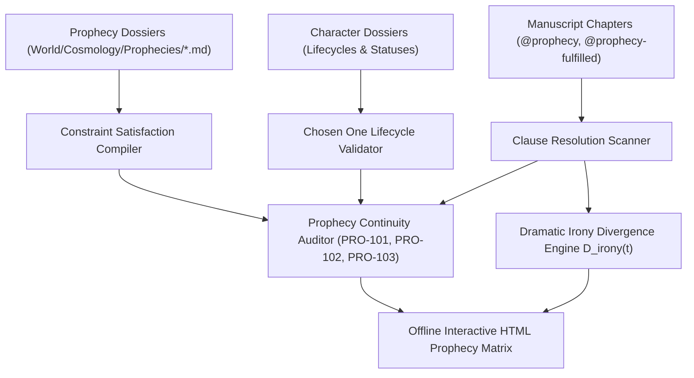

# Prophecy Resolution Matrix, Constraint Satisfaction & Dramatic Irony (`docs/PROPHECY.md`)
> **Domain C: Magic Systems, Metaphysics, Metasystems & Causality** | **CLI:** `arcanum prophecy` / `arcanum oracle`

---

## 1. Overview & Theoretical Rationale

The **Ars Arcanum Prophecy Engine** (`scripts/lib/prophecy.py`) is an offline predictive constraint validator, dramatic irony modeler, and narrative foreshadowing auditor engineered for epic fantasy authors, mythological worldbuilders, and tragedy dramatists.

In mythological and high-fantasy literature, prophecies are profound structural promises that establish intense reader expectations. When handled poorly, prophecies collapse into lazy exposition or unearned plot convenience. Authors encounter four major architectural failure modes:
1. **Unearned Declared Fulfillment (`PRO-101`)**: Labeling a prophecy as fulfilled in lore notes when zero corresponding fulfillment events occur in manuscript prose.
2. **Dead Target Entity (`PRO-102`)**: The destined "Chosen One" dies prematurely before completing the prophecy's mandatory clauses without an explicit subversion tag.
3. **Orphan Lore Prophecies (`PRO-103`)**: Sprawling mythological verses created in worldbuilding bibles that never appear in prose or influence character motivations.
4. **Dramatic Irony Decay (`PRO-104`)**: Failing to calculate the epistemic gap between what the reader knows from the prophecy versus what the characters understand.

The Prophecy Engine extracts prophecy definitions (`World/Cosmology/Prophecies/*.md`), cross-validates them against character dossiers and manuscript `@prophecy:` tags, computes clause-level Boolean fulfillment vectors, models dramatic irony metrics, and generates interactive HTML audit reports.



---

## 2. Prophetic Narrative Dynamics & Archetypes

```
+-----------------------------------------------------------------------------------+
|                        CANONICAL PROPHETIC DYNAMICS                               |
+-------------------+-------------------------------+-------------------------------+
| SELF-FULFILLING   | THE CASSANDRA PARADOX         | AMBIGUOUS / LITERAL TWIST     |
| (OEDIPAL LOOP)    | Absolute truth paired with    | Semantic polysemy or syntactic|
| Actions taken to  | zero belief; characters march | misdirection masking literal  |
| avoid the outcome | toward disaster knowingly.    | fulfillments (Macbeth).       |
| directly cause it.|                               |                               |
+-------------------+-------------------------------+-------------------------------+
```

### 2.1 The Oedipal Self-Fulfilling Causal Loop
In self-fulfilling loops, the foreknowledge of the outcome is the necessary causal prerequisite for the event occurring:

$$\text{Knowledge}(\Phi) \xrightarrow{\text{Spawns Fear}} \text{Action}(A_{\text{evasion}}) \xrightarrow{\text{Causes}} \text{Event}(E_{\text{prophesied}})$$

Without the Oracle's warning, King Laius would never have abandoned Oedipus on the mountain; without being abandoned, Oedipus would never have encountered his father at the crossroads.

### 2.2 The Cassandra Paradox
The prophet possesses veridical prescience, but is cursed with zero communicative persuasion:

$$\mathcal{P}(\text{Event} = \text{True} \mid \text{Prophecy}) = 1.0 \quad \land \quad \mathcal{P}(\text{Belief} = \text{True} \mid \text{Audience}) = 0.0$$

The dramatic engine shifts from *mystery* ("Will it happen?") to *tragic inevitability and suspense* ("How will they fail to listen?").

### 2.3 Semantic Ambiguity vs Literal Fulfillment
Prophecies frequently exploit **semantic equivocation** and **metaphorical misdirection**:
- *Syntactic Ambiguity*: "No man of woman born shall harm Macbeth" $\to$ Macduff was delivered via caesarean section.
- *Geographic / Toponymic Equivocation*: "You will die beneath Jerusalem" $\to$ King Henry IV dies in the Jerusalem Chamber at Westminster Abbey.
- *Entity Metaphor*: "When the Dragon reborn weeps over the broken stone" $\to$ Refers to a specific broken seal, not geological stone.

### 2.4 Divergent Timeline Prophecies & Prescience Traps
In hard speculative fiction (e.g. Frank Herbert's *Dune*), prescience operates as a quantum superposition of possible worldlines:

$$\Phi(t) = \int_{\Omega} \Psi(w, t) \cdot \mathcal{P}(w) \, dw$$

The prophet does not merely observe the future; the act of observation collapses probability waves into a rigid, inescapable "Golden Path," turning prescience into a temporal prison.

---

## 3. Mathematical Modeling & Constraint Satisfaction (CSP)

### 3.1 Prophecy as a Constraint Satisfaction Problem (CSP)
A prophecy $\Phi$ is formalized as a tuple $(X, D, C)$:
- $X = \{x_1, x_2, \dots, x_k\}$: Set of predictive condition variables (clauses).
- $D = \{\{0, 1\}\}^k$: Boolean domain of clause states ($0 = \text{unresolved}, 1 = \text{fulfilled}$).
- $C = \{\phi_1, \phi_2, \dots, \phi_m\}$: Temporal, spatial, and agentic constraints linking clauses.

The global prophecy fulfillment state vector $\vec{S}(\Phi) \in \{0, 1\}^k$:

$$\text{Status}(\Phi) = \begin{cases} 
\text{unfulfilled} & \text{if } \sum_{i=1}^k x_i = 0 \\
\text{partially\_fulfilled} & \text{if } 0 < \sum_{i=1}^k x_i < k \\
\text{fulfilled} & \text{if } \sum_{i=1}^k x_i = k \land \neg \text{Subverted} \\
\text{subverted} & \text{if } \sum_{i=1}^k x_i = k \land \text{IronicInversion} \\
\text{broken} & \text{if } \exists i \text{ s.t. } x_i \text{ is rendered logically impossible}
\end{cases}$$

### 3.2 Dramatic Irony Divergence Metric ($D_{\text{irony}}$)
Dramatic irony measures the cognitive divergence between the reader's prophetic knowledge $\mathcal{K}_{\text{reader}}(t)$ and the viewpoint character's knowledge $\mathcal{K}_{\text{char}}(t)$ at manuscript chapter $t$:

$$D_{\text{irony}}(t) = \frac{|\mathcal{K}_{\text{reader}}(t) \setminus \mathcal{K}_{\text{char}}(t)|}{|\mathcal{K}_{\text{reader}}(t)|} \in [0.0, 1.0]$$

```
Dramatic Irony D_irony(t)
1.0 |                   * Tragic Peak (Reader knows fate; hero is blind)
0.8 |                  / \
0.6 |    * Reveal     /   \
0.4 |   / \          /     \
0.2 |  /   \________/       \* Anagnorisis (Hero discovers truth)
0.0 +-+----+-------+--------+--> Chapter Stream (t)
     Ch 1  Ch 8   Ch 15   Ch 25
```

---

## 4. Subfeatures Matrix & Diagnostic Codes

| Diagnostic Code | Flag | Trigger Condition | Worldbuilding Correction |
|---|---|---|---|
| `PRO-101` | `UNRESOLVED_FULFILLMENT` | Prophecy marked `status: fulfilled` in lore but has unresolved clauses in manuscript. | Add fulfillment scene tags `@prophecy-fulfilled` in prose. |
| `PRO-102` | `DEAD_CHOSEN_ONE` | Destined bearer marked as deceased prior to clause completion. | Declare subversion, lineage transference, or resurrect entity. |
| `PRO-103` | `ORPHAN_PROPHECY` | Verse exists in `World/` but never referenced in prose. | Weave verse into scholar dialogue, religious texts, or dreams. |
| `PRO-104` | `PREMATURE_ANAGNORISIS` | Character discovers prophecy meaning before Act II Midpoint. | Delay realization to preserve dramatic tension. |
| `PRO-105` | `CLAUSE_CONTRADICTION` | Clause $x_a$ requires character living, while $x_b$ requires their prior sacrifice. | Clarify metaphorical vs physical death conditions. |

---

## 5. Frontmatter Directives & YAML Schemas

### 5.1 Prophecy Lore Dossier (`World/Cosmology/Prophecies/Ember_Covenant.md`)
```yaml
---
prophecy_id: "ember_covenant"
title: "The Covenant of the Ashen Crown"
prophet: "Seer Malakor"
era_recorded: "Age of Eclipse, Year 412"
dynamic_type: "oedipal_loop" # oedipal_loop | cassandra | ambiguous_literal | divergent_timeline
bearer_entity: "Prince_Aethelgard"
clauses:
  - id: "blood_eclipse"
    text: "When the crimson moon blots out the golden sun"
    condition: "astronomical_event == 'solar_eclipse'"
    resolved: true
    resolved_chapter: 7
  - id: "brother_slaying"
    text: "The kin-blade shall pierce the twin of dawn"
    condition: "target_killed('Prince_Alden', weapon='Sunfang')"
    resolved: false
  - id: "throne_fall"
    text: "And the iron throne shall melt to glass"
    condition: "citadel_destroyed"
    resolved: false
---
```

### 5.2 Manuscript Scene Directive (`Manuscript/Chapter-07.md`)
```markdown
# Chapter 7: The Sky Bleeds Black
@prophecy: ember_covenant
@clause_fulfilled: blood_eclipse
@dramatic_irony: 0.85

Aethelgard looked to the blackened sky. The sun was consumed by a bleeding shadow.
```

---

## 6. Worked Step-by-Step Example

### Scenario: High-Fantasy Equivocal Prophecy ("The Unborn King")
1. **The Verse**: *"No king crowned in gold shall strike the Shadow Lord, nor shall he fall while the Iron Gate stands whole."*
2. **Character Assumption (Tragic Blunder)**: The allied lords believe they need a queen to strike him, and spend three chapters defending the Iron Gate fortress.
3. **The Literal Inversion (Payoff)**:
   - The protagonist was crowned with a wreath of rowan leaves (*crowned in wood, not gold*).
   - The antagonist lured them into the fortress; to kill him, the allies must *demolish their own Iron Gate* to breach the warding field.
4. **Epistemic Tracking**:
   - Ch 02–14: Audience and characters assume figurative language ($D_{\text{irony}} = 0.10$).
   - Ch 15: Protagonist finds ancient architectural schematic showing the Iron Gate is a resonance anchor ($D_{\text{irony}} = 0.90$ for readers and hero vs army commanders).
   - Ch 20: Climax demolition and victory.

---

## 7. Recommended Reading, References & Media

### 7.1 Foundational Craft & Academic Books
- **Sophocles (c. 429 BCE)**. *Oedipus Rex* (trans. Robert Fagles, *The Three Theban Plays*, Penguin Classics).  
  *The primordial dramaturgical masterpiece of the self-fulfilling prophetic causal loop and tragic discovery.*
- **Shakespeare, William (1606)**. *Macbeth* (Arden Shakespeare).  
  *The definitive dramatic treatise on prophetic ambiguity, equivocation, and semantic double-meaning.*
- **Herbert, Frank (1965)**. *Dune*. Chilton Books. ISBN: 978-0441172719.  
  *Unrivaled examination of the physics and psychological terror of prescience, the myth of the Kwisatz Haderach, and the trap of the Golden Path.*
- **Gaiman, Neil & Pratchett, Terry (1990)**. *Good Omens: The Nice and Accurate Prophecies of Agnes Nutter, Witch*. Workman Publishing. ISBN: 978-0060853983.  
  *Masterclass in humorous hyper-literal prophetic specificity and butterfly-effect temporal mechanics.*
- **Martin, George R.R. (1996–Present)**. *A Song of Ice and Fire* series. Bantam Books.  
  *Textbook case study of multi-layered, deceptive prophecy (Azor Ahai, the Prince That Was Promised, Maggy the Frog's Valonqar).*

### 7.2 Landmark Scientific / Worldbuilding Papers & Textbooks
- **Borges, Jorge Luis (1941)**. "The Garden of Forking Paths", *Ficciones*. Editorial Sur.  
  *The seminal philosophical story introducing labyrinthine temporal divergence and infinite simultaneous futures.*
- **Popper, Karl (1957)**. *The Poverty of Historicism*. Routledge. ISBN: 978-0415278461.  
  *Formulates the 'Oedipus effect' in philosophy of science: how the prediction of an event influences the event itself.*

### 7.3 Seminal Video Lectures, Masterclasses & Channels
- **Tale Foundry (2018)**. *Prophecies in Fiction: Why They're So Hard to Write*. YouTube.  
  *Detailed examination of self-fulfilling traps, subversion techniques, and the preservation of agency.*
- **Hello Future Me (Tim Hickson, 2019)**. *On Writing: Prophecies & Foreshadowing in Fantasy*. YouTube.  
  *Analyzes George R.R. Martin and J.K. Rowling's use of figurative misdirection versus literal payoff.*
- **CrashCourse Theater (2018)**. *Tragic Inevitability and the Oracle at Delphi*. YouTube / PBS.  
  *Explores Greek tragic dramaturgy and the psychological effect of pre-ordained fate on theatrical audiences.*

### 7.4 Landmark Speculative Case Studies
- **Frank Herbert, *Dune Messiah* (1969)**: Paul Atreides blinded physically but forced to navigate strictly through his rigid prescient memory of the future.
- **J.K. Rowling, *Harry Potter and the Order of the Phoenix* (2003)**: Sybill Trelawney's prophecy showing how Voldemort's choice created his own nemesis (*"Mark him as his equal"*).
- **Star Wars (George Lucas, 1999–2005)**: The Chosen One prophecy bringing balance to the Force through tragic destruction before ultimate redemption.
