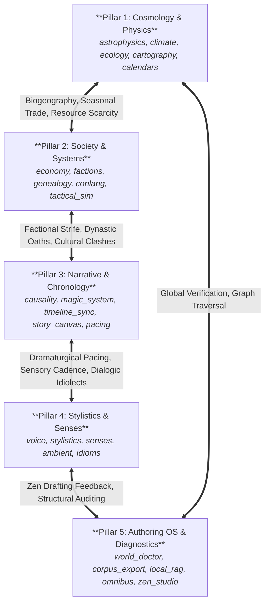

# Universal Knowledge Mesh, Causal Cascades & Cross-Domain Resonance (`docs/RESONANCE.md`)
> **Domain Z: Universal Interconnectivity, Synergy & Synthesis Mesh** | **CLI:** `arcanum resonance` / `arcanum cascade` / `arcanum spark` / `arcanum bridge`

---

## 1. Overview & Theoretical Rationale

The **Universal Resonance & Knowledge Mesh Engine** (`scripts/lib/resonance.py`) is a deterministic synthesis, graph-theoretic cross-domain bridge, and causal cascade engine designed to weave all 50+ domain engines of *Ars Arcanum* into an interconnected worldbuilding ecosystem.

Authors and narrative architects frequently encounter cognitive silos when building intricate speculative universes:
1. **Physical $\leftrightarrow$ Societal Disconnect**: Planetary axial tilt or stellar radiation models (`astrophysics`, `climate`) are modified without tracing their ripple effects into agrarian calendars, macroeconomics (`economy`), religious feast days, or strategic military campaigns (`tactical_sim`).
2. **Linguistic $\leftrightarrow$ Metaphysical Isolation**: Conlang phonetic shifts (`conlang`) and naming conventions evolve separately from magical resonance frequencies (`magic_system`) or geological strata (`cartography`).
3. **Narrative $\leftrightarrow$ Stylistic Decoupling**: Plot tension arcs (`pacing`, `structure`) lack structural isomorphism with character cadence rhythms (`voice`, `stylistics`) or sensory palettes (`senses`, `ambient`).
4. **Lack of Emergent Combinatorial Sparks**: Ideation stalls when world elements are designed in vacuum rather than sparked through multidisciplinary analogies.

The Resonance Engine bridges these silos by mapping all domain engines and craft features into a weighted bi-directional graph across 5 master domain pillars, calculating multi-hop causal cascades, finding shortest metaphorical paths between disparate concepts, and auditing global world coherence.

---

## 2. Universal Architecture & 5-Pillar Topology



### 2.1 The 5 Master Pillars
1. **Cosmology & Physics**: Planetary orbits, tidal ranges, biomes, geological formations, terrain networks, and celestial timekeeping.
2. **Society & Systems**: Trade networks, currencies, lineage genetics, political power structures, linguistic syntax, and military doctrine.
3. **Narrative & Chronology**: Non-linear causality DAGs, metaphysical magic conservation, dual-track timeline sync, story corkboard, and plot tension matrices.
4. **Stylistics & Senses**: Character idiolect signatures, readability metrics, 5-sense sensory saturation, ambient atmospheric acoustic palettes, and cultural figures of speech.
5. **Authoring OS & Diagnostics**: Inconsistency diagnosis (`world_doctor`), multi-volume continuity, SQLite/FTS5 semantic retrieval (`local_rag`), corpus export, and distraction-free drafting (`zen_studio`).

---

## 3. Core Engine Mechanics & Mathematical Invariants

### 3.1 Causal Cascade Simulation
When an author alters a fundamental worldbuilding parameter $u$, the change cascades through the graph $G = (V, E)$:

$$\text{Impact}(v) = \text{InitialMagnitude}(u) \cdot \prod_{e=(i, j) \in \text{Path}(u, v)} \text{EdgeWeight}(e) \cdot \text{DampingFactor}^{d(u, v)}$$

- **Damping Factor**: $\gamma = 0.85$ per edge traversal, preventing infinite energetic amplification.
- **Forward-Chaining Horizon**: Explores up to $k$ hops (default: 4) across physical, socioeconomic, and narrative boundaries.
- **Multi-Perspective Resolution Pathways**:
  - *Hard Realism*: Physical and mathematical direct consequences.
  - *Speculative Trope*: Genre-specific narrative drama and mythological resonance.
  - *Creative Sovereignty*: The author's ultimate narrative prerogative and symbolic balance.

### 3.2 Shortest Path Conceptual Bridging
To connect two seemingly unrelated elements (e.g. `astrophysics.axial_tilt` and `conlang.phonetics`), the engine executes breadth-first shortest-path traversals on the weighted resonance graph:

$$\text{Path}^* = \arg\min_{\text{paths } P} \sum_{e \in P} \frac{1}{\text{Weight}(e)}$$

The path produces intermediate storytelling steps and narrative metaphor rationales at every hop.

### 3.3 Combinatorial Spark Generation
The spark engine samples cross-pillar node pairs across distinct conceptual layers, testing for structural isomorphisms (e.g., *Pressure Accumulation $\leftrightarrow$ Political Rebellion*, *Orbital Resonance $\leftrightarrow$ Rhythmic Stanza Metre*), and outputs actionable prompts for scene drafting and worldbuilding.

---

## 4. CLI Command Reference

### Inspect Ecosystem Knowledge Mesh
```bash
# View textual summary of pillars, node count, and cross-domain edge density
python -m scripts.lib.cli resonance mesh

# Export single-file, 100% offline interactive HTML network visualization
python -m scripts.lib.cli resonance mesh --html reports/resonance_mesh.html
```

### Simulate Causal Cascades
```bash
# Trace ripple effects of a planetary parameter change
python -m scripts.lib.cli cascade "Axial tilt increased to 38.5 degrees" --hops 3

# Trace a metaphysical or economic shock
python -m scripts.lib.cli cascade "Silver mana conductivity halved by stellar flare"
```

### Synthesize Cross-Domain Sparks
```bash
# Generate 5 interdisciplinary worldbuilding sparks
python -m scripts.lib.cli spark --count 5

# Focus sparks on specific pillars
python -m scripts.lib.cli spark --pillar "Cosmology & Physics" --pillar "Society & Systems"
```

### Discover Metaphorical Bridges
```bash
# Connect two disparate engine domains
python -m scripts.lib.cli bridge "astrophysics" "conlang"
python -m scripts.lib.cli bridge "tactical_sim" "ambient"
```

### Audit Inter-Engine Coherence
```bash
# Scan project manuscripts and world lore for cross-domain integrity
python -m scripts.lib.cli resonance audit
```

---

## 5. UI Integration Surfaces

### 5.1 Desktop Studio Hub (`🌌 Resonance & Synergy Mesh`)
- **Live Ecosystem Telemetry**: Node counts, inter-engine edge counts, and cross-pillar density gauges.
- **Causal Cascade Sandbox**: Input a hypothetical disruption and visualize multi-hop consequences with advisory resolution tabs (*Hard Realism*, *Speculative Trope*, *Creative Sovereignty*).
- **Creative Spark Lab**: Instant combinatorial ideation generator with copy-to-clipboard markdown cards.
- **Visual Network Graph**: Interactive canvas rendering cross-pillar nodes and real-time causal paths.

### 5.2 Zen Drafting Studio (`💡 Sparks` Drawer)
- Offline, distraction-free drafting drawer embedding live cross-domain prompts.
- Click **"Roll Cross-Domain Spark"** during writing block to inject multidisciplinary analogies directly into the draft buffer.

---

## 6. Verification & Invariants

```bash
# Execute the complete Resonance Engine unit and integration test suite
python -m unittest tests/test_resonance.py

# Verify static typing and style compliance
ruff check scripts/lib/resonance.py
mypy scripts/lib/resonance.py
```
