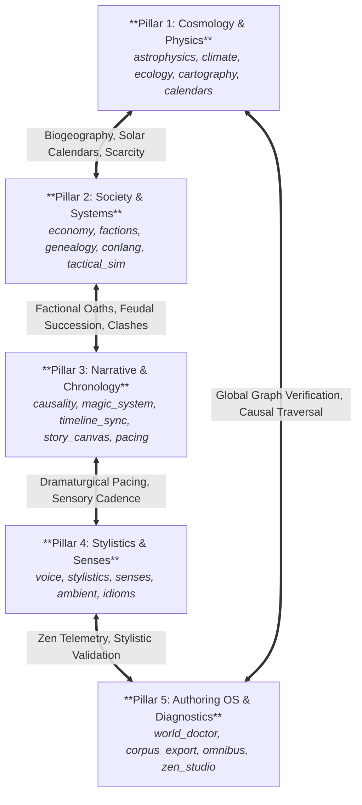

# Universal Knowledge Mesh, Causal Cascades & Thematic Resonance (`docs/RESONANCE.md`)
> **Domain Z: Universal Interconnectivity, Synergy & Synthesis Mesh** | **CLI:** `arcanum resonance` / `arcanum cascade` / `arcanum spark` / `arcanum bridge`

---

## 1. Overview & Theoretical Rationale

The **Ars Arcanum Universal Resonance & Knowledge Mesh Engine** (`scripts/lib/resonance.py`) is a deterministic synthesis, graph-theoretic cross-domain bridge, and causal cascade engine designed to weave all 50+ domain modules of *Ars Arcanum* into an interconnected, non-contradictory worldbuilding ecosystem.

### Modular Tri-Module Architecture

To maintain high cohesion, testability, and strict adherence to the `<800 lines/file` engineering contract, the engine is decomposed into three coordinated modules:

1. **Dispatcher & Auditor Facade ([`scripts/lib/resonance.py`](file:///scripts/lib/resonance.py))**:
   - Handles CLI command routing (`arcanum resonance`, `arcanum cascade`, `arcanum spark`, `arcanum bridge`).
   - Implements structural isomorphism evaluators, cross-domain coherence audits (`audit_cross_domain_coherence`), and the public API interface.
   - Integrates the thread-safe, memoized `DataAccessLayer` (`get_data_access()`) for instant cached vault and frontmatter loading.

2. **Graph Catalog & Causal Engine ([`scripts/lib/resonance_data.py`](file:///scripts/lib/resonance_data.py))**:
   - Encapsulates the 5-pillar domain taxonomy and 74 cross-domain relational edge definitions.
   - Implements graph adjacency building, BFS shortest-path search (`find_metaphorical_bridge`), and the mathematical causal cascade simulation engine (`simulate_cascade`).
   - Parses domain-specific entities from local Markdown and YAML manifests via `data_access.py` and `parse_yaml_frontmatter()`.

3. **Offline HTML Visualizer ([`scripts/lib/resonance_template.py`](file:///scripts/lib/resonance_template.py))**:
   - Generates standalone, interactive HTML/SVG Knowledge Mesh graphs.
   - Enforces strict offline Content Security Policies (`default-src 'none'; style-src 'unsafe-inline'; script-src 'unsafe-inline'; img-src data:; media-src data: blob:;`) with zero remote network calls.

Authors and speculative worldbuilders frequently encounter cognitive silos:
1. **Cosmological $\leftrightarrow$ Societal Decoupling**: Modifying planetary axial tilt or stellar classification (`astrophysics`, `climate`) without propagating the downstream effects into agrarian calendars, macroeconomic trade cycles (`economy`), religious feast days, and military campaigning seasons (`tactical_sim`).
2. **Linguistic $\leftrightarrow$ Metaphysical Isolation**: Conlang phonetic shifts and naming conventions (`conlang`) evolving independently from metaphysical casting runes (`magic_system`).
3. **Thematic $\leftrightarrow$ Structural Disconnect**: Plot tension arcs (`pacing`, `structure`) lacking structural isomorphism with character dialogue leitmotifs (`voice`, `stylistics`) and sensory palettes (`senses`).
4. **Causal Circularity & Orphaned Nodes**: Unchecked cross-domain dependencies producing causal paradoxes (cycles in directed dependency graphs) or ungrounded lore fragments.

The Resonance Engine maps all entities, domains, and thematic motifs into a weighted Directed Acyclic Graph (DAG) across 5 master pillars, executes multi-hop causal simulations, performs transitive closure reachability analyses, and audits global world coherence.



---

## 2. Graph Theory & Mathematical Formulations

### 2.1 Causal Cascade Simulation & Propagation
Let the worldbuilding knowledge mesh be a directed graph $G = (V, E, W)$, where vertices $v \in V$ represent domain parameters (e.g., `axial_tilt`, `crop_yield`, `grain_price`, `peasant_revolt`) and directed edges $e = (u, v) \in E$ represent causal dependencies with coupling weight $W(u, v) \in [-1.0, 1.0]$.

When an author modifies parameter $u_0$ by perturbation $\delta_0$, the impact cascades to downstream node $v$ along path $\pi = (u_0, u_1, \dots, u_k = v)$:

$$\text{Impact}(v) = \delta_0 \cdot \prod_{i=0}^{k-1} W(u_i, u_{i+1}) \cdot \gamma^k$$

Where $\gamma \in (0, 1]$ is the spatial/causal damping factor ($\gamma = 0.85$ default) preventing runaway energetic amplification over long traversal chains.

```
[ Axial Tilt (28.5°) ] --(+0.90)--> [ Extreme Seasonal Temp Δ ] --(+0.80)--> [ Winter Crop Failure ]
                                                                                   |
                                                                                (+0.85)
                                                                                   v
[ Feudal Siege Season Delayed ] <--(-0.75)-- [ Urban Grain Price Spike ] <--------+
```

### 2.2 Topological Sort & Acyclicity Guarantee
To ensure logical consistency and prevent causal bootstrap paradoxes, the dependency graph must be a DAG (Directed Acyclic Graph). The engine executes Kahn's Algorithm or DFS-based topological ordering in $\mathcal{O}(|V| + |E|)$ time:

$$\text{Valid World Order}: \quad \forall (u, v) \in E, \quad \text{Order}(u) < \text{Order}(v)$$

If a cycle is detected (e.g., $A \to B \to C \to A$), the engine flags `RES-101: CAUSAL_CYCLE_DETECTED`.

### 2.3 Transitive Closure Reachability Matrix
The global reachability matrix $\mathbf{T} \in \{0, 1\}^{|V| \times |V|}$ is calculated via the Floyd-Warshall algorithm ($\mathcal{O}(|V|^3)$) or Boolean matrix exponentiation:

$$\mathbf{T} = \bigvee_{k=1}^{|V|} \mathbf{A}^k$$

Where $\mathbf{A}$ is the adjacency matrix. $\mathbf{T}_{ij} = 1$ indicates that altering domain parameter $i$ inevitably cascades into parameter $j$.

### 2.4 Graph Centrality & Worldbuilding Keystone Metrics
To identify **Keystone Worldbuilding Concepts** (elements whose alteration shatters the widest array of lore systems), the engine calculates:
1. **Betweenness Centrality ($C_B$)**:
   $$C_B(v) = \sum_{s \ne v \ne t} \frac{\sigma_{st}(v)}{\sigma_{st}}$$
2. **Eigenvector Centrality / PageRank ($\vec{x}$)**:
   $$\lambda \vec{x} = \mathbf{A}^T \vec{x}$$

### 2.5 Semantic Echo Lattices & Leitmotif Recurrence
In prose analysis, recurring thematic motifs $M$ (e.g. "Broken Mirrors", "Ash", "Clockwork") are tracked across narrative time:

$$\text{Resonance}(M, t) = \sum_{k=1}^{K} \text{Salience}(M, k) \cdot \exp\left( -\frac{(t - t_k)^2}{2\sigma_{\text{memory}}^2} \right)$$

### 2.6 Specialized Structural Isomorphisms & Cross-Genre Archetypes
The engine formalizes structural isomorphisms that enforce cross-domain coherence across specialized speculative fiction subgenres:

1. **Grimdark Blood Magic & Metabolic Entropy (`iso-grimdark-blood-entropy`)**:
   - **Isomorphism Core**: Somatic Cast Cost $\longleftrightarrow$ Cellular Tissue Necrosis $\longleftrightarrow$ Aristocratic Feudal Extraction $\longleftrightarrow$ Agrarian Serf Labor Debt $\longleftrightarrow$ Visceral Staccato Sensory Cadence.
   - **Causal Constraint**: Every spell cast degrades bodily stamina ($W = -0.90$), mandating an economic underclass of blood-tithe serfs to fuel high-tier aristocracy wards.
   - **Narrative Archetype**: Power is directly zero-sum and non-renewable; political corruption mirrors physical biological decay.

2. **Biopunk Genetic Editing & Ecological Splicing (`iso-biopunk-gene-cascade`)**:
   - **Isomorphism Core**: Synthetic Epigenetic Splices $\longleftrightarrow$ Pathogen Vector Resistance $\longleftrightarrow$ Corporate Intellectual Property Cartels $\longleftrightarrow$ Invasive Chimera Food-Web Cascades $\longleftrightarrow$ Synthetic Tactile Sensory Palette.
   - **Causal Constraint**: Organism enhancements carry hereditary vector mutations ($W = +0.85$), triggering localized trophic collapse in native predator-prey chains.
   - **Narrative Archetype**: The boundary between living biology and corporate proprietary technology dissolves; ecology acts as the battlefield.

3. **Cyberpunk High-Frequency Currency & Algorithmic Scarcity (`iso-cyberpunk-algo-scarcity`)**:
   - **Isomorphism Core**: Cryptographic Token Burn $\longleftrightarrow$ Orbital Compute Latency $\longleftrightarrow$ Black-Market Barter Networks $\longleftrightarrow$ Autonomous Corporate Strike Teams $\longleftrightarrow$ Neon Staccato Dialogue Rhythm.
   - **Causal Constraint**: High-frequency financial transactions consume localized power grids ($W = -0.80$), causing rolling municipal blackouts that dictate urban heist timelines.
   - **Narrative Archetype**: Information speed and compute bandwidth directly determine physical survival and social caste mobility.

---

## 3. Subfeatures Matrix & Diagnostic Codes

| Diagnostic Code | Flag | Root Cause | Resolution |
|---|---|---|---|
| `RES-101` | `CAUSAL_CYCLE` | Circular dependency in lore rules (e.g. Magic derives from Gods who derive from Magic). | Break cycle by designating one node as the primordial uncaused axiom. |
| `RES-102` | `ORPHAN_KNOWLEDGE_NODE` | Lore element has in-degree 0 and out-degree 0 across the entire graph. | Connect node to regional economy, faction history, or geographic landmark. |
| `RES-103` | `UNPROPAGATED_CASCADE` | Fundamental cosmological/geological change made without updating downstream societal files. | Run `arcanum cascade` and accept suggested automated adjustments. |
| `RES-104` | `LEITMOTIF_EXTINCTION` | Core thematic motif introduced in Act I disappears completely from Act II & III. | Re-introduce sensory echo in climax reflection scene. |
| `RES-105` | `CROSS_DOMAIN_CONTRADICTION` | Physical law declared in `Astrophysics` directly contradicted by `Cartography` travel times. | Synchronize orbital distances with overland marching velocity. |

---

## 4. Frontmatter Directives & YAML Schemas

### 4.1 Knowledge Mesh Node Declaration (`World/Sociology/Economy/Grain_Trade.md`)
```yaml
---
node_id: "grain_market"
domain: "society_systems"
category: "economy"
parameters:
  base_price_per_bushel: 4.5 # copper crowns
  scarcity_elasticity: 1.8
dependencies:
  - source: "astrophysics.orbital_eccentricity"
    weight: 0.75
    mechanism: "Drives severity of winter frost duration."
  - source: "ecology.locust_swarm_frequency"
    weight: -0.60
    mechanism: "Reduces annual crop harvest yield."
downstream_impacts:
  - target: "factions.peasant_guild.rebellion_risk"
    weight: 0.85
  - target: "military.garrison_ration_cost"
    weight: 0.90
thematic_leitmotifs:
  - "The Weighing of the Scale"
  - "Chaff in the Wind"
---
```

### 4.2 Scene Motif Directive (`Manuscript/Chapter-11.md`)
```markdown
# Chapter 11: The Bitter Harvest
@motif: "Chaff in the Wind"
@leitmotif_salience: 0.8
@domain_link: "economy.grain_market"

Old Willem ran dry grain through his fingers. It crumbled to dust like brittle bone.
```

---

## 5. Worked Step-by-Step Example

### Scenario: Shifting a Planet's Axial Tilt from $23.5^\circ \to 31.0^\circ$
1. **Cosmology Trigger**: Planetary axial tilt increased by $\Delta = +7.5^\circ$.
2. **First-Hop Cascade (`Climate`)**:
   - Summer polar insolation increases by $+22\%$.
   - Winter polar freezing deepens; equatorial thermal equator oscillates wildly.
3. **Second-Hop Cascade (`Ecology & Agronomy`)**:
   - Single annual harvest window shrinks from 180 days to 110 days in temperate zones.
   - Crop yields drop by $35\%$ ($W = 0.85 \times 0.85 = 0.72$ net impact).
4. **Third-Hop Cascade (`Society & Military`)**:
   - Armies cannot sustain winter sieges; military campaigning restricted strictly to high summer ($t = 60\text{ days}$).
   - Faction treaties enforce mandatory communal grain granaries protected by religious vows.
5. **Fourth-Hop Cascade (`Narrative & Motifs`)**:
   - Climax battle must take place before the "Black Frost Solstice" deadline (natural ticking clock).
   - Verbal idiom generated: *"A word spoken before the frost"* (meaning an urgent, fleeting promise).

---

## 6. Recommended Reading, References & Media

### 6.1 Foundational Craft & Academic Books
- **Forster, E. M. (1927)**. *Aspects of the Novel*. Edward Arnold / Harcourt Brace. ISBN: 978-0156091800.  
  *Introduced the foundational distinction between Story (chronological sequence) and Plot (causal connection), alongside musical rhythm and leitmotif patterns.*
- **Frye, Northrop (1957)**. *Anatomy of Criticism: Four Essays*. Princeton University Press. ISBN: 978-0691012988.  
  *The landmark work on archetypal criticism, mythos structures, and systematic literary taxonomy.*
- **Hofstadter, Douglas R. (1979)**. *Gödel, Escher, Bach: An Eternal Golden Braid*. Basic Books. ISBN: 978-0465026562.  
  *Masterpiece examining recursive systems, strange loops, self-reference, and fugue-like leitmotif weaving.*
- **Pearl, Judea (2000)**. *Causality: Models, Reasoning, and Inference*. Cambridge University Press. ISBN: 978-0521895606.  
  *The foundational mathematical text on Directed Acyclic Graphs (DAGs), causal inference, and counterfactual reasoning.*
- **Bordwell, David (1985)**. *Narration in the Fiction Film*. University of Wisconsin Press. ISBN: 978-0299101749.  
  *Exhaustive cognitive narratology study on syuzhet patterning, motif integration, and causal hypothesis testing.*

### 7.2 Landmark Scientific / Worldbuilding Papers & Textbooks
- **Wolf, Mark J. P. (2012)**. *Building Imaginary Worlds: The Theory and History of Subcreation*. Routledge. ISBN: 978-0415631204.  
  *Formalizes world consistency, completeness, and invention across secondary-world causal systems.*
- **Newman, Mark (2010)**. *Networks: An Introduction*. Oxford University Press. ISBN: 978-0199206650.  
  *The authoritative scientific textbook on graph theory, centrality metrics, small-world phenomena, and network clustering.*

### 7.3 Seminal Video Lectures, Masterclasses & Channels
- **Isaac Arthur (SFIA, 2016–Present)**. *Science & Futurism with Isaac Arthur: Worldbuilding & Megastructures*. YouTube.  
  *Exhaustive scientific examinations of interconnected speculative physics, planetary engineering, and downstream societal evolutions.*
- **Artifexian (2015–Present)**. *Systematic Speculative Worldbuilding & Climate Dynamics*. YouTube.  
  *Algorithmic step-by-step videos connecting stellar mechanics to weather, geology, and civilizations.*
- **Biblaridion (2018–Present)**. *Alien Biospheres & Conlang Integration*. YouTube.  
  *Masterclass series mapping evolutionary biologies to cultural linguistic frameworks.*
- **Hello Future Me (Tim Hickson, 2020)**. *How to Create Thematic Resonance in Speculative Fiction*. YouTube.  
  *Deep dive into integrating motifs, worldbuilding rules, and character dilemmas into a unified thematic core.*

### 7.4 Landmark Speculative Case Studies
- **Frank Herbert, *Dune* (1965)**: The undisputed masterclass in ecological-societal-theological causal resonance (Sandworms $\to$ Melange $\to$ Spacing Guild $\to$ Imperial Geopolitics).
- **Ursula K. Le Guin, *The Left Hand of Darkness* (1969)**: Rigorous causal integration of ambisexual biology with political culture, language, and philosophy (Karhide vs Orgoreyn).
- **Kim Stanley Robinson, *Red Mars* (1992)**: Textbook simulation of geological terraforming triggering sociopolitical revolutions and legal schisms.
