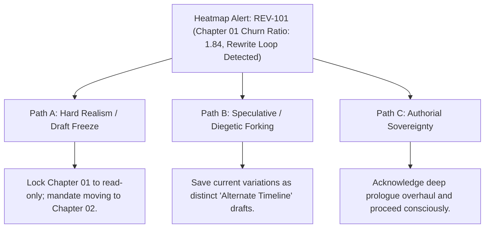

# Manuscript Revision Density, Churn Analytics & Cognitive Heatmaps (`docs/REVISION_HEATMAP.md`)
> **Domain D: Stylistics, Polish & Continuity** | **CLI:** `arcanum revision-heatmap` / `arcanum churn`

---

## 1. Overview & Theoretical Rationale

The **Ars Arcanum Revision Density & Churn Heatmap Engine** (`scripts/lib/revision_heatmap.py`) is an offline, quantitative prose-editing analytics suite, snapshot comparator, and chromatic heatmap visualizer designed for speculative fiction authors, developmental editors, and writing researchers.

Long-form writing and recursive revision are cognitively demanding processes. Authors often fall into pathological editing patterns without realizing it:
1. **The Endless Polishing Trap (Rewriting Loops)**: An author repeatedly rewrites the first three chapters dozens of times (accumulating massive churn) while later acts remain unwritten or unrevised.
2. **Structural Neglect**: Chapters that underwent massive worldbuilding or timeline retcons in earlier parts of the book remain untouched, causing severe continuity discrepancies.
3. **Uneven Developmental Effort**: Without quantitative visibility into where editorial energy was spent, authors cannot assess whether revisions addressed structural pacing or merely superficial line edits.

```
+-------------------------------------------------------------------------------+
|                    ARS ARCANUM REVISION CHURN ENGINE                          |
|                                                                               |
|  +--------------------+     Snapshot Differencing     +--------------------+  |
|  | Active Manuscript  | <---------------------------> | Baseline Snapshot  |  |
|  | Draft (Draft-02)   |                               | (Draft-01/Backups) |  |
|  +--------------------+                               +--------------------+  |
|            |                                                    |             |
|            v                                                    v             |
|  [Line & Word Diff]                                   [Statistical Z-Scoring] |
|  (Insertions I, Deletions D)                          (Over-Revised vs Stale) |
|            |                                                    |             |
|            +----------------------------------------------------+             |
|                                     |                                         |
|                                     v                                         |
|                   +-----------------------------------+                       |
|                   |  Normalized Churn Ratio Calculation|                      |
|                   |  Diagnostic Warning Pipeline      |                       |
|                   |  Interactive HTML5 Heatmap Matrix |                       |
|                   +-----------------------------------+                       |
|                                     |                                         |
|                                     v                                         |
|                     [Standout Visual Revision Heatmap]                        |
|                     [Zero-Cloud Sovereign Generation]                         |
+-------------------------------------------------------------------------------+
```

The Revision Heatmap Engine quantifies word churn, line variance, and edit distribution across chapters by diffing active working files against milestone snapshots, generating publication-grade HTML chromatic heatmaps and diagnostic triage reports.

---

## 2. Mathematical Formalism & Statistical Churn Formulation

### 2.1 Raw Edit Churn & Normalized Churn Ratio
For chapter $c$ compared against baseline snapshot $s$, let $I_c$ be total inserted words/lines and $D_c$ be total deleted words/lines:

$$\text{Raw Churn Score}: \quad \chi_c = I_c + D_c$$

To prevent long chapters from skewing raw metrics, the engine calculates the **Normalized Churn Ratio** ($\mathcal{R}_c$):

$$\mathcal{R}_c = \frac{I_c + D_c}{\max(W_c, W_s, 1)}$$

Where $W_c$ is current word count and $W_s$ is baseline snapshot word count.
- $\mathcal{R}_c = 0.0$: Pristine / Untouched draft.
- $0.0 < \mathcal{R}_c \le 0.35$: Conservative line polish / copyedit pass.
- $0.35 < \mathcal{R}_c \le 0.85$: Moderate developmental revision.
- $\mathcal{R}_c > 0.85$: Aggressive rewrite or structural overhaul.

```
Normalized Churn Distribution:
Ratio R_c
  ^
  |  [Over-Revised Loop: R > 1.2]
  |  +--------------------------+
  |  | Chapter 01 (R = 1.45)    |
  |  +--------------------------+
  |                                [Moderate Pass: 0.35 <= R <= 0.85]
  |                                +--------------------------------+
  |                                | Chapters 02 - 08 (Avg: 0.42)   |
  |                                +--------------------------------+
  |                                                                   [Untouched: R = 0.0]
  |                                                                   +------------------+
  |                                                                   | Ch 09 - 15 (0.0) |
  +-------------------------------------------------------------------+------------------+----> Chapters
```

### 2.2 Statistical Outlier Detection ($Z$-Score)
To identify statistically anomalous chapters requiring editorial intervention:

$$\mu_{\mathcal{R}} = \frac{1}{N} \sum_{i=1}^N \mathcal{R}_i, \qquad \sigma_{\mathcal{R}} = \sqrt{\frac{1}{N} \sum_{i=1}^N (\mathcal{R}_i - \mu_{\mathcal{R}})^2}$$

$$Z_c = \frac{\mathcal{R}_c - \mu_{\mathcal{R}}}{\sigma_{\mathcal{R}}}$$

- **`REV-101` (Over-Revised Warning)**: $Z_c \ge +2.5$ (or $\mathcal{R}_c > 3.0 \times \mu_{\mathcal{R}}$).
- **`REV-102` (Untouched Draft Alert)**: $\mathcal{R}_c = 0.0$ and $W_c > 100$ when $\mu_{\mathcal{R}} > 0.20$.

### 2.3 Chromatic Color Mapping Function
In HTML export mode, normalized churn is mapped to an HSL color gradient:

$$\text{Hue}(\mathcal{R}_c) = \max\Big(0, \; 120 - 120 \times \min(1.0, \mathcal{R}_c)\Big)$$

- $\text{Hue} = 120^\circ$ (Green): Low churn / Stable prose.
- $\text{Hue} = 60^\circ$ (Amber): Moderate developmental activity.
- $\text{Hue} = 0^\circ$ (Red): Intense revision churn / Active rewrite.

---

## 3. Diagnostic Codes & Triage Reference

| Code | Severity | Category | Diagnostic Trigger | Authorial Remediation Strategy |
|---|---|---|---|---|
| `REV-101` | **WARNING** | Over-Revision | $\mathcal{R}_c > 3 \times \mu_{\mathcal{R}}$ or $Z_c \ge 2.5$ | Freeze chapter scope; the scene is trapped in an unproductive polishing loop. |
| `REV-102` | **INFO** | Untouched Draft | $\mathcal{R}_c = 0.0$ while surrounding chapters revised | Audit scene for continuity drift, outdated lore, or retconned character names. |
| `REV-103` | **WARNING** | Asymmetric Deletion | $D_c > 3 \times I_c$ and $D_c > 500\text{ words}$ | Verify that cut scenes were deliberately pruned and archived in `Archive/`. |
| `REV-104` | **INFO** | Massive Expansion | $I_c > 3 \times D_c$ and $I_c > 1500\text{ words}$ | Check whether chapter has outgrown structural word count targets. |
| `REV-105` | **ERROR** | Missing Snapshot | Target chapter has no baseline in snapshot tree | Create new baseline milestone before continuing revision pass. |

---

## 4. CLI Execution & Option Reference

```bash
# 1. Run revision density audit against default Backups/ directory
arcanum revision-heatmap Manuscripts/Book-01/Draft-02

# 2. Compare active draft against an explicit previous draft folder
arcanum revision-heatmap Manuscripts/Book-01/Draft-02 --snapshot-dir Manuscripts/Book-01/Draft-01

# 3. Export standalone interactive HTML5 visual heatmap
arcanum revision-heatmap Manuscripts/Book-01/Draft-02 --export-html Reports/Revision_Heatmap.html

# 4. Output structured JSON metrics for CI/CD or custom dashboards
arcanum revision-heatmap Manuscripts/Book-01/Draft-02 --json

# 5. CLI aliases
arcanum churn Manuscripts/Book-01/
arcanum revision-density Manuscripts/Book-01/
```

### Parameter Reference Table

| Parameter | Short | Type | Default | Description |
|---|---|---|---|---|
| `target_dir` | (Positional) | `Path` | *Required* | Active manuscript working directory. |
| `--snapshot-dir` | `-s` | `Path` | `Backups/` | Milestone baseline directory to diff against. |
| `--export-html` | `-o` | `Path` | `None` | Exports interactive standalone HTML visual report. |
| `--threshold` | `-t` | `float` | `0.30` | Minimum churn ratio to highlight in red/amber. |
| `--json` | `-j` | `bool` | `False` | Emits machine-readable JSON summary to stdout. |

---

## 5. Tri-Fold Creative Advisory Resolutions



### Scenario: Chapter Stuck in Over-Revision Polishing Loop
- **Path A (Hard Realism / Psychological Draft Freeze)**:
  - The author is procrastinating by endlessly re-crafting opening sentences. Lock the chapter file or tag it `@status: frozen` and force drafting on Act II.
- **Path B (Diegetic Forking)**:
  - If the author cannot choose between two compelling opening directions, fork them into `Chapter_01_Heist.md` and `Chapter_01_Infiltration.md` and continue the narrative forward.
- **Path C (Authorial Sovereignty)**:
  - If Chapter 1 underwent an intentional complete structural overhaul (e.g. switching from first-person to third-person POV), acknowledge the high churn as a deliberate milestone.

---

## 6. Recommended Reading, References & Media

### 6.1 Foundational Data Visualization & Statistical Treatises
- **Tufte, Edward R. (1983)**. *The Visual Display of Quantitative Information*. Graphics Press. ISBN: 978-0961392147.  
  *The landmark text defining data-ink ratio, micro/macro readings, and chromatic heatmap visualization integrity.*
- **Cleveland, William S. & McGill, Robert (1984)**. "Graphical Perception: Theory, Experimentation, and Application to the Development of Graphical Methods", *Journal of the American Statistical Association*, 79(387):531–554.  
  *Empirical foundations of color gradient perception, position scales, and visual density decoding.*
- **Brewer, Cynthia A. (1994)**. "Color Use Guidelines for Mapping and Visualization", *Visualization in Modern Cartography*, pp. 123–147.  
  *Scientific design of perceptual diverging and sequential color scales (ColorBrewer).*

### 6.2 Cognitive Revision Theory & Empirical Churn Studies
- **Nagappan, Nachiappan & Ball, Thomas (2005)**. "Use of Relative Code Churn Measures to Predict Code Defect Density", *Proceedings of the 27th International Conference on Software Engineering (ICSE)*, pp. 284–292.  
  *Pioneering empirical study demonstrating that high normalized churn ($\frac{I + D}{\text{length}}$) strongly correlates with structural defect clusters.*
- **Flower, Linda & Hayes, John R. (1981)**. "A Cognitive Process Theory of Writing", *College Composition and Communication*, 32(4):365–387.  
  *The seminal cognitive model of writing, distinguishing between local linguistic polishing and recursive structural revision loops.*
- **Bereiter, Carl & Scardamalia, Marlene (1987)**. *The Psychology of Written Composition*. Lawrence Erlbaum Associates.  
  *Contrasting novice "knowledge telling" with expert "knowledge transforming" revision strategies.*

### 6.3 Video Lectures, Masterclasses & Writing Media
- **Brandon Sanderson's BYU Creative Writing Lectures**: *Managing the Revision Process: Avoiding the Polishing Trap*.  
  *Techniques for pushing forward to complete rough drafts before falling into endless first-chapter revisions.*
- **Writing Excuses**: *Season 12, Episode 45: Recognizing When a Story is Over-Edited*.  
  *Identifying when excessive line revision begins stripping vitality and voice from prose.*
- **Tale Foundry**: *The Psychology of Writer's Block and Rewriting Loops*.  
  *Cognitive strategies for overcoming perfectionism in manuscript drafting.*

### 6.4 Landmark Speculative Case Studies
- **Rothfuss, Patrick**: *The Doors of Stone* (Revision History and Draft Refinement).  
  *High-profile case study of perfectionist micro-revision loops and structural complexity management.*
- **Martin, George R.R.**: *A Dance with Dragons* ("The Meereenese Knot").  
  *Famous example of structural churn where a single narrative junction required dozens of rewrites to reconcile character convergence.*
- **Hemingway, Ernest**: *A Farewell to Arms* (39 Written Endings).  
  *The classic historical example of intense localized revision churn focused entirely on the final chapter.*
