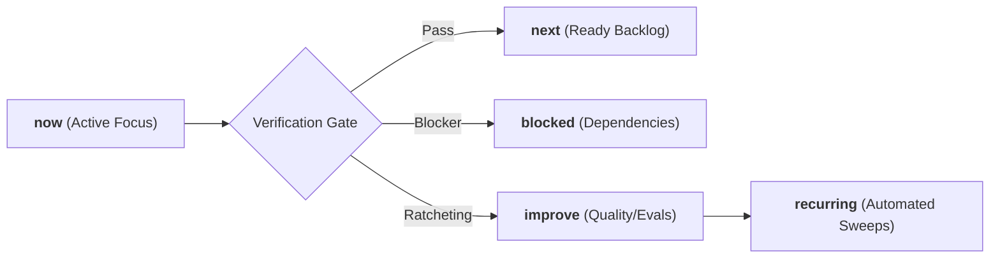

# Ars Arcanum (Scriptorium) — Sovereign Roadmap & Momentum Queues
> **Version 0.1.0** | Tracking Continuous Evolution Across Sovereign Craft Disciplines

---

## 1. Operating Architecture & Momentum Queues

Ars Arcanum manages ongoing engineering, research, and craft capabilities across five formal momentum queues, as established in [`AGENTS.md`](file:///AGENTS.md):

---

## 2. Active Momentum State

### `now` (Active Focus)
- **v0.1.0 Core Hardening & Modular Architecture**:
  - [x] **Modular Registry Architecture**: Successfully decomposed `scripts/lib/registry.py` from 2,490 lines to 511 lines via `registry_base.py` and 7 domain specification modules in `scripts/lib/registry_specs/` (<800 lines/file contract satisfied).
  - [x] **Packaging & Entrypoints**: Added standard `setuptools>=61.0` build system to `pyproject.toml` and package root `scripts/__init__.py`, registering `arcanum` and `ars-arcanum` CLI entry points.
  - [x] **Security & Concurrency**:
    - Enforced cross-platform Windows reserved device name rejections (`CON`, `PRN`, `AUX`, `NUL`, `COM1-9`, `LPT1-9`) across path validation endpoints in `_bootstrap.py` and `scope.py`.
    - Hardened `ArcanumLock` on Windows with deterministic seek-to-0 before `msvcrt.locking` and transparent debug logging.
    - Hardened Studio Hub REST server with exact Host/Origin checks (supporting IPv6 `::1`), allowlisted engine execution, and mutex locking.
    - Hardened `restore.py` with non-empty directory overwrite guards (`--force`) and fail-closed SHA-256 sidecar verification (`--no-verify`).
  - [x] **Data Access Layer & Dynamic Dispatch**:
    - Centralized file reading, frontmatter parsing, chapter discovery, and lore querying into thread-safe cached `data_access.py` with automatic `mtime` cache invalidation; integrated across `resonance.py`, `economy.py`, `studio_hub.py`, `series_continuity.py`, `story_canvas.py`, and `structure.py`.
    - Upgraded CLI dispatcher (`cli.py`) with dynamic user plugin resolution from `registry.py`.
    - Modularized `scripts/lib/tips.py` from 3,324 lines down to 442 lines across `scripts/lib/tips_catalog/` (<60 lines/file).
    - Extracted Studio Hub presentation template into `scripts/lib/studio_hub_template.py`, reducing `studio_hub.py` by over 2,100 lines.
    - Modularized `scripts/lib/resonance.py` from 1,796 lines down to 573 lines via `resonance_data.py` (552 lines) and `resonance_template.py` (639 lines).
    - Modularized `scripts/lib/economy.py` from 1,154 lines down to 671 lines via `economy_data.py` (107 lines), `economy_template.py` (126 lines), and `economy_trade.py` (298 lines).
    - Modularized `scripts/lib/scope.py` into `scope_models.py`, `scope_parser.py`, and `scope_resolver.py`.
    - Modularized `scripts/lib/docx_sync.py` into `docx_builder.py`.
    - Modularized `scripts/lib/corpus_export.py` into `corpus_export_formatters.py`.
    - Modularized `scripts/lib/factions.py` into `factions_data.py`.
    - Modularized `scripts/lib/writing_sprint.py` into `writing_sprint_template.py`.
    - Modularized `scripts/lib/revision_heatmap.py` into `revision_heatmap_template.py`.
  - [x] **Creative Sovereignty & Epistemic Safety Remediations (Findings F-01 through F-14)**:
    - Permanently removed all normative composite scores (`Thematic Resonance Score: 92%`, `Structural Harmony Score (0-100%)`, `Preflight Compliance Score`, `Catastrophic Domain Penalty`).
    - Replaced moralizing diagnostic strings (`REV-101/102`, `PRP-101/102`) with descriptive activity metrics and author inquiries.
    - Decoupled universal character templates from mandatory magic schemas (`templates/world-bible/Templates/fileClasses/Character.md`).
    - Hardened zero-input error modes to fail fast with code 1 instead of calculating fake 0.0% scores.
    - Replaced hardcoded spark loops with dynamic combinatorial spark synthesis and `[SPECULATION]` edge provenance.
    - Enabled universal `@intent: deliberate` and frontmatter `intent: deliberate` immunity across continuity, anachronism, and magic linters.
    - Added framework-free and `none` structure presets to `structure.py` and `manuscript_scaffold.py`.
    - Corrected academic citations (Newman 2006 SQLite) and removed synthetic search URL generators.
  - [x] **Master Bibliography & Theoretical Grounding**:
    - Aggregated and cross-indexed 563+ theoretical and scholarly citations across all 47 craft engines (`arcanum doc bib` / `citations`).
  - [x] **Testing Architecture & E2E Decomposition**:
    - Decomposed monolithic 21-stage E2E test suite (`tests/test_grand_tour_e2e.py`) into 21 isolated stage test methods plus unified lifecycle runner (743 lines, <800L contract compliant).
    - Expanded golden astrophysics datasets (Trappist-1e, Proxima Centauri b, Earth-Mars Brachistochrone) and climate benchmarks (Hadley circulation, runaway greenhouse).
  - [x] **Interactive Vector Visualizations & Offline Studio Cockpit**:
    - Added interactive SVG Narrative Geometry & Pacing Envelope with logistic milestone projections to Studio Hub (`tab-structure`).
    - Added interactive SVG Resonance Topology & Knowledge Mesh canvas with 5 master pillars, causal bridge vectors, and domain filters to Studio Hub (`tab-resonance`).
  - [x] **Tool-First Architecture & 32-Plugin Obsidian World Bible Suite**:
    - Integrated and pre-configured 32 offline Obsidian community plugins with verified SHA-256 manifests (`manifest.json` and `community-plugins.json`).
    - Integrated external toolchain (PolyGlot, Gramps, Wonderdraft, Celestia, StarGen, Pandoc, Typst, novelWriter, Vale, LanguageTool).
    - Converted craft guides into mastercraft references (`CONLANG.md`, `GENEALOGY.md`, `CARTOGRAPHY.md`, `ASTROPHYSICS.md`, `PACING.md`, `TYPOGRAPHY.md`).
    - Published comprehensive guides: [`docs/guides/EXTERNAL_TOOLS_AND_PLUGINS.md`](file:///docs/guides/EXTERNAL_TOOLS_AND_PLUGINS.md), [`docs/guides/OBSIDIAN_PLUGINS.md`](file:///docs/guides/OBSIDIAN_PLUGINS.md), and [`docs/guides/SOFTWARE_CATALOG.md`](file:///docs/guides/SOFTWARE_CATALOG.md).
  - [x] **Verification Gate**: Passed 100% verification across test suite (958 tests discovered, 0 failures), Ruff strict linting (0 violations across 211 files), Mypy static typing (211 source files clean), and Coverage threshold (`fail_under = 80`).

### `next` (Ready Backlog)
- **Zen Studio In-Situ Outlines**:
  - Integrate interactive SVG scene tension timeline directly into Zen Studio typewriter view.

### `blocked` (External / Human Decisions)
- *None currently.* All core engines execute with zero external pip dependencies and 100% offline sovereignty.

### `improve` (Refactoring & Evals)
- **Simulation Parameter Anchors**:
  - Expand solar system planet generation presets and non-standard moon orbit dynamics.

### `recurring` (Automated Background Invariants)
- **Supply-Chain & CDN Sweeps**: Automated verification ensuring 0% external CDN scripts, tracking beacons, or network dependencies in generated HTML artifacts, verified against Obsidian plugin digest manifest (`manifest.json`).
- **Strict Content Security Policy**: Verification of `<meta http-equiv="Content-Security-Policy" content="default-src 'none'; style-src 'unsafe-inline'; script-src 'unsafe-inline'; img-src data:; media-src data: blob:;">` in all HTML exports.
- **Coverage Floor**: Maintain minimum 80% test coverage enforcement in `pyproject.toml`.
- **Cross-Platform Lock Sweeps**: Ensure POSIX `fcntl.flock` and Windows `msvcrt.locking` concurrency compliance.

---

## 3. Long-Term Version Milestones

| Milestone | Target Horizon | Focus Area | Key Deliverables |
|:---|:---:|:---|:---|
| **v0.1.0** | Current | Stability, Packaging & Security | Standard setuptools packaging, Windows device defenses, lockfile hardening, hardened REST API & restore safety. |
| **v0.2.0** | Next Sprint | Dynamic CLI & DAL | Registry-driven CLI dispatch, centralized vault repository pattern, frontmatter schema validation. |
| **v0.3.0** | Future | Modular Engine Tier | Complete `<800L` refactoring across remaining oversized engine modules. |
| **v1.0.0** | Long-Term | Sovereign Studio Suite | Fully unified offline visual canvas, real-time causality graph rendering. |
