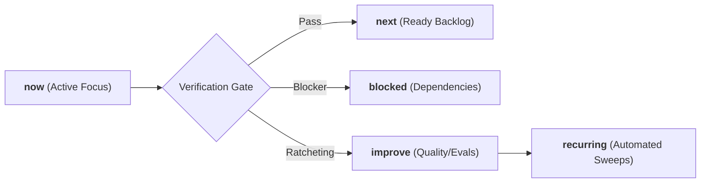

# Ars Arcanum (Scriptorium) — Sovereign Roadmap & Momentum Queues
> **Version 5.0.0** | Tracking Continuous Evolution Across Sovereign Craft Disciplines

---

## 1. Operating Architecture & Momentum Queues

Ars Arcanum manages ongoing engineering, research, and craft capabilities across five formal momentum queues, as established in [AGENTS.md](../AGENTS.md) and [tasks.md](../tasks.md):

---

## 2. Active Momentum State

### `now` (Active Focus)
- **v5.0.0 Core Hardening & Modular Architecture**:
  - [x] **Modular Registry Architecture**: Successfully decomposed `scripts/lib/registry.py` from 2,490 lines to 511 lines via `registry_base.py` and 7 domain specification modules in `scripts/lib/registry_specs/` (<800 lines/file contract satisfied).
  - [x] **Security & Concurrency**:
    - Enforced cross-platform Windows reserved device name rejections (`CON`, `PRN`, `AUX`, `NUL`, `COM1-9`, `LPT1-9`) across path validation endpoints in `_bootstrap.py` and `scope.py`.
    - Hardened `ArcanumLock` on Windows with deterministic seek-to-0 before `msvcrt.locking` and transparent debug logging.
    - Verified fail-safe atomic filesystem replacement with parent directory `fsync` flushing.
  - [x] **Verification Gate**: Passed 100% verification across test suite (853 tests, 0 failures), Ruff strict linting (0 errors), and Mypy static typing (156 source files clean).

### `next` (Ready Backlog)
- **Dynamic CLI Routing**:
  - Refactor CLI dispatcher (`cli.py`) to dynamic registry-driven command routing to eliminate static dispatch tables.
- **Data Access Layer (DAL)**:
  - Abstract repetitive `Path.rglob()` and file parsing across lore vaults into a centralized cached vault reader (`data_access.py`).
- **Interactive Visualizations**:
  - Expand Studio Hub and Zen Studio offline widgets for high-dimensional narrative geometry and multi-branch causality graphs.

### `blocked` (External / Human Decisions)
- *None currently.* All core engines execute with zero external pip dependencies and 100% offline sovereignty.

### `improve` (Refactoring & Evals)
- **Engine Size Optimization**:
  - Modularize remaining oversized modules (`studio_hub.py`, `scope.py`, `economy.py`, `astrophysics.py`) to conform with the `<800 lines/file` engineering contract.
- **Testing Architecture**:
  - Decompose monolithic 21-stage E2E tests into isolated, parameterized test stages for faster failure localization.
  - Expand golden physics and astrodynamics datasets to anchor more simulation parameters.

### `recurring` (Automated Background Invariants)
- **Supply-Chain & CDN Sweeps**: Automated verification ensuring 0% external CDN scripts, tracking beacons, or network dependencies in generated HTML artifacts.
- **Strict Content Security Policy**: Verification of `<meta http-equiv="Content-Security-Policy" content="default-src 'none'; style-src 'unsafe-inline'; script-src 'unsafe-inline'; img-src data:; media-src data: blob:;">` in all HTML exports.
- **Coverage Floor**: Maintain minimum 85% test coverage enforcement in `pyproject.toml`.
- **Cross-Platform Lock Sweeps**: Ensure POSIX `fcntl.flock` and Windows `msvcrt.locking` concurrency compliance.

---

## 3. Long-Term Version Milestones

| Milestone | Target Horizon | Focus Area | Key Deliverables |
|:---|:---:|:---|:---|
| **v5.0.x** | Current | Stability & Security | Windows device defenses, lockfile hardening, roadmap instantiations. |
| **v5.1.0** | Next Sprint | Modular Registry | Decoupled engine specs, `<800L` compliance, dynamic CLI routing. |
| **v5.2.0** | Future | Data Access Layer | Cached vault repository pattern, frontmatter schema validation. |
| **v6.0.0** | Long-Term | Sovereign Studio Suite | Fully unified offline visual canvas, real-time causality graph rendering. |
