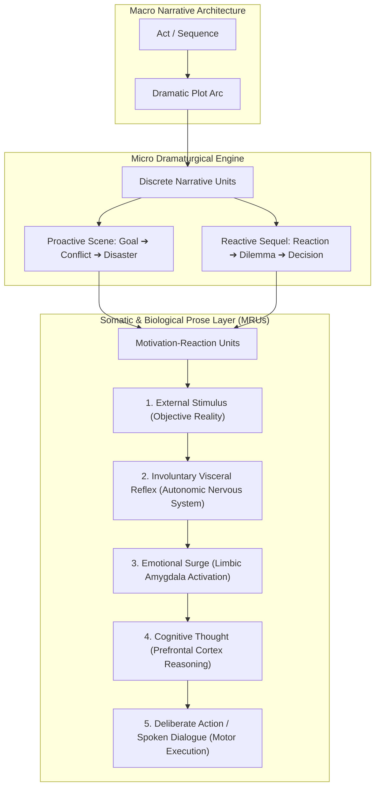
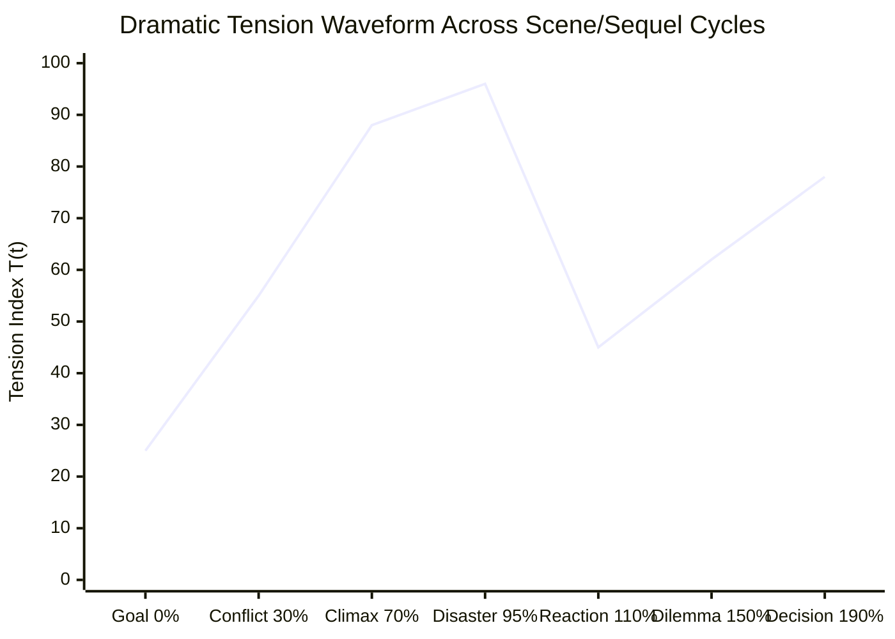
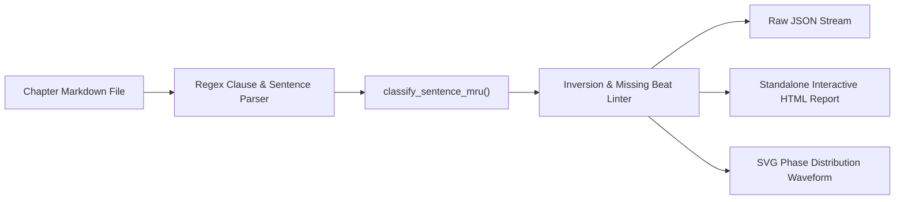

# Ars Arcanum Scene Mechanics, MRU Theory & Dramatic Polarity Engine (`docs/SCENE_MECHANICS.md`)
> **Domain E: Narrative Dynamics, Pacing, Structure & Branching** | **CLI Command:** `arcanum scene` | **Module:** `scripts/lib/scene_mechanics.py`

---

## 1. Overview & Theoretical Rationale

The **Ars Arcanum Scene Mechanics Engine** (`scripts/lib/scene_mechanics.py`) is an offline computational craft auditor and dramaturgy validator engineered for speculative fiction novelists, playwrights, and narrative architects. 

While macro-structural frameworks (e.g., the Three-Act Paradigm, the Hero's Journey, or Save the Cat!) dictate the distribution of milestone beats across a 100,000-word manuscript, the emotional reality of a novel is won or lost at the micro-structural level: the individual **Scene** and **Sequel**, structured down to the biological mechanics of the **Motivation-Reaction Unit (MRU)**.



### 1.1 The Neurological & Somatic Basis of Dwight Swain's MRU
In *Techniques of the Selling Writer* (1965), Dwight V. Swain codified the **Motivation-Reaction Unit (MRU)**. Far from an arbitrary stylistic dogma, Swain's model reflects the hardwired physiological processing sequence of the human nervous system:

1. **Stimulus (External World)**: An event occurs outside the character's boundary ($t = 0\text{ ms}$). Light hits the retina; acoustic soundwaves compress against the tympanic membrane.
2. **Visceral Reflex (Autonomic / Brainstem)**: Before the stimulus reaches conscious awareness, the sympathetic nervous system triggers involuntary somatic changes ($t \approx 50 - 150\text{ ms}$): heart palpitations, adrenaline release, pupil dilation, galvanic skin response, flinching, or throat constriction.
3. **Emotional Surge (Limbic System / Amygdala)**: The raw visceral state coalesces into emotional valence ($t \approx 150 - 300\text{ ms}$): primal dread, burning rage, cold grief, or soaring triumph.
4. **Cognitive Thought (Neocortex / Prefrontal Cortex)**: Conscious mental realization, tactical assessment, and internal monologue form ($t \approx 300 - 500\text{ ms}$). The character names the threat and calculates options.
5. **Deliberate Action & Spoken Dialogue (Somatic Motor Cortex)**: The character exerts willful agency upon the physical environment ($t > 500\text{ ms}$): swinging a blade, diving behind cover, or speaking a retort.

#### The Immersion-Breaking Cost of Inverted MRUs
When an author inverts this biological sequence—placing conscious thought before physical reflex (*"She realized the assassin was behind her, her heart pounding with terror"*), or action before stimulus (*"He ducked before the arrow whistled past"* without precognitive justification)—the reader's mirror neuron network detects a synthetic cognitive dissonance. The prose feels artificial, "stage-managed," and emotionally detached.

---

## 2. The Scene vs. Sequel Dialectic

Dramatic progression is an alternating thermodynamic cycle between **kinetic entropy generation (Scenes)** and **somatic entropy processing (Sequels)**.

```
       [ PROACTIVE SCENE ]                             [ REACTIVE SEQUEL ]
 ┌─────────────────────────────┐                 ┌─────────────────────────────┐
 │  1. GOAL                    │                 │  1. REACTION                │
 │     • Concrete, Tangible    │                 │     • Visceral Shock        │
 │     • Immediate Deadline    │                 │     • Emotional Catharsis   │
 ├─────────────────────────────┤                 ├─────────────────────────────┤
 │  2. CONFLICT                │                 │  2. DILEMMA                 │
 │     • Escalating Resistance │  ────────────>  │     • Hobson's Choice       │
 │     • Rising Stakes         │                 │     • Irreconcilable Values │
 ├─────────────────────────────┤                 ├─────────────────────────────┤
 │  3. DISASTER                │                 │  3. DECISION                │
 │     • "No, and..."          │                 │     • Concrete Pivot        │
 │     • "Yes, but..."         │                 │     • Target Next Goal      │
 └─────────────────────────────┘                 └─────────────────────────────┘
                ▲                                               │
                └───────────────────────────────────────────────┘
```

### 2.1 The Proactive Scene Architecture
A Proactive Scene is driven by external agency and immediate objective obstacles. It contains three non-negotiable structural phases:

1. **Goal**: The POV character enters the unit with a specific, measurable, urgent objective. It cannot be vague ("He wanted peace"); it must be physical and immediate ("He must steal the cipher key from the magistrate's desk before the clock strikes midnight").
2. **Conflict**: The POV character meets escalating opposition that cannot be easily bypassed. The resistance is dynamic: the antagonist or environment actively counters the protagonist's tactical maneuvers.
3. **Disaster (The Hook / Complication)**: The scene ends with an unexpected failure or a pyrrhic victory that destabilizes the protagonist's position:
   - **"No, and furthermore..." (Absolute Disaster)**: The protagonist fails to achieve the goal, and their operational situation worsens catastrophically.
   - **"Yes, but..." (Pyrrhic Disaster)**: The protagonist achieves the immediate goal, but doing so triggers a severe new complication (e.g., securing the cipher reveals the enemy has already decrypted the capital's coordinates).
   - **Prohibited Ending**: Simple *"Yes"* (which terminates dramatic tension) or random *"No"* unconnected to protagonist agency (which feels like cheap *deus ex machina*).

### 2.2 The Reactive Sequel Architecture
A Reactive Sequel is the necessary physiological and cognitive aftermath of a Disaster. It provides emotional digestion, thematic integration, and strategic recalibration:

1. **Reaction**: The character experiences visceral grief, physical collapse, or panic resulting from the previous disaster. Adrenaline recedes, revealing vulnerability and physical damage.
2. **Dilemma**: The character confronts the new reality. All obvious solutions are exhausted. The character faces a **Hobson's choice** (an apparent choice with only one real option) or a **Value Dilemma** (choosing between two sacred loyalties or two catastrophic sacrifices).
3. **Decision**: Out of the crucible of the dilemma, the protagonist makes a resolute, deliberate choice. This decision generates the **Goal** for the subsequent Proactive Scene, re-engaging the kinetic cycle.

---

## 3. Mathematical Models & Dramaturgical Formulations



### 3.1 Scene Energy Metric ($E_{\text{scene}}$)
The thermodynamic vitality of a dramatic unit is quantified as the ratio of active kinetic agency and visceral somatic cues to static exposition:

$$E_{\text{scene}} = \frac{\sum w_{\text{action}} + \sum w_{\text{dialogue}} + 1.5 \sum w_{\text{visceral}}}{\sum w_{\text{exposition}} + 0.5 \sum w_{\text{cognitive}} + 1.0}$$

Where:
- $w_{\text{action}}$: Word count of physical kinetic movement and environmental interactions.
- $w_{\text{dialogue}}$: Word count of direct character-to-character verbal exchanges.
- $w_{\text{visceral}}$: Word count of autonomic physiological reactions (pulse, breath, sweat, flinch).
- $w_{\text{exposition}}$: Word count of static backstory, omniscient worldbuilding, and passive description.
- $w_{\text{cognitive}}$: Word count of internal contemplation and reflective reasoning.

### 3.2 Dynamic Tension Index ($T(t)$)
The instantaneous dramatic tension across a normalized narrative timeline $t \in [0.0, 1.0]$:

$$T(t) = \Pi(t) \cdot \left(1.0 + \alpha \cdot \frac{d\mathcal{S}}{dt}\right) \cdot e^{-\lambda(t - t_{\text{crisis}})^2}$$

Where:
- $\Pi(t) \in [-1.0, +1.0]$: The instantaneous dramatic polarity (negative for peril/defeat, positive for triumph/hope).
- $\frac{d\mathcal{S}}{dt}$: The rate of stakes escalation per 100 words.
- $\lambda$: The decay coefficient of post-crisis tension release.

### 3.3 The Swain Pacing Coefficient ($\kappa_{\text{swain}}$)
The macro-structural ratio between external kinetic scenes and internal cognitive sequels:

$$\kappa_{\text{swain}} = \frac{N_{\text{scene}}}{N_{\text{scene}} + N_{\text{sequel}}}$$

- **High-Octane Thriller / Action Fantasy**: $\kappa_{\text{swain}} \in [0.70, 0.85]$ (rapid scene chaining with compressed sequels).
- **Literary Speculative / Psychological Drama**: $\kappa_{\text{swain}} \in [0.45, 0.55]$ (balanced oscillation with expansive dilemma exploration).
- **Sagging Narrative / Analytical Paralysis**: $\kappa_{\text{swain}} < 0.35$ (excessive internal contemplation without external obstacles).

### 3.4 Polarity Shift Vector ($\Delta \Pi$)
Every vital dramatic scene must execute a net shift in value polarity across its duration:

$$\Delta \Pi = \Pi_{\text{exit}} - \Pi_{\text{entry}}$$

$$\text{Valid Dramatic Unit} \iff |\Delta \Pi| \ge 1.0 \quad \text{or} \quad \text{Sign}(\Pi_{\text{entry}}) \neq \text{Sign}(\Pi_{\text{exit}})$$

| Entry State ($\Pi_{\text{entry}}$) | Exit State ($\Pi_{\text{exit}}$) | Dynamic Type | Narrative Effect |
|---|---|---|---|
| $+0.8$ (Confident / In Control) | $-0.9$ (Ambushed / Trapped) | $+ \to -$ (Classic Disaster) | Plunges protagonist into crisis; demands immediate sequel. |
| $-0.7$ (Desperate / Bleeding) | $+0.6$ (Secured Antidote) | $- \to +$ (Hard-Won Reversal) | Cathartic relief; sets up new high-stakes complication. |
| $+0.5$ (Sneaking Undetected) | $+0.6$ (Still Undetected) | $\Delta \Pi \approx 0$ (Static / Flatline) | **FLAW**: Scene produces no dramatic change; candidate for pruning. |
| $+0.7 \to -0.8 \to +0.8$ | $+0.8$ (Double Reversal) | $+ \to - \to +$ (Rollercoaster) | High dramatic intensity; common in midpoint and climactic set-pieces. |

---

## 4. Ars Arcanum Engine & CLI Architecture



### 4.1 CLI Command Reference

```powershell
# Scan an entire manuscript directory for scene/sequel balance and MRU inversions
arcanum scene Manuscript/

# Analyze a single chapter with standalone interactive HTML report
arcanum scene Manuscript/Act_2/Chapter_14.md --html reports/ch14_scene.html

# Emit machine-readable JSON for CI/CD lint pipelines
arcanum scene Manuscript/ --json > reports/scene_audit.json
```

### 4.2 Diagnostic Codes Matrix

| Code | Severity | Description | Remediating Action |
|---|---|---|---|
| `SCN-101` | **HIGH** | Inverted MRU: Cognitive Thought preceding Visceral Reflex | Place somatic response (pulse, breath, flinch) immediately following stimulus before interior monologue. |
| `SCN-102` | **HIGH** | Inverted MRU: Action/Dialogue preceding Visceral Reflex | Insert involuntary somatic response before character acts or speaks in reaction to a sudden stimulus. |
| `SCN-103` | **MEDIUM** | Missing Goal Beat in Proactive Scene | Clarify the POV character's concrete, immediate objective in the opening 15% of the scene. |
| `SCN-104` | **MEDIUM** | Missing Disaster / Complication at Scene Termination | Replace flat or unresolved ending with a decisive *"No, and..."* or *"Yes, but..."* disaster. |
| `SCN-105` | **MEDIUM** | Sequel Lacks Concrete Decision Pivot | Ensure the sequel concludes with a clear, active decision that directly ignites the next scene's goal. |
| `SCN-106` | **LOW** | Static Polarity Flatline ($\Delta \Pi < 0.2$) | Introduce a value reversal (e.g., trust to suspicion, triumph to catastrophe) across the scene. |
| `SCN-107` | **LOW** | Low Scene Energy ($E_{\text{scene}} < 0.50$) | Prune static exposition paragraphs; convert internal reflections into active dialogue or physical conflict. |
| `SCN-108` | **HIGH** | White Room Action Burst (Action without sensory grounding) | Ground kinetic beats with acoustic, tactile, and proprioceptive details. |

---

## 5. Practical Authorial Worksheets & Worked Masterclass Examples

### 5.1 Step-by-Step MRU Transformation Case Study

#### Flawed Amateur Draft (Inverted MRUs, Flat Polarity, Missing Disaster):
> Julian stood in the subterranean vault. He wondered if the ancient iron door could withstand the dragon's breath, realizing that his wards were failing rapidly. His heart hammered in his chest and cold sweat broke across his brow as the dragon slammed against the barrier. The stone shattered. "We have to run now!" he screamed to Lyra. He grabbed his spellbook and stepped through the exit tunnel safely.

**Flaws Identified by Engine:**
- `SCN-101 (Inverted MRU)`: Cognitive realization (*"He wondered... realizing that his wards were failing"*) occurs before the somatic reaction (*"His heart hammered... cold sweat broke"*).
- `SCN-102 (Inverted MRU)`: Visceral reaction occurs after the character has already thought through the problem.
- `SCN-104 (Missing Disaster)`: The character simply steps through the exit safely (flat *"Yes"* resolution, zero stakes escalation).

#### Masterclass Revision (Rigorous MRU Ordering, Polarity Inversion $+ \to -$):
> A concussive detonation slammed against the vault doors. *(Stimulus)*  
> The shockwave drove the air from Julian's lungs; his pulse spiked in his throat as ice-cold adrenaline flooded his limbs. *(Visceral Reflex)*  
> Pure animal terror gripped him. *(Emotional Surge)*  
> *The threshold runes have collapsed,* his mind registered. *Three seconds before the iron melts.* *(Cognitive Thought)*  
> Julian lunged across the flagstones, seized Lyra by the collar of her tunic, and hauled her into the drainage sluice. *(Action)*  
> "Hold your breath!" he shouted. *(Dialogue)*  
> The iron gates blew inward in a molten cascade. The escape hatch buckled under the falling masonry, sealing them inside total darkness with the creature's claws scraping overhead. *(Disaster: "Yes, but now trapped")*

---

### 5.2 The Scene & Sequel Authorial Blueprint (YAML Schema)

```yaml
---
unit_id: "SCN-ACT2-CH14"
type: "proactive_scene"
pov_character: "Valeria Sterling"
pacing_target_words: 2400

scene_mechanics:
  goal:
    objective: "Extract the decrypted planetary telemetry from the orbital terminal"
    urgency: "Terminal auto-purge in 4 minutes"
    stakes_failure: "Loss of the colony fleet's coordinates"
  
  conflict:
    primary_antagonist: "Inquisitor Vane and two Praetorian heavy synthetics"
    escalation_steps:
      - "Step 1: Security grid locks the access corridor, cutting off escape route"
      - "Step 2: Synthetics deploy suppression fields, disabling Valeria's phase-shield"
      - "Step 3: Vane begins remote terminal wipe from the upper gantry"
      
  disaster:
    disaster_type: "yes_but"
    outcome: "Valeria secures the telemetry drive, but Vane identifies her biological signature and triggers the station's orbital de-orbit thrusters."
    exit_polarity: -0.85
    entry_polarity: +0.40

sequel_coupling:
  target_sequel_id: "SQL-ACT2-CH15"
  reaction_focus: "Suffocation and sensory overload as artificial gravity collapses"
  dilemma_choice:
    option_a: "Vent the docking bay atmosphere to launch the escape pod (killing remaining station engineers)"
    option_b: "Manual override the reactor core (50% probability of lethal radiation exposure)"
  decision: "Option B: Valeria commits to manual override, establishing the next scene goal."
---
```

---

## 6. Recommended Reading, References & Media

### 6.1 Foundational Craft & Academic Books
- **Swain, Dwight V. (1965)**. *Techniques of the Selling Writer*. University of Oklahoma Press. ISBN: 978-0806111919.  
  *The seminal work introducing Motivation-Reaction Units (MRUs), the Scene/Sequel polarity dialectic, and the sensory hierarchy of prose pacing.*
- **Bickham, Jack M. (1993)**. *Scene & Structure: How to Construct Fiction with Mystery, Suspense, and Power*. Writer's Digest Books. ISBN: 978-0898795516.  
  *The definitive expansion of Swain's principles by his foremost protégé, providing exhaustive mathematical beat breakdowns for Scene/Sequel linkages.*
- **Scofield, Sandra (2007)**. *The Scene Book: A Primer for the Fiction Writer*. Penguin Books. ISBN: 978-0143112341.  
  *A masterclass treatise on the anatomy of the scene, sensory pulse points, scene framing, and trajectory modulation.*
- **Rosenfeld, Jordan (2014)**. *Make a Scene: Crafting a Powerful Story One Scene at a Time* (2nd ed.). Writer's Digest Books. ISBN: 978-1599630809.  
  *Detailed blueprints for 15 distinct scene archetypes (Action, Suspense, Epiphany, Dialogue, Climax) with practical diagnostic rubrics.*
- **McKee, Robert (1997)**. *Story: Substance, Structure, Style, and the Principles of Screenwriting*. ReganBooks / HarperCollins. ISBN: 978-0060391683.  
  *Formalizes dramatic scene polarity shifts ($\Delta \Pi$), value-at-stake transitions, and turning point mechanics.*

### 6.2 Landmark Lectures, Video Masterclasses & Podcasts
- **Sanderson, Brandon (2020)**. *BYU Creative Writing Lecture 4: Scene Construction and Pacing*. Brigham Young University / YouTube.  
  *Deep dive into goal-driven scene progression, micro-clifffhangers, promise-progress-payoff frameworks, and pacing modulation.*
- **Hello Future Me / Timothy Hickson (2019)**. *The Anatomy of a Scene: Pacing, Tension, and Emotional Arcs*. YouTube Video Essay Series.  
  *Visual breakdown of scene architecture, micro-tension splines, and sequel transitions in speculative masterpieces.*
- **Tale Foundry (2021)**. *How to Write Engaging Scenes: Conflict, Disasters, and Reaction Chains*. YouTube Narratology Analysis.  
  *Exploration of somatic reader empathy, MRU psychology, and the prevention of flat narrative sequences.*
- **Writing Excuses (2013–2022)**. *Season 8 & Season 14: Masterclasses on Scene Construction, Sequels, and Emotional Pacing*. Hosted by Brandon Sanderson, Mary Robinette Kowal, Howard Tayler, and Dan Wells.  
  *Audio workshops dissecting live scene edits, visceral sensory cues, and failure modes in commercial prose.*

### 6.3 Landmark Speculative Fiction Case Studies
- **Herbert, Frank (1965)**. *Dune*. Chilton Books.  
  *Exemplary execution of deep internal MRU sequences (the Gom Jabbar test: extreme somatic stimulus $\to$ autonomic reflex $\to$ fear $\to$ litany of the mind $\to$ resolute stillness).*
- **Sanderson, Brandon (2010)**. *The Way of Kings*. Tor Books.  
  *Kaladin Stormblessed's Bridge Four assault scenes: rigorous Proactive Scene chaining (*Goal $\to$ Conflict $\to$ Catastrophe*) punctuated by somber Chasm Sequels (*Grief $\to$ Dilemma $\to$ Tactical Decision*).*
- **Martin, George R.R. (1996)**. *A Game of Thrones*. Bantam Spectra.  
  *Masterclass in $+ \to -$ dramatic polarity inversions (the Tower of Joy sequence, Eddard Stark's investigation turns).*
