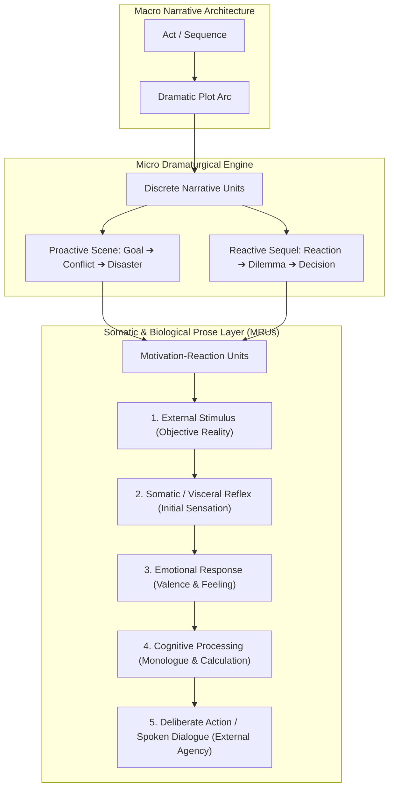
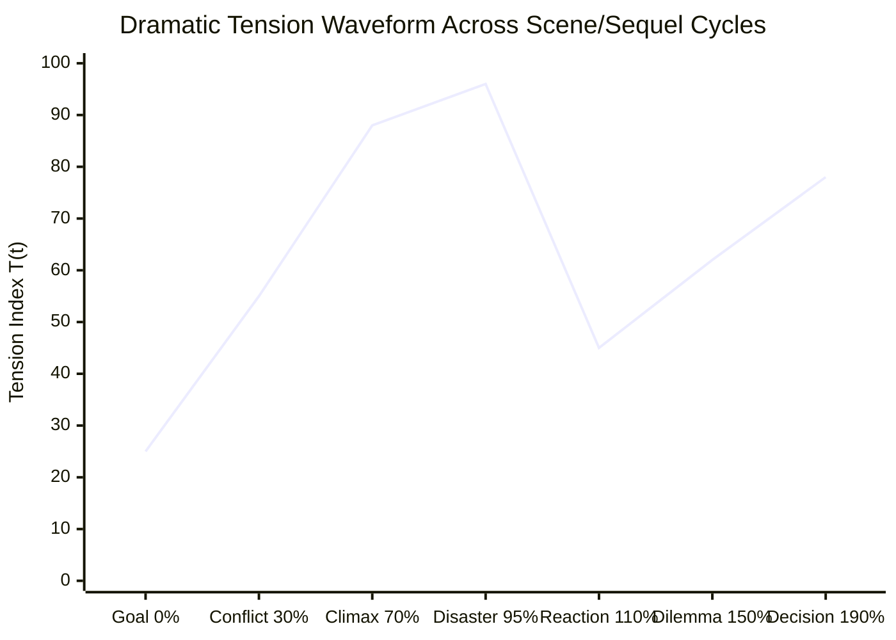

# Author Craft Masterclass: Scene Mechanics, MRU Dynamics & Dramatic Polarity (`docs/SCENE_MECHANICS.md`)
> **Craft Discipline: Narrative Dynamics, Motivation-Reaction Units (MRU) & Dramatic Polarity**

---

## 1. Overview & Theoretical Rationale

While macro-structural frameworks (e.g., the Three-Act Paradigm, the Hero's Journey, or Save the Cat!) dictate the distribution of milestone beats across a 100,000-word manuscript, the emotional reality of a novel is won or lost at the micro-structural level: the individual **Scene** and **Sequel**, structured down to the biological mechanics of the **Motivation-Reaction Unit (MRU)**.



### 1.1 Historical Lineage: Dwight Swain's Motivation-Reaction Unit (MRU)
> **Craft Lineage Notice**: The Motivation-Reaction Unit was codified by pulp author and writing professor Dwight V. Swain in *Techniques of the Selling Writer* (1965), and later refined by Jack M. Bickham and Jim Butcher. It was engineered specifically to maximize kinetic momentum and visceral reader empathy in commercial genre fiction and adventure narrative. It is an opt-in craft lens—not a biological mandate or cognitive law.

Swain's model proposes a sequential unfolding from external cause to internal reaction:
1. **Stimulus (External Event)**: An event occurs in the environment (e.g., an explosion, an insult, a door creaking open).
2. **Visceral Reflex (Somatic Cue)**: Immediate physical sensation or involuntary reaction (gasp, flinch, sudden adrenaline pulse).
3. **Emotional Resonance (Feeling)**: The character's emotional perception of the stimulus (dread, fury, sorrow, relief).
4. **Cognitive Thought (Monologue / Reflection)**: Conscious realization and internal assessment of options.
5. **Deliberate Action & Spoken Dialogue**: The character exercises agency by acting or speaking into the scene.

#### Stylistic Variations & Deliberate Inversions
While Swain's linear order excels at high-intensity kinetic pacing, literary and psychological traditions routinely invert or collapse these phases to achieve specific aesthetic effects:
- **Stream-of-Consciousness / Psychological Interiority** (e.g., Virginia Woolf, Marcel Proust): Prioritizes subjective associative memory and philosophical reflection before or without external stimuli.
- **Deadpan / Hardboiled Narration** (e.g., Dashiell Hammett, Ernest Hemingway): Strips away internal emotional and cognitive commentary entirely, reporting only external stimulus and motor action.
- **Impulsive / Instinctive Action**: Action occurring simultaneously with or before conscious cognition, reflecting battlefield muscle memory.

---

## 2. The Scene vs. Sequel Dialectic
> **Craft Lineage**: Developed by Dwight Swain and Jack Bickham as a modular paradigm for managing dramatic tension and pacing in serialized fiction.

```
       [ PROACTIVE SCENE ]                             [ REACTIVE SEQUEL ]
 ┌─────────────────────────────┐                 ┌─────────────────────────────┐
 │  1. GOAL                    │                 │  1. REACTION                │
 │     • Concrete, Tangible    │                 │     • Visceral Shock        │
 │     • Immediate Deadline    │                 │     • Emotional Catharsis   │
 ├─────────────────────────────┤                 ├─────────────────────────────┤
 │  2. CONFLICT                │                 │  2. DILEMMA                 │
 │     • Escalating Resistance │  ────────────>  │     • Hobson's Choice       │
 │     • Rising Stakes         │                 │     • Irreconcilable Values │
 ├─────────────────────────────┤                 ├─────────────────────────────┤
 │  3. DISASTER                │                 │  3. DECISION                │
 │     • "No, and..."          │                 │     • Concrete Pivot        │
 │     • "Yes, but..."         │                 │     • Target Next Goal      │
 └─────────────────────────────┘                 └─────────────────────────────┘
                ▲                                               │
                └───────────────────────────────────────────────┘
```

### 2.1 The Proactive Scene Architecture
In Swain's model, a Proactive Scene focuses on external agency and tangible conflict:
1. **Goal**: The POV character enters the unit pursuing a concrete immediate objective.
2. **Conflict**: The POV character encounters escalating active or environmental opposition.
3. **Outcome / Complication**: The attempt culminates in a complication that prevents simple closure:
   - **"No, and furthermore..." (Complication)**: The immediate goal fails and the predicament deepens.
   - **"Yes, but..." (Pyrrhic Gain)**: The immediate goal succeeds, but introduces a new challenge.

### 2.2 The Reactive Sequel Architecture
A Reactive Sequel provides space for emotional processing and strategic reorientation:
1. **Reaction**: The character processes the emotional and physical impact of recent events.
2. **Dilemma**: The character confronts limited options or conflicting values.
3. **Decision**: The character commits to a new proactive course of action, seeding the next goal.

---

## 3. Stylostatistical Telemetry & Dramatic Measurements



### 3.1 Prose Composition Balance ($R_{\text{balance}}$)
Provides a descriptive ratio of kinetic agency and spoken dialogue relative to exposition and reflection:

$$R_{\text{balance}} = \frac{\sum w_{\text{action}} + \sum w_{\text{dialogue}} + 1.5 \sum w_{\text{visceral}}}{\sum w_{\text{exposition}} + 0.5 \sum w_{\text{cognitive}} + 1.0}$$

Where:
- $w_{\text{action}}$: Word count of physical kinetic movement and environmental interactions.
- $w_{\text{dialogue}}$: Word count of direct character verbal exchanges.
- $w_{\text{visceral}}$: Word count of somatic cues (pulse, breath, sensory impressions).
- $w_{\text{exposition}}$: Word count of contextual background and narrator exposition.
- $w_{\text{cognitive}}$: Word count of internal contemplation and reflective monologue.

### 3.2 Dynamic Tension Index ($T(t)$)
An advisory model of dramatic tension across narrative progress $t \in [0.0, 1.0]$:

$$T(t) = \Pi(t) \cdot \left(1.0 + \alpha \cdot \frac{d\mathcal{S}}{dt}\right) \cdot e^{-\lambda(t - t_{\text{crisis}})^2}$$

### 3.3 The Swain Macro Balance ($\kappa_{\text{swain}}$)
Descriptive ratio between external kinetic scenes and contemplative sequels:

$$\kappa_{\text{swain}} = \frac{N_{\text{scene}}}{N_{\text{scene}} + N_{\text{sequel}}}$$

- **Kinetic Focus**: $\kappa_{\text{swain}} \in [0.70, 0.85]$ (rapid scene transitions with compressed sequels).
- **Reflective / Literary Speculative**: $\kappa_{\text{swain}} \in [0.45, 0.55]$ (balanced oscillation with expansive character introspection).
- **Contemplative Atmosphere**: $\kappa_{\text{swain}} < 0.35$ (introspective world immersion, pastoral or philosophical depth).

### 3.4 Polarity Shift Telemetry ($\Delta \Pi$)
Tracks the shift in character fortune or emotional state across a scene unit:

$$\Delta \Pi = \Pi_{\text{exit}} - \Pi_{\text{entry}}$$

| Entry State ($\Pi_{\text{entry}}$) | Exit State ($\Pi_{\text{exit}}$) | Dynamic Pattern | Narrative Context |
|---|---|---|---|
| $+0.8$ (Confident / In Control) | $-0.9$ (Ambushed / Trapped) | $+ \to -$ (Dramatic Reversal) | Plunges protagonist into crisis; invites immediate reaction. |
| $-0.7$ (Desperate / Bleeding) | $+0.6$ (Secured Antidote) | $- \to +$ (Hard-Won Pivot) | Cathartic turnaround; sets up subsequent challenge. |
| $+0.5$ (Sneaking Undetected) | $+0.6$ (Still Undetected) | $\Delta \Pi \approx 0$ (Steady State) | **OBSERVATION**: Low polarity shift; characteristic of atmospheric, transitional, or contemplative slice-of-life scenes. |
| $+0.7 \to -0.8 \to +0.8$ | $+0.8$ (Double Reversal) | $+ \to - \to +$ (Rollercoaster) | High narrative oscillation; characteristic of midpoint and climactic set-pieces. |

---

## 4. Author Self-Editing Rubric & Diagnostic Checklist

When revising individual scenes, evaluate your prose against this dramaturgical checklist:

| Diagnostic Check | Flaw & Symptom | Self-Editing Remediating Action |
|---|---|---|
| **Inverted MRU: Thought before Reflex** | Cognitive analysis (*"He realized..."*) placed before somatic reaction (*"His heart pounded..."*). | Relocate visceral reflex (pulse, breath, flinch) immediately following external stimulus before internal thoughts. |
| **Inverted MRU: Action before Reflex** | Physical movement or retort occurs before visceral reaction to a sudden shocking stimulus. | Insert involuntary somatic response before character acts or speaks in reaction to a crisis. |
| **Missing Goal Beat** | Character enters proactive scene drifting aimlessly with no urgent, concrete objective. | Establish the POV character's concrete, measurable goal within the opening 15% of the scene. |
| **Missing Disaster / Weak Resolution** | Scene terminates in a tidy *"Yes"* with zero unresolved complications or consequences. | Replace flat ending with an escalating *"No, and..."* disaster or a pyrrhic *"Yes, but..."* dilemma. |
| **Sequel Lacks Decision Pivot** | Reactive sequel ends in passive despair without resolving into a new course of action. | Ensure the character works through the dilemma to a committed decision that launches the next scene's goal. |
| **Static Polarity Flatline** | Emotional valence and stakes remain identical from scene start to scene end ($\Delta \Pi \approx 0$). | Inject a dramatic reversal (trust to betrayal, safety to ambush) that permanently shifts the character's status. |
| **Low Scene Energy** | Heavy blocks of backstory and contemplative internal analysis paralyze the dramatic pacing ($E_{\text{scene}} < 0.50$). | Convert interior monologue into active dialogue conflict or kinetic obstacles. |
| **White Room Syndrome** | Rapid physical action unfolding without sensory or spatial grounding. | Anchor kinetic beats with concrete tactile, acoustic, and thermal environmental details. |

---

## 5. Practical Authorial Worksheets & Worked Masterclass Examples

### 5.1 Step-by-Step MRU Transformation Case Study

#### Flawed Amateur Draft (Inverted MRUs, Flat Polarity, Missing Disaster):
> Julian stood in the subterranean vault. He wondered if the ancient iron door could withstand the dragon's breath, realizing that his wards were failing rapidly. His heart hammered in his chest and cold sweat broke across his brow as the dragon slammed against the barrier. The stone shattered. "We have to run now!" he screamed to Lyra. He grabbed his spellbook and stepped through the exit tunnel safely.

**Flaws Identified:**
- *Inverted MRU*: Cognitive realization (*"He wondered... realizing that his wards were failing"*) occurs before the somatic reaction (*"His heart hammered... cold sweat broke"*).
- *Missing Visceral Sequence*: Visceral reaction occurs after the character has already thought through the problem.
- *Missing Disaster*: The character simply steps through the exit safely (flat *"Yes"* resolution, zero stakes escalation).

#### Masterclass Revision (Rigorous MRU Ordering, Polarity Inversion $+ \to -$):
> A concussive detonation slammed against the vault doors. *(Stimulus)*  
> The shockwave drove the air from Julian's lungs; his pulse spiked in his throat as ice-cold adrenaline flooded his limbs. *(Visceral Reflex)*  
> Pure animal terror gripped him. *(Emotional Surge)*  
> *The threshold runes have collapsed,* his mind registered. *Three seconds before the iron melts.* *(Cognitive Thought)*  
> Julian lunged across the flagstones, seized Lyra by the collar of her tunic, and hauled her into the drainage sluice. *(Action)*  
> "Hold your breath!" he shouted. *(Dialogue)*  
> The iron gates blew inward in a molten cascade. The escape hatch buckled under the falling masonry, sealing them inside total darkness with the creature's claws scraping overhead. *(Disaster: "Yes, but now trapped")*

---

### 5.2 The Scene & Sequel Authorial Blueprint (YAML Schema for Scene Planning)

```yaml
---
unit_id: "SCN-ACT2-CH14"
type: "proactive_scene"
pov_character: "Valeria Sterling"
pacing_target_words: 2400

scene_mechanics:
  goal:
    objective: "Extract the decrypted planetary telemetry from the orbital terminal"
    urgency: "Terminal auto-purge in 4 minutes"
    stakes_failure: "Loss of the colony fleet's coordinates"
  
  conflict:
    primary_antagonist: "Inquisitor Vane and two Praetorian heavy synthetics"
    escalation_steps:
      - "Step 1: Security grid locks the access corridor, cutting off escape route"
      - "Step 2: Synthetics deploy suppression fields, disabling Valeria's phase-shield"
      - "Step 3: Vane begins remote terminal wipe from the upper gantry"
      
  disaster:
    disaster_type: "yes_but"
    outcome: "Valeria secures the telemetry drive, but Vane identifies her biological signature and triggers the station's orbital de-orbit thrusters."
    exit_polarity: -0.85
    entry_polarity: +0.40

sequel_coupling:
  target_sequel_id: "SQL-ACT2-CH15"
  reaction_focus: "Suffocation and sensory overload as artificial gravity collapses"
  dilemma_choice:
    option_a: "Vent the docking bay atmosphere to launch the escape pod (killing remaining station engineers)"
    option_b: "Manual override the reactor core (50% probability of lethal radiation exposure)"
  decision: "Option B: Valeria commits to manual override, establishing the next scene goal."
---
```

---

## 6. Recommended Reading, References & Media

### 6.1 Foundational Craft & Academic Books
- **Swain, Dwight V. (1965)**. *Techniques of the Selling Writer*. University of Oklahoma Press. ISBN: 978-0806111919.  
  *The seminal work introducing Motivation-Reaction Units (MRUs), the Scene/Sequel polarity dialectic, and the sensory hierarchy of prose pacing.*
- **Bickham, Jack M. (1993)**. *Scene & Structure: How to Construct Fiction with Mystery, Suspense, and Power*. Writer's Digest Books. ISBN: 978-0898795516.  
  *The definitive expansion of Swain's principles by his foremost protégé, providing exhaustive mathematical beat breakdowns for Scene/Sequel linkages.*
- **Scofield, Sandra (2007)**. *The Scene Book: A Primer for the Fiction Writer*. Penguin Books. ISBN: 978-0143112341.  
  *A masterclass treatise on the anatomy of the scene, sensory pulse points, scene framing, and trajectory modulation.*
- **Rosenfeld, Jordan (2014)**. *Make a Scene: Crafting a Powerful Story One Scene at a Time* (2nd ed.). Writer's Digest Books. ISBN: 978-1599630809.  
  *Detailed blueprints for 15 distinct scene archetypes (Action, Suspense, Epiphany, Dialogue, Climax) with practical diagnostic rubrics.*
- **McKee, Robert (1997)**. *Story: Substance, Structure, Style, and the Principles of Screenwriting*. ReganBooks / HarperCollins. ISBN: 978-0060391683.  
  *Formalizes dramatic scene polarity shifts ($\Delta \Pi$), value-at-stake transitions, and turning point mechanics.*

### 6.2 Landmark Lectures, Video Masterclasses & Podcasts
- **Sanderson, Brandon (2020)**. *BYU Creative Writing Lecture 4: Scene Construction and Pacing*. Brigham Young University / YouTube.  
  *Deep dive into goal-driven scene progression, micro-clifffhangers, promise-progress-payoff frameworks, and pacing modulation.*
- **Hello Future Me / Timothy Hickson (2019)**. *The Anatomy of a Scene: Pacing, Tension, and Emotional Arcs*. YouTube Video Essay Series.  
  *Visual breakdown of scene architecture, micro-tension splines, and sequel transitions in speculative masterpieces.*
- **Tale Foundry (2021)**. *How to Write Engaging Scenes: Conflict, Disasters, and Reaction Chains*. YouTube Narratology Analysis.  
  *Exploration of somatic reader empathy, MRU psychology, and the prevention of flat narrative sequences.*
- **Writing Excuses (2013–2022)**. *Season 8 & Season 14: Masterclasses on Scene Construction, Sequels, and Emotional Pacing*. Hosted by Brandon Sanderson, Mary Robinette Kowal, Howard Tayler, and Dan Wells.  
  *Audio workshops dissecting live scene edits, visceral sensory cues, and failure modes in commercial prose.*

### 6.3 Landmark Speculative Fiction Case Studies
- **Herbert, Frank (1965)**. *Dune*. Chilton Books.  
  *Exemplary execution of deep internal MRU sequences (the Gom Jabbar test: extreme somatic stimulus $\to$ autonomic reflex $\to$ fear $\to$ litany of the mind $\to$ resolute stillness).*
- **Sanderson, Brandon (2010)**. *The Way of Kings*. Tor Books.  
  *Kaladin Stormblessed's Bridge Four assault scenes: rigorous Proactive Scene chaining (*Goal $\to$ Conflict $\to$ Catastrophe*) punctuated by somber Chasm Sequels (*Grief $\to$ Dilemma $\to$ Tactical Decision*).*
- **Martin, George R.R. (1996)**. *A Game of Thrones*. Bantam Spectra.  
  *Masterclass in $+ \to -$ dramatic polarity inversions (the Tower of Joy sequence, Eddard Stark's investigation turns).*
