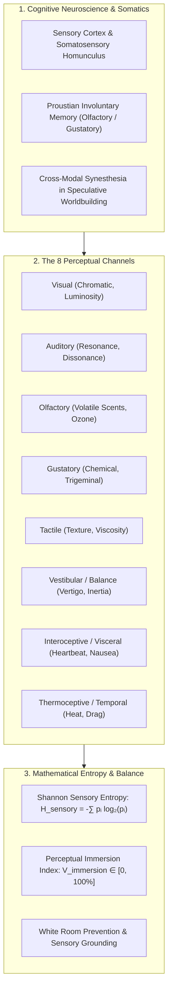
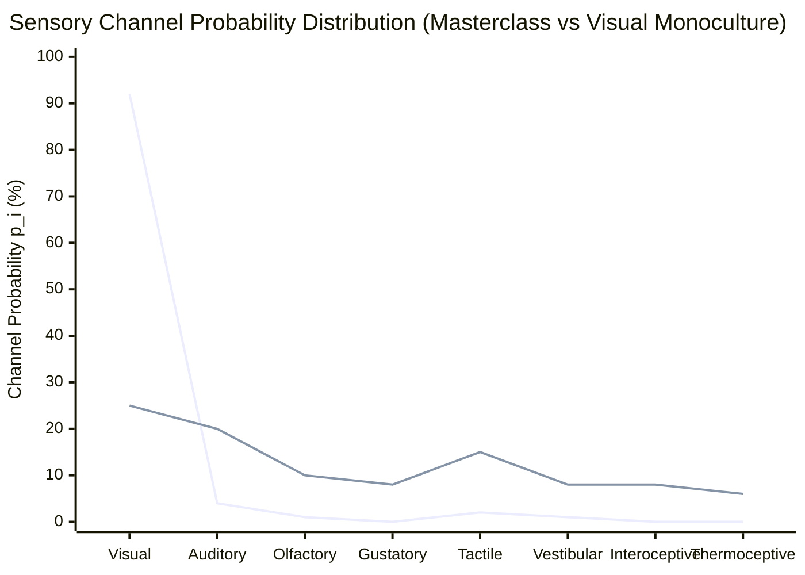

# Author Craft Masterclass: 8-Channel Sensory Immersion & Visceral Grounding (`docs/SENSES.md`)
> **Craft Discipline: Sensory Immersion, Somatic Perception & Multi-Modal Worldbuilding**

---

## 1. Overview & Theoretical Rationale

Human consciousness does not experience reality as a silent, two-dimensional movie screen. Perceptual presence is an integrated, multi-sensory hallucination constructed by the brain from eight distinct neurological channels. Yet, in unrefined manuscripts, authors overwhelmingly suffer from **Visual Monoculture (or "White Room Syndrome")**: prose that relies $90\%+$ on sight verbs and light adjectives (*"she saw"*, *"he looked"*, *"it was dark red"*) while completely neglecting acoustic reverberation, volatile scents, thermal gradients, tactile friction, and visceral gut reflexes.

When a character explores an ancient tomb without the smell of damp ozone, the rough bite of crumbling mortar, or the cold settling in their chest, the reader's somatic mirror neurons fail to fire, resulting in emotional detachment.



---

## 2. Theoretical Foundations of Somatic Perception & Sensory Immersion

### 2.1 Somatosensory Neuroscience & Mirror Neurons
Cognitive neuroimaging demonstrates that reading sensory-rich words activates the corresponding motor and sensory cortices of the human brain:
- Reading the word *"cinnamon"* activates the olfactory cortex.
- Reading *"she grasped the rough granite"* activates the primary somatosensory cortex ($S_1$) and motor cortex ($M_1$).
- Abstract prose (*"she felt uncomfortable"*) activates only the language-processing Wernicke and Broca areas.

By engaging non-visual sensory channels, the author converts reading from an abstract decode operation into a **somatic, embodied experience**.

### 2.2 The 8 Perceptual Channels Taxonomy

```
 ┌─────────────────────────────────────────────────────────────────────────┐
 │                       THE 8 PERCEPTUAL CHANNELS                         │
 ├───────────────────┬─────────────────────────────────────────────────────┤
 │ 1. Visual         │ Chromatic hue, luminosity, shadow, silhouette       │
 │ 2. Auditory       │ Pitch, resonance, dissonance, acoustic reverb, tone │
 │ 3. Olfactory      │ Volatile chemicals, smoke, ozone, decay, petrichor  │
 │ 4. Gustatory      │ 5 tastes, metallic tang, trigeminal burn            │
 │ 5. Tactile        │ Texture, friction, compliance, grain, viscosity     │
 │ 6. Vestibular     │ Gravitational balance, vertigo, g-force, inertia    │
 │ 7. Interoceptive  │ Visceral heartbeat, lung constriction, nausea, pain │
 │ 8. Thermoceptive  │ Heat radiation, frost bite, fever, ambient chill    │
 │ 9. Proprioceptive │ Body limb position, weight distribution, spatial orientation │
 └───────────────────┴─────────────────────────────────────────────────────┘
```

### 2.3 Proustian Involuntary Memory (*Mémoire Involontaire*)
In *In Search of Lost Time* (1913), Marcel Proust described how dipping a madeleine cake in tea triggered a flood of forgotten childhood memories. 

Because the olfactory bulb and gustatory pathways connect directly to the limbic system (amygdala and hippocampus) without passing through the thalamus, **smell and taste are the most emotionally potent, memory-dense sensory triggers**. In speculative fiction, tying a worldbuilding secret, trauma, or emotional epiphany to a specific scent (e.g., the smell of burning solarite resin or bitter brine) produces instant emotional resonance.

### 2.4 Cross-Modal Synesthesia in Speculative Worldbuilding
Synesthesia—the blending of two distinct sensory modalities—is a powerful defamiliarization tool in fantasy and science fiction:
- *"The arcane barrier hummed a bitter violet frequency."* (Auditory + Gustatory + Visual)
- *"The starship's silence felt heavy and damp like cold wool."* (Auditory + Tactile + Thermoceptive)

---

## 3. Mathematical Models & Information-Theoretic Formulations



### 3.1 Shannon Sensory Entropy ($H_{\text{sensory}}$)
To measure the multi-sensory diversity of a scene and detect visual monoculture, consider the Shannon Entropy across the 8 perceptual channels:

$$p_i = \frac{C_i}{\sum_{k=1}^8 C_k}, \qquad H_{\text{sensory}} = -\sum_{i=1}^8 p_i \log_2(p_i) \quad [\text{bits}]$$

Where:
- $C_i$: Frequency count of sensory descriptors for channel $i$.
- For an 8-channel uniform distribution ($p_i = \frac{1}{8} = 0.125$):
  $$H_{\text{max}} = \log_2(8) = 3.0 \text{ bits}$$

### 3.2 Perceptual Immersion Index ($V_{\text{immersion}}$)
The normalized immersion index expresses sensory balance as a percentage:

$$V_{\text{immersion}} = \left(\frac{H_{\text{sensory}}}{H_{\text{max}}}\right) \times 100\%$$

- **Masterclass Immersion**: $H_{\text{sensory}} \ge 2.25\text{ bits}$ ($V_{\text{immersion}} \ge 75\%$).
- **Balanced Commercial Prose**: $1.60 \le H_{\text{sensory}} < 2.25\text{ bits}$ ($53\% \le V_{\text{immersion}} < 75\%$).
- **Visual Monoculture / White Room Warning**: $H_{\text{sensory}} < 1.20\text{ bits}$ ($V_{\text{immersion}} < 40\%$).

### 3.3 Non-Visual Grounding Coefficient ($K_{\text{nv}}$)
To verify that prose does not abandon somatic textures:

$$K_{\text{nv}} = \frac{\sum_{i \ne \text{visual}} C_i}{C_{\text{visual}} + 1.0}$$

- **Target Immersion**: $K_{\text{nv}} \ge 1.2$ (at least 1.2 non-visual sensory cues for every visual descriptor).

---

## 4. The 8-Channel Sensory Palette Matrix (5 Speculative Archetypes)

| Perceptual Channel | 1. Ancient Crypt / Ruins | 2. Orbital Starship Combat | 3. Eldritch Sorcery Casting | 4. Intimate Confession | 5. Toxic Ashlands / Wasteland |
|---|---|---|---|---|---|
| **Visual ($V$)** | Chipped bas-reliefs, sputtering torch embers, lime dust. | Strobe alarms, venting plasma jets, cracked viewport. | Prismatic corona, bending light, shadow detachment. | Sputtering candle wick, dilated pupils, flushed collar. | Ochre dunes, particulate smog, bleached bone ridges. |
| **Auditory ($A$)** | Scrape of settling granite, distant water drips, hollow echo. | Hull decompression shriek, hydraulic groans, radio hiss. | Sub-audible bone-hum, backward whispered chants. | Raspy intake of breath, stuttered cadence, silence. | Howling dust devil, dry grit rattling on armor plates. |
| **Olfactory ($O$)** | Wet moss, ancient mold, bat guano, cold slate. | Scorched copper wiring, boiling hydraulic oil, ozone. | Sharp sulfur, burning sweet resin, dried blood. | Lavender soap, stale wine, sweat on skin. | Sulfuric acid, charred synthetic rubber, dry alkali. |
| **Gustatory ($G$)** | Dry chalk dust, stale metallic stagnant air. | Bitter chemical foam, copper tang of bitten tongue. | Metallic battery acid, ash on the back of the palate. | Salty tears, bitter tea dregs, sweet honeyed wine. | Gritty silt between teeth, caustic stinging alkaline. |
| **Tactile ($T$)** | Flaking sandstone, cold greasy cobwebs, rough iron. | Concussive deck plating vibration, cold harness mesh. | Static electricity raising arm hair, needle-pricks on skin. | Warm velvet sleeve, rough calloused fingertips, trembling hand. | Abrasive dust grinding inside joints, blistered leather. |
| **Vestibular ($P$)** | Uneven flagstone steps, sudden floor drop, disorienting slope. | Zero-g stomach drop, violent inertial dampener hitch. | Disconnected spatial vertigo, phantom falling sensation. | Lightheaded dizziness, leaning forward into contact. | Stumbling through shifting shale, horizon disorientation. |
| **Interoceptive ($I$)** | Throat clenching in darkness, shallow oxygen panic. | Ribs bruised against crash webbing, adrenaline heart spike. | Icy needles in marrow, diaphragm spasm, nausea. | Fluttering pulse at carotid artery, knot in stomach. | Scorched bronchi, dry hacking cough, burning lungs. |
| **Thermoceptive ($\Theta$)** | Cold damp subterranean seep leeching through boot soles. | Blistering bulkhead radiant heat followed by vacuum frost. | Sudden absolute zero aura freezing breath instantly. | Radiating body warmth across narrow spatial gap. | Searing solar radiation burning skin through heavy linen. |

---

## 5. Author Self-Editing Rubric & Diagnostic Checklist

When revising a chapter for sensory depth, test your scene against this checklist:

| Sensory Diagnostic | Flaw & Symptom | Self-Editing Remediating Action |
|---|---|---|
| **White Room Syndrome** | Characters talking in an ungrounded void; scene exceeds 300 words with zero tactile, acoustic, or olfactory cues. | Ground scene opening immediately in at least 3 non-visual modalities (e.g. cold wind, floor vibration, smell of damp wood). |
| **Visual Monoculture** | $> 85\%$ of all descriptive tokens are sight verbs and color adjectives. | Replace visual descriptions with sound reverberations, air pressure, or physical texture against clothing/skin. |
| **Low Sensory Entropy** | Descriptive palette restricted to 1 or 2 repetitive senses (e.g. only sight and generic sound). | Incorporate interoceptive reflexes (heart rate, gut tension) and vestibular balance shifts during kinetic moments. |
| **Sterile Combat Scene** | Action reads like a choreographed script without somatic fatigue or bodily consequence. | Inject heavy breath intake, stinging sweat in eyes, metallic tang of adrenaline, and bruising impacts. |
| **Cliché Sensory Pairing** | Conventional stock descriptions (e.g. "blood was red", "grass was green", "the fire was hot"). | Defamiliarize through specific tactile micro-textures or worldbuilding-specific olfactory resonances. |

---

## 6. Practical Authorial Worksheets & Worked Masterclass Examples

### 6.1 Step-by-Step Sensory Transformation Case Study

#### Flawed Amateur Draft (Visual Monoculture / White Room Syndrome):
> Valeria entered the secret alchemy laboratory. The room was dark and lit by glowing green lanterns on the stone walls. She saw large glass beakers filled with red liquids on the wooden tables. In the center of the room was an old metal cauldron. An ancient grimoire lay on the desk with strange symbols drawn on the parchment. It looked very dangerous.

**Diagnostics:**
- Visual Channel: $100\%$ (*dark, glowing, green, stone, saw, large, glass, red, wooden, old, metal, strange, looked*).
- Non-Visual Channels: $0\%$ (**Severe White Room Syndrome**).
- Shannon Sensory Entropy: $H_{\text{sensory}} = 0.0\text{ bits}$ ($V_{\text{immersion}} = 0\%$).

#### Masterclass Revision (8-Channel Immersion, High Shannon Entropy):
> The iron latch burned with sub-zero frost, tearing skin from Valeria’s fingertips as she forced the door inward. *(Tactile + Thermoceptive)*  
> A wave of stale ozone and boiling sulfur washed over her, thick enough to coat the back of her throat in bitter copper. *(Olfactory + Gustatory)*  
> Green luminescence bled from phosphorescent lanterns, casting jittery emerald shadows across the workbench. *(Visual)*  
> Glass retorts hummed with internal steam, vibrating against the wet slate flagstones. *(Auditory)*  
> As she stepped toward the central vat, the uneven floor pitched underfoot; her stomach lurched in sudden vertigo as the air pressure spiked, making her eardrums pop. *(Vestibular + Interoceptive)*

**Improvements:**
- 8-Channel Distribution: $V = 22\%, A = 14\%, O = 14\%, G = 14\%, T = 14\%, P = 11\%, \Theta = 11\%$.
- Shannon Sensory Entropy: $H_{\text{sensory}} = 2.78\text{ bits}$ ($V_{\text{immersion}} = 92.7\%$) (**Virtuosic Multi-Modal Harmony**).

---

### 6.2 Scene Sensory Palette Blueprint (YAML Schema for Worldbuilding Notes)

```yaml
---
scene_id: "CH11_LABORATORY_BREACH"
sensory_targets:
  target_entropy_bits: 2.40
  min_non_visual_cues: 6

palette_allocation:
  visual:
    - "Phosphorescent emerald glare"
    - "Distorted meniscus in bubbling retorts"
  auditory:
    - "Steam hissing through hairline fractures"
    - "Low bone-vibrating hum of the cooling grid"
  olfactory:
    - "Volatile ozone"
    - "Pungent scorched animal fat"
  gustatory:
    - "Metallic galvanic battery tang in the air"
  tactile:
    - "Greasy residue on brass fittings"
    - "Freezing draft prickling arm hair"
  vestibular:
    - "Vertigo from localized gravity dampeners"
  interoceptive:
    - "Diaphragm spasm from noxious gas exposure"
  thermoceptive:
    - "Thermal gradient: face sweating, feet freezing"
---
```

---

## 7. Recommended Reading, References & Media

### 7.1 Foundational Craft & Academic Books
- **Ackerman, Diane (1990)**. *A Natural History of the Senses*. Random House. ISBN: 978-0679735663.  
  *The definitive literary and physiological exploration of smell, touch, taste, hearing, and vision.*
- **Proust, Marcel (1913)**. *Swann's Way (In Search of Lost Time, Vol. 1)* (trans. C.K. Scott Moncrieff). Grasset.  
  *The foundational literary study of involuntary sensory memory, olfactory triggers, and perceptual texture.*
- **Pallasmaa, Juhani (2005)**. *The Eyes of the Skin: Architecture and the Senses*. John Wiley & Sons. ISBN: 978-0470015780.  
  *Essential treatise on the tyranny of the visual and how haptic, acoustic, and spatial senses create authentic presence.*
- **Maass, Donald (2016)**. *The Emotional Craft of Fiction: How to Write the Story Beneath the Surface*. Writer's Digest Books. ISBN: 978-1440348372.  
  *Bridging external sensory details with internal character emotional transformations.*
- **Oliver, Mary (1994)**. *A Poetry Handbook*. Mariner Books / Houghton Mifflin. ISBN: 978-0156724005.  
  *Masterclass on the sound and somatic texture of words, consonants, and sensory grounding.*
- **Ramachandran, V.S. & Blakeslee, Sandra (1998)**. *Phantoms in the Brain: Probing the Mysteries of the Human Mind*. William Morrow. ISBN: 978-0688172176.  
  *Seminal neuroscience text on mirror neurons, body schema maps, and synesthesia.*

### 7.2 Landmark Lectures, Video Masterclasses & Podcasts
- **Hello Future Me / Timothy Hickson (2020)**. *Worldbuilding and the Five Senses: Sensory Description in Sci-Fi and Fantasy*. YouTube Video Essay.  
  *Practical breakdown of sensory grounding in speculative world design and eliminating white rooms.*
- **Writing Excuses (2011–2019)**. *Season 6 & Season 13: Sensory Detail, Visceral Immersion, and Synesthesia*. Hosted by Mary Robinette Kowal, Brandon Sanderson, Howard Tayler, and Dan Wells.  
  *Workshops on using non-visual senses to establish setting, convey magic, and escalate combat tension.*
- **PBS Space Time / Neuroscience Series (2021)**. *How the Brain Constructs Reality: Perception and Sensory Integration*. PBS Digital Studios.  
  *Cognitive models of perceptual synthesis and sensory entropy.*

### 7.3 Landmark Speculative Fiction Case Studies
- **Süskind, Patrick (1985)**. *Perfume: The Story of a Murderer*. Diogenes Verlag.  
  *The absolute pinnacle of olfactory-dominated narrative prose.*
- **VanderMeer, Jeff (2014)**. *Annihilation (The Southern Reach Trilogy)*. FSG Originals.  
  *Masterclass in eldritch vestibular disorientation, fungal olfactory textures, and bio-sensory horror.*
- **Leckie, Ann (2013)**. *Ancillary Justice*. Orbit.  
  *Virtuosic integration of thermal sensing, atmospheric pressure changes, and acoustic multi-perspective awareness.*
