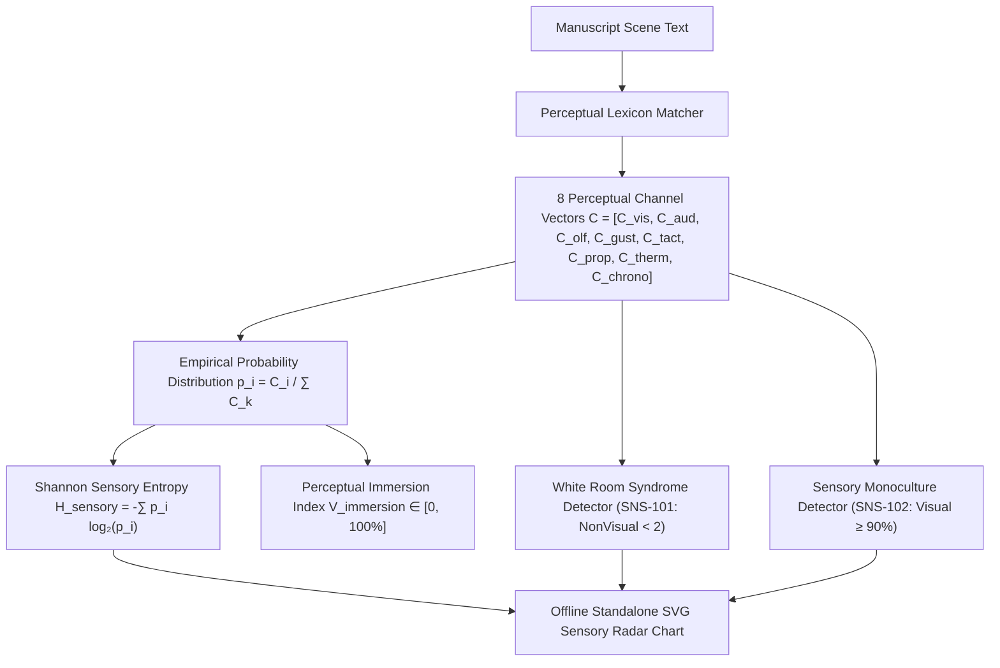
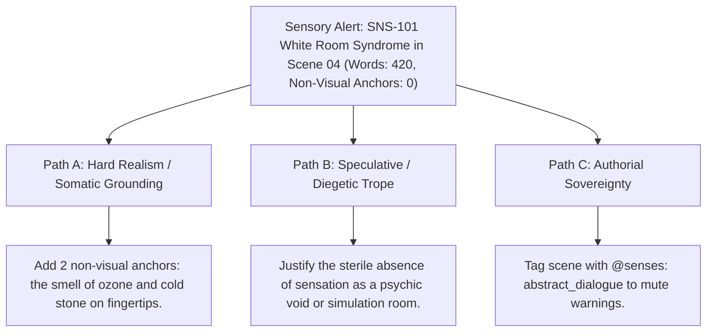

# 8-Channel Sensory Palette, Perceptual Immersion & Shannon Entropy (`docs/SENSES.md`)
> **Domain B: Linguistics, Conlang, Idioms & Stylistics** | **CLI:** `arcanum senses` / `arcanum sensory`

---

## 1. Overview & Theoretical Rationale

The **Ars Arcanum Sensory Palette Engine** (`scripts/lib/senses.py`) is an offline cognitive perception profiler, sensory monoculture auditor, and embodied immersion analyzer designed for speculative fiction novelists and creative prose stylists.

Novice and intermediate manuscripts frequently suffer from **Visual Monoculture (or "White Room Syndrome")**: prose that relies $90\%+$ on sight verbs and light adjectives (*"she saw"*, *"he looked"*, *"it appeared dark red"*) while completely neglecting the acoustic, olfactory, gustatory, thermal, and proprioceptive textures of the scene. When a character stands in an ancient crypt without the smell of damp ozone, the cold bite of basalt on their skin, or the ringing silence in their ears, the reader experiences emotional detachment rather than visceral presence.

The Sensory Palette Engine scans chapter prose against calibrated multi-channel lexicons, computes Shannon sensory entropy ($H_{\text{sensory}}$), calculates the Perceptual Immersion Index ($V_{\text{immersion}}$), flags White Room scenes, and generates interactive SVG radar charts.

---

## 2. Perceptual Cognition & Mathematical Formulation



### 2.1 The 8 Perceptual Channels Taxonomy
The engine monitors eight distinct somatic sensory dimensions:
1. **Visual ($V$)**: Chromatic hue, luminosity, shadow, silhouette, optical motion (*crimson, azure, gloom, radiant*).
2. **Auditory ($A$)**: Acoustic pitch, resonance, dissonance, timbre, volume (*clang, whisper, murmur, shrill*).
3. **Olfactory ($O$)**: Volatile scents, smoke, rot, petrichor, flora, sulfur (*acrid, musk, incense, sulfur*).
4. **Gustatory ($G$)**: Chemical taste, salinity, bitterness, metallic tang (*briny, bitter, copper, honey*).
5. **Tactile ($T$)**: Mechanical texture, friction, roughness, viscosity (*velvet, coarse, gritty, silken*).
6. **Proprioception ($P$)**: Kinesthetic balance, muscle tension, vertigo, inertia (*lurch, vertigo, pulse, stagger*).
7. **Thermoception ($\Theta$)**: Environmental heat, frost, fever, shivering (*blazing, frost, clammy, searing*).
8. **Chronoception ($\tau$)**: Subjective time perception, ticking urgency, temporal drag (*dilation, stasis, rushed*).

### 2.2 Shannon Sensory Entropy ($H_{\text{sensory}}$)
To quantify whether a scene achieves rich perceptual balance rather than visual monoculture:

$$p_i = \frac{C_i}{\sum_{k=1}^8 C_k}, \qquad H_{\text{sensory}} = -\sum_{i=1}^8 p_i \log_2(p_i) \quad [\text{bits}]$$

For an 8-channel uniform distribution ($p_i = \frac{1}{8}$), maximum entropy is:
$$H_{\text{max}} = \log_2(8) = 3.0 \text{ bits}$$

The normalized **Perceptual Immersion Index ($V_{\text{immersion}}$)**:
$$V_{\text{immersion}} = \left(\frac{H_{\text{sensory}}}{H_{\text{max}}}\right) \times 100\%$$

- **Sensory Monoculture Warning**: If $H_{\text{sensory}} < 1.2\text{ bits}$ ($V_{\text{immersion}} < 40\%$) over a scene of $> 300\text{ words}$.
- **Master-Class Immersion**: $H_{\text{sensory}} \ge 2.2\text{ bits}$ ($V_{\text{immersion}} \ge 73\%$).

---

## 3. Subfeatures Matrix & Diagnostic Codes

| Code / Feature | Algorithmic Mechanism | Severity | Diagnostic Rule / Trigger | Narrative Craft Significance |
|:---|---|:---:|---|---|
| **`SNS-101`** | Evaluates total non-visual sensory anchor count. | `WARNING` | **White Room Syndrome**: Words $> 150$, but non-visual anchors $< 2$. | Prevents abstract floating dialogue lacking somatic grounding. |
| **`SNS-102`** | Calculates visual channel share ($p_{\text{visual}}$). | `WARNING` | **Visual Monoculture**: Total anchors $\ge 5$, but visual share $\ge 90\%$. | Broadens sensory registers across action and description. |
| **Sensory Radar Generator** | Projects 8-channel coordinates onto polar radial axes. | `INFO` | Emits interactive standalone SVG spider/radar charts. | Gives authors immediate visual feedback on perceptual balance. |
| **Somatic Anchor Counter** | Tallying somatic (thermal + tactile + proprioceptive) hits. | `INFO` | Measures physical embodiment and POV visceral presence. | Enhances horror, thriller, and action scene immersion. |

---

## 4. Author Extension & Configuration Guide

### 4.1 CLI Command Reference
```bash
# Analyze sensory palette across full manuscript directory
arcanum senses Manuscript/

# Export standalone offline HTML report with SVG radar charts
arcanum senses Manuscript/ --html reports/sensory_report.html

# Output machine-readable JSON sensory channel distributions
arcanum senses Manuscript/ --json

# Query Shannon sensory entropy mathematics and cognitive theory
arcanum doc senses --math --why
```

---

## 5. Tri-Fold Creative Advisory Resolutions



### Scenario: White Room Syndrome Alert (`SNS-101`)
- **Path A (Hard Realism / Somatic Layering)**:
  - Insert two non-visual anchors into the scene: the metallic taste of adrenaline in the character's mouth and the damp chill of the subterranean cellar floor through their boots.
- **Path B (Speculative / Diegetic Trope)**:
  - If the scene is set inside a virtual reality simulation, an astral void, or a sensory deprivation chamber, keep the lack of senses and tag with `@environment: sensory_void`.
- **Path C (Authorial Sovereignty)**:
  - If writing a rapid, staccato dialogue interchange between two operatives where physical description would break conversational velocity, bypass the warning via `@senses: fast_dialogue`.

---

## 6. Content Security Policy & Offline Isolation

All sensory palette analyzers and SVG radar charts operate 100% offline with zero CDN dependencies:

```html
<meta http-equiv="Content-Security-Policy" content="default-src 'none'; style-src 'unsafe-inline'; script-src 'unsafe-inline'; img-src data:; media-src data: blob:;">
```
