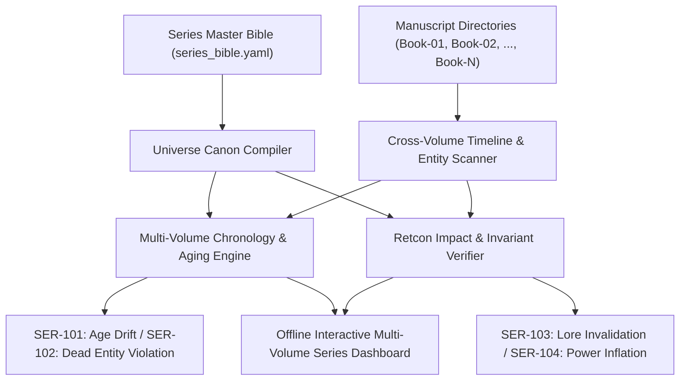

# Multi-Volume Series Continuity & Retcon Management (`docs/SERIES_CONTINUITY.md`)
> **Domain D: Stylistics, Polish & Continuity** | **CLI:** `arcanum series-continuity` / `arcanum series`

---

## 1. Overview & Theoretical Rationale

The **Ars Arcanum Series Continuity Engine** (`scripts/lib/series_continuity.py`) is an offline cross-volume canon validator, multi-decade timeline synchronizer, and retroactive continuity (retcon) impact analyzer engineered for multi-book sagas, trilogies, and expansive speculative franchises.

In multi-volume storytelling, narrative continuity challenges scale non-linearly with series volume count:
1. **Chronological Age Drift (`SER-101`)**: A character born in Year 400 is declared 22 years old in Book 1 (Year 420) and 25 years old in Book 3 (Year 435), violating chronological invariance.
2. **Deceased Entity Resurrections (`SER-102`)**: Characters killed in earlier volumes participating in live scenes without explicit resurrection, clone, or flashback declarations.
3. **Power Scaling & Arcane Inflation (`SER-103`)**: Magical abilities or technologies established with strict boundaries in Book 1 escalating beyond all thermodynamic or narrative constraints by Book 4.
4. **Unmanaged Retcons (`SER-104`)**: Altering world lore or character backstories in later volumes without auditing how those changes invalidate previous books' plot logic.
5. **Cross-Volume Chekhov Abandonment (`SER-105`)**: Long-range foreshadowing planted in Book 1 left unresolved when the series concludes.

The Series Continuity Engine compiles the unified Universe Bible (`Universes/<Name>/series_bible.yaml`), aggregates timeline markers across all book directories (`Book-01/`, `Book-02/`, etc.), verifies character aging functions, and tracks retcon impact propagation.



---

## 2. Multi-Volume Chronology & Aging Formulations

### 2.1 Character Chronological Aging Invariant
Let character $C$ have a canonical birth date $t_{\text{birth}}(C)$ in the in-world calendar. For Book $k$ set across the temporal interval $[t_{\text{start}}(k), t_{\text{end}}(k)]$:

$$\text{Age}_{\text{min}}(C, k) = t_{\text{start}}(k) - t_{\text{birth}}(C)$$

$$\text{Age}_{\text{max}}(C, k) = t_{\text{end}}(k) - t_{\text{birth}}(C)$$

$$\text{Age Invariance Rule}: \quad \forall t \in [t_{\text{start}}(k), t_{\text{end}}(k)], \quad |\text{ProseAge}(C, t) - (t - t_{\text{birth}}(C))| < 1.0 \text{ Year}$$

If a character's prose age deviates from calculated astronomical calendar years, the engine raises `SER-101: AGE_DRIFT_DETECTED`.

### 2.2 Transgenerational Dynastic Drift
For sagas spanning multiple centuries (e.g. Isaac Asimov's *Foundation*, Frank Herbert's *Dune*):

$$\text{Generation Index}: \quad g(C) = \left\lfloor \frac{t_{\text{birth}}(C) - t_{\text{epoch}}}{\Delta t_{\text{generation}}} \right\rfloor \quad (\Delta t_{\text{gen}} \approx 25\text{--}30\text{ years})$$

$$\text{Dynastic Invariant}: \quad t_{\text{birth}}(\text{Child}) > t_{\text{birth}}(\text{Parent}) + 14 \text{ Years}$$

---

## 3. Retcon Taxonomy & Impact Propagation

```
+-----------------------------------------------------------------------------------+
|                        RETROACTIVE CONTINUITY (RETCON) TAXONOMY                   |
+-------------------+-------------------------------+-------------------------------+
| 1. ADDITIVE       | 2. ALTERATIVE                 | 3. SUBTRACTIVE                |
| Filling in unseen | Overwriting established facts | Removing previously canonized |
| historical gaps   | with new explanations. High   | events from current continuity|
| without altering  | risk of breaking causal logic | (e.g. declaring a side story  |
| existing events.  | in earlier volumes.           | non-canonical / apocryphal).  |
+-------------------+-------------------------------+-------------------------------+
```

### 3.1 Retcon Impact Graph Analysis
When an alterative retcon $\mathcal{R}$ is declared in Book $k$ on proposition $P$, the engine traces its backward causal dependency cone in the lore DAG:

$$\text{Invalidated Scenes}(\mathcal{R}) = \{ S \in \bigcup_{j < k} \text{Book}_j \mid S \text{ causally depends on } \neg P \}$$

If $|\text{Invalidated Scenes}| > 0$, the author must either:
- Provide an in-universe epistemological explanation (*"Character $X$ was lied to in Book 1"*).
- Execute a formal text patch across earlier manuscripts.

---

## 4. Subfeatures Matrix & Diagnostic Codes

| Diagnostic Code | Flag | Trigger Condition | Worldbuilding Correction |
|---|---|---|---|
| `SER-101` | `AGE_DRIFT` | Character stated age in Book $k$ conflicts with series timeline calendar. | Correct stated age or adjust time gap between book volumes. |
| `SER-102` | `POST_MORTEM_ACTIVITY` | Character deceased in Book $j$ acts in Book $k$ ($k > j$) without resurrection tag. | Tag as vision/flashback or replace character with successor. |
| `SER-103` | `POWER_INFLATION` | Magic power output in Book $k$ exceeds Book 1 rules by $> 300\%$ without catalyst. | Re-introduce severe casting costs, exhaustion, or material limits. |
| `SER-104` | `UNRESOLVED_RETCON` | Alterative retcon breaks causal necessity of a major Act II plot point in Book 1. | Add diegetic justification (unreliable narrator, forged records). |
| `SER-105` | `DANGLING_SERIES_GUN` | Chekhov relic introduced in Book 1 remains unmentioned by finale of Book 3. | Plant payoff in final volume climax or explicitly destroy relic. |
| `SER-106` | `GEOGRAPHIC_EXPANSION_ERROR` | Kingdom boundaries or travel distances in Book 4 contradict Book 1 maps. | Synchronize regional maps in `World/Cartography/`. |

---

## 5. Series Bible Schema & Frontmatter Configurations

### 5.1 Series Master Bible (`Universes/Eldoria/series_bible.yaml`)
```yaml
series_title: "The Chronicles of the Shattered Sun"
universe_id: "eldoria_prime"
calendar_system: "solar_standard_365"
timeline_epoch: "0 AF (After the Fall)"
volumes:
  - id: "book_01"
    title: "The Whispering Ember"
    start_year: 420.2
    end_year: 421.1
    status: "published_alpha"
  - id: "book_02"
    title: "The Iron Winter"
    start_year: 424.0 # 3-year time skip
    end_year: 425.5
    status: "draft_beta"
  - id: "book_03"
    title: "The Sun Ascendant"
    start_year: 428.0
    end_year: 429.2
    status: "outline_gamma"
macro_chekhov_registry:
  - id: "the_black_prism"
    introduced_in: "book_01"
    primed_in: "book_02"
    payoff_expected_in: "book_03"
    status: "on_track"
```

### 5.2 Character Series Ledger (`World/Characters/Valerius.md`)
```yaml
---
name: "Valerius Stone"
birth_year: 398.5
status_by_volume:
  book_01:
    age: 21.7
    rank: "Apprentice Knight"
    status: "alive"
  book_02:
    age: 25.5
    rank: "Lord Commander"
    status: "alive"
  book_03:
    age: 29.5
    rank: "High Inquisitor"
    status: "alive"
---
```

---

## 6. Worked Step-by-Step Example

### Scenario: Resolving a Magic System Retcon Between Book 2 and Book 4
1. **Book 2 Statement (Alpha Canon)**: *"The Sunken Gate can only be opened by royal blood of House Vance."*
2. **Book 4 Plot Need (Author Intent)**: The protagonist (a peasant thief with zero royal blood) must unlock the Gate to prevent total apocalypse.
3. **Naïve Retcon (Fails `SER-104`)**: Writing that anyone can open the gate with sufficient willpower. This invalidates Book 2's entire civil war where House Vance was hunted for their blood.
4. **Epistemic Retcon (Valid Solution)**:
   - In Book 4, the protagonist discovers the ancient inscription was mistranslated by the corrupt Scholastic Priesthood in Year 110.
   - The original Old Valyrian phrase was *"blood of the flame"* (referring to anyone who has consumed the sacred Fire Lotus), which House Vance hoarded to monopolize power.
   - **Audit Result**: Validated. Book 2 character beliefs remain intact as historical misinformation, preserving causal stakes.

---

## 7. Recommended Reading, References & Media

### 7.1 Foundational Craft & Academic Books
- **Wolf, Mark J. P. (2012)**. *Building Imaginary Worlds: The Theory and History of Subcreation*. Routledge. ISBN: 978-0415631204.  
  *Exhaustive academic study of trans-authorial universes, multi-volume world growth, and canon maintenance.*
- **Doležel, Lubomír (1998)**. *Heterocosmica: Fiction and Possible Worlds*. Johns Hopkins University Press. ISBN: 978-0801858499.  
  *Foundational possible-worlds semantics text examining fictional authentication and truth-value across long narrative cycles.*
- **Saint-Gelais, Richard (2011)**. *Fictions transfictionnelles: Essor d'un genre*. Éditions du Seuil. ISBN: 978-2021045239.  
  *The definitive structuralist analysis of sequels, spin-offs, and canon preservation in sprawling fictional universes.*
- **Eco, Umberto (1979)**. *The Role of the Reader: Explorations in the Semiotics of Texts*. Indiana University Press. ISBN: 978-0253203182.  
  *Examines the myth of Superman, serial narratives, and the cognitive mechanics of non-linear timeline consumption.*

### 7.2 Landmark Scientific / Worldbuilding Papers & Textbooks
- **Okuda, Michael & Okuda, Denise (1996)**. *The Star Trek Chronology: The History of the Future*. Pocket Books. ISBN: 978-0671536107.  
  *The historical standard for constructing a coherent multi-century timeline across dozens of television seasons and films.*
- **Ahlstrom, Peter & Sanderson, Brandon (2015–Present)**. *The Cosmere Continuity Archival Standards*. Dragonsteel Entertainment.  
  *The modern gold standard in multi-series speculative universe continuity tracking.*

### 7.3 Seminal Video Lectures, Masterclasses & Channels
- **Brandon Sanderson (2020)**. *Lecture #12: Worldbuilding Epics & Series Continuity*, BYU Creative Writing Lectures. YouTube.  
  *How to manage 10-book series without collapsing under the weight of accumulated lore.*
- **Tale Foundry (2020)**. *How to Handle Retcons Without Ruining Your Story*. YouTube.  
  *Deep dive into additive vs alterative retcons and how to preserve audience trust.*
- **Hello Future Me (Tim Hickson, 2020)**. *Writing Multi-Book Series: Pacing & Long-Term Arcs*. YouTube.  
  *Techniques for planting long-range Chekhov's guns in Book 1 and resolving them in Book 5.*

### 7.4 Landmark Speculative Case Studies
- **Brandon Sanderson, *The Cosmere* (2005–Present)**: 20+ novels across multiple planetary systems governed by a single overarching metaphysical system (Investiture, Shards of Adonalsium).
- **Steven Erikson & Ian C. Esslemont, *Malazan Book of the Fallen* (1999–Present)**: A sprawling 10-volume military fantasy epic spanning millennia of archaeological and geopolitical history.
- **George R.R. Martin, *The World of Ice & Fire* (2014)**: Fictional historical chronicle demonstrating intentional conflicting historical accounts (Archmaester Gyldayn vs Mushroom).
