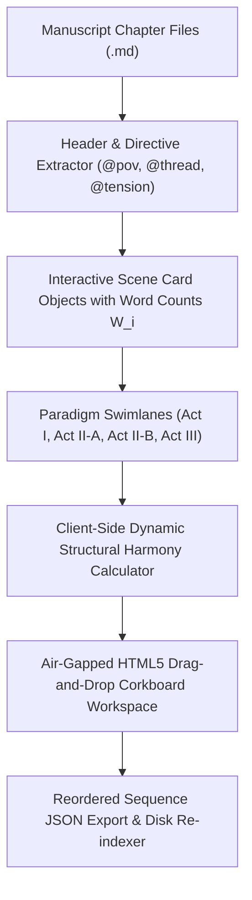

# Visual Story Canvas, Corkboard Systems & Spatial Storytelling (`docs/STORY_CANVAS.md`)
> **Domain B: Narrative Architecture, Structure & Dynamics** | **CLI:** `arcanum story-canvas` / `arcanum canvas`

---

## 1. Overview & Theoretical Rationale

The **Ars Arcanum Story Canvas Engine** (`scripts/lib/story_canvas.py`) is an offline visual corkboard, spatial narrative sequencer, and interactive chapter reordering workspace designed for novelists, narrative designers, and developmental editors.

Drafting a 50-chapter manuscript strictly within a linear, vertical text stream imposes severe cognitive tunnel vision. Authors encounter persistent spatial visualization handicaps:
1. **Act Boundary Blindness (`CAN-101`)**: Inability to perceive macro structural distortion (e.g. an Act I that quietly expands to $42\%$ of total word count, starving the confrontation).
2. **Subplot Thread Stranding (`CAN-102`)**: Losing track of B-story and C-story physical card distributions across acts, resulting in long deserts where secondary characters disappear.
3. **Reordering Friction (`CAN-103`)**: Hesitation to experiment with chapter rearrangements due to the tedious manual labor of file renaming, frontmatter updates, and cross-reference re-indexing.
4. **Cloud / SaaS Security Vulnerability**: Proprietary visual plotting tools (e.g. Miro, Plottr, Milanote) store sensitive unpublished creative intellectual property on remote servers subject to telemetry and data mining.

The Story Canvas compiles markdown chapter metadata into a self-contained, air-gapped HTML5/JavaScript visual corkboard with real-time client-side structural harmony calculations and atomic disk manifest synchronization.



---

## 2. Spatial Storyboarding Paradigms & Craft Lineage

```
+-----------------------------------------------------------------------------------+
|                        CANONICAL SPATIAL STORYBOARDING METHODS                    |
+-------------------+-------------------------------+-------------------------------+
| NABOKOV'S INDEX   | PIXAR BEAT BOARD & COLOR      | SYD FIELD SCREENPLAY          |
| CARD SYSTEM       | SCRIPT PIPELINE               | INDEX CARD WORKFLOW           |
| Non-linear 3x5    | Visual thumbnailing of beats; | 4 distinct card colors        |
| bristol cards     | mapping emotional color       | representing acts; 56 cards   |
| shuffled freely.  | scripts across sequences.     | pinned to a physical board.   |
+-------------------+-------------------------------+-------------------------------+
```

### 2.1 Vladimir Nabokov's Index Card Method
Vladimir Nabokov composed his masterpieces (*Lolita*, *Pale Fire*, *Ada or Ardor*) exclusively on unruled 3x5 index cards using a pencil:
- **Non-Linear Composition**: Writing scenes as they crystallize in the imagination rather than adhering to linear chronological drafting.
- **Physical Combinatorics**: Shuffling cards across physical tabletop surfaces to discover unexpected thematic juxtapositions, structural symmetries, and narrative turns.
- **Micro-Scene Modularity**: Restricting each card to a single cohesive sensory or dramatic unit, ensuring high prose density and eliminating filler.

### 2.2 Pixar's Beat Board & Color Script Pipeline
Pixar Animation Studios structures complex emotional narratives through visual beat boards:
- **Emotional Thumbnailing**: Every major plot inflection is represented as a single keyframe capturing the essential emotional dynamic between characters.
- **Color Scripting**: Background hues, lighting saturation, and tonal values are mapped across the story timeline (e.g. cool desaturated blues during grief, warm vibrant golds during connection).
- **Pitch Boarding**: Sequentially walking through physical pinned boards to audit pacing rhythm before committing animation resources.

### 2.3 Syd Field's 56-Card Screenplay Workflow
Syd Field formalized the physical corkboard paradigm for dramatic structure:
- 14 cards for Act I (Setup).
- 28 cards for Act II (Confrontation: 14 cards for II-A up to Midpoint, 14 cards for II-B up to Plot Point 2).
- 14 cards for Act III (Resolution).
- Color-coded pins denoting A-Plot, B-Plot, Romance, and Antagonistic movements.

---

## 3. Gestalt Spatial Cognition & Mathematical Harmony Formulation

### 3.1 Gestalt Visual Grouping Principles
The Story Canvas workspace leverages cognitive Gestalt psychology to provide pre-attentive clarity:
- **Proximity & Common Region**: Cards positioned within vertical act swimlanes share continuous thematic and chronological affinity.
- **Visual Similarity**: Deterministic pastel color badges for POV characters and subplot threads allow the human eye to instantly identify strand density and narrative gaps.
- **Tension Heat Indicator**: A vertical accent gradient ($0.0 \to 10.0$) on each card visually indicates high-octane action vs quiet reflective sequelae.

### 3.2 Dynamic Real-Time Structural Harmony Metric
As the author drags scene cards across swimlanes, the client-side JavaScript engine dynamically recalculates the global Structural Harmony Score $\mathcal{H} \in [0, 100\%]$:

$$\mathcal{H} = \max\left(0.0, \, 100.0 \cdot \left[ 1.0 - \frac{1}{2} \sum_{b \in \mathcal{B}} |\text{ActualPct}_b - \text{TargetPct}_b| \right] \right)$$

Where:

$$\text{ActualPct}_b = \frac{\sum_{i \le b} w_i}{W_{\text{total}}}$$

If moving Chapter 12 from Act II-A to Act I drops $\mathcal{H}$ from $92\%$ to $74\%$, the canvas boundary flashes an amber warning, alerting the author to act bloat.

---

## 4. Subfeatures Matrix & Diagnostic Codes

| Diagnostic Code | Flag | Trigger Condition | Corrective Action |
|---|---|---|---|
| `CAN-101` | `ACT_IMBALANCE` | Any act lane deviates by $> \pm 8\%$ from paradigm standard (e.g. Act I $> 33\%$). | Shift bridge chapters into adjacent act or prune exposition scenes. |
| `CAN-102` | `THREAD_DESERT` | A tagged subplot card absent for $> 5$ consecutive card slots in a swimlane. | Insert intermediate B-story card or weave into existing card tags. |
| `CAN-103` | `UNTAGGED_CARD` | Scene card has no declared POV or tension score. | Add frontmatter `@pov:` and `@tension:` metadata. |
| `CAN-104` | `CLIFFHANGER_DEFICIT` | Act-ending milestone cards have tension rating $< 7.0$. | Heighten end-of-act stakes or introduce dramatic revelations. |

---

## 5. Canvas State Schema & Markdown Export Manifest

### 5.1 Canvas Layout State (`.arcanum/canvas_state.json`)
```json
{
  "paradigm": "three_act",
  "total_words": 85400,
  "harmony_score": 94.2,
  "swimlanes": [
    {
      "id": "act_1",
      "title": "Act I: Setup & Catalyst",
      "target_pct": 0.25,
      "actual_pct": 0.242,
      "card_ids": ["ch01", "ch02", "ch03", "ch04", "ch05"]
    },
    {
      "id": "act_2a",
      "title": "Act II-A: The Response",
      "target_pct": 0.25,
      "actual_pct": 0.261,
      "card_ids": ["ch06", "ch07", "ch08", "ch09", "ch10", "ch11"]
    }
  ],
  "cards": {
    "ch01": {
      "title": "The Fallen Envoy",
      "file": "Manuscript/Chapter-01.md",
      "words": 4200,
      "pov": "Elena",
      "thread": "main_quest",
      "tension": 6.5,
      "beat": "Exposition"
    }
  }
}
```

### 5.2 Atomic Disk Sync CLI Command
```bash
# Launch interactive offline Story Canvas in default browser
arcanum story-canvas Manuscript/

# Export current canvas arrangement to reordered chapter markdown files
arcanum canvas --apply-manifest .arcanum/reordered_manifest.json --backup
```

---

## 6. Worked Step-by-Step Example

### Scenario: Reorganizing a 30-Chapter Thriller with Act I Bloat
1. **Initial Inspection**:
   - Act I contains 10 chapters ($38,000$ words / $42\%$ of $90,000$ word novel).
   - Dynamic Harmony Score: $\mathcal{H} = 66.0\%$ (**ACT_IMBALANCE Alert**).
2. **Visual Corkboard Triage**:
   - In the canvas UI, the author inspects Cards 6, 7, and 8 (backstory flashback and guild politics).
   - The author drags Card 7 and 8 into Act II-A as investigative discoveries rather than opening exposition.
   - The author merges redundant dialogue in Card 3 into Card 4.
3. **Dynamic Re-Calculation**:
   - Act I shrinks to 6 chapters ($22,500$ words / $25.0\%$).
   - Act II-A expands to 8 chapters ($24,000$ words / $26.6\%$).
   - New Structural Harmony Score: $\mathcal{H} = 96.5\%$.
4. **Sync to Disk**:
   - Author clicks "Save Sequence", generating an atomic file renaming script that cleanly reorders `Chapter-01.md` through `Chapter-30.md`.

---

## 7. Recommended Reading, References & Media

### 7.1 Foundational Craft & Academic Books
- **Nabokov, Vladimir (1951)**. *Speak, Memory: An Autobiography Revisited*. Grosset & Dunlap / Vintage. ISBN: 978-0679723394.  
  *Detailed accounts of Nabokov's spatial composition methods, index card drafting, and non-linear memory structures.*
- **Tufte, Edward R. (1990)**. *Envisioning Information*. Graphics Press. ISBN: 978-0961392116.  
  *The landmark work on high-density information displays, spatial layering, visual micro/macro design, and small multiples.*
- **Ware, Colin (2008)**. *Visual Thinking: for Design*. Morgan Kaufmann / Elsevier. ISBN: 978-0123750303.  
  *Cognitive neuroscience of visual queries, pre-attentive sensory processing, and spatial working memory.*
- **Field, Syd (1979)**. *Screenplay: The Foundations of Screenwriting*. Dell Publishing. ISBN: 978-0385339032.  
  *The original codified reference for physical 56-card structural corkboard planning.*
- **Norman, Donald A. (2013)**. *The Design of Everyday Things* (Revised ed.). Basic Books. ISBN: 978-0465050659.  
  *Principles of spatial affordances, feedback loops, and error prevention in direct-manipulation user interfaces.*

### 7.2 Landmark Scientific / Worldbuilding Papers & Textbooks
- **Card, Stuart K., Mackinlay, Jock D., & Shneiderman, Ben (1999)**. *Readings in Information Visualization: Using Vision to Think*. Morgan Kaufmann. ISBN: 978-1558605336.  
  *The foundational academic text on externalizing cognitive models into visual spatial workspaces.*
- **Bertin, Jacques (1967)**. *Semiology of Graphics* (trans. William J. Berg, 1983). University of Wisconsin Press. ISBN: 978-1589482616.  
  *Pioneered the visual variable taxonomy (position, size, shape, value, color, orientation, texture).*

### 7.3 Seminal Video Lectures, Masterclasses & Channels
- **Pixar Animation Studios (2016)**. *Pixar in a Box: The Art of Storyboarding & Visual Beat Boards*. Khan Academy / Disney.  
  *Exhaustive masterclass on visual thumbnailing, emotional pacing, and storyboard revision.*
- **Lessons from the Screenplay (2018)**. *The Visual Craft of Storytelling & Spatial Beat Sheets*. YouTube.  
  *Examines how physical cards and visual boards prevent pacing collapses.*
- **StudioBinder (2019–Present)**. *Storyboarding Masterclass: Visual Pacing & Beat Cards*. YouTube.  
  *Practical video tutorials on color-coding subplots, tracking character arcs on boards, and visual sequence planning.*

### 7.4 Landmark Speculative Case Studies
- **Vladimir Nabokov, *Lolita* (1955)**: Written entirely on index cards shuffled across hotel rooms, achieving unparalleled structural and linguistic density.
- **Pixar, *Inside Out* (2015)**: Masterpiece developed through dozens of iterative beat boards mapping abstract emotional concepts into visual color palettes.
- **Christopher Nolan, *Dunkirk* (2017)**: Nolan's famous hand-drawn cross-temporal tripartite visual canvas (Land: 1 week, Sea: 1 day, Air: 1 hour) synchronized into a single structural climax.
