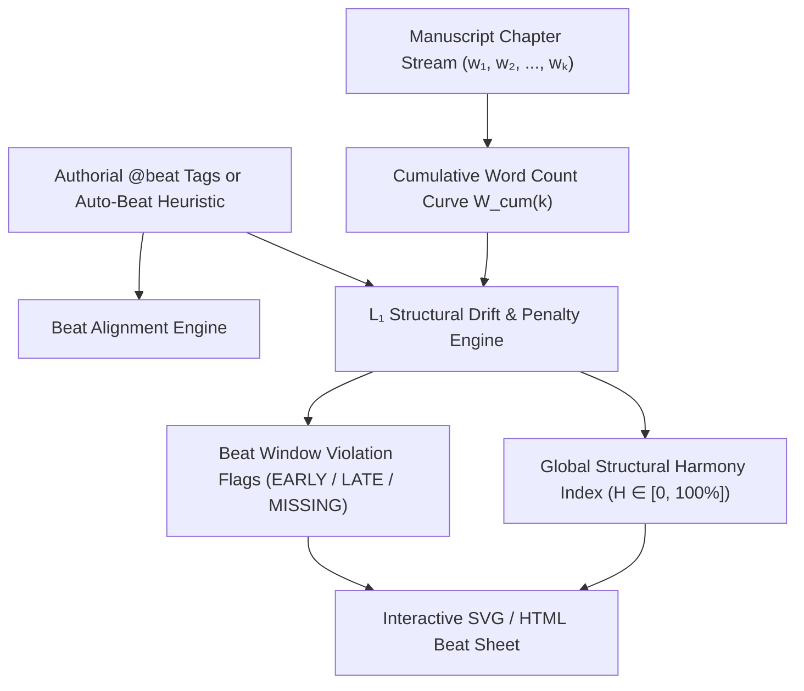
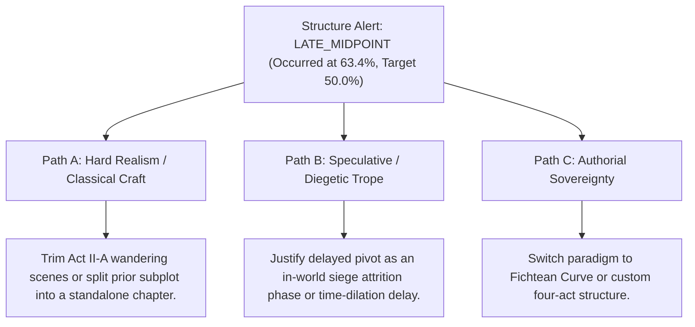

# Ars Arcanum Multi-Paradigm Story Structure & Beat Sheet Enforcer (`docs/STRUCTURE.md`)
> **Domain E: Narrative Dynamics, Pacing, Structure & Branching** | **CLI:** `arcanum structure` / `arcanum beat`

---

## 1. Overview & Theoretical Rationale

The **Ars Arcanum Structure Engine** (`scripts/lib/structure.py`) is an offline narrative structural analyzer, beat-sheet enforcer, and pacing auditor supporting 9 canonical story architectures from Western and Eastern narrative traditions.

In long-form storytelling, the placement of major dramatic turning points (the Inciting Catalyst, the Break into Act II, the Midpoint Reversal, the Dark Night of the Soul, and the Climax) governs narrative momentum and cognitive satisfaction. When structural beats occur too early, the narrative lacks necessary worldbuilding setup and character investment; when they occur too late, the pacing sags, causing reader drop-off.

The Structure Engine parses chapter word counts, tracks authorial `@beat:` annotations, maps the manuscript's cumulative progression curve against ideal beat windows, calculates $L_1$ structural drift penalties, and evaluates global **Structural Harmony** ($0 \text{ to } 100\%$).

---

## 2. Mathematical & Formal Algorithmic Formulation



### 2.1 Cumulative Manuscript Progression Curve
For a manuscript composed of $K$ chapters with word counts $W = [w_1, w_2, \dots, w_K]$ and total word count $W_{\text{total}} = \sum_{j=1}^{K} w_j$:

$$W_{\text{cum}}(k) = \frac{\sum_{j=1}^{k} w_j}{W_{\text{total}}} \in [0.0, 1.0]$$

### 2.2 $L_1$ Structural Drift & Window Penalty Function
Let a narrative paradigm $\mathcal{P}$ define a set of canonical beats $\mathcal{B} = \{b_1, b_2, \dots, b_M\}$, where each beat $b_i$ has a target location $\tau_i \in [0, 1]$ and an allowable tolerance envelope $[\tau_i^{\text{min}}, \tau_i^{\text{max}}]$.

If beat $b_i$ occurs at chapter $k_i$ with cumulative position $p_i = W_{\text{cum}}(k_i)$, the raw drift is:
$$\Delta_i = |p_i - \tau_i|$$

The window penalty $P_i$ penalizes only positions falling strictly outside the tolerance envelope:
$$P_i = \begin{cases} 
0.0 & \text{if } \tau_i^{\text{min}} \le p_i \le \tau_i^{\text{max}} \\
\frac{p_i - \tau_i^{\text{max}}}{\tau_i^{\text{max}}} & \text{if } p_i > \tau_i^{\text{max}} \quad (\text{Late Beat}) \\
\frac{\tau_i^{\text{min}} - p_i}{\tau_i^{\text{min}}} & \text{if } p_i < \tau_i^{\text{min}} \quad (\text{Early Beat})
\end{cases}$$

### 2.3 Global Structural Harmony Score ($\mathcal{H}$)
The composite harmony percentage aggregates beat alignments across all active beats, penalizing missing beats with a fixed penalty $P_{\text{missing}} = 1.0$:

$$\mathcal{H} = \max\left(0.0, \, 100.0 - \left( \frac{100.0}{|\mathcal{B}|} \sum_{i=1}^{|\mathcal{B}|} \min(1.0, \, P_i \cdot \omega_i) \right) \right)$$

Where $\omega_i$ is the dramatic criticality weight of the beat ($\omega = 1.5$ for Midpoint and Climax; $\omega = 1.0$ for minor pinch points).

### 2.4 Midpoint Phase Inversion Vector
The engine verifies that the narrative undergoes a **reactive-to-proactive phase shift** across the Midpoint ($\tau \approx 0.50$):
$$\vec{V}_{\text{agency}}(t) = \nabla \text{ProactiveActionScore}(t)$$
$$\text{Midpoint Inversion Valid} \iff \vec{V}_{\text{agency}}(t > 0.50) > \vec{V}_{\text{agency}}(t < 0.50)$$

---

## 3. Canonical Narrative Paradigms Matrix (9 Frameworks)

| Paradigm Key | Framework Name | Total Beats | Core Philosophical Axis | Typical Genre Fit |
|---|---|---|---|---|
| `three_act` | **Classic Three-Act Structure** | 9 | Setup $\to$ Confrontation $\to$ Resolution | General Fiction, Thrillers, Fantasy |
| `save_the_cat` | **Save the Cat! 15 Beat Sheet** | 15 | Blake Snyder Commercial Screenplay Beats | Commercial Novels, YA, Sci-Fi |
| `heros_journey` | **Campbell/Vogler Monomyth** | 12 | Ordinary World $\to$ Threshold $\to$ Transformation | Epic Fantasy, Mythic Sci-Fi, Space Opera |
| `story_circle` | **Dan Harmon 8-Step Story Circle** | 8 | Order $\to$ Chaos $\to$ Adaptation $\to$ Return | Character-Driven Fiction, Episodic Arcs |
| `seven_point` | **7-Point Story Structure** | 7 | Dan Wells Iceberg / State Reversal Model | Sci-Fi, Mystery, Heist Novels |
| `eight_sequence` | **Cinematic 8-Sequence Method** | 8 | 10-15 minute screenwriting reel sequences | Fast-Paced Thrillers, Action Novels |
| `fichtean_curve` | **The Fichtean Curve** | 7 | Serial Crises Escalating to Final Climax | Survival Stories, Gothic Horror, Mysteries |
| `kishotenketsu` | **Kishōtenketsu (起承転結)** | 4 | Introduction $\to$ Development $\to$ Twist $\to$ Synthesis | Conflictless Narrative, Eastern Philosophy, Slice-of-Life |
| `freytags_pyramid` | **Freytag's Dramatic Pyramid** | 7 | Gustav Freytag 5-Act Tragic Architecture | Tragedies, Historical Epics, Classical Drama |

### 3.1 Detailed Beat Allocation Tables

#### Classic Three-Act Structure (`three_act`)
```
[0% --- Opening --- 12% --- Inciting Incident --- 25% --- Plot Point 1 --- 37% --- Pinch 1 --- 50% --- Midpoint --- 62% --- Pinch 2 --- 75% --- Crisis --- 88% --- Climax --- 100%]
```
1. **Opening Status Quo** ($\tau = 5\%$, Window: $0\% - 10\%$): Ordinary world baseline and character flaws.
2. **Inciting Incident** ($\tau = 12\%$, Window: $8\% - 16\%$): The disturbance that breaks the status quo.
3. **Plot Point 1 / Break into Act II** ($\tau = 25\%$, Window: $20\% - 30\%$): Irrevocable crossing into the conflict arena.
4. **First Pinch Point** ($\tau = 37\%$, Window: $32\% - 42\%$): Direct demonstration of antagonistic power.
5. **Midpoint Reversal** ($\tau = 50\%$, Window: $45\% - 55\%$): Shift from defensive/reactive to offensive/proactive; false victory/defeat.
6. **Second Pinch Point** ($\tau = 62\%$, Window: $58\% - 68\%$): Antagonist tightens the noose; ticking clock introduced.
7. **All Hope Is Lost / Crisis** ($\tau = 75\%$, Window: $70\% - 80\%$): Total apparent defeat; death of the mentor or primary strategy.
8. **Climax** ($\tau = 88\%$, Window: $82\% - 94\%$): Final direct showdown resolving the primary dramatic premise.
9. **Resolution / Denouement** ($\tau = 96\%$, Window: $92\% - 100\%$): New status quo established.

#### Kishōtenketsu (`kishotenketsu`) — Non-Western 4-Stage Harmony
1. **起 (Ki / Introduction)** ($\tau = 15\%$, Window: $0\% - 25\%$): Establishing characters, setting, and atmosphere without artificial conflict.
2. **承 (Shō / Development)** ($\tau = 40\%$, Window: $25\% - 55\%$): Expanding the worldview, deepening relationships, exploring lore.
3. **転 (Ten / The Twist / The Turn)** ($\tau = 75\%$, Window: $65\% - 85\%$): Introducing an unexpected element or perspective that reframes earlier scenes.
4. **結 (Ketsu / Reconciliation / Synthesis)** ($\tau = 95\%$, Window: $85\% - 100\%$): Connecting the disparate elements into a unified, harmonious whole.

---

## 4. Subfeatures Matrix

| Subfeature | Algorithmic Mechanism | Diagnostic Output / Rule | Narrative Craft Significance |
|---|---|---|---|
| **Beat Window Enforcer** | Evaluates cumulative chapter word counts against paradigm target intervals. | Flags `BEAT_WINDOW_DRIFT` (Early/Late) with percentage delta. | Prevents pacing lag or rushed narrative transitions. |
| **Midpoint Inversion Auditor** | Measures character proactive decision verbs before vs. after $50\%$ mark. | Flags `STATIC_MIDPOINT` if agency does not shift from reactive to active. | Ensures the protagonist drives the second half of the story. |
| **Catalyst Timing Verifier** | Verifies that the Inciting Incident occurs within the first $15\%$ of the word count. | Flags `LATE_CATALYST` if chapter $> 15\%$. | Protects against sluggish openings that alienate prospective readers. |
| **Multi-Paradigm Cross-Comparer** | Evaluates a single manuscript against all 9 paradigms simultaneously. | Emits comparative Harmony Score radar matrix across paradigms. | Allows authors to discover which narrative framework best fits their intuitive drafting style. |
| **Act Boundary Word Balance** | Measures proportional word distribution across Act I ($25\%$), Act II ($50\%$), Act III ($25\%$). | Emits act ratio diagnostics (e.g. `Act I: 35% (Bloated), Act II: 40% (Starved)`). | Prevents sagging second acts and truncated finales. |

---

## 5. Author Extension & Configuration Guide

### 5.1 Tagging Beats in Scene Frontmatter (Markdown)
Authors tag chapters with canonical beat identifiers:

```markdown
---
title: "The Fall of the Sunken Spire"
pov: "Elena"
beat: "Midpoint"
paradigm: "three_act"
---

Elena stood atop the broken battlements. For forty days she had fled; tonight, she would hunt.
```

### 5.2 Inline Directive Syntax
```markdown
# Chapter 18: The Shattered Mirror
@beat: All-Hope-Is-Lost
@paradigm: save_the_cat
@tension: 9.2

Everything was gone. The archives were ash. Master Corvo was dead.
```

### 5.3 Custom Paradigm Definition in `arcanum.yaml`
Authors can define custom story paradigms or modify existing beat windows:

```yaml
structure:
  default_paradigm: "three_act"
  custom_paradigms:
    grimdark_four_act:
      title: "Grimdark Four-Act Architecture"
      beats:
        - name: "Status Quo & Bleak Reality"
          target_pct: 0.08
          window: [0.00, 0.15]
        - name: "First Catastrophe"
          target_pct: 0.25
          window: [0.20, 0.30]
        - name: "Pyrrhic Victory (Midpoint)"
          target_pct: 0.50
          window: [0.45, 0.55]
        - name: "Betrayal & Collapse"
          target_pct: 0.75
          window: [0.70, 0.80]
        - name: "Grim Resolution"
          target_pct: 0.95
          window: [0.90, 1.00]
```

---

## 6. Command-Line Interface (CLI) Reference

```bash
# Evaluate manuscript structure against default Three-Act model
arcanum structure Manuscript/

# Evaluate against Save the Cat! 15 beat sheet
arcanum structure Manuscript/ --paradigm save_the_cat

# Evaluate against Hero's Journey and output detailed beat breakdown
arcanum structure Manuscript/ --paradigm heros_journey --verbose

# Export standalone offline interactive HTML/SVG beat report
arcanum structure Manuscript/ --paradigm kishotenketsu --html reports/structure_kishotenketsu.html

# Output raw JSON structural analytics for automated pipelines
arcanum structure Manuscript/ --json

# Query mathematical derivation of L1 drift formulas
arcanum doc structure --math --why
```

---

## 7. Tri-Fold Creative Advisory Resolutions



### Scenario: Late Midpoint Alert ($\tau_{\text{actual}} = 63.4\%$)
- **Path A (Classical Craft / Structural Precision)**:
  - Prune intermediate travelogue or secondary character dialogue in Act II-A.
  - Accelerate the antagonist's second strike to force the protagonist's proactive decision earlier in the manuscript.
- **Path B (Speculative / Diegetic Trope)**:
  - Reframe the extended first half as an intentional "grinding siege" or "bureaucratic labyrinth" where delay is the core antagonist weapon.
- **Path C (Authorial Sovereignty)**:
  - Adopt a different paradigm that embraces late inflection points, such as **The Fichtean Curve** or **Freytag's Dramatic Pyramid** (where the Climax sits at $52\%-60\%$).

---

## 8. Content Security Policy & Air-Gap Guarantee

All generated structural audit reports and interactive SVG beat maps are 100% offline and compliant with the Ars Arcanum security contract:

```html
<meta http-equiv="Content-Security-Policy" content="default-src 'none'; style-src 'unsafe-inline'; script-src 'unsafe-inline'; img-src data:; media-src data: blob:;">
```
