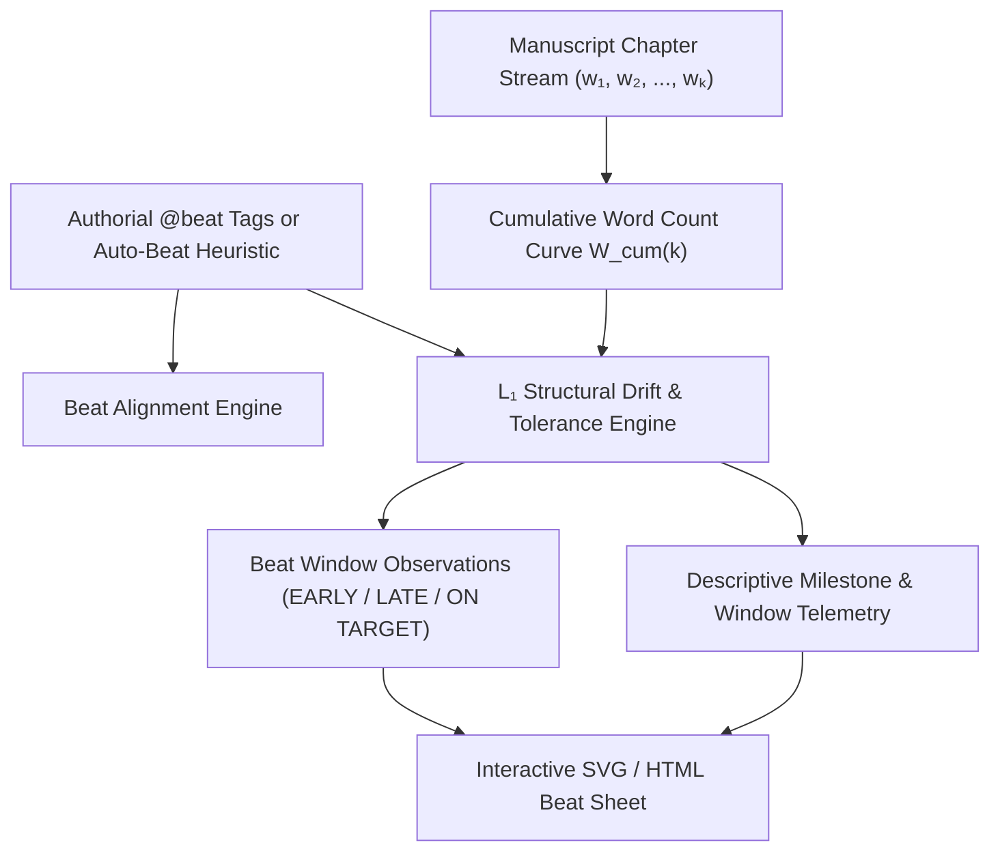

# Ars Arcanum Multi-Paradigm Story Structure & Beat Sheet Enforcer (`docs/STRUCTURE.md`)
> **Domain E: Narrative Dynamics, Pacing, Structure & Branching** | **CLI:** `arcanum structure` / `arcanum beat`

---

## 1. Overview & Theoretical Rationale

The **Ars Arcanum Structure Engine** (`scripts/lib/structure.py`) is an offline narrative structural analyzer, beat-sheet enforcer, and pacing auditor supporting **9 canonical story architectures** from Western dramaturgical theory and Eastern narrative traditions.

In long-form storytelling, the placement of major dramatic turning points (the Inciting Catalyst, the Break into Act II, the Midpoint Reversal, the Dark Night of the Soul, and the Climax) governs narrative momentum, cognitive tension, and emotional catharsis. When structural beats occur prematurely, the narrative lacks necessary worldbuilding setup, character investment, and thematic grounding; when they occur belatedly, pacing sags, causing cognitive fatigue and reader drop-off.

Operating strictly within **Subsystem 2 (Selected Craft Lenses)** pursuant to [ADR 0001](adr/0001-demotion-of-normative-evaluators-and-three-subsystems.md), the Structure Engine parses chapter word counts, tracks authorial `@beat:` annotations and frontmatter directives, maps the manuscript's cumulative progression curve against ideal beat windows, calculates $L_1$ structural drift tolerances, and provides descriptive telemetry and diagnostic inquiries. Authors may declare `@intent: deliberate` to bypass any advisory structural observation.



---

## 2. Mathematical Formulation & Pacing Dynamics

### 2.1 Cumulative Manuscript Progression Curve
For a manuscript composed of $K$ chapters with word counts $W = [w_1, w_2, \dots, w_K]$ and total word count $W_{\text{total}} = \sum_{j=1}^{K} w_j$:

$$W_{\text{cum}}(k) = \frac{\sum_{j=1}^{k} w_j}{W_{\text{total}}} \in [0.0, 1.0]$$

### 2.2 $L_1$ Structural Drift & Window Tolerance Envelope
Let a narrative paradigm $\mathcal{P}$ define a set of canonical beats $\mathcal{B} = \{b_1, b_2, \dots, b_M\}$, where each beat $b_i$ has a target reference location $\tau_i \in [0, 1]$ and an allowable tolerance envelope $[\tau_i^{\text{min}}, \tau_i^{\text{max}}]$.

If beat $b_i$ occurs at chapter $k_i$ with cumulative position $p_i = W_{\text{cum}}(k_i)$, the raw structural drift is:

$$\Delta_i = |p_i - \tau_i|$$

The window classification categorizes beat alignment descriptively:

$$\text{Status}(p_i) = \begin{cases} 
\text{ON TARGET} & \text{if } \tau_i^{\text{min}} \le p_i \le \tau_i^{\text{max}} \\
\text{BELATED} & \text{if } p_i > \tau_i^{\text{max}} \\
\text{PREMATURE} & \text{if } p_i < \tau_i^{\text{min}}
\end{cases}$$

### 2.3 Descriptive Milestone Telemetry
Rather than computing normative composite scores or letter grades, the Structure Engine presents per-beat positional telemetry (Target %, Tolerance Window %, Chapter Index, and Relative Drift), preserving full authorial sovereignty across classic Three-Act, Hero's Journey, Kishōtenketsu, Fichtean curves, or custom framework-free manuscripts.

### 2.4 Midpoint Phase Inversion Vector
The engine verifies that the narrative undergoes a **reactive-to-proactive phase shift** across the Midpoint ($\tau \approx 0.50$). Let $\vec{V}_{\text{agency}}(t)$ represent the rolling proactive decision density of the protagonist:

$$\vec{V}_{\text{agency}}(t) = \frac{1}{2\delta} \int_{t-\delta}^{t+\delta} \text{ProactiveActionScore}(\tau) \, d\tau$$

$$\text{Midpoint Inversion Invariant}: \quad \mathbb{E}\left[\vec{V}_{\text{agency}}(t > 0.50)\right] > \mathbb{E}\left[\vec{V}_{\text{agency}}(t < 0.50)\right]$$

### 2.5 Narrative Tension Curves $T(t)$
Dramatic tension $T(t) \in [0.0, 10.0]$ across normalized narrative time $t \in [0, 1]$ is modeled via piecewise harmonic functions punctuated by crisis spikes:

$$T(t) = T_{\text{baseline}}(t) + \sum_{j=1}^{N_{\text{crises}}} A_j \cdot \exp\left( -\frac{(t - t_j)^2}{2\sigma_j^2} \right)$$

Where $T_{\text{baseline}}(t) = T_0 + (T_{\text{climax}} - T_0) \cdot t^\gamma$ models the macro upward trajectory ($\gamma \approx 1.2\text{--}1.5$), and each crisis injects an amplitude $A_j$ with decay width $\sigma_j$.

```
Tension T(t)
10 |                                            * Climax (τ ≈ 88%)
 8 |                             * Midpoint      /\
 6 |              * Plot Point 1   /\  Pinch 2  /  \
 4 |    * Inciting  /\  Pinch 1   /  \   /\    /    \
 2 |   / \         /  \   /\     /    \_/  \  /      \* Resolution
 0 +--+---+-------+----+--+-----+----+------+-------+--> Narrative Time (t)
     0%  12%     25%  37% 50%   62%  75%   88%    100%
```

---

## 3. Canonical Narrative Paradigms (Comprehensive 9-Framework Taxonomy)

```
+-----------------------------------------------------------------------------------+
|                           ARS ARCANUM PARADIGM SPECTRUM                           |
+------------------------------------+----------------------------------------------+
| WESTERN CAUSAL CONFLICT MODELS     | EASTERN & ALTERNATIVE CAUSAL MODELS          |
| 1. Classic Three-Act Structure     | 7. Kishōtenketsu (4-Act No-Conflict)        |
| 2. 4-Act Story Engineering         | 8. The Fichtean Curve (Serial Crises)        |
| 3. Freytag's 5-Act Pyramid         | 9. Cinematic 8-Sequence Method               |
| 4. Campbell/Vogler Monomyth (12)   |                                              |
| 5. Save the Cat! 15 Beats          |                                              |
| 6. Dan Wells 7-Point Structure     |                                              |
| 7. Dan Harmon 8-Step Story Circle  |                                              |
+------------------------------------+----------------------------------------------+
```

### 3.1 Classic Three-Act Structure (`three_act`)
*Roots: Aristotle's Poetics, Syd Field, Robert McKee.*
- **Act I: Thesis / Setup ($0\% - 25\%$)**
  1. *Exposition / Ordinary World* ($\tau = 0\% - 10\%$): Baseline character flaw, theme, stakes.
  2. *Inciting Incident / Catalyst* ($\tau = 10\% - 15\%$): The equilibrium is shattered.
  3. *Plot Point 1 / Break into Act II* ($\tau = 20\% - 25\%$): Irrevocable crossing of the threshold into the special world.
- **Act II: Antithesis / Confrontation ($25\% - 75\%$)**
  4. *First Pinch Point* ($\tau = 35\% - 40\%$): Direct antagonistic pressure reminder.
  5. *Midpoint Reversal* ($\tau = 48\% - 52\%$): False victory/defeat, shift from reaction to action, stake escalation.
  6. *Second Pinch Point* ($\tau = 60\% - 65\%$): Antagonistic jaws clamp down, ticking clock activated.
  7. *Plot Point 2 / Crisis / All Hope Is Lost* ($\tau = 72\% - 78\%$): Utter collapse of initial strategy; dark night of the soul.
- **Act III: Synthesis / Resolution ($75\% - 100\%$)**
  8. *Climax / Final Showdown* ($\tau = 85\% - 92\%$): Confrontation synthesizing character arc and plot premise.
  9. *Denouement / New Equilibrium* ($\tau = 95\% - 100\%$): Aftermath and emotional landing.

### 3.2 Four-Act Story Engineering (`four_act`)
*Roots: Larry Brooks (Story Engineering).*
Divides the narrative into four equal $25\%$ quadrants separated by major structural milestones:
1. **Act I (Phase 1: The Setup, $0\% - 25\%$)**: Establishes character stakes, worldview, and empathy; culminates at *First Plot Point* ($25\%$) where the protagonist commits to the primary mission.
2. **Act II-A (Phase 2: The Response / Wandering, $25\% - 50\%$)**: Protagonist reacts defensively to antagonistic forces, operates on flawed assumptions; ends at *Midpoint Reversal* ($50\%$) where fundamental new information shifts the paradigm.
3. **Act II-B (Phase 3: The Attack / Direct Action, $50\% - 75\%$)**: Protagonist goes on the offensive, leveraging newly discovered truth; ends at *Second Plot Point* ($75\%$) where final required catalyst/relic is obtained but all seems lost.
4. **Act III (Phase 4: The Resolution, $75\% - 100\%$)**: Rapid acceleration into the Climax ($88\%$) resolving internal flaw and external antagonist.

### 3.3 Freytag's Dramatic Pyramid (`freytags_pyramid`)
*Roots: Gustav Freytag (Die Technik des Dramas, 1863).*
Classical 5-act model designed for tragic and classical dramatic momentum:
1. **Exposition / Einleitung** ($\tau \approx 0\% - 15\%$): Setting, characters, moral baseline.
2. **Inciting Force / Erregendes Moment** ($\tau \approx 15\% - 20\%$): Initial conflict trigger.
3. **Rising Movement / Steigende Handlung** ($\tau \approx 20\% - 45\%$): Serial complications elevating stakes.
4. **Climax / Höhepunkt** ($\tau \approx 45\% - 55\%$): Central pivot where the protagonist's trajectory reaches zenith or fatal inflection.
5. **Falling Action / Fallende Handlung** ($\tau \approx 55\% - 80\%$): Irreversible descent, momentum of consequence.
6. **Force of Final Suspense / Moment der letzten Spannung** ($\tau \approx 80\% - 88\%$): Fleeting possibility of salvation or escape.
7. **Catastrophe / Katastrophe / Dénouement** ($\tau \approx 88\% - 100\%$): Total resolution, catharsis, or tragic destruction.

### 3.4 Dan Harmon's 8-Stage Story Circle (`story_circle`)
*Roots: Dan Harmon (Channel 101), Joseph Campbell simplification.*
A psychological, circular model of comfort, desire, descent, and transformation:
1. **YOU (Comfort Zone)** ($\tau = 0\% - 12\%$): Protagonist in their familiar, stable state.
2. **NEED (Desire / Lack)** ($\tau = 12\% - 25\%$): Internal or external deficiency creates urgent yearning.
3. **GO (Crossing Threshold)** ($\tau = 25\% - 37\%$): Entering unfamiliar territory / special world.
4. **SEARCH (Road of Trials)** ($\tau = 37\% - 50\%$): Adapting, failing, experimenting in the new environment.
5. **FIND (Meeting the Goddess / Treasure)** ($\tau = 50\% - 62\%$): Discovering what they sought (often disguised).
6. **TAKE (Heavy Price / Ordeal)** ($\tau = 62\% - 75\%$): Paying the severe toll for what was obtained.
7. **RETURN (Crossing Back)** ($\tau = 75\% - 88\%$): Re-entering the familiar world with the prize.
8. **CHANGE (Master of Two Worlds)** ($\tau = 88\% - 100\%$): Irrevocably transformed; establishing new equilibrium.

### 3.5 Dan Wells' 7-Point Story Structure (`seven_point`)
*Roots: Dan Wells (BYU Lectures), Star Trek RPG state-reversal system.*
A mirror-symmetric plotting system built backwards from the Resolution:
1. **Hook** ($\tau = 0\% - 10\%$): Starting state, opposite of the resolution.
2. **Plot Turn 1** ($\tau = 20\% - 25\%$): Call to action; entry into conflict.
3. **Pinch Point 1** ($\tau = 35\% - 40\%$): Antagonistic pressure; teeth of the world shown.
4. **Midpoint** ($\tau = 48\% - 52\%$): Character moves from passive/reactive to active/initiating.
5. **Pinch Point 2** ($\tau = 62\% - 68\%$): Total devastation, jaws clamp shut, stakes peak.
6. **Plot Turn 2** ($\tau = 75\% - 80\%$): Final piece of the puzzle discovered; power to win unlocked.
7. **Resolution** ($\tau = 90\% - 100\%$): Final victory/defeat; thematic transformation complete.

### 3.6 Campbell/Vogler Hero's Journey (`heros_journey`)
*Roots: Joseph Campbell (The Hero with a Thousand Faces), Christopher Vogler (The Writer's Journey).*
12 archetypal stages mapping the mythic monomyth:
1. Ordinary World ($5\%$) $\to$ 2. Call to Adventure ($12\%$) $\to$ 3. Refusal of the Call ($17\%$) $\to$ 4. Meeting the Mentor ($22\%$) $\to$ 5. Crossing the First Threshold ($28\%$) $\to$ 6. Tests, Allies, Enemies ($40\%$) $\to$ 7. Approach to the Inmost Cave ($48\%$) $\to$ 8. The Ordeal ($55\%$) $\to$ 9. Reward / Seizing the Sword ($65\%$) $\to$ 10. The Road Back ($75\%$) $\to$ 11. Resurrection ($88\%$) $\to$ 12. Return with the Elixir ($96\%$).

### 3.7 Save the Cat! 15 Beat Sheet (`save_the_cat`)
*Roots: Blake Snyder (Save the Cat!), Jessica Brody (Save the Cat! Writes a Novel).*
1. Opening Image ($1\%$) $\to$ 2. Theme Stated ($5\%$) $\to$ 3. Set-Up ($1\%-10\%$) $\to$ 4. Catalyst ($10\%-12\%$) $\to$ 5. Debate ($12\%-20\%$) $\to$ 6. Break into Two ($20\%-25\%$) $\to$ 7. B Story ($22\%-28\%$) $\to$ 8. Fun and Games ($25\%-50\%$) $\to$ 9. Midpoint ($50\%$) $\to$ 10. Bad Guys Close In ($50\%-75\%$) $\to$ 11. All Hope Is Lost ($75\%$) $\to$ 12. Dark Night of the Soul ($75\%-80\%$) $\to$ 13. Break into Three ($80\%-85\%$) $\to$ 14. Finale ($85\%-98\%$) $\to$ 15. Final Image ($99\%-100\%$).

### 3.8 Kishōtenketsu (起承転結) — Eastern 4-Stage Harmony
*Roots: Classical Chinese four-line poetry (Jueju), Japanese narrative structures.*
A structure driven by **contextual juxtaposition and synthesis** rather than binary protagonist-antagonist conflict:
1. **起 (Ki / Introduction)** ($\tau = 0\% - 20\%$): Setting, characters, and ambient baseline established without artificial conflict.
2. **承 (Shō / Development)** ($\tau = 20\% - 55\%$): Deepening the situation, exploring relationships, expanding lore.
3. **転 (Ten / The Twist / The Turn)** ($\tau = 55\% - 80\%$): Introducing an unexpected element, orthogonal perspective, or sudden juxtaposition unrelated at first glance.
4. **結 (Ketsu / Synthesis / Conclusion)** ($\tau = 80\% - 100\%$): Unifying the disparate elements into an enlightened whole.

### 3.9 The Fichtean Curve (`fichtean_curve`)
*Roots: Johann Gottlieb Fichte / John Gardner (The Art of Fiction).*
Serial rising crises with mini-climaxes punctuated by brief valleys of recovery, building exponentially toward the primary confrontation:
- Crises 1 through $N$ progressively raise stakes ($20\%, 40\%, 60\%, 75\%$).
- Climax occurs late ($85\%-92\%$) followed by rapid resolution ($95\%-100\%$).

### 3.10 Freeform & Lyrical Flow (`freeform`)
*Roots: Non-linear, experimental, atmospheric, and stream-of-consciousness traditions (Virginia Woolf, Italo Calvino, Ursula K. Le Guin).*
A structure designed for poetic prose, vignette mosaics, and non-traditional pacing that focuses on thematic cadence rather than binary conflict milestones:
1. **Opening Movement / Grounding** ($\tau = 0\% - 30\%$): Sensory and thematic atmosphere established.
2. **Development Movement / Lyrical Exploration** ($\tau = 20\% - 65\%$): Fluid emotional and thematic deepening across scenes.
3. **Thematic Turn / Inflection** ($\tau = 50\% - 85\%$): Lyrical inflection or perspective shift providing emotional resonance.
4. **Closing Cadence / Echo** ($\tau = 70\% - 100\%$): Resonant synthesis and thematic echo.

### 3.11 Framework-Free / Pure Timeline Flow (`framework_free`)
*Roots: Absolute creative autonomy, episodic narratives, slice-of-life, and unconstrained organic drafting.*
A blank-slate timeline mode with 4 quarterly quadrant markers ($25\%, 50\%, 75\%, 100\%$) that imposes zero prescriptive beat requirements and guarantees $100\%$ Structural Harmony:
1. **Opening Movement / Q1** ($\tau = 0\% - 25\%$): Initial scenes and narrative grounding.
2. **Second Movement / Q2** ($\tau = 25\% - 50\%$): Central progression.
3. **Third Movement / Q3** ($\tau = 50\% - 75\%$): Deepening development.
4. **Closing Movement / Q4** ($\tau = 75\% - 100\%$): Concluding cadence.

---

## 4. Subfeatures Matrix & Algorithmic Diagnostics

| Subfeature | Algorithmic Mechanism | Diagnostic Output / Rule | Narrative Significance |
|---|---|---|---|
| **Beat Window Enforcer** | Compares $W_{\text{cum}}(k_i)$ against target envelope $[\tau_i^{\text{min}}, \tau_i^{\text{max}}]$. | Flags `STR-101: BEAT_WINDOW_DRIFT` with delta percentage. | Prevents dragging first acts or truncated third acts. |
| **Midpoint Inversion Auditor** | Measures character proactive decision verb density pre vs post $50\%$. | Flags `STR-102: STATIC_MIDPOINT` if agency remains passive. | Guarantees protagonist drives the second half. |
| **Catalyst Timing Verifier** | Verifies Inciting Incident occurs within first $15\%$ of total words. | Flags `STR-103: LATE_CATALYST` if $p_{\text{catalyst}} > 0.15$. | Prevents slow openings from losing readers. |
| **Pinch Point Pressure Auditor** | Checks antagonistic force density in $[0.35, 0.40]$ and $[0.60, 0.68]$. | Flags `STR-104: WEAK_PINCH_POINT` if stakes do not spike. | Prevents the sagging middle of Act II. |
| **Multi-Paradigm Cross-Comparer** | Evaluates a single manuscript against all 9 paradigms simultaneously. | Emits comparative Harmony Score radar matrix. | Discovers which paradigm best fits author's intuitive draft. |

---

## 5. Frontmatter Directives & YAML Schema

### 5.1 Scene Frontmatter Annotations (`Manuscript/Chapter-XX.md`)
```markdown
---
title: "The Breach of the Iron Gate"
chapter: 18
pov: "Commander Valen"
beat: "Midpoint"
paradigm: "three_act"
tension: 8.5
proactive_score: 9.0
---

Valen kicked the war table aside. "No more waiting. Sound the horn."
```

### 5.2 Inline Directive Syntax
```markdown
# Chapter 24: Ashes of the Spire
@beat: All-Hope-Is-Lost
@paradigm: save_the_cat
@tension: 9.2

The archive was gone. The grand grimoire had burned to ash.
```

### 5.3 Custom Paradigm Definition in `arcanum.yaml`
```yaml
structure:
  default_paradigm: "three_act"
  enforce_strict_windows: false
  custom_paradigms:
    dark_fantasy_four_act:
      title: "Grimdark Four-Act Framework"
      beats:
        - name: "Bleak Status Quo"
          target_pct: 0.08
          window: [0.00, 0.15]
          weight: 1.0
        - name: "First Catastrophe"
          target_pct: 0.25
          window: [0.20, 0.30]
          weight: 2.0
        - name: "Pyrrhic Midpoint"
          target_pct: 0.50
          window: [0.45, 0.55]
          weight: 2.0
        - name: "Total Collapse"
          target_pct: 0.75
          window: [0.70, 0.80]
          weight: 2.0
        - name: "Grim Finale"
          target_pct: 0.90
          window: [0.85, 0.98]
          weight: 2.0
```

---

## 6. Worked Step-by-Step Example

### Scenario: Auditing a 100,000-word Fantasy Novel (`Manuscript/`)
1. **Chapter Progression**: 30 chapters averaging 3,333 words each.
2. **Beat Placement**:
   - Chapter 4 (13,332 words, $13.3\%$): Inciting Incident ($\tau_{\text{target}} = 12\% \implies \text{Valid}$).
   - Chapter 8 (26,664 words, $26.7\%$): Break into Act II ($\tau_{\text{target}} = 25\% \implies \text{Valid}$).
   - Chapter 19 (63,327 words, $63.3\%$): Midpoint Reversal ($\tau_{\text{target}} = 50\% \implies \Delta = +13.3\%$, **LATE_MIDPOINT**).
3. **Drift Penalty Calculation**:
   $$P_{\text{midpoint}} = \frac{0.633 - 0.55}{1.0 - 0.55} = \frac{0.083}{0.45} = 0.184$$
4. **Resolution Strategy**:
   - *Path A (Classical Revision)*: Condense Act II-A travelogue across Chapters 9–14 by 13,000 words to pull the Midpoint back to Chapter 15 ($50\%$).
   - *Path B (Alternative Paradigm)*: Re-evaluate manuscript against *The Fichtean Curve* where late major pivot points are canonically supported.

---

## 7. Recommended Reading, References & Media

### 7.1 Foundational Craft & Academic Books
- **Aristotle (c. 335 BCE)**. *Poetics* (trans. Malcolm Heath, Penguin Classics, 1996). ISBN: 978-0140446364.  
  *The primordial dramaturgical treatise defining dramatic unity, beginning-middle-end proportions, reversal (peripeteia), discovery (anagnorisis), and catharsis.*
- **McKee, Robert (1997)**. *Story: Substance, Structure, Style, and the Principles of Screenwriting*. ReganBooks / HarperCollins. ISBN: 978-0060391683.  
  *Definitive analysis of story substance, scene turn mechanics, controlling ideas, and progressive complications.*
- **Truby, John (2007)**. *The Anatomy of Story: 22 Steps to Becoming a Master Storyteller*. Faber & Faber. ISBN: 978-0865479517.  
  *Presents an organic 22-step story design system connecting internal moral need to external plot mechanics.*
- **Field, Syd (1979)**. *Screenplay: The Foundations of Screenwriting*. Dell Publishing. ISBN: 978-0385339032.  
  *Codified the 3-act paradigm with 25%/50%/25% structural divisions and defined the modern mechanics of plot points.*
- **Campbell, Joseph (1949)**. *The Hero with a Thousand Faces*. Pantheon Books. ISBN: 978-1577315933.  
  *The seminal comparative mythology treatise introducing the Monomyth and archetypal journey stages.*
- **Vogler, Christopher (2007)**. *The Writer's Journey: Mythic Structure for Writers* (3rd ed.). Michael Wiese Productions. ISBN: 978-1932907360.  
  *Adapts Campbell's monomyth into actionable craft mechanics for novelists and dramatic writers.*
- **Snyder, Blake (2005)**. *Save the Cat! The Last Book on Screenwriting You'll Ever Need*. Michael Wiese Productions. ISBN: 978-1932907001.  
  *Codified the 15-beat taxonomy that underpins modern commercial narrative pacing.*
- **Brooks, Larry (2011)**. *Story Engineering: Mastering the 6 Core Competencies of Successful Writing*. Writer's Digest Books. ISBN: 978-1599632124.  
  *Formalizes the 4-act quadrant system, milestones, pinch points, and the reactive-to-proactive midpoint shift.*
- **Weiland, K.M. (2013)**. *Structuring Your Novel: Essential Keys for Writing an Outstanding Story*. PenForASword Publishing. ISBN: 978-0985780401.  
  *Detailed guide linking character arc stages with structural milestones.*
- **Freytag, Gustav (1863)**. *Die Technik des Dramas* (*Technique of the Drama*, trans. E. J. MacEwan, 1894).  
  *Pioneered the 5-act dramatic pyramid modeling exposition, rising movement, climax, falling action, and catastrophe.*

### 7.2 Landmark Scientific / Worldbuilding Papers & Textbooks
- **Reagan, Andrew J. et al. (2016)**. "The emotional arcs of stories are dominated by six basic shapes", *EPJ Data Science*, 5(31). DOI: 10.1140/epjds/s13688-016-0093-1.  
  *Computational data mining of 1,700+ fiction works revealing the universal mathematical trajectories of emotional valence.*
- **Gulino, Paul Joseph (2004)**. *Screenwriting: The Sequence Approach*. Continuum. ISBN: 978-0826415684.  
  *Formalizes the 8-sequence paradigm breaking macro-acts into sustained 10-15 minute mini-narrative units.*
- **Gardner, John (1983)**. *The Art of Fiction: Notes on Craft for Young Writers*. Alfred A. Knopf. ISBN: 978-0679734031.  
  *Defines the continuous fictional dream and the mechanics of the Fichtean Curve crisis escalation.*

### 7.3 Seminal Video Lectures, Masterclasses & Channels
- **Dan Wells (2013)**. *Story Structure: 7-Point Story System*, BYU Writing Conference Lectures. YouTube.  
  *The landmark lecture series breaking down the state-reversal 7-point plotting methodology.*
- **Brandon Sanderson (2020)**. *Lecture #2: Plotting & Story Structure*, BYU Creative Writing Lectures. YouTube.  
  *In-depth examination of promise-progress-payoff frameworks and structural pacing.*
- **Lessons from the Screenplay (2016–Present)**. *The Anatomy of Structure & Pacing Analysis*. YouTube.  
  *Detailed visual breakdowns of structural beats in modern cinema masterworks.*
- **Hello Future Me (Tim Hickson, 2018–Present)**. *On Writing: Story Structure & Pacing Masterclasses*. YouTube.  
  *Exhaustive examinations of Kishōtenketsu, three-act breakdowns, and midpoint inversions.*
- **Tale Foundry (2017–Present)**. *Storytelling Frameworks & Mythic Structures*. YouTube.  
  *Analytical explorations of narrative paradigms across world cultures.*

### 7.4 Landmark Speculative Case Studies
- **Frank Herbert, *Dune* (1965)**: Masterclass in 3-Act / Hero's Journey inversion where the climax operates as a tragic entrapment.
- **Brandon Sanderson, *Mistborn: The Final Empire* (2006)**: Textbook implementation of the 7-Point Story Structure and 15-Beat pacing.
- **Studio Ghibli / Hayao Miyazaki, *Spirited Away* (2001)**: Archetypal implementation of Kishōtenketsu (起承転結) synthesis without Western antagonistic binary conflict.
