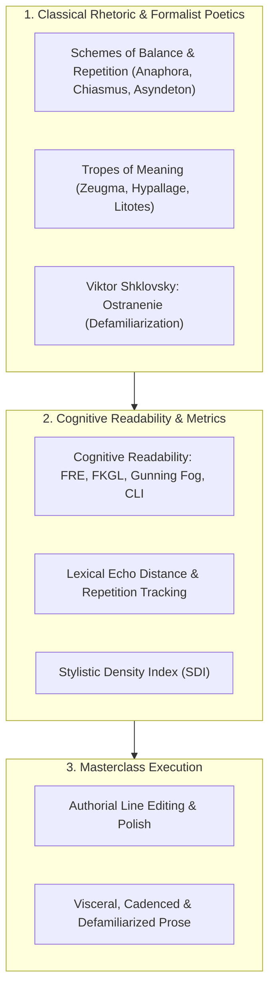
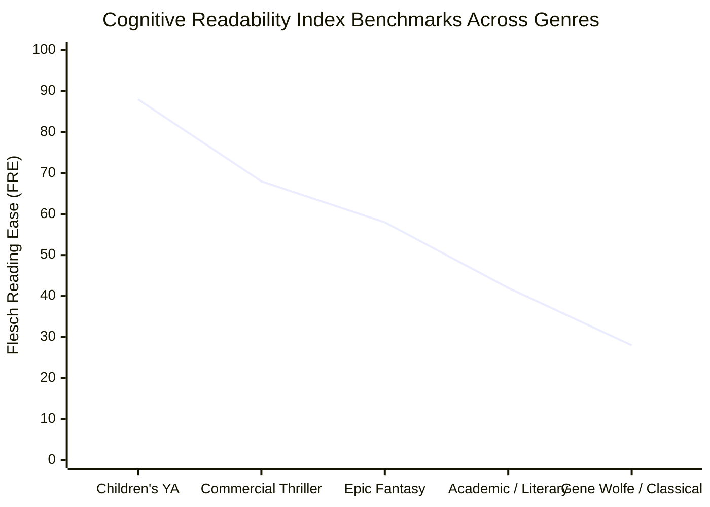

# Author Craft Masterclass: Prose Stylistics, Rhetorical Schemes & Line Editing (`docs/STYLISTICS.md`)
> **Craft Discipline: Stylistics, Rhetorical Schemes, Line Editing & Cognitive Readability**

---

## 1. Overview & Theoretical Rationale

Masterclass prose is neither transparently invisible nor needlessly baroque; it is **sculpted for maximum cognitive and sensory resonance**. In unrefined first drafts, subconscious linguistic crutches inevitably dilute narrative authority:
1. **Passive Voice Bloat & Weak Verbs**: Reliance on forms of *"to be"* and passive verb constructions that strip characters of physical agency.
2. **Cognitive Filter Verbs**: Buffering sensory experience behind filter markers (*"she saw"*, *"he felt"*, *"she noticed"*), creating emotional distance between the reader and the story world.
3. **Lexical Echoes**: Unintentional repetition of distinctive nouns, adjectives, or rare verbs within a tight 100–300 word reading window.
4. **Automated Clichés**: Trope-laden descriptions that fail to defamiliarize the narrative world.
5. **Rhetorical Flatness**: Prose that ignores the classical schemes and tropes that give English prose its cadence, symmetry, and memorable power.



---

## 2. Theoretical Foundations of Stylistics & Classical Rhetoric

### 2.1 Viktor Shklovsky's Defamiliarization (*Ostranenie*)
In his landmark 1917 essay *"Art as Technique"*, Russian Formalist theorist Viktor Shklovsky wrote:

> *"Habitization devours objects, clothes, furniture, one's wife, and the fear of war... Art exists that one may recover the sensation of life; it exists to make one feel things, to make the stone stony. The technique of art is to make objects 'unfamiliar,' to make forms difficult, to increase the difficulty and length of perception because the process of perception is an aesthetic end in itself and must be prolonged."*

Masterclass speculative fiction avoids generic shorthand ("the sword was sharp," "the dragon was terrifying"). It uses **defamiliarizing sensory language** to force the reader's imagination to actively reconstruct the physical world (e.g., describing a gun not as a firearm, but as "a cold steel tube that spits lead-wrapped thunder").

### 2.2 Classical Schemes of Balance, Repetition & Cadence

| Scheme | Definition | Canonical Example in Speculative Fiction |
|---|---|---|
| **Anaphora** | Repetition of a word or phrase at the beginning of successive clauses. | *"Before the stars, there was stone. Before the stone, there was fire. Before the fire, there was only the void."* |
| **Epistrophe** | Repetition of a word or phrase at the end of successive clauses. | *"The empire fell by iron, they were judged by iron, and in the dark, they will be remembered by iron."* |
| **Chiasmus** | Inverted grammatical parallelism ($A-B \implies B-A$). | *"He could not master the arcane flame, and the flame soon mastered him."* |
| **Asyndeton** | Deliberate omission of conjunctions between coordinate clauses. | *"She ran, stumbled, bled, rose, struck."* (Accelerates pacing to maximum velocity). |
| **Polysyndeton** | Deliberate insertion of multiple conjunctions. | *"And the sand burned, and the sun glared, and the wind screamed, and their water skins ran dry."* (Creates overwhelming weight). |
| **Tricolon & Isocolon** | A series of three parallel clauses of equal length. | *"We forged the fleet, we crossed the rift, we conquered the sun."* |
| **Symploce** | Simultaneous combination of Anaphora and Epistrophe. | *"Against the dark, we hold the gate; against the void, we hold the gate."* |

### 2.3 Classical Tropes of Meaning & Transference

| Trope | Definition | Canonical Example in Speculative Fiction |
|---|---|---|
| **Zeugma / Syllepsis** | A single verb governing two or more words in radically different senses (literal and metaphorical). | *"She extinguished the lantern and all remaining hope of peace."* |
| **Hypallage** | Transferred epithet: applying an adjective to a noun other than the one it logically modifies. | *"He drew a nervous breath through a guilty cigarette."* (The cigarette is not guilty; the smoker is). |
| **Litotes** | Deliberate understatement by asserting the negative of its contrary. | *"Surviving the plasma barrage was no small achievement."* |
| **Oxymoron** | Juxtaposition of contradictory terms. | *"A deafening silence enveloped the ruined citadel."* |
| **Synesthesia** | Cross-modal sensory attribution (describing sound with color or taste with geometry). | *"The high-frequency shield emitter screamed a bitter crimson note."* |

### 2.4 Showing vs. Telling & Filter-Verb Elimination
Showing is not the mere accumulation of raw data; it is the **dramatization of cause and effect**. 

Eliminating cognitive filter verbs (*heard, saw, felt, noticed, wondered, watched*) collapses the distance between the reader and the physical reality:
- **Filtered (Weak / Distant)**: *Valeria heard the distant artillery and felt fear grip her throat.*
- **Direct (Masterclass / Visceral)**: *The floor plates shuddered under heavy artillery fire. Cold bile rose in Valeria's throat.*

---

## 3. Cognitive Readability & Stylometric Formulations



### 3.1 Standard Psychometric Readability Formulas
Let $W$ be total words, $S$ be total sentences, $Y$ be total syllables, $C$ be total characters, and $W_{\text{complex}}$ be words with $\ge 3$ syllables:

#### 1. Flesch Reading Ease (FRE):
$$\text{FRE} = 206.835 - 1.015 \left(\frac{W}{S}\right) - 84.6 \left(\frac{Y}{W}\right)$$

#### 2. Flesch-Kincaid Grade Level (FKGL):
$$\text{FKGL} = 0.39 \left(\frac{W}{S}\right) + 11.8 \left(\frac{Y}{W}\right) - 15.59 \quad [\text{US School Grade Level}]$$

#### 3. Gunning Fog Index:
$$\text{Fog} = 0.4 \left[ \left(\frac{W}{S}\right) + 100 \left(\frac{W_{\text{complex}}}{W}\right) \right]$$

#### 4. Coleman-Liau Index (CLI):
$$\text{CLI} = 0.0588 \left(\frac{C}{W} \times 100\right) - 0.296 \left(\frac{S}{W} \times 100\right) - 15.8$$

### 3.2 Lexical Echo Detection via Distance Decay
For a root word stem $w$ occurring at token indices $i$ and $j$ ($i < j$):

$$\Delta_{\text{distance}} = j - i \quad [\text{words}]$$

The Echo Penalty $\mathcal{E}(w)$ decays exponentially over reading distance:

$$\mathcal{E}(w) = \Omega(w) \cdot e^{-\lambda \cdot \Delta_{\text{distance}}}$$

Where:
- $\Omega(w) \in [1.0, 5.0]$: The lexical distinctiveness weight of the word (common words like *door* or *sword* have $\Omega = 1.0$; rare words like *scintillating* or *labyrinthine* have $\Omega = 5.0$).
- $\lambda = 0.015$: Decay constant calibrated so that an echo within 30 words generates a severe flag, while echoes beyond 200 words decay to near zero.

### 3.3 Stylistic Density Index (SDI)
The concentration of intentional rhetorical devices per thousand words:

$$\text{SDI} = \frac{N_{\text{schemes}} + N_{\text{tropes}}}{W_{\text{total}} / 1000}$$

- **Baroque / Highly Stylized**: $\text{SDI} > 8.0$.
- **Balanced Literary Speculative**: $3.5 \le \text{SDI} \le 7.9$.
- **Flat / Utilitarian Prose**: $\text{SDI} < 2.0$.

---

## 4. Author Self-Editing Rubric & Line-Editing Checklist

When revising a drafted manuscript for style and prose mechanics, audit your work against this checklist:

| Stylistic Diagnostic | Flaw & Symptom | Self-Editing Remediating Action |
|---|---|---|
| **Cognitive Filter Verbs** | Excessive occurrences of *saw, heard, felt, realized, noticed, wondered* ($> 12$ per 1000 words). | Delete the filter; describe the sensory phenomenon directly as objective narrative reality. |
| **Lexical Echoes** | Distinctive, unusual nouns or verbs repeated within a tight 50-word span. | Replace the duplicate term with an accurate synonym, or restructure the sentence to eliminate the repetition. |
| **Passive Voice Bloat** | Sentences where the grammatical subject is acted upon rather than acting ($> 8\%$ of clauses). | Recast into active voice with clear agent subjects (*"The gate was breached by the orcs"* $\to$ *"The orcs breached the gate"*). |
| **Said-Bookisms** | Melodramatic dialogue attribution tags (*"hissed, groaned, opined, ejaculated"*). | Replace with the transparent tag *"said"*, or replace the tag entirely with a physical action beat. |
| **Dialogue Tag Adverbs** | Modifying dialogue tags with redundant adverbs (*"said angrily, whispered quietly"*). | Delete the adverb; convey emotional subtext through character word choice, punctuation, and physical gestures. |
| **Weak Verb Clusters** | Sentences dominated by forms of *to be* and static state verbs (*was, were, have, had* $> 40\%$). | Substitute static verbs with sensory, kinetic action verbs. |
| **Cliché Sensory Shorthand** | Trite, automated figurative expressions (*"white as a sheet, crystal clear, cold as ice"*). | Apply Shklovskian defamiliarization to craft original metaphors grounded in your world's lore. |
| **Rhetorical Cadence Mismatch** | Using sluggish polysyndeton during high-velocity action scenes or choppy asyndeton during contemplative moments. | Match sentence syntax to scene pacing: asyndeton accelerates kinetics; polysyndeton builds solemn, cumulative weight. |

---

## 5. Practical Authorial Worksheets & Worked Masterclass Examples

### 5.1 Step-by-Step Prose Polish Transformation Case Study

#### Flawed Amateur Draft (Filter Verbs, Passive Voice, Echoes, Said-Bookisms):
> Valeria could see the huge obsidian fortress looming in the darkness. She felt a cold shiver run down her spine as the dark wind blew across the mountain pass. The heavy iron gates were slowly being opened by the guards. "We must make our approach right now," whispered Valeria urgently. She noticed that the guards carried huge blades that glinted in the dark moonlight.

**Flaws Identified:**
- Filter verbs: *"could see", "felt", "noticed"*.
- Severe Lexical Echoes: *"darkness / dark / dark"*, *"huge / huge"* within 55 words.
- Passive voice: *"were slowly being opened by the guards"*.
- Said-bookism + adverb: *"whispered Valeria urgently"*.

#### Masterclass Revision (Defamiliarization, Active Agency, Chiasmus, Sensory Verbs):
> The obsidian fortress pierced the frozen sky, a black tooth rooted in basalt. Sleet bit Valeria’s cheek; ice coated the links of her mail. Below the battlements, the iron gates ground open, spewing torchlight across the snow.  
> 
> "On me," Valeria said, her hand locking around the hilt of her sword.  
> 
> Two sentries stepped into the perimeter, halberd blades catching the blood-red flare of the forge-fires. They watched the pass, but the pass watched them.

**Stylistic Improvements:**
- Zero filter verbs; immediate sensory immersion.
- Echoes eliminated; replaced with precise textures (*"black tooth rooted in basalt"*, *"links of her mail"*, *"halberd blades"*).
- Classical figure integrated: Chiasmus (*"They watched the pass, but the pass watched them"*).

---

### 5.2 Rhetorical Sentence Architecture Blueprint

```markdown
### Masterclass Rhetorical Sentence Builder

1. **The Asyndetic Kinetic Burst (Action Acceleration)**:
   [Subject] + [Verb 1], [Verb 2], [Verb 3], [Terminal Impact Verb].
   *Example: "Valeria breached the threshold, severed the power conduits, shattered the display terminal, and dove into the storm."*

2. **The Defamiliarized Metaphor (Ostranenie)**:
   [Familiar Diegetic Object] + [Unexpected Somatic/Mechanical Tenor] + [Sensory Grounding].
   *Example: "The starship's plasma drive didn't roar; it purred with the heavy, predatory vibration of a caged lion."*

3. **The Zeugma / Syllepsis Dual Pivot**:
   [Subject] + [Single Governing Verb] + [Literal Concrete Noun] + and + [Abstract Thematic Noun].
   *Example: "Inquisitor Vane broke the suspect's fingers and the empire's oldest treaty."*
```

---

## 6. Recommended Reading, References & Media

### 6.1 Foundational Craft & Academic Books
- **Quinn, Arthur (1982)**. *Figures of Speech: 60 Ways to Turn a Phrase*. Routledge. ISBN: 978-1884505225.  
  *The premier classical guide to schemes and tropes, providing witty and profound literary breakdowns.*
- **Tufte, Virginia (2006)**. *Artful Sentences: Syntax as Style*. Graphics Press. ISBN: 978-0961392185.  
  *A masterclass in syntactic architecture, analyzing how great writers employ noun phrases, appositives, and periodic forms.*
- **Thomas, Francis-Noël & Turner, Mark (1994)**. *Clear and Simple as the Truth: Writing Classic Prose*. Princeton University Press. ISBN: 978-0691147512.  
  *The definitive treatise on the "Classic Style," framing prose as an egalitarian conversation presenting truth.*
- **Clark, Roy Peter (2006)**. *Writing Tools: 55 Essential Strategies for Every Writer*. Little, Brown and Company. ISBN: 978-0316014984.  
  *Practical strategies for word order, climactic sentence placement, strong verbs, and prose economy.*
- **Lanham, Richard A. (2006)**. *Revising Prose* (5th ed.). Longman. ISBN: 978-0321444370.  
  *Introduced the "Paramedic Method" for eliminating the Official Style, passive voice bloat, and prepositional glued sentences.*
- **Fish, Stanley (2011)**. *How to Write a Sentence: And How to Read One*. Harper. ISBN: 978-0061840548.  
  *Philosophical and formalist celebration of the sentence as the primary unit of human thought and art.*

### 6.2 Landmark Literary Theory Treatises & Lectures
- **Shklovsky, Viktor (1917)**. "Art as Technique" (*Iskusstvo kak priem*). In *Russian Formalist Criticism*. University of Nebraska Press.  
  *The foundational text introducing Defamiliarization (Ostranenie) and the artistic purpose of perceptual resistance.*
- **Sanderson, Brandon (2020)**. *BYU Creative Writing Lecture 7: Prose Style, Mechanics, and Description*. Brigham Young University / YouTube.  
  *Clear framework for prose windowpane theory: transparent prose vs. stained-glass prose in speculative fiction.*
- **Tale Foundry (2022)**. *The Power of Rhetoric in Storytelling: Figures of Speech in Fantasy and Sci-Fi*. YouTube Video Essay.  
  *Visual and auditory demonstration of chiasmus, anaphora, and zeugma in iconic speculative worldbuilding.*

### 6.3 Landmark Speculative Fiction Case Studies
- **Wolfe, Gene (1982)**. *The Sword of the Lictor*. Timescape / Pocket Books.  
  *Masterclass in defamiliarized sensory prose and classical rhetorical cadence in speculative fiction.*
- **Mieville, China (2000)**. *Perdido Street Station*. Macmillan.  
  *Virtuosic execution of rich sensory diction, polysyllabic textures, and atmospheric defamiliarization.*
- **McCarthy, Cormac (2006)**. *The Road*. Alfred A. Knopf.  
  *The pinnacle of polysyndetic biblical cadence, stark prose economy, and visceral somatic weight.*
