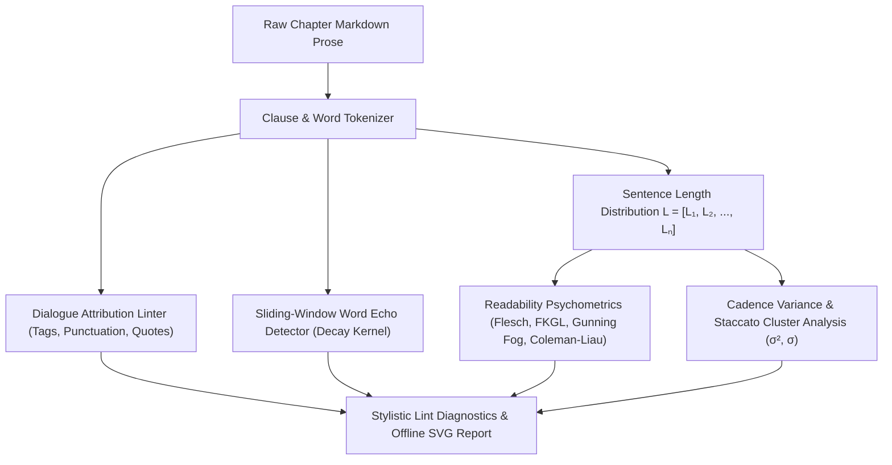
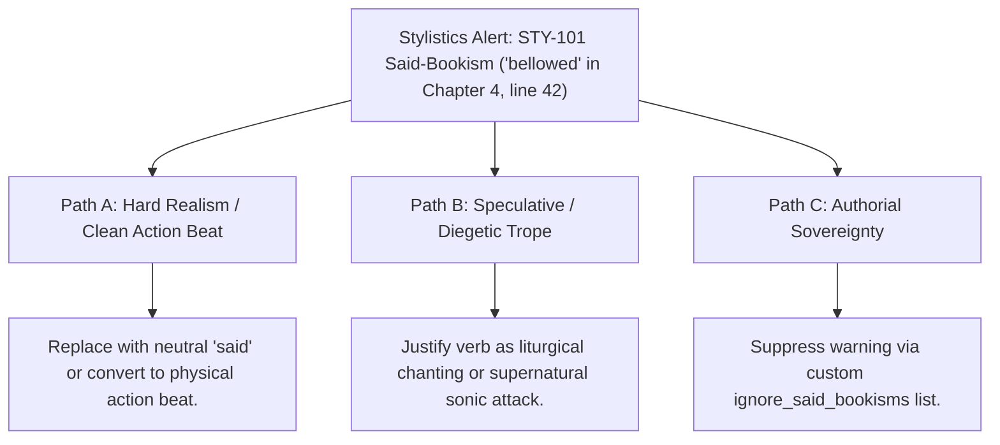

# Prose Stylistics, Computational Readability & Cadence Linters (`docs/STYLISTICS.md`)
> **Domain B: Linguistics, Conlang, Idioms & Stylistics** | **CLI:** `arcanum stylistics` / `arcanum prose-lint`

---

## 1. Overview & Theoretical Rationale

The **Ars Arcanum Stylistics Engine** (`scripts/lib/stylistics.py`) is an offline computational prose linter, dialogue mechanics auditor, sliding-window word echo detector, and cognitive readability analyzer engineered for speculative fiction novelists and structural line editors.

During first-draft writing, subconscious linguistic habits inevitably introduce subtle prose defects that fatigue readers:
1. **Melodramatic Dialogue Tags & Said-Bookisms**: Relying on overwritten tags (*"bellowed"*, *"opined"*, *"hissed"*) instead of evocative physical action beats.
2. **Adverb Crutches**: Modifying basic tags with weak adverbs (*"said angrily"*, *"whispered quietly"*), violating the cardinal rule of showing vs. telling.
3. **Lexical Echoes & Word Repetitions**: Unintentionally repeating distinctive nouns, verbs, or adjectives within tight 100–300 word windows.
4. **Cadence Monotony & Staccato Clusters**: Prose that lacks rhythmic variation, creating robotic cadence fatigue.
5. **Passive Voice Bloat**: Overusing passive constructions (*"The door was opened by..."*) that deflate narrative agency and pacing.

The Stylistics Engine parses chapter markdown, runs morphological stemming, computes standard psychometric readability formulas, scans dialogue attribution mechanics, and generates interactive HTML reports with SVG sentence length histograms.

---

## 2. Computational Stylometry & Mathematical Formulation



### 2.1 Standard Cognitive Readability Formulas
Let $W$ be total word count, $S$ be total sentence count, $Y$ be total syllable count, $C$ be total character count, and $W_{\text{complex}}$ be words with $\ge 3$ syllables:

#### 1. Flesch Reading Ease (FRE):
$$\text{FRE} = 206.835 - 1.015 \left(\frac{W}{S}\right) - 84.6 \left(\frac{Y}{W}\right) \in [0, 100]$$
- $90 - 100$: Very Easy (Comics, Children's literature).
- $60 - 70$: Standard Commercial Fiction (Stephen King, Brandon Sanderson).
- $30 - 50$: Difficult / Academic (Literary Fiction, Gene Wolfe).

#### 2. Flesch-Kincaid Grade Level (FKGL):
$$\text{FKGL} = 0.39 \left(\frac{W}{S}\right) + 11.8 \left(\frac{Y}{W}\right) - 15.59 \quad [\text{US School Grade}]$$

#### 3. Gunning Fog Index:
$$\text{Fog} = 0.4 \left[ \left(\frac{W}{S}\right) + 100 \left(\frac{W_{\text{complex}}}{W}\right) \right]$$

#### 4. Coleman-Liau Index (CLI):
$$\text{CLI} = 0.0588 \left(\frac{C}{W} \times 100\right) - 0.296 \left(\frac{S}{W} \times 100\right) - 15.8$$

### 2.2 Lexical Echo Detection via Exponential Distance Kernel
For a word stem $w$ appearing at token positions $i$ and $j$ ($i < j$):

$$\Delta_{\text{distance}} = j - i$$
$$\text{EchoSeverity}(w) = \begin{cases} 
\text{High} & \text{if } \Delta_{\text{distance}} \le 50 \text{ words} \\
\text{Medium} & \text{if } 50 < \Delta_{\text{distance}} \le 150 \text{ words} \\
\text{Low} & \text{if } 150 < \Delta_{\text{distance}} \le 300 \text{ words}
\end{cases}$$

Functional stopwords (pronouns, auxiliary verbs, articles, prepositions) are filtered out via standard closed-class dictionary masks before echo evaluation.

---

## 3. Subfeatures Matrix & Diagnostic Codes

| Code / Feature | Algorithmic Mechanism | Severity | Diagnostic Rule / Trigger | Narrative Craft Significance |
|:---|---|:---:|---|---|
| **`STY-101`** | Regex matching against overwrought dialogue verbs. | `WARNING` | **Overwrought Said-Bookism**: Flags dramatic verbs (*bellowed, opined, intoned*). | Encourages strong action beats over artificial dialogue tags. |
| **`STY-102`** | Dialogue tag adverb pattern matching (`said + -ly`). | `WARNING` | **Adverb Crutch**: Flags adverbs modifying dialogue verbs (*said angrily*). | Eliminates weak telling in favor of visceral showing. |
| **`STY-103`** | Dialogue punctuation and capitalization linter. | `ERROR` | **Punctuation Error**: Flags `"Hello." said John` or `"Hello," He said`. | Enforces strict publication typography and house style rules. |
| **`STY-104`** | Morphological sliding-window echo scanner ($300\text{w}$). | `WARNING` | **Word Echo**: Flags non-stopword repetition within $< 150$ words. | Prevents repetitive vocabulary from distracting the reader. |
| **`STY-105`** | Rolling sentence length variance ($\sigma$). | `WARNING` | **Monotonous Cadence**: Flags $\sigma < 3.5$ across $\ge 10$ sentences. | Protects against robotic syntactic drone and reader fatigue. |
| **`STY-106`** | Passive voice regex detector (`be + past_participle`). | `WARNING` | **Passive Voice Bloat**: Flags passive constructions ($> 10\%$ chapter share). | Sharpens character agency and kinetic storytelling impact. |

---

## 4. Author Extension & Configuration Guide

### 4.1 CLI Command Reference
```bash
# Scan a single scene or entire manuscript directory for stylistic defects
arcanum stylistics Manuscript/

# Export standalone offline interactive HTML report with sentence length histograms
arcanum stylistics Manuscript/ --html reports/stylistics_report.html

# Output machine-readable JSON diagnostics
arcanum stylistics Manuscript/ --json

# Query stylometrics math and readability formulas
arcanum doc stylistics --math --why
```

---

## 5. Tri-Fold Creative Advisory Resolutions



### Scenario: Said-Bookism Warning (`STY-101`)
- **Path A (Hard Realism / Modern Fiction Craft)**:
  - Replace the tag with a crisp action beat: `Elena smashed her fist onto the war table. "We advance at dawn."`
- **Path B (Speculative / Diegetic Trope)**:
  - If the character is literally vibrating the air with thunder magic or sonic augments, keep the verb and tag the scene with `@style: sonic_dialogue`.
- **Path C (Authorial Sovereignty)**:
  - If writing in a stylized Gothic or Victorian pulp register where florid dialogue tags are aesthetically desired, add `allowed_dialogue_tags: ["bellowed", "intoned"]` in `arcanum.yaml`.

---

## 6. Content Security Policy & Offline Isolation

All stylistics analyzers and HTML readability dashboards execute 100% offline with zero CDN dependencies:

```html
<meta http-equiv="Content-Security-Policy" content="default-src 'none'; style-src 'unsafe-inline'; script-src 'unsafe-inline'; img-src data:; media-src data: blob:;">
```
