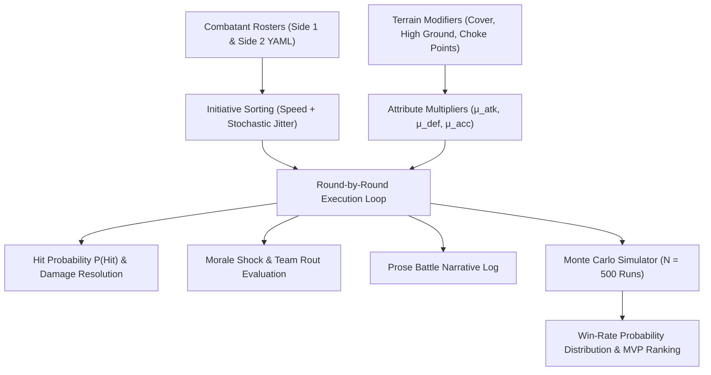
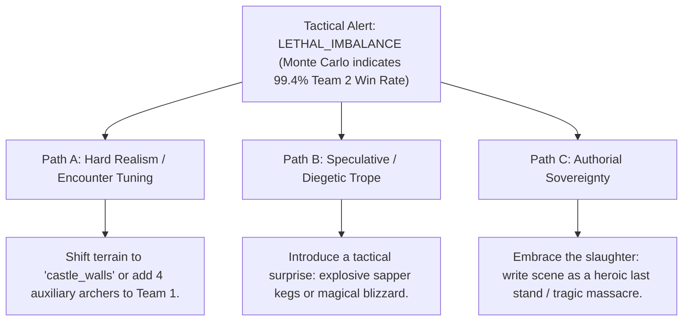

# Dynamic Tactical Combat Simulator & Monte Carlo Encounter Design (`docs/TACTICAL_SIM.md`)
> **Domain D: Sociology, Factions, Economics, Genealogy & Warfare** | **CLI:** `arcanum tactical` / `arcanum skirmish`

---

## 1. Overview & Theoretical Rationale

The **Ars Arcanum Tactical Combat Simulator** (`scripts/lib/tactical_sim.py`) is an offline encounter design tool, stochastic battle simulator, and Monte Carlo probability modeler built for military fantasy novelists, tactical fiction authors, and tabletop RPG designers.

Writing battle scenes without data backing frequently causes narrative tension to collapse:
1. **Unbelievable Underdog Victories**: Depicting 5 peasant recruits defeating 20 armored knights without explaining terrain force multipliers, ambushes, or tactical choke-points.
2. **Arbitrary Plot Armor**: Main characters surviving impossible numerical odds without quantified defensive mechanics.
3. **Static Combat Flow**: Battles where units deal identical damage every round without morale decay, critical hits, or weapon reach advantages.

The Tactical Simulator executes round-by-round combat loops with terrain-aware mechanics, calculates stochastic win-rate distributions via Monte Carlo runs ($N = 100 \text{ to } 10,000$), identifies tactical MVP combatants, and outputs formatted prose combat logs.

---

## 2. Combat Mechanics & Stochastic Formulation



### 2.1 Turn-Based Initiative & Action Ordering
Combatants are sorted dynamically each round by instantaneous initiative $I_i$:

$$I_i = \text{Speed}_i + \mathcal{U}(-2, +2)$$

Where $\mathcal{U}(a, b)$ is a uniform random integer perturbation simulating reflexes and battlefield chaos.

### 2.2 Attack Resolution & Damage Calculation
For an attacker $A$ targeting defender $D$ in a given terrain environment:

#### Hit Probability:
$$P(\text{Hit}) = \max\left(0.05, \, \min\left(0.95, \, \frac{\text{Accuracy}_A \cdot \mu_{\text{acc, terrain}}}{\text{Evasion}_D \cdot \mu_{\text{cover, terrain}}}\right)\right)$$

#### Damage Formulation:
$$\text{Raw Damage} = \text{Attack}_A \cdot \mu_{\text{atk, terrain}} \cdot \text{CritMultiplier}$$
$$\text{Effective Damage} = \max\left(1, \, \lfloor \text{Raw Damage} - \text{Defense}_D \cdot \mu_{\text{def, terrain}} \rfloor\right)$$

Where $\text{CritMultiplier} = 2.0$ with probability $P(\text{Crit}) = \frac{\text{Skill}_A}{100}$.

### 2.3 Morale Decay & Tactical Rout Probability
When a team suffers heavy casualties, surviving combatants experience morale shocks:

$$M_{\text{current}}(t) = M_{\text{initial}} \cdot \left(\frac{\text{Active Combatants}}{\text{Total Initial Roster}}\right) - \text{LossShocks}$$
$$\text{Rout Trigger} \iff M_{\text{current}}(t) \le 0.30 \cdot M_{\text{initial}} \implies \text{Team Routs (Forced Surrender / Retreat)}$$

### 2.4 Monte Carlo Win-Rate Convergence
For $N$ independent battle simulations between Team 1 and Team 2:

$$\hat{P}(\text{Team 1 Win}) = \frac{1}{N}\sum_{i=1}^N \mathbb{I}(\text{Winner}_i = 1)$$
$$\text{Standard Error } \sigma_{\hat{P}} = \sqrt{\frac{\hat{P}(1 - \hat{P})}{N}}$$

For $N = 1000$ runs, estimation error is bounded to $\pm 1.5\%$, giving authors statistical certainty regarding encounter lethality.

---

## 3. Terrain Modifiers Reference Matrix

| Terrain Key | Environment | Attack Mod ($\mu_{\text{atk}}$) | Def Mod ($\mu_{\text{def}}$) | Accuracy Mod ($\mu_{\text{acc}}$) | Narrative Significance |
|:---|---|:---:|:---:|:---:|---|
| `open_field` | Grassy Plains | $1.0\times$ | $1.0\times$ | $1.0\times$ | Neutral baseline wargame setting. |
| `dense_forest` | Boreal Woods | $0.85\times$ | $1.15\times$ | $0.75\times$ | High cover; favors stealth and light skirmishers. |
| `castle_walls` | Fortified Ramparts | $0.70\times$ (Attacker) | $2.0\times$ (Defender) | $1.3\times$ (Defender) | Enormous defender advantage; favors archers. |
| `dungeon_corridor` | Narrow Chokepoint | $1.0\times$ | $1.3\times$ | $0.90\times$ | Limits flanking; favors heavy shieldwalls. |
| `mountain_pass` | Rocky Incline | $0.80\times$ | $1.2\times$ | $0.80\times$ | High ground bonuses and difficult footing. |

---

## 4. Author Extension & Configuration Guide

### 4.1 Team Roster Manifest (`knights.yaml`)
```yaml
- name: "Sir Galahad"
  role: "Knight Commander"
  hp: 120
  attack: 28
  defense: 18
  speed: 12
  accuracy: 85
  morale: 100
  weapon: "Sunsteel Greatsword"

- name: "Spire Bowman"
  role: "Ranged Marksman"
  hp: 60
  attack: 22
  defense: 8
  speed: 16
  accuracy: 92
  morale: 75
  weapon: "Yew Longbow"
```

---

## 5. Command-Line Interface (CLI) Reference

```bash
# Simulate a single battle with detailed prose narrative log
arcanum tactical --side1 knights.yaml --side2 bandits.yaml --terrain dense_forest --log

# Run 1000-iteration Monte Carlo simulation for encounter balance with custom defending side
arcanum tactical --side1 garrison.yaml --side2 siege_force.yaml --terrain castle_walls --defending-side 1 --runs 1000

# Output machine-readable JSON battle statistics
arcanum tactical --side1 heroes.yaml --side2 boss.yaml --json

# Query combat simulation mathematics and Lanchester damage equations
arcanum doc tactical_sim --math --why
```

---

## 6. Tri-Fold Creative Advisory Resolutions



### Scenario: Lethal Encounter Imbalance Warning (Win Rate $< 5\%$)
- **Path A (Hard Realism / Tactical Rebalancing)**:
  - Give the defending underdog heavy terrain fortification (`castle_walls`) or introduce chokepoint defensive advantages to raise survival odds to $\approx 30\%-40\%$.
- **Path B (Speculative / Diegetic Trope)**:
  - Keep the unequal odds, but script a specific asymmetric catalyst: an ancient relic discharge, an unexpected cavalry flank charge, or an assassin eliminating the enemy commander.
- **Path C (Authorial Sovereignty)**:
  - Intentionally write the battle as a catastrophic defeat or heroic sacrifice (e.g. Thermopylae or The Alamo).

---

## 7. Content Security Policy & Offline Isolation

All tactical combat simulations and Monte Carlo engines execute 100% offline with zero CDN dependencies:

```html
<meta http-equiv="Content-Security-Policy" content="default-src 'none'; style-src 'unsafe-inline'; script-src 'unsafe-inline'; img-src data:; media-src data: blob:;">
```
