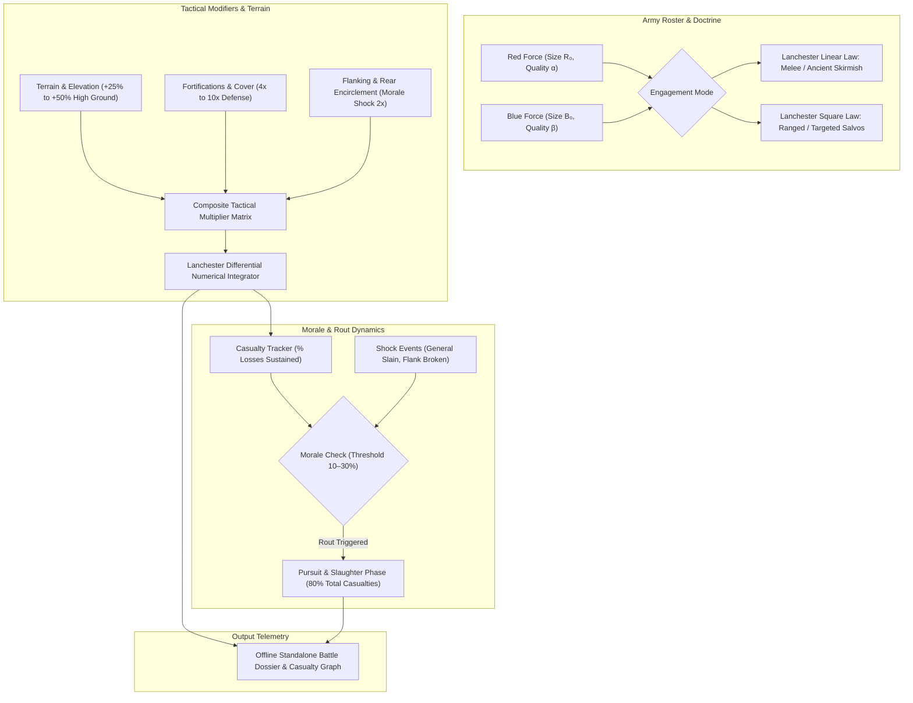

# Lanchester Combat Dynamics, Morale Shock & Operational Logistics (`docs/TACTICAL_SIM.md`)
> **Domain B: Societies, Lineages, Geopolitics & Tactical War** | **CLI:** `arcanum tactics` / `arcanum wargame`

---

## 1. Executive Summary & Epistemological Architecture

The **Ars Arcanum Tactical Warfare & Wargaming Engine** (`scripts/lib/tactical_sim.py`) is an offline battle simulation compiler, Lanchester combat attrition integrator, troop morale collapse auditor, and army march column calculator designed for military fantasy novelists, wargame system designers, and historical tacticians.

Military combat in fiction frequently succumbs to Hollywood romanticisms that contradict operational reality:
1. **The "Fight to the Last Man" Fallacy (`TAC-101`)**: Depicting armies fighting down to 99% extermination before breaking, ignoring that historical armies almost universally rout and dissolve upon sustaining **10%–30% casualties**.
2. **Linear Mass Scaling Errors (`TAC-102`)**: Treating a 2:1 numerical advantage as merely twice as effective in ranged or concentrated combat, ignoring Lanchester's Square Law where a 2:1 numerical superiority yields a **4:1 combat advantage**.
3. **The Bloodbath Myth of the Clashing Line**: Assuming the majority of casualties occur during the shield wall clash, ignoring that **80%–90% of all battlefield casualties occur during the rout** when broken troops drop shields and flee.
4. **Column Length Amnesia**: Depicting an army of 40,000 marching onto a battlefield simultaneously, ignoring that their single-file road column stretches over $35\text{ km}$, taking 10+ hours to deploy into battle lines.

The Tactical Engine numerically integrates Lanchester differential equations, tracks cumulative morale shock multipliers, computes terrain/fortification defilade modifiers, and simulates unit routing dynamics.



---

## 2. The Lanchester Combat Power Laws

Frederick W. Lanchester (1916) formulated the mathematical foundations of military attrition. The outcome of a battle depends entirely on whether forces engage in **unaimed/ancient duels** (Linear Law) or **concentrated targeted fire** (Square Law).

```
                      [ LANCHESTER ENGAGEMENT REGIMES ]
  1. LINEAR LAW (Ancient Melee)        ──► dB/dt = -β  ;  dR/dt = -α  ──► Power ∝ N · Quality
  2. SQUARE LAW (Ranged Concentration) ──► dB/dt = -β R;  dR/dt = -α B──► Power ∝ N² · Quality
```

### 2.1 Lanchester’s Linear Law (Ancient Melee & Frontage-Constrained Duels)
When units fight along a narrow front (e.g., Thermopylae pass, shield wall clash) where only the soldiers in the front rank can engage, each warrior fights one opponent at a time:

$$\frac{dB}{dt} = -\beta, \quad \frac{dR}{dt} = -\alpha$$

Integrating across battle duration:

$$\beta (R_0 - R(t)) = \alpha (B_0 - B(t))$$

- **Combat Power Metric**:
  $$\text{Combat Power}_{\text{Linear}} = \text{Force Size } N \times \text{Individual Quality } \alpha$$
  In narrow melee choke points, high individual quality (Spartan hoplites, elite knights) can hold off vast numerical superiorities.

### 2.2 Lanchester’s Square Law (Modern Ranged & Targeted Concentrated Fire)
When every unit in Force Red can freely acquire, target, and fire upon any unit in Force Blue simultaneously (e.g., longbow volleys, musket lines, artillery salvos, starship broadsides):

$$\frac{dB}{dt} = -\beta R(t)$$
$$\frac{dR}{dt} = -\alpha B(t)$$

Where $\alpha$ is Red's individual kill-rate efficiency and $\beta$ is Blue's efficiency. Multiplying and integrating:

$$\beta \left( R_0^2 - R(t)^2 \right) = \alpha \left( B_0^2 - B(t)^2 \right)$$

- **Lanchester's Law of Fighting Power**:
  $$\text{Fighting Power} = \alpha \cdot N^2$$

#### The Geometric Power of Numerical Superiority:
Because fighting power scales with the **square of troop numbers ($N^2$)**, numerical superiority dominates individual unit quality:
- If Force Red has $2,000$ archers ($\alpha = 1.0$) and Force Blue has $1,000$ elite archers ($\beta = 1.5$):
  $$\text{Power}(\text{Red}) = 1.0 \times 2,000^2 = 4,000,000$$
  $$\text{Power}(\text{Blue}) = 1.5 \times 1,000^2 = 1,500,000$$
  Force Red possesses **$2.67\times$ the combat power** of Force Blue and will annihilate Blue with minimal losses.
- *Clausewitz's Principle of the Schwerpunkt*: Concentrating forces locally transforms a fair fight into an overwhelmingly asymmetric Lanchester Square slaughter.

---

## 3. Force Multipliers & Tactical Terrain Modifiers

Composite operational effectiveness $\alpha_{\text{eff}}$ scales the base unit lethality:

$$\alpha_{\text{eff}} = \alpha_0 \times \prod_{k} M_k$$

```
                        [ TACTICAL MULTIPLIER MATRIX ]
  Factor                      Modifier (M_k)    Tactical Effect
  ──────                      ──────────────    ───────────────
  High Ground / Crest Defense +25% to +50%      Gravity boosts missile range / slows charge
  Stone Castle Defilade       4.0x to 10.0x     Massive missile protection; narrow arrow slits
  Encirclement / Flank Attack 2.0x to 3.0x      Nullifies shields; triggers catastrophic panic
  Deep Mud / Trench Obstacle  0.3x to 0.5x      Neutralizes cavalry shock charge velocity
  Heavy Rain / High Winds     0.2x to 0.5x      Slacks bowstrings; ruins gunpowder priming
```

---

## 4. Morale Mechanics & The Anatomy of the Rout

Historical battle studies by John Keegan (*The Face of Battle*) and Col. Trevor N. Dupuy prove that armies are psychological entities, not mathematical health bars.

```
      Casualties Sustained (%)
           ▲
       100 ┼ - - - - - - - - - - - - - - - - - - - Hollywood Myth: Fight to 100% Death
           │
        50 ┼ - - - - - - - - - - - - - - - - - - - Elite / Fanatical Veteran Breaking Point
           │
        15 ┼────────────────────────────────────── REAL HISTORICAL BREAKING POINT (10%–20%)
           │                                       (Rout Triggers -> The Massacre Begins)
         0 ┼──────────────────────────────────────► Time (t)
```

### 4.1 Historical Casualty Breaking Points
- **Conscript / Green Levy**: Routs after sustaining **$5\%\text{–}10\%$ casualties**.
- **Standard Regular Infantry**: Routs after sustaining **$15\%\text{–}20\%$ casualties**.
- **Hardened Veterans / Knights**: Routs after sustaining **$30\%\text{–}40\%$ casualties**.
- **Fanatical Martyrs / Paladins**: Breaks only at $> 50\%$ (historically exceedingly rare; e.g., Spartans at Thermopylae, Swiss Guard at Rome).

### 4.2 Shock Events Triggering Instant Morale Collapse
Even at $0\%$ physical casualties, a unit immediately breaks if subjected to sudden psychological shock:
1. **General / Sovereign Slain**: Sudden loss of supreme command ($\text{Morale Penalty } -50\%$).
2. **Cavalry Charge from the Rear**: Sudden realization of entrapment ($\text{Morale Penalty } -60\%$).
3. **Adjacent Friendly Unit Routing**: Contagious panic spreading across the line.
4. **Ammunition Exhaustion**: Missile troops unable to return fire.

### 4.3 The Slaughter of the Rout
> **In pre-modern warfare, 80% to 90% of all battle casualties occur *after* the line breaks.**

While the shield wall holds, armor and shields keep casualty rates low ($< 5\%\text{/hour}$). Once the line turns its back and flees, fleeing soldiers throw down heavy shields and weapons, enabling pursuing light cavalry and skirmishers to butcher them from behind with zero retaliation.

---

## 5. Column Length & Operational March Logistics

An army on the march does not travel in wide battle lines; it moves in narrow single- or double-file columns along dirt roads.

```
  ◄── 10 km Vanguard ──►◄───── 15 km Main Body ─────►◄── 12 km Baggage Train ──►
  ═══════════════════════════════════════════════════════════════════════════════
  Total Road Column Length L_column ≈ 37 km (Takes 10+ hours to pass a single point)
```

### 5.1 The March Column Length Formula
For an army of $N_{\text{inf}}$ infantry, $N_{\text{cav}}$ cavalry, and $N_{\text{wagons}}$ supply wagons:

$$L_{\text{column}} = \left( \frac{N_{\text{inf}}}{D_{\text{inf}}} \right) + \left( \frac{N_{\text{cav}}}{D_{\text{cav}}} \right) + \left( N_{\text{wagons}} \times \Delta_{\text{wagon}} \right)$$

Where typical road marching densities are:
- Infantry marching 4-abreast: $D_{\text{inf}} \approx 2,000\text{ men/km}$ (with spacing).
- Cavalry marching 2-abreast: $D_{\text{cav}} \approx 400\text{ horses/km}$.
- Baggage wagons: $\Delta_{\text{wagon}} \approx 20\text{ meters per wagon}$ ($50\text{ wagons/km}$).

#### Example: A Medieval Royal Host of 20,000 Men
- $15,000$ Infantry (4-abreast): $\frac{15,000}{2,000} = 7.5\text{ km}$.
- $5,000$ Cavalry (2-abreast): $\frac{5,000}{400} = 12.5\text{ km}$.
- $600$ Supply Wagons: $600 \times 0.02\text{ km} = 12.0\text{ km}$.
- **Total Column Length**: $L_{\text{column}} = 7.5 + 12.5 + 12.0 = 32.0\text{ km}$.

*Operational Reality*: If the vanguard arrives at a battlefield at 08:00, the rearguard and supply wagons will not arrive until after 18:00. An enemy ambushing the column in transit will defeat the army piecemeal.

---

## 6. Worked Step-by-Step Tactical Simulation

### Scenario: The Battle of the Red Ridge
- **Force Red (Defenders on High Ground)**: $3,000$ longbowmen on a steep ridge ($M_{\text{terrain}} = 1.4$), kill-rate efficiency $\alpha = 0.08\text{ kills/min/man}$.
- **Force Blue (Attackers in the Plain)**: $5,000$ armored crossbowmen, kill-rate efficiency $\beta = 0.05\text{ kills/min/man}$.
- Both forces engage simultaneously in targeted ranged combat (Lanchester Square Law).
- Morale breaking threshold: $20\%$ losses for Blue ($1,000$ casualties); $25\%$ losses for Red ($750$ casualties).

#### Step 1: Compute Effective Effectiveness Coefficients
- $\alpha_{\text{eff}} = \alpha \times M_{\text{terrain}} = 0.08 \times 1.40 = 0.112$.
- $\beta_{\text{eff}} = 0.050$.

#### Step 2: Calculate Lanchester Combat Power
$$\text{Power}(\text{Red}) = \alpha_{\text{eff}} \times R_0^2 = 0.112 \times (3000)^2 = 0.112 \times 9,000,000 = 1,008,000$$
$$\text{Power}(\text{Blue}) = \beta_{\text{eff}} \times B_0^2 = 0.050 \times (5000)^2 = 0.050 \times 25,000,000 = 1,250,000$$

*Initial Outlook*: Blue holds a slight total power edge ($1.25\text{M}$ vs $1.01\text{M}$), but will Blue break from morale before Red is defeated?

#### Step 3: Determine Losses at Blue's Morale Break Threshold
Blue routs when $B(t) = 4,000$ ($1,000$ casualties sustained).
Using the Lanchester invariant:

$$\alpha_{\text{eff}} (B_0^2 - B(t)^2) = \beta_{\text{eff}} (R_0^2 - R(t)^2)$$

$$0.112 \times \left( 5000^2 - 4000^2 \right) = 0.050 \times \left( 3000^2 - R(t)^2 \right)$$

$$0.112 \times (25,000,000 - 16,000,000) = 0.050 \times (9,000,000 - R^2)$$

$$0.112 \times 9,000,000 = 1,008,000$$

$$9,000,000 - R(t)^2 = \frac{1,008,000}{0.050} = 20,160,000$$

*Mathematical Implication*: Because $20,160,000 > 9,000,000$, Red's roster $R(t)^2$ reaches zero *before* Blue loses $1,000$ men. 
Let's find Red's casualties when Red hits its own $25\%$ breaking point ($R(t) = 2,250$):

$$0.050 \times (3000^2 - 2250^2) = 0.050 \times (9,000,000 - 5,062,500) = 0.050 \times 3,937,500 = 196,875$$

$$B_0^2 - B(t)^2 = \frac{196,875}{0.112} = 1,757,812$$

$$B(t)^2 = 25,000,000 - 1,757,812 = 23,242,188 \implies B(t) \approx 4,821 \text{ men}$$

*Battle Conclusion*: Force Red sustains $750$ casualties and **routs from the ridge**. Force Blue loses only $179$ men ($3.6\%$ casualties). Blue's overwhelming $5:3$ numerical mass completely overcame Red's high-ground advantage.

---

## 7. Practical YAML Schemas

```yaml
schema_version: "2.0"
battle_engagement:
  id: "battle_of_red_ridge"
  engagement_type: "lanchester_square"

force_red:
  name: "Aurelian Ridge Archers"
  initial_strength: 3000
  base_lethality_alpha: 0.08
  terrain_multiplier: 1.40 # High ground crest
  morale_breaking_threshold_pct: 0.25
  is_fortified: false

force_blue:
  name: "Iron Vanguard Crossbowmen"
  initial_strength: 5000
  base_lethality_beta: 0.05
  terrain_multiplier: 1.00 # Open flat plain
  morale_breaking_threshold_pct: 0.20
  is_fortified: false

logistical_column:
  force_blue_total_troops: 5000
  marching_formation_width: 4
  cavalry_count: 800
  supply_wagons: 120
  total_column_length_km: 7.9
```

---

## 8. CLI Reference & Scriptorium Integration

```bash
# Run Lanchester Square Law battle simulation with morale breaking points
arcanum tactics --simulate-battle World/Military/red_ridge.yaml

# Calculate road march column length and transit deployment timeline
arcanum wargame --column-length --infantry 15000 --cavalry 5000 --wagons 600

# Generate standalone offline HTML casualty graph and battle dossier
arcanum tactics --battle World/Military/red_ridge.yaml --html reports/battle_report.html
```

---

## 9. Recommended Reading, References & Media

### Foundational Craft & Academic Textbooks
- **Lanchester, Frederick W. (1916)**. *Aircraft in Warfare: The Dawn of the Fourth Arm*. Constable and Company.  
  *The historic foundational work formulating the Linear and Square Laws of military attrition.*
- **Keegan, John (1976)**. *The Face of Battle: A Study of Agincourt, Waterloo, and the Somme*. Jonathan Cape.  
  *The revolutionary military history masterwork detailing the psychological reality of combat, fear, and the mechanics of the rout.*
- **von Clausewitz, Carl (1832)**. *Vom Kriege* (*On War*). Dümmlers Verlag.  
  *The philosophical cornerstone of military strategy, the fog of war, friction, and the center of gravity (Schwerpunkt).*
- **Sun Tzu (5th Century BCE)**. *The Art of War*.  
  *Timeless tactical treatise on deception, terrain advantages, and winning without battle.*
- **Dupuy, Trevor N. (1987)**. *Understanding War: History and Theory of Combat*. Paragon House.  
  *The comprehensive operational research treatise detailing the Quantified Judgment Model (QJM) and environmental multipliers.*

### Landmark Scientific & Operations Research Papers
- **Taylor, James G. (1983)**. *Lanchester Models of Warfare* (2 vols). Operations Research Society of America (ORSA).  
  *The university standard for differential equation modeling of combined arms warfare.*
- **Epstein, Joshua M. (1985)**. *The Calculus of Conventional War: Dynamic Analysis Without Lanchester Theory*. Brookings Institution.  
  *Pioneered modern adaptive threshold attrition modeling.*

### Seminal Video Lectures, Masterclasses & Channels
- **Bret Devereaux (ACOUP)** (*The Universal Battle*, *How Did Ancient Battles Actually Work?*).  
  *The premier academic military historian analyzing weapon ranges, morale breaks, and the myth of sword-fighting.*
- **Kings and Generals** (YouTube Series: *Animated Historical Tactical Battles*).  
  *Exquisite visual tactical battle maps illustrating flanking maneuvers, column deployments, and encirclements.*
- **BazBattles** (YouTube Series: *Tactical Formations & Morale Mechanics*).  
  *Deep step-by-step reconstructions of ancient and medieval command structures and casualty spikes.*
- **Invicta** (YouTube Series: *Ancient Siege Warfare & Military Engineering*).  
  *Detailed breakdowns of fortifications, sapping techniques, and logistical sieges.*

### Landmark Speculative Case Studies
- **Tolkien, J.R.R.** *The Lord of the Rings* (The Battle of the Pelennor Fields: cavalry flank shock charges breaking morale, Grond siege mechanics, and rearguard lines).
- **Martin, George R.R.** *A Clash of Kings* (The Battle of the Blackwater: naval chain boom choke point, wildfire area-denial shock, and Tywin's unexpected cavalry flank).
- **Erikson, Steven**. *Malazan Book of the Fallen* (*Deadhouse Gates* / *Memories of Ice*: Morale limits during the Chain of Dogs, sapper explosives, and combined arms sorcery).
- **Abercrombie, Joe**. *The Heroes* (Exhaustive, unromanticized three-day minute-by-minute battle study showing confusion, friendly fire, exhaustion, and rout mechanics).
