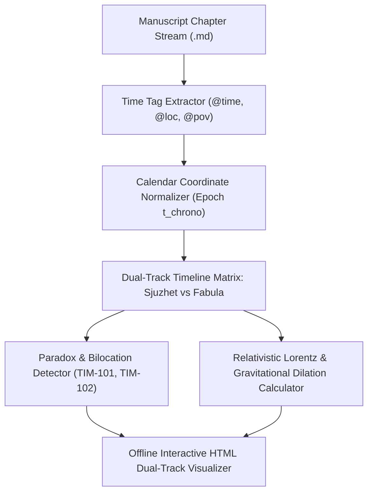

# Dual-Track Narrative vs Chronological Timeline Synchronizer (`docs/TIMELINE_SYNC.md`)
> **Domain B: Narrative Architecture, Structure & Dynamics** | **CLI:** `arcanum timeline` / `arcanum sync`

---

## 1. Overview & Theoretical Rationale

The **Ars Arcanum Timeline Synchronizer Engine** (`scripts/lib/timeline_sync.py`) is an offline dual-track temporal analyzer, non-linear discourse mapper, and causal anomaly detector built for multi-POV epics, mystery thrillers, and relativistic hard science fiction.

In non-linear, multi-POV, or relativistic storytelling, the sequence in which the reader encounters events rarely matches the true chronological sequence in which events transpired within the fictional universe. Authors encounter severe cognitive pitfalls:
1. **Temporal Bilocation Anomalies (`TIM-101`)**: The same POV character physically present at two disparate geographic locations at the identical calendar timestamp without teleportation or clone mechanics.
2. **Causal Inversion Paradoxes (`TIM-102`)**: Character $B$ reacting to an outcome of an event that has not yet occurred in the in-world chronology.
3. **Disorienting Analepsis / Prolepsis Drift (`TIM-103`)**: Unanchored flashbacks or flashforwards lacking clear sensory, causal, or frame-narrative justification.
4. **Relativistic Time Dilation Errors (`TIM-104`)**: Failing to calculate the differential clock rates between near-light-speed relativistic starships and planetary baseline civilizations.

The Timeline Engine maps narrative discourse time (*sjuzhet*) against true chronological story time (*fabula*), normalizes diverse fictional and astronomical calendar coordinates, detects paradoxes, and renders interactive dual-lane SVG timeline reports.



---

## 2. Narratological Theory: Fabula vs Sjuzhet & Genette's Dimensions

```
+-----------------------------------------------------------------------------------+
|                        NARRATIVE TIME VS STORY TIME                               |
+------------------------------------+----------------------------------------------+
| FABULA (Chronological Story Time)  | SJUZHET (Discourse / Reading Time)           |
| - In-world objective causal stream | - Subjective artistic arrangement in text    |
| - t_story ∈ [-∞, +∞]               | - Chapter stream index k ∈ [1, K]            |
| - Russian Formalist: Causal-tempo- | - French Narratology: Order, Duration,       |
|   ral reality of events            |   Frequency (Gérard Genette)                 |
+------------------------------------+----------------------------------------------+
```

### 2.1 Gérard Genette's Three Temporal Dimensions
1. **Order (Chronology vs Anachrony)**:
   - **Analepsis (Flashback)**: Retrospective narration recounting events prior to the current narrative baseline.
     - *External Analepsis*: Events before the story began (backstory).
     - *Internal Analepsis*: Events that occurred earlier within the novel's timeframe but were skipped.
   - **Prolepsis (Flashforward)**: Anticipatory narration revealing future events.
2. **Duration (Velocity / Pacing Ratio $\mathcal{V} = \frac{\Delta t_{\text{reading}}}{\Delta t_{\text{story}}}$)**:
   - *Scene* ($\mathcal{V} \approx 1$): Real-time dialogue and action.
   - *Summary* ($\mathcal{V} < 1$): Weeks or years compressed into a single paragraph.
   - *Ellipsis* ($\mathcal{V} = 0$): Time passed without textual mention.
   - *Pause* ($\mathcal{V} = \infty$): Long descriptive or philosophical passage while story time stops.
   - *Stretch* ($\mathcal{V} > 1$): Slow-motion magnification of a split-second bullet impact.
3. **Frequency (Event Iteration)**:
   - *Singulative*: Narrating once what happened once ($1N / 1S$).
   - *Repeating*: Narrating $n$ times what happened once ($nN / 1S$, e.g. *Rashomon* multiple perspectives).
   - *Iterative*: Narrating once what happened $n$ times ($1N / nS$, e.g. *"Every Sunday they walked to church"*).

---

## 3. Mathematical Models & Relativistic Physics

### 3.1 Temporal Mapping Function: Sjuzhet to Fabula
Let a manuscript have $K$ chapters in reading order $k \in \{1, 2, \dots, K\}$. Each chapter contains a set of events $e$, each tagged with an in-world timestamp coordinate $t_{\text{chrono}}(e) \in \mathbb{R}$.

$$\text{Chronological Drift Function}: \quad \Delta \tau(k) = t_{\text{chrono}}(k) - t_{\text{chrono}}(k-1)$$

$$\text{Classification}: \quad \begin{cases} 
\Delta \tau(k) > 0 & \text{Chronological Forward Progression} \\
\Delta \tau(k) < 0 & \text{Analepsis (Flashback)} \\
\Delta \tau(k) \gg \text{Median}(\Delta \tau) & \text{Narrative Ellipsis (Time Jump)}
\end{cases}$$

### 3.2 Bilocation Paradox Invariant
Let $\text{Presence}(C, t, L)$ indicate character $C$ at in-world time $t$ and location $L$.

$$\text{Bilocation Paradox} \iff \exists t, L_1, L_2 \text{ s.t. } \text{Presence}(C, t, L_1) \land \text{Presence}(C, t, L_2) \land L_1 \neq L_2 \land \mathcal{D}(L_1, L_2) > 0$$

### 3.3 Relativistic Time Dilation in Hard Sci-Fi
For interstellar spaceflight at relativistic velocities $v$ relative to stationary planetary reference frame $S$:

1. **Special Relativity (Kinetic Lorentz Dilation)**:
   $$\gamma = \frac{1}{\sqrt{1 - \frac{v^2}{c^2}}}$$
   $$\Delta t_{\text{ship}} = \frac{\Delta t_{\text{planetary}}}{\gamma}$$
   *Example*: A ship traveling at $v = 0.99c$ ($\gamma \approx 7.088$) journeys to Sirius ($d = 8.6\text{ light-years}$).
   - Planetary frame elapsed time: $\Delta t_{\text{planet}} \approx 8.687\text{ years}$.
   - Ship crew elapsed time: $\Delta t_{\text{ship}} = \frac{8.687}{7.088} \approx 1.225\text{ years}$.

2. **General Relativity (Gravitational Dilation Near Black Holes)**:
   $$t_f = t_0 \sqrt{1 - \frac{2GM}{r c^2}} = t_0 \sqrt{1 - \frac{r_s}{r}}$$
   Where $r_s = \frac{2GM}{c^2}$ is the Schwarzschild radius.

---

## 4. Subfeatures Matrix & Diagnostic Codes

| Diagnostic Code | Flag | Trigger Condition | Worldbuilding Correction |
|---|---|---|---|
| `TIM-101` | `BILOCATION_ANOMALY` | Same POV character in two places at identical timestamp $t_{\text{chrono}}$. | Adjust chapter timestamp or add travel sequence. |
| `TIM-102` | `CAUSAL_INVERSION` | Character references information prior to its chronological discovery. | Move discovery chapter earlier or rephrase dialogue. |
| `TIM-103` | `UNANCHORED_FLASHBACK` | Chapter jumps $> 1$ year backward with zero framing trigger or time tag. | Add explicit sensory anchor or chapter frontmatter header. |
| `TIM-104` | `RELATIVISTIC_DESYNC` | Interstellar starship arrives at planet without factoring Lorentz factor $\gamma$. | Compute crew age vs planetary civilization age using dilation formulas. |
| `TIM-105` | `TIMELINE_OVERLAP_COLLISION` | Two concurrent POV battles in same fortress describe contradictory weather. | Synchronize weather conditions in `World/Climate/`. |

---

## 5. Frontmatter Directives & YAML Schemas

### 5.1 Scene Frontmatter Temporal Tagging (`Manuscript/Chapter-14.md`)
```yaml
---
title: "The Fall of the Western Bastion"
chapter: 14
pov: "Captain_Rylan"
timeline:
  calendar: "imperial_solar"
  year: 1442
  month: 8
  day: 19
  hour: 14.5 # 2:30 PM
  narrative_type: "analepsis" # chronological | analepsis | prolepsis
  analepsis_anchor: "Rylan clutching his father's broken compass"
relativistic_frame:
  velocity_fraction_c: 0.0 # Planetary frame
---
```

### 5.2 Relativistic Starship Flight Frontmatter (`Manuscript/Chapter-22.md`)
```yaml
---
title: "Transit to Epsilon Eridani"
chapter: 22
pov: "Navigator_Chen"
timeline:
  ship_proper_time_years: 2.4
  earth_coordinate_time_years: 11.8
  lorentz_gamma: 4.917
  relativistic_velocity: 0.979 # fraction of c
---
```

---

## 6. Worked Step-by-Step Example

### Scenario: Auditing a Non-Linear Murder Mystery (Sjuzhet vs Fabula)
1. **Reading Stream (Sjuzhet)**:
   - Ch 01: Detective arrives at crime scene ($t_{\text{chrono}} = \text{Day 3, 09:00}$).
   - Ch 02: Flashback to the Victim's argument at the tavern ($t_{\text{chrono}} = \text{Day 1, 21:00}$).
   - Ch 03: Flashback to the Murderer forging the will ($t_{\text{chrono}} = \text{Day 2, 14:00}$).
   - Ch 04: Detective interrogates the suspect ($t_{\text{chrono}} = \text{Day 3, 11:30}$).
2. **Timeline Synchronizer Execution**:
   - Reorders events into **Fabula**:
     1. [Day 1, 21:00] Victim argues at tavern (Ch 02).
     2. [Day 2, 14:00] Murderer forges will (Ch 03).
     3. [Day 3, 09:00] Detective arrives at scene (Ch 01).
     4. [Day 3, 11:30] Detective interrogates suspect (Ch 04).
   - **Audit Check**:
     - In Ch 04, the Detective asks about the forged will.
     - Did Detective find the will in Ch 01? Yes ($t = \text{Day 3, 09:30}$).
     - **Result**: Valid. Causal chain preserved. Zero causal inversions.

### 6.1 In-Vault Timeline & Sequence Tooling: Obsidian Longform, Calendarium & April's Timelines
- **Obsidian Longform**: Reorder atomic scene notes between narrative reading sequence (*sjuzhet*) and chronological story time (*fabula*) using drag-and-drop corkboards. See [Longform Guide](file:///docs/guides/EXTERNAL_TOOLS_AND_PLUGINS.md#5-longform).
- **Obsidian Calendarium**: Pin historical events and chapter scenes directly onto interactive planetary calendar grids with custom eras and multi-moon phases. See [Calendarium Guide](file:///docs/guides/EXTERNAL_TOOLS_AND_PLUGINS.md#16-calendarium-fantasy-calendar).
- **April's Automatic Timelines**: Automatically aggregate tagged scene notes into dynamic horizontal or vertical chronological timeline feeds (`aat-vertical`). See [April's Timelines Guide](file:///docs/guides/EXTERNAL_TOOLS_AND_PLUGINS.md#17-aprils-automatic-timelines).

---

## 7. Recommended Reading, References & Media

### 7.1 Foundational Craft & Academic Books
- **Genette, Gérard (1980)**. *Narrative Discourse: An Essay in Method* (trans. Jane E. Lewin). Cornell University Press. ISBN: 978-0801492594.  
  *The foundational structuralist narratology text establishing Order, Duration, Frequency, Analepsis, and Prolepsis.*
- **Ricoeur, Paul (1984–1988)**. *Time and Narrative* (Volumes 1–3, trans. Kathleen McLaughlin and David Pellauer). University of Chicago Press. ISBN: 978-0226713328.  
  *The landmark philosophical treatise on threefold mimesis, human temporal experience, and narrative configuration.*
- **Chiang, Ted (1998)**. *Story of Your Life* (in *Stories of Your Life and Others*). Tor Books. ISBN: 978-1101972120.  
  *Masterclass in non-linear simultaneous temporal consciousness, variational physics (Fermat's Principle of Least Time), and linguistic determinism.*
- **Bordwell, David (1985)**. *Narration in the Fiction Film*. University of Wisconsin Press. ISBN: 978-0299101749.  
  *Comprehensive breakdown of fabula construction, syuzhet cues, and cinematic non-linear storytelling.*

### 7.2 Landmark Scientific / Worldbuilding Papers & Textbooks
- **Thorne, Kip S. (1994)**. *Black Holes and Time Warps: Einstein's Outrageous Legacy*. W. W. Norton & Co. ISBN: 978-0393312768.  
  *The authoritative physicist's guide to relativistic kinematics, gravitational time dilation, and wormhole causality.*
- **Einstein, Albert (1905)**. "Zur Elektrodynamik bewegter Körper" (*On the Electrodynamics of Moving Bodies*), *Annalen der Physik*, 17(10), 891–921.  
  *The original formulation of Special Relativity and Lorentz transformations.*

### 7.3 Seminal Video Lectures, Masterclasses & Channels
- **PBS Space Time (Matt O'Dowd, 2015–Present)**. *The Physics of Time Dilation, Relativity & Spacetime Curvature*. YouTube.  
  *Invaluable visual derivations of Lorentz contractions, light cones, and causal boundaries.*
- **Lessons from the Screenplay (2017)**. *Arrival — How Sound and Editing Tell the Story*. YouTube.  
  *Examines the non-linear editing techniques and psychological anchoring of flash-forwards.*
- **StudioBinder (2020)**. *Nonlinear Storytelling: How Directors Play with Time*. YouTube.  
  *Detailed breakdowns of Memento, Pulp Fiction, and Dunkirk temporal structures.*

### 7.4 Landmark Speculative Case Studies
- **Christopher Nolan, *Memento* (2000)**: Textbook alternating dual-track architecture: Color scenes moving backward in fabula, Black-and-White scenes moving forward in fabula, meeting at the revelation climax.
- **Quentin Tarantino, *Pulp Fiction* (1994)**: Masterclass in circular non-linear syuzhet creating fresh dramatic irony and emotional resurrection.
- **Alastair Reynolds, *Revelation Space* series (2000–Present)**: The pinnacle of hard relativistic space opera with realistic decades of time dilation between lighthugger crews and planetary worlds.
