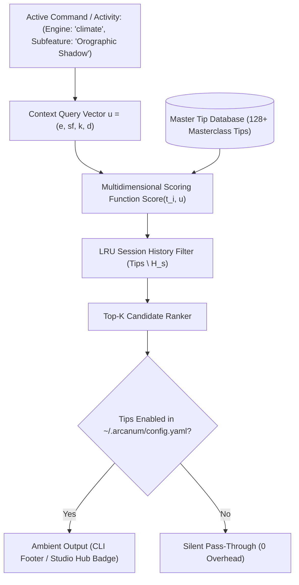
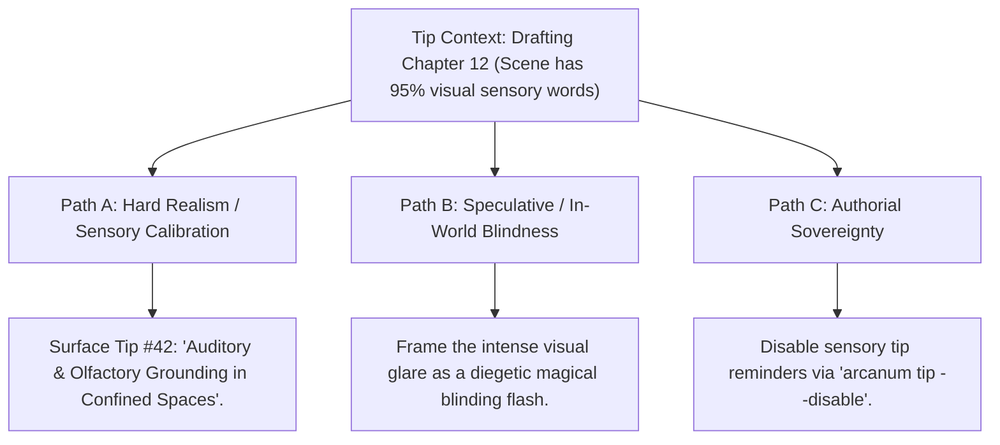

# Dynamic Intelligent Tips & Ambient Craft Wisdom Engine (`docs/TIPS.md`)
> **Core Authoring & Knowledge Discovery Engine** | **CLI:** `arcanum tip` / `arcanum tips`

---

## 1. Overview & Theoretical Rationale

The **Ars Arcanum Dynamic Intelligent Tip Engine** (`scripts/lib/tips.py`) is an ambient, non-intrusive craft intelligence and technical discovery system engineered for speculative fiction novelists, narrative designers, worldbuilders, and dramaturgs.

Modern creative operating systems encapsulate hundreds of specialized mathematical, physical, linguistic, and structural capabilities across 50+ domain engines. However, authors frequently experience cognitive friction and "feature blindness":
1. **Unused Specialized Capabilities**: Powerful analytical subfeatures (e.g. Roche limit disruption formulas, orographic rain shadow thermodynamics, Gresham's law currency debasement triggers, Novikov self-consistency causality loops, Fitts tension arcs) remain underutilized because they reside deep in technical documentation.
2. **Context-Free Clichés**: Generic writing advice ("Show, don't tell", "Kill your darlings") feels patronizing and provides zero actionable value during deep drafting or complex astrophysics calculations.
3. **Flow-Breaking Modals**: Intrusive popup dialogs shatter the author's psychological flow state and creative immersion.

```
+-------------------------------------------------------------------------------+
|                    ARS ARCANUM AMBIENT TIP ENGINE                             |
|                                                                               |
|  +--------------------+     Context Vector Engine     +--------------------+  |
|  | Active Activity /  | ----------------------------> | Multidimensional   |  |
|  | Engine Command     |                               | Relevance Scoring  |  |
|  +--------------------+                               +--------------------+  |
|            |                                                    |             |
|            v                                                    v             |
|  [Pillar & Subfeature Match]                          [LRU History Filter]    |
|  (Astrophysics, Conlang, Pacing)                      (Zero-Stall Variety)    |
|            |                                                    |             |
|            +----------------------------------------------------+             |
|                                     |                                         |
|                                     v                                         |
|                   +-----------------------------------+                       |
|                   |  Ambient Presentation Rails       |                       |
|                   |  - CLI Command Footers            |                       |
|                   |  - Studio Hub Top Banner Badges   |                       |
|                   |  - Zen Studio Collapsible Drawer  |                       |
|                   +-----------------------------------+                       |
|                                     |                                         |
|                                     v                                         |
|                     [Masterclass Craft Discovery]                             |
|                     [100% Sovereign Author Control]                           |
+-------------------------------------------------------------------------------+
```

The Tip Engine implements a **Videogame Loading-Screen Ambient Discovery Model**: delivering high-density, mathematically rigorous craft wisdom and tool shortcuts exactly when and where they are relevant, with zero modal interruptions and complete author sovereignty.

---

## 2. Mathematical Formalism & Contextual Scoring



### 2.1 Multidimensional Relevance Scoring Formula
When a command is executed, a query vector $\mathbf{u} = \big(u_{\text{engine}}, \, u_{\text{subfeature}}, \, u_{\text{tags}}, \, u_{\text{depth}}\big)$ is evaluated against all database tips $\mathbf{t}_i$:

$$\text{Score}(\mathbf{t}_i, \mathbf{u}) = w_e \cdot \mathbb{I}(e_i = u_e) + w_{sf} \cdot \operatorname{Jaccard}(sf_i, u_{sf}) + w_k \cdot \left| \text{Tags}_i \cap \text{Toks}(\mathbf{u}) \right| + w_d \cdot \mathcal{W}_{\text{depth}}(d_i, u_d)$$

Where:
- $w_e = 50.0$: Weight for exact engine domain match.
- $w_{sf} = 25.0$: Weight for subfeature alignment.
- $w_k = 8.0$: Weight per overlapping keyword tag.
- $w_d = 10.0$: Weight for requested depth level (`intermediate`, `advanced`, `masterclass`).

### 2.2 Zero-Stall Session History Cycling ($H_s$)
To prevent repetitive tip fatigue, the engine maintains an ephemeral session history set $H_s \subset \text{Database}$. Candidates are selected exclusively from the complement set $\text{Database} \setminus H_s$:

$$\text{Selection Candidate Set}: \quad \mathcal{S}_{\text{candidates}} = \begin{cases} \text{Database} \setminus H_s & \text{if } |\text{Database} \setminus H_s| > 0 \\ \text{Database} \quad (\text{Reset } H_s \gets \emptyset) & \text{if exhaustively cycled} \end{cases}$$

---

## 3. Tip Taxonomy Across the 6 System Pillars

| Pillar Code | Domain Pillar | Primary Topics & Mathematical Engines | Example Masterclass Craft Focus |
|---|---|---|---|
| **P1** | **Cosmology & Physics** | `astrophysics`, `climate`, `cosmology`, `journey` | Roche limit tidal disruption, Coriolis storm bands, Keplerian orbital resonance. |
| **P2** | **Society & Systems** | `economy`, `factions`, `governance`, `tactical_sim` | Gresham's law currency debasement, feudal levy logistics, lanchester combat laws. |
| **P3** | **Narrative & Chronology**| `timeline_sync`, `plot_matrix`, `pacing`, `concordance`| Novikov self-consistency causal loops, Fitts tension arcs, Braided multi-POV synchronization. |
| **P4** | **Editorial Craft & Style**| `stylistics`, `senses`, `idioms`, `voice`, `dialogue` | Micro-sensory palette ratios, Erdős-Heaps lexical richness, dialect phonetic distancing. |
| **P5** | **Manuscript Drafting** | `manuscript_scaffold`, `zen_studio`, `sprint` | 16-paradigm beat allocations, flow-state velocity targets, anti-procrastination locks. |
| **P6** | **System Ops & RAG** | `vault_search`, `corpus_export`, `codex_export`, `diff`| TF-IDF sub-linear scoring, SQLite FTS5 BM25 queries, lossless schema refactoring. |

---

## 4. Tip Schema Specification & Example Records

```yaml
# Tip Schema Structure
id: "tip_climate_orographic_shadow"
engine: "climate"
feature: "Precipitation & Wind Cells"
subfeature: "Orographic Rain Shadow"
pillar: "cosmology_physics"
category: "craft"
depth: "masterclass"
title: "Orographic Rain Shadows: The Science of Plausible Deserts"
content: "When prevailing winds push moist maritime air masses against a mountain range, adiabatic cooling forces precipitation on the windward slope. The descending air on the leeward slope is dry and warm, creating hyper-arid desert basins directly adjacent to lush coastal rainforests."
rationale: "Adiabatic lapse rate causes moisture to condense as air ascends, leaving dry rain shadows on the opposite side."
example: "Placing a desert behind the Iron Spire Range explains why the eastern nomadic clans survive exclusively on seasonal meltwater wadis."
tags:
  - "geography"
  - "mountains"
  - "desert"
  - "climate"
  - "plausibility"
weight: 1.2
```

---

## 5. CLI Execution & User Sovereignty Reference

```bash
# 1. Fetch a random high-value tip across any domain
arcanum tip

# 2. Fetch a tip tailored to a specific engine or pillar
arcanum tip climate
arcanum tip economy
arcanum tip pacing

# 3. Target a specific subfeature
arcanum tip astrophysics --subfeature "Roche Limit"

# 4. Filter by depth level (masterclass only)
arcanum tip --depth masterclass

# 5. Output structured JSON for IDE plugins and status bars
arcanum tip magic_system --format json

# 6. Global User Sovereignty (Disable/Enable tips completely)
arcanum tip --status
arcanum tip --disable
arcanum tip --enable
```

---

## 6. Tri-Fold Creative Advisory Resolutions



### Scenario: Contextual Writing Tip Surfaced During Revision
- **Path A (Hard Realism / Craft Calibration)**:
  - The author reads the ambient tip in the CLI footer and adds tactile and auditory details (the cold sweat on the hilt, the hum of the stone) to enrich the scene.
- **Path B (Diegetic Adaptation)**:
  - The sensory imbalance is intentionally embraced: the protagonist is in a sensory deprivation chamber or dazzled by solar radiance.
- **Path C (Authorial Sovereignty)**:
  - If the author prefers complete silence during drafting sprints, run `arcanum tip --disable` to turn off all ambient hints across the environment.

---

## 7. Recommended Reading, References & Media

### 7.1 Foundational Craft & Worldbuilding Treatises
- **Sanderson, Brandon (2020)**. *Brandon Sanderson's Guide to Writing Epic Fantasy & Worldbuilding*. Dragonsteel Books.  
  *The defining craft rules for hard vs soft magic systems, continuity tracking, and satisfying story promises.*
- **Le Guin, Ursula K. (1998)**. *Steering the Craft: A Twenty-First-Century Guide to Sailing the Sea of Story*. Mariner Books. ISBN: 978-0544611610.  
  *Masterclass on sentence rhythm, POV distance, sensory immersion, and narrative voice.*
- **Card, Orson Scott (1990)**. *How to Write Science Fiction & Fantasy*. Writer's Digest Books. ISBN: 978-0898794168.  
  *The seminal guide to MICE quotient nesting, world rules, and exposition delivery.*

### 7.2 Scientific & Worldbuilding Media Lectures
- **Artifexian**: *The Complete Worldbuilding Video Masterclass Series (Planetary Physics, Tectonics, Climate, Conlangs)*.  
  *Step-by-step mathematical and scientific worldbuilding principles.*
- **Biblaridion**: *Alien Biospheres & Reforged Worldbuilding Series*.  
  *Exemplary evolutionary biology, conlang phonology, and historical worldbuilding.*
- **Hello Future Me (Tim Hickson)**: *On Writing and Worldbuilding (Volumes 1 & 2)*.  
  *Deep dramaturgical analysis of character arcs, foreshadowing, and worldbuilding integration.*
- **Tale Foundry**: *The Anatomy of Fiction: Story Circles, Tropes, and Literary Monsters*.  
  *Deep video essays dissecting narrative architecture and speculative themes.*
- **Isaac Arthur (SFIA)**: *Science & Futurism with Isaac Arthur: Hard Sci-Fi Worldbuilding*.  
  *Hard science megastructures, interstellar travel physics, and Fermi paradox solutions.*
- **PBS Space Time & Kurzgesagt**: *Astrophysics, Quantum Mechanics, and Cosmological Entropy*.  
  *Visual explanations of orbital mechanics, black holes, and space-time geometry.*

### 7.3 Landmark Speculative Case Studies
- **Sanderson, Brandon**: *The Stormlight Archive* (Roshar Ecology and Highstorms). Tor Books.  
  *Exemplar of rigorous ecological worldbuilding where crustacean biology and meteorology dictate culture and architecture.*
- **Herbert, Frank**: *Dune* (Arrakis Ecology and Hydrology). Chilton Books.  
  *The quintessential masterclass in interdisciplinary worldbuilding fusing religion, economics, and planetary ecology.*
- **Tolkien, J.R.R.**: *The Lord of the Rings* (Linguistic Foundation of Middle-earth).  
  *Secondary world where entire mythologies, geographies, and genealogies grew out of constructed linguistic roots.*
