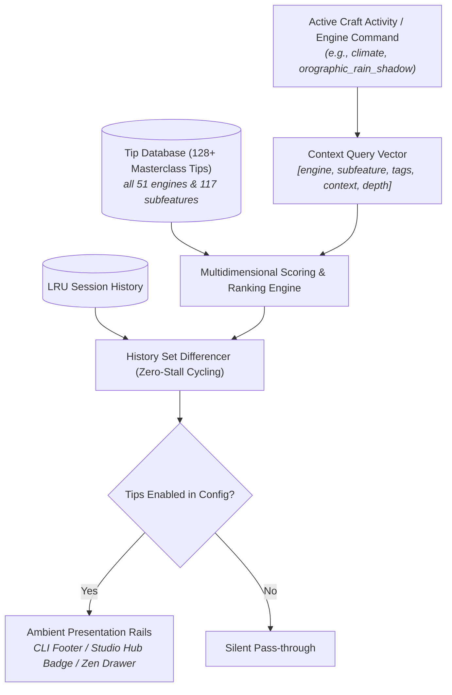

# Dynamic Intelligent Tips & Craft Wisdom Engine (`docs/TIPS.md`)
> **Core Authoring & Knowledge Discovery Engine** | **CLI:** `arcanum tip` / `arcanum tips`

---

## 1. Overview & Theoretical Rationale

The **Dynamic Intelligent Tip Engine** (`scripts/lib/tips.py`) is an ambient, non-intrusive craft and technical discovery system engineered for speculative fiction authors, narrative designers, and worldbuilders.

Modern creative operating systems contain hundreds of advanced mathematical, scientific, and dramaturgical features across 50+ domain engines. However, authors frequently experience feature blindness:
1. **Unused Craft Capabilities**: Powerful subfeatures (e.g. Roche limit disruption formulas, orographic rain shadows, Gresham's law debasement triggers, Novikov self-consistency loop checks) remain undiscovered because they reside deep in technical documentation.
2. **Context Mismatch**: Generic tips ("Remember to show, don't tell") waste authorial attention and feel patronizing.
3. **Intrusive Popups**: Modal interruptions break flow state and drafting velocity.

The Ars Arcanum Tip Engine solves this with **videogame loading-screen style ambient presentation** that is:
- **Intelligently Contextual**: Automatically surfaces tips specifically relevant to the engine, subfeature, or drafting task the author is currently performing.
- **Strictly Non-Obvious & High-Value**: Curates masterclass craft insights, mathematical equations, narrative psychology, and cross-domain synergies rather than elementary advice.
- **Non-Intrusive**: Rendered seamlessly in CLI command footers, Studio Hub top badges, and Zen Studio collapsible drawers.
- **100% Author Sovereignty**: Easily toggled on or off globally via CLI (`arcanum tip --disable`), Studio Hub settings, or configuration files.

---

## 2. Tip Metadata Architecture & Retrieval Mechanics



### 2.1 Tip Specification Schema
Every tip in the database is defined with structured metadata:
- **`id`**: Unique identifier (e.g. `tip_astrophysics_roche_limit`).
- **`engine`**: Canonical engine name (e.g. `astrophysics`, `climate`, `conlang`, `magic_system`).
- **`feature`** & **`subfeature`**: Specific tool capabilities (e.g. `Roche Limit & Planetary Rings`, `Orographic Rain Shadow`).
- **`category`**: `craft`, `core`, or `utility`.
- **`pillar`**: Domain pillar (`cosmology_physics`, `society_systems`, `narrative_chronology`, `editorial_craft`, `manuscript_drafting`, `system_ops`).
- **`title`**: Concise, evocative headline.
- **`content`**: Actionable craft or technical advice.
- **`rationale`**: The mathematical, scientific, or dramaturgical principle underpinning the tip.
- **`example`**: Concrete in-universe or manuscript demonstration.
- **`tags`**: Keyword index for fuzzy retrieval and cross-domain bridges.
- **`depth`**: `intermediate`, `advanced`, or `masterclass`.
- **`weight`**: Relative retrieval priority.

### 2.2 Multidimensional Token & Subfeature Scoring
When a tip query $\mathbf{u} = (\text{engine}, \text{subfeature}, \text{context}, \text{query})$ is executed:

$$\text{Score}(\mathbf{t}_i, \mathbf{u}) = w_e \cdot \mathbb{I}(e_i = u_e) + w_{sf} \cdot \text{Sim}(sf_i, u_{sf}) + w_k \cdot |\text{Tags}_i \cap \text{Toks}(\mathbf{u})| + w_d \cdot \text{DepthWeight}_i$$

- **Exact Engine Match**: $+50.0$ points.
- **Subfeature Token Overlap**: $+20.0$ points per matching keyword.
- **Cross-Domain Tag Matches**: $+8.0$ points.
- **Context Overlap** (e.g. `drafting`, `worldbuilding`, `revision`): $+12.0$ points.

### 2.3 Zero-Stall History Cycling
To prevent repetitive tip fatigue, the database maintains a session history set $H_s$. Candidate tips are drawn from $\text{Tips} \setminus H_s$. When all relevant tips in a category have been shown, $H_s$ automatically clears, guaranteeing seamless variety.

---

## 3. CLI Command Reference

### Display Contextual Tips
```bash
# Get a random high-value tip across the ecosystem
python -m scripts.lib.cli tip

# Get a tip tailored to a specific engine
python -m scripts.lib.cli tip astrophysics
python -m scripts.lib.cli tip conlang
python -m scripts.lib.cli tip economy

# Query tip for a specific subfeature
python -m scripts.lib.cli tip climate --subfeature "Orographic Rain Shadow"
python -m scripts.lib.cli tip pacing --subfeature "Fitts Tension Curves"

# Filter by depth
python -m scripts.lib.cli tip --depth masterclass

# Output structured JSON for IDE integration
python -m scripts.lib.cli tip magic_system --format json
```

### Manage User Sovereignty & Preferences
```bash
# Check current tip display status
python -m scripts.lib.cli tip --status

# Disable tip displays globally
python -m scripts.lib.cli tip --disable

# Re-enable tip displays
python -m scripts.lib.cli tip --enable

# List all engines with tip coverage
python -m scripts.lib.cli tip --list-engines
```

---

## 4. UI & Ecosystem Integration Surfaces

### 4.1 CLI Ambient Footers
When executing craft commands (e.g. `arcanum climate`, `arcanum conlang`), a single-line or bordered non-intrusive tip footer appears at the end of the output, highlighting a non-obvious synergy.

### 4.2 Studio Desktop Hub (`💡 Contextual Tip Banner`)
- Appears at the top of domain tabs with dynamic rotation.
- Contextually adapts when the user navigates between tabs (e.g. switching to the *Cartography* tab instantly pulls geological and drainage tips).
- Includes quick **"Roll Another Tip"** and **"Dismiss / Disable"** controls.

### 4.3 Zen Drafting Studio (`💡 Craft Wisdom` Drawer)
- An in-situ collapsible drawer tab in the distraction-free drafting environment.
- Automatically analyzes active manuscript keywords (e.g., detects dialogue heavy scenes vs action sequences) and suggests relevant craft wisdom.

---

## 5. Verification & Testing

```bash
# Run unit tests for tip retrieval, scoring, and alias resolution
python -m unittest tests/test_tips.py

# Run full repository test suite
python -m unittest discover tests

# Check linting and static typing
ruff check scripts/lib/tips.py
mypy scripts/lib/tips.py
```
