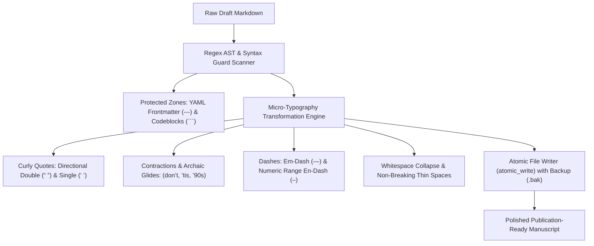
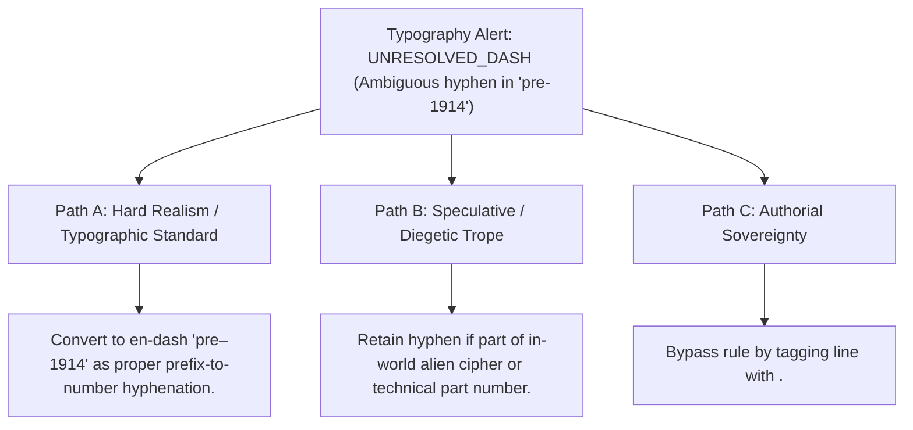

# Smart Typography Normalizer, Micro-Typography & Bringhurst Polish (`docs/TYPOGRAPHY.md`)
> **Domain B: Linguistics, Conlang, Idioms & Stylistics** | **CLI:** `arcanum typography` / `arcanum typo-clean`

---

## 1. Overview & Theoretical Rationale

The **Ars Arcanum Typography Engine** (`scripts/lib/typography_cleaner.py`) is an offline micro-typography transformer, smart quote converter, em/en-dash normalizer, and publication formatting validator built for novelists, publishers, and typographers.

Drafts written across code editors, word processors, and mobile note apps accumulate typographic errors that detract from literary polish:
1. **Typewriter Straight Quotes**: Raw ASCII quotes (`"`, `'`) instead of typographic directional curly quotes (`“`, `”`, `‘`, `’`).
2. **Ambiguous Dashes**: Doubled hyphens (`--`) or minus signs used indiscriminately for em-dashes (`—`) in dialogue interruptions and en-dashes (`–`) in numeric date ranges.
3. **Improper Ellipses**: Three raw period characters (`...`) that space inconsistently across different rendering engines instead of the dedicated Unicode horizontal ellipsis (`…`).
4. **Accidental Markdown Syntax Corruption**: Converting triple-dash YAML frontmatter delimiters (`---`) into em-dashes, breaking metadata parsers.

The Typography Engine applies Robert Bringhurst's *Elements of Typographic Style* principles using pure Python regular expressions and deterministic AST preservation, converting raw text into publication-ready literary typography while safeguarding code blocks and frontmatter.

---

## 2. Micro-Typography & Transformation Formulation



### 2.1 Robert Bringhurst Typographic Rules
1. **Quotation Hierarchy & Directionality**:
   - Double Quotes: Opening `“` ($\text{U+201C}$) before word boundaries; closing `”` ($\text{U+201D}$) after punctuation or word end.
   - Single Quotes / Nested Quotes: Opening `‘` ($\text{U+2018}$) and closing `’` ($\text{U+2019}$).
2. **Apostrophes in Contractions & Elisions**:
   - Contractions (`don't` $\to$ `don’t`) and possessives (`Elena's` $\to$ `Elena’s`) always receive right single quote / apostrophe `’` ($\text{U+2019}$).
   - Archaic leading apostrophes (`'tis` $\to$ `’tis`, `'90s` $\to$ `’90s`) must maintain right apostrophe curl.
3. **Dash Disambiguation**:
   - **Em-Dash (`—`, $\text{U+2014}$)**: Used for abrupt syntactic breaks, parenthetical thoughts, and dialogue interruptions without surrounding whitespace.
   - **En-Dash (`–`, $\text{U+2013}$)**: Used for numeric ranges ($1914\text{–}1918$, $\text{pp. } 20\text{–}25$) and compound relational proper nouns (*London–Paris railway*).
4. **Ellipsis Spacing (`…`, $\text{U+2026}$)**:
   - Single Unicode glyph replacing three discrete periods, preventing awkward line wraps across periods.

---

## 3. Transformation Rules Reference Matrix

| Input Pattern | Typographic Output | Unicode Code Point | Craft Rule / Application |
|:---|:---|:---:|---|
| `"hello"` | `“hello”` | `U+201C`, `U+201D` | Double directional quotation marks. |
| `'hello'` | `‘hello’` | `U+2018`, `U+2019` | Single directional quotation marks. |
| `don't`, `it's` | `don’t`, `it’s` | `U+2019` | Contraction / possessive apostrophe. |
| `'tis`, `'90s` | `’tis`, `’90s` | `U+2019` | Leading elision / decade apostrophe. |
| `--` or `---` (prose) | `—` | `U+2014` | Em-dash for narrative pauses and interruptions. |
| `1420-1425`, `pp. 12-18`| `1420–1425`, `pp. 12–18`| `U+2013` | En-dash for numeric and chronological ranges. |
| `...` or `. . .` | `…` | `U+2026` | Horizontal ellipsis glyph. |
| `trailing whitespace \n`| `\n` | `\n` | Strips useless whitespace at line ends. |

### Syntax Protection Guarantees:
- **YAML Frontmatter**: The exact string `---` bounding frontmatter headers is protected via regex lookahead masks.
- **Fenced Code Blocks**: Text inside ```` ``` ```` code blocks is untouched.

---

## 4. Command-Line Interface (CLI) Reference

```bash
# Dry-run preview of typographic changes with unified diff
arcanum typography Manuscript/Chapter_01.md

# Apply changes in-place with automatic .bak backup files
arcanum typography Manuscript/ -i

# Apply in-place without creating backup files
arcanum typography Manuscript/ -i --no-backup

# Show full unified diff for all modified files
arcanum typography Manuscript/ --diff

# Output JSON summary statistics of replacements
arcanum typography Manuscript/ --json

# Query micro-typography rules and Bringhurst principles
arcanum doc typography --math --why
```

---

## 5. Tri-Fold Creative Advisory Resolutions



### Scenario: Ambiguous Prefix Hyphen vs. Range
- **Path A (Hard Realism / Strict Bringhurst Standard)**:
  - Apply an en-dash when connecting a prefix to a date or proper noun (*pre–World War I*).
- **Path B (Speculative / Diegetic Inscription)**:
  - If the text represents a machine serial code (*Unit-994-B*), retain ASCII hyphens.
- **Path C (Authorial Sovereignty)**:
  - Use `--no-backup` and customize regex patterns in `typography_config.yaml`.

---

## 6. Content Security Policy & Offline Isolation

The Typography Engine operates 100% offline with atomic POSIX/Windows file locking and zero external network dependencies:

```html
<meta http-equiv="Content-Security-Policy" content="default-src 'none'; style-src 'unsafe-inline'; script-src 'unsafe-inline'; img-src data:; media-src data: blob:;">
```
