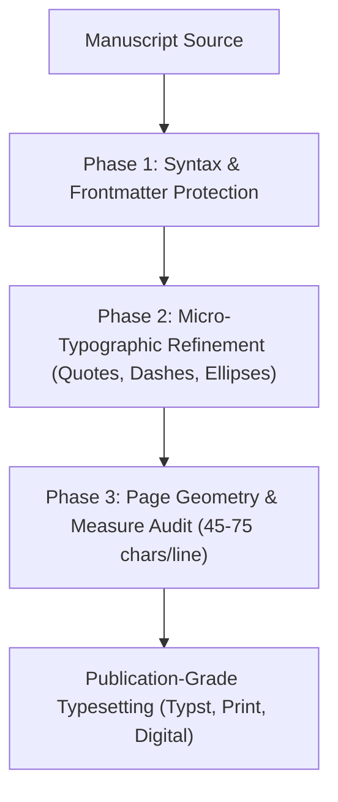
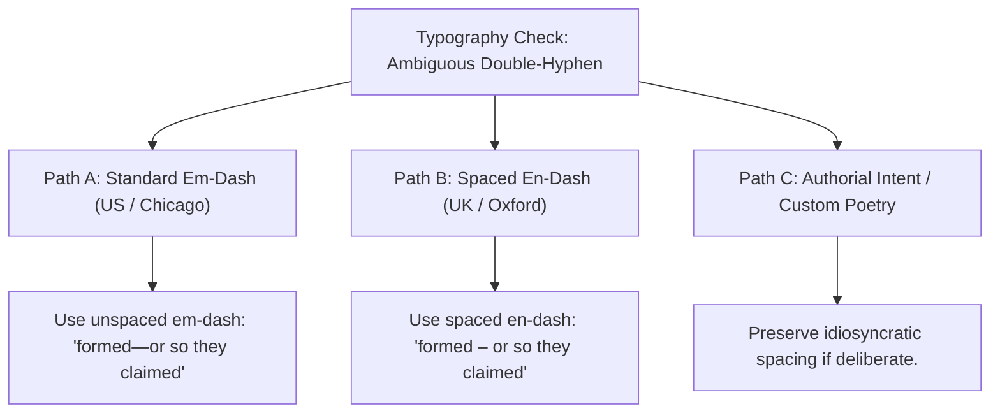

# Master Craft Reference: Book Typography, Page Geometry & Typesetting Standards (`docs/TYPOGRAPHY.md`)
> **Domain B: Linguistics, Conlang, Idioms & Stylistics** | **Master Craft Reference Manual**
> **Primary Active Toolchain:** [Smart Typography](file:///templates/world-bible/.obsidian/plugins/obsidian-smart-typography) + [formatForge](file:///templates/world-bible/.obsidian/plugins/formatforge) + [Style Settings](file:///templates/world-bible/.obsidian/plugins/obsidian-style-settings) + [Typst CLI](https://typst.app/) | **Reference CLI:** `arcanum clean`

---

## 1. Overview & Theoretical Rationale

This document serves as the **Master Craft Reference Manual** for book typography, micro-typographic punctuation, optical kerning rules, and page block geometry in speculative fiction. Active in-vault punctuation conversion is handled automatically by **Smart Typography**, page formatting by **formatForge** and **Style Settings**, and final print typesetting by **Typst** (see [Master External Tools Guide](file:///docs/guides/EXTERNAL_TOOLS_AND_PLUGINS.md)).

Drafting across multiple text editors, operating systems, and note-taking applications inevitably introduces subtle typographic artifacts that degrade visual hierarchy and reader immersion:

1. **Typewriter Punctuation**: Straight ASCII double (`"`) and single (`'`) quotation marks, which lack optical directionality.
2. **Ambiguous Hyphens**: Raw double-hyphens (`--`) or minus signs used indiscriminately for em-dashes (`—`) in dialogue interruptions, and hyphens used instead of en-dashes (`–`) in chronological and numerical ranges.
3. **Disjointed Ellipses**: Three raw period characters (`...`) that space unevenly and cause improper line breaks across margin boundaries instead of the dedicated Unicode horizontal ellipsis (`…`).
4. **Disrupted Page Block Geometry**: Imbalanced text measures (lines too long or too short), poor leading ratios, and irregular margins that cause eye fatigue.



This doctrine outlines classical typographic principles drawn from Robert Bringhurst's *The Elements of Typographic Style*, Jan Tschichold's *The Form of the Book*, and Jost Hochuli's *Detail in Typography*, providing rules for clean authorial manuscripts and publication-ready page layouts.

---

## 2. Page Geometry & Classical Proportional Formulas

### 2.1 Golden Section & Tschichold Canon
The golden ratio $\phi$ governs harmonious book page proportions:

$$\phi = \frac{1 + \sqrt{5}}{2} \approx 1.6180339887$$

A page ratio of $1 : 1.618$ (or the classical Renaissance ratio $2 : 3$) balances negative whitespace and text density.

```
+--------------------------------------------------------+
|  Jan Tschichold / Van de Graaf Canon Page Geometry     |
|                                                        |
|  +-----------------------------+--------------------+  |
|  | Left Page (Verso)           | Right Page (Recto) |  |
|  |                             |                    |  |
|  |    +--------+ (Top: 2u)     |     (Top: 2u)      |  |
|  |    |        |               |      +--------+    |  |
|  | (3u| Text   |(1.5u)   (1.5u)| (3u) | Text   |    |  |
|  | Out| Block  |Inner     Inner| Out  | Block  |    |  |
|  |    |        |               |      |        |    |  |
|  |    +--------+               |      +--------+    |  |
|  |    (Bottom: 4u)             |      (Bottom: 4u)  |  |
|  | +-----------------------------+--------------------+  |
+--------------------------------------------------------+
```

### 2.2 Van de Graaf Canon Grid Mathematics
In the Van de Graaf Canon, the page is divided into a $9 \times 9$ grid ($81$ equal sub-rectangles). The text block occupies a $6 \times 6$ sub-rectangle, yielding the classical margin proportions:

$$\text{Inner Margin} : \text{Top Margin} : \text{Outer Margin} : \text{Bottom Margin} = 1.5 : 2.0 : 3.0 : 4.0$$

The text block dimensions are exactly:
$$\text{Width}_{\text{text}} = \frac{2}{3} \times \text{Width}_{\text{page}}, \qquad \text{Height}_{\text{text}} = \frac{2}{3} \times \text{Height}_{\text{page}}$$

### 2.3 The Typographic Measure & Leading Formulas
The **measure** ($M$) is the width of a line of text in characters. For optimal reading comfort and saccadic eye movements:

$$45 \le M \le 75\text{ characters per line} \quad (\text{Optimal } M_{\text{opt}} \approx 65\text{ characters / } 10\text{–}12\text{ words})$$

The **leading** ($L$, line-height) is proportioned to the font size ($S$) and line length ($W$):

$$L = S \times \left( 1.25 + 0.05 \times \frac{W - W_{\text{min}}}{W_{\text{opt}}} \right)$$

For body text at $11\text{pt}$, standard literary leading is $14.5\text{pt} - 16\text{pt}$ ($1.35\times - 1.45\times$).

---

## 3. Micro-Typographic Transformation Rules

| Input Pattern | Typographic Output | Unicode Glyph | Code Point | Bringhurst Craft Rule & Context |
|:---|:---|:---:|:---:|---|
| `"word"` | `“word”` | `“ ”` | `U+201C`, `U+201D` | Double curly quotes; opening quote precedes word; closing follows punctuation. |
| `'word'` | `‘word’` | `‘ ’` | `U+2018`, `U+2019` | Single curly quotes / nested dialogue quotes. |
| `don't`, `it's` | `don’t`, `it’s` | `’` | `U+2019` | Contractions and possessive apostrophes strictly receive right curly apostrophe. |
| `'tis`, `'90s` | `’tis`, `’90s` | `’` | `U+2019` | Leading elisions and decade apostrophes curl to the right ($\text{U+2019}$), never opening single quote ($\text{U+2018}$). |
| `--` or `---` (prose) | `—` | `—` | `U+2014` | Em-dash for parenthetical breaks and abrupt dialogue cutoffs (no surrounding spaces). |
| `1420-1425`, `pp. 12-18` | `1420–1425`, `pp. 12–18` | `–` | `U+2013` | En-dash for chronological and numerical ranges, page spans, and joint relationships. |
| `...` or `. . .` | `…` | `…` | `U+2026` | Dedicated horizontal ellipsis glyph preventing split line breaks across periods. |
| `Chapter 4`, `Fig. 2` | `Chapter 4` | `\u00A0` | `U+00A0` | Non-breaking space prevents separating chapter/figure numbers from their label. |
| `100 km`, `50 kg` | `100 km` | `\u202F` | `U+202F` | Narrow non-breaking space locks measurement units to numeric quantities. |

---

## 4. Syntax Protection in Markdown & Typesetting

When refining prose, authors should ensure that markup syntax is protected:
- **YAML Frontmatter**: Keep delimiters (`---`) and scalar strings intact.
- **Fenced Code Blocks**: Preserve triple backticks and programming syntax.
- **Inline Code & Math**: Keep LaTeX formulas (`$...$`) and backtick literals uncurled.

---

## 5. Author Self-Editing Rubric & Typographic Standards Matrix



### 5.1 Authorial Typographic Checklist

1. **Straight Quotes Elimination**: Ensure all double and single quotes are converted to proper typographic curly quotation marks.
2. **Apostrophe Direction**: Check leading elisions (*’twas*, *’90s*, *rock ’n’ roll*) to confirm they curl to the right ($\text{U+2019}$), not left.
3. **Dash Disambiguation**: Use en-dashes for numerical and date ranges (`pp. 45–52`, `1812–1814`) and em-dashes for parenthetical interjections or dialogue cutoffs.
4. **Ellipsis Glyphs**: Replace raw triple periods with single Unicode horizontal ellipsis characters (`…`) to avoid margin splitting.

---

## 6. Recommended Reading, References & Media

### 6.1 Foundational Typographical Treatises & Classics
- **Bringhurst, Robert (2012)**. *The Elements of Typographic Style* (Version 4.0). Hartley & Marks Publishers. ISBN: 978-0881792126.  
  *The undisputed masterpiece of modern typographic philosophy, proportion, rhythm, punctuation, and type anatomy.*
- **Tschichold, Jan (1991)**. *The Form of the Book: Essays on the Morality of Good Design*. Hartley & Marks. ISBN: 978-0881790344.  
  *Essential essays on page geometry, the Van de Graaf canon, the Golden Section, and margin proportions.*
- **Hochuli, Jost (2015)**. *Detail in Typography*. Éditions B42 / Hyphen Press. ISBN: 978-2917855607.  
  *The definitive guide to micro-typography: letters, letterspacing, word spacing, line spacing, and paragraph measure.*
- **Warde, Beatrice (1955)**. *The Crystal Goblet: Sixteen Essays on Typography*. Sylvan Press.  
  *The classic philosophical treatise arguing that typography should be transparent and serve the reader's immersion.*
- **Lupton, Ellen (2014)**. *Thinking with Type: A Critical Guide for Designers, Writers, Editors, & Students* (2nd Edition). Princeton Architectural Press. ISBN: 978-1568989693.  
  *Modern handbook covering visual grids, typographic hierarchy, and digital typesetting.*

### 6.2 Technical Standards & Unicode Specifications
- **Unicode Consortium (2024)**. *The Unicode Standard, Version 15.1 – Chapter 6: Writing Systems and Punctuation*. [unicode.org](https://www.unicode.org/versions/Unicode15.1.0/).  
  *Authoritative definitions of directional quotes, dashes, ellipses, and space characters.*
- **The University of Chicago Press (2017)**. *The Chicago Manual of Style* (17th / 18th Edition). University of Chicago Press.  
  *The industry benchmark for hyphenation, dash conventions, quotation nesting, and punctuation order.*

### 6.3 Video Lectures, Masterclasses & Typographic Media
- **TDC (Type Directors Club) Masterclasses**: *The Geometry of the Book: From Gutenberg to Modern Type Layout*.  
  *Visual lectures on page proportions, grids, and the Golden Section.*
- **Ellen Lupton (Maryland Institute College of Art)**: *Typographic Hierarchy and Reading Mechanics*.  
  *Exploration of how the human eye scans lines of text, saccadic reading jumps, and line length fatigue.*
- **Brandon Sanderson's BYU Creative Writing Lectures**: *Typesetting and Manuscript Formatting for Professional Submission*.  
  *Industry standards for novel manuscript preparation.*

### 6.4 Landmark Speculative Case Studies
- **Danielewski, Mark Z.**: *House of Leaves* (2000). Pantheon Books.  
  *The ultimate extreme of ergodic typography, using spatial layout, colored fonts, and architectural page structures.*
- **Pratchett, Terry**: *Discworld Series* (The Voice of DEATH).  
  *Iconic use of SMALL CAPS without quotation marks to establish an unearthly, supernatural vocal timbre.*
- **Tolkien, J.R.R.**: *The Lord of the Rings* (First Edition Typesetting by Allen & Unwin).  
  *Exemplar of classical British page geometry, runic calligraphy, and custom Elvish tengwar type insets.*
