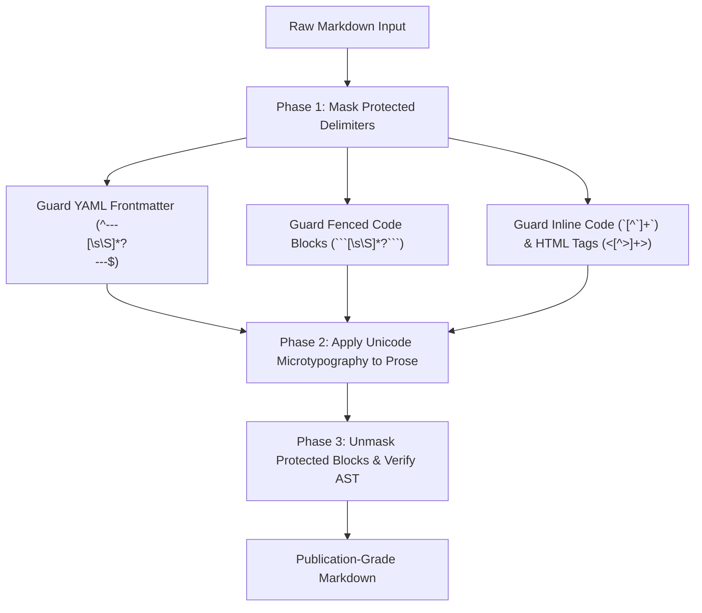
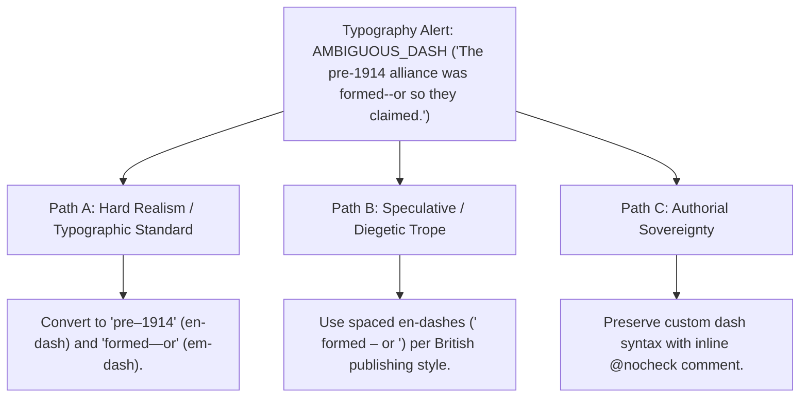

# Book Typography, Golden Section Geometry & Micro-Typographic Polish (`docs/TYPOGRAPHY.md`)
> **Domain B: Linguistics, Conlang, Idioms & Stylistics** | **CLI:** `arcanum typography` / `arcanum typo-clean`

---

## 1. Overview & Theoretical Rationale

The **Ars Arcanum Typography Engine** (`scripts/lib/typography_cleaner.py`) is an offline micro-typography transformer, smart quote converter, em/en-dash normalizer, and page geometry layout validator engineered for novelists, typographers, and sovereign publishers.

Drafting across multiple text editors, operating systems, and note-taking applications inevitably introduces subtle typographic artifacts that degrade visual hierarchy and reader immersion:
1. **Typewriter Punctuation**: Straight ASCII double (`"`) and single (`'`) quotation marks, which lack optical directionality.
2. **Ambiguous Hyphens**: Raw double-hyphens (`--`) or minus signs used indiscriminately for em-dashes (`—`) in dialogue interruptions, and hyphens used instead of en-dashes (`–`) in chronological and numerical ranges.
3. **Disjointed Ellipses**: Three raw period characters (`...`) that space unevenly and cause improper line breaks across margin boundaries instead of the dedicated Unicode horizontal ellipsis (`…`).
4. **Disrupted Page Block Geometry**: Imbalanced text measures (lines too long or too short), poor leading ratios, and irregular margins that cause eye fatigue.

```
+-------------------------------------------------------------------------------+
|                      ARS ARCANUM TYPOGRAPHY PIPELINE                          |
|                                                                               |
|  +--------------------+      Syntax-Masked AST        +--------------------+  |
|  | Markdown Source    | ----------------------------> | Protected Delimiter|  |
|  | (YAML & Codeblocks)|                               | & Prose Isolator   |  |
|  +--------------------+                               +--------------------+  |
|            |                                                    |             |
|            v                                                    v             |
|  [Directional Quotes]                                [Bringhurst Metric Check]|
|  [Em/En-Dash Split]                                  [Measure: 45-75 chars]   |
|  [Non-Breaking Spaces]                               [Van de Graaf Canon Grid]|
|            |                                                    |             |
|            +----------------------------------------------------+             |
|                                     |                                         |
|                                     v                                         |
|                     [Atomic In-Place File Writer]                             |
|                     [Deterministic .bak Backups]                              |
|                     [Publishing-Grade Typography]                             |
+-------------------------------------------------------------------------------+
```

The Typography Engine applies the classical principles of Robert Bringhurst's *The Elements of Typographic Style*, Jan Tschichold's *The Form of the Book*, and Jost Hochuli's *Detail in Typography*, executing deterministic Unicode microtypography while protecting Markdown code blocks and YAML frontmatter.

---

## 2. Page Geometry & Classical Proportional Formulas

### 2.1 Golden Section & Tschichold Canon
The golden ratio $\phi$ governs harmonious book page proportions:

$$\phi = \frac{1 + \sqrt{5}}{2} \approx 1.6180339887$$

A page ratio of $1 : 1.618$ (or the classical Renaissance ratio $2 : 3$) balances negative whitespace and text density.

```
+--------------------------------------------------------+
|  Jan Tschichold / Van de Graaf Canon Page Geometry     |
|                                                        |
|  +-----------------------------+--------------------+  |
|  | Left Page (Verso)           | Right Page (Recto) |  |
|  |                             |                    |  |
|  |    +--------+ (Top: 2u)     |     (Top: 2u)      |  |
|  |    |        |               |      +--------+    |  |
|  | (3u| Text   |(1.5u)   (1.5u)| (3u) | Text   |    |  |
|  | Out| Block  |Inner     Inner| Out  | Block  |    |  |
|  |    |        |               |      |        |    |  |
|  |    +--------+               |      +--------+    |  |
|  |    (Bottom: 4u)             |      (Bottom: 4u)  |  |
|  +-----------------------------+--------------------+  |
+--------------------------------------------------------+
```

### 2.2 Van de Graaf Canon Grid Mathematics
In the Van de Graaf Canon, the page is divided into a $9 \times 9$ grid ($81$ equal sub-rectangles). The text block occupies a $6 \times 6$ sub-rectangle, yielding the classical margin proportions:

$$\text{Inner Margin} : \text{Top Margin} : \text{Outer Margin} : \text{Bottom Margin} = 1.5 : 2.0 : 3.0 : 4.0$$

The text block dimensions are exactly:
$$\text{Width}_{\text{text}} = \frac{2}{3} \times \text{Width}_{\text{page}}, \qquad \text{Height}_{\text{text}} = \frac{2}{3} \times \text{Height}_{\text{page}}$$

### 2.3 The Typographic Measure & Leading Formulas
The **measure** ($M$) is the width of a line of text in characters. For optimal reading comfort and saccadic eye movements:

$$45 \le M \le 75\text{ characters per line} \quad (\text{Optimal } M_{\text{opt}} \approx 65\text{ characters / } 10\text{–}12\text{ words})$$

The **leading** ($L$, line-height) is proportioned to the font size ($S$) and line length ($W$):

$$L = S \times \left( 1.25 + 0.05 \times \frac{W - W_{\text{min}}}{W_{\text{opt}}} \right)$$

For body text at $11\text{pt}$, standard literary leading is $14.5\text{pt} - 16\text{pt}$ ($1.35\times - 1.45\times$).

---

## 3. Micro-Typographic Transformation Rules

| Input Pattern | Typographic Output | Unicode Glyph | Code Point | Bringhurst Craft Rule & Context |
|:---|:---|:---:|:---:|---|
| `"word"` | `“word”` | `“ ”` | `U+201C`, `U+201D` | Double curly quotes; opening quote precedes word; closing follows punctuation. |
| `'word'` | `‘word’` | `‘ ’` | `U+2018`, `U+2019` | Single curly quotes / nested dialogue quotes. |
| `don't`, `it's` | `don’t`, `it’s` | `’` | `U+2019` | Contractions and possessive apostrophes strictly receive right curly apostrophe. |
| `'tis`, `'90s` | `’tis`, `’90s` | `’` | `U+2019` | Leading elisions and decade apostrophes curl to the right ($\text{U+2019}$), never opening single quote ($\text{U+2018}$). |
| `--` or `---` (prose) | `—` | `—` | `U+2014` | Em-dash for parenthetical breaks and abrupt dialogue cutoffs (no surrounding spaces). |
| `1420-1425`, `pp. 12-18` | `1420–1425`, `pp. 12–18` | `–` | `U+2013` | En-dash for chronological and numerical ranges, page spans, and joint relationships. |
| `...` or `. . .` | `…` | `…` | `U+2026` | Dedicated horizontal ellipsis glyph preventing split line breaks across periods. |
| `Chapter 4`, `Fig. 2` | `Chapter 4` | `\u00A0` | `U+00A0` | Non-breaking space prevents separating chapter/figure numbers from their label. |
| `100 km`, `50 kg` | `100 km` | `\u202F` | `U+202F` | Narrow non-breaking space locks measurement units to numeric quantities. |

---

## 4. Syntax-Protection Architecture

To prevent corrupting machine-readable metadata and code blocks, the transformation pipeline utilizes a three-phase masking strategy:



---

## 5. CLI Execution & Option Reference

```bash
# 1. Preview typographic corrections with unified colored diff (dry-run)
arcanum typography Manuscripts/Book-01/Chapter_01.md

# 2. Apply corrections in-place across all manuscript chapters with automatic .bak backup
arcanum typography Manuscripts/Book-01/ --in-place

# 3. Apply corrections in-place without generating .bak backup files
arcanum typography Manuscripts/Book-01/ -i --no-backup

# 4. Enforce strict Bringhurst measure checking (flags lines > 80 chars)
arcanum typography Manuscripts/Book-01/ --check-measure

# 5. Output full replacement statistics as JSON
arcanum typography Manuscripts/Book-01/ --json
```

### CLI Parameter Reference Table

| Flag / Option | Short | Type | Default | Description |
|---|---|---|---|---|
| `targets` | (Positional) | `Path...` | *Required* | File(s) or directory to analyze and transform. |
| `--in-place` | `-i` | `bool` | `False` | Modifies source files directly on disk. |
| `--no-backup` | `-n` | `bool` | `False` | Suppresses creation of `.bak` backup files. |
| `--check-measure` | `-m` | `bool` | `False` | Analyzes paragraph measure and line length. |
| `--diff` | `-d` | `bool` | `True` | Emits colored terminal diff of changes. |
| `--json` | `-j` | `bool` | `False` | Outputs structured JSON statistics. |

---

## 6. Tri-Fold Creative Advisory Resolutions



### Scenario: Disambiguating Compound Dashes
- **Path A (Hard Realism / Chicago & Bringhurst Standard)**:
  - Numerical ranges receive en-dashes (`1914–1918`); narrative interruptions and parenthetical clauses receive unspaced em-dashes (`formed—or so they claimed`).
- **Path B (British / Commonwealth Publishing Style)**:
  - Parenthetical clauses utilize spaced en-dashes (`formed – or so they claimed`), which is the dominant convention in UK publishing (Penguin, Oxford University Press).
- **Path C (Authorial Sovereignty)**:
  - If the author deliberately employs idiosyncratic dash styling (e.g., Emily Dickinson-style spaced dashes), pass `--style=spaced-en` or disable dash replacement.

---

## 7. Recommended Reading, References & Media

### 7.1 Foundational Typographical Treatises & Classics
- **Bringhurst, Robert (2012)**. *The Elements of Typographic Style* (Version 4.0). Hartley & Marks Publishers. ISBN: 978-0881792126.  
  *The undisputed masterpiece of modern typographic philosophy, proportion, rhythm, punctuation, and type anatomy.*
- **Tschichold, Jan (1991)**. *The Form of the Book: Essays on the Morality of Good Design*. Hartley & Marks. ISBN: 978-0881790344.  
  *Essential essays on page geometry, the Van de Graaf canon, the Golden Section, and margin proportions.*
- **Hochuli, Jost (2015)**. *Detail in Typography*. Éditions B42 / Hyphen Press. ISBN: 978-2917855607.  
  *The definitive guide to micro-typography: letters, letterspacing, word spacing, line spacing, and paragraph measure.*
- **Warde, Beatrice (1955)**. *The Crystal Goblet: Sixteen Essays on Typography*. Sylvan Press.  
  *The classic philosophical treatise arguing that typography should be transparent and serve the reader's immersion.*
- **Lupton, Ellen (2014)**. *Thinking with Type: A Critical Guide for Designers, Writers, Editors, & Students* (2nd Edition). Princeton Architectural Press. ISBN: 978-1568989693.  
  *Modern handbook covering visual grids, typographic hierarchy, and digital typesetting.*

### 7.2 Technical Standards & Unicode Specifications
- **Unicode Consortium (2024)**. *The Unicode Standard, Version 15.1 – Chapter 6: Writing Systems and Punctuation*. [unicode.org](https://www.unicode.org/versions/Unicode15.1.0/).  
  *Authoritative definitions of directional quotes, dashes, ellipses, and space characters.*
- **The University of Chicago Press (2017)**. *The Chicago Manual of Style* (17th / 18th Edition). University of Chicago Press.  
  *The industry benchmark for hyphenation, dash conventions, quotation nesting, and punctuation order.*

### 7.3 Video Lectures, Masterclasses & Typographic Media
- **TDC (Type Directors Club) Masterclasses**: *The Geometry of the Book: From Gutenberg to Modern Type Layout*.  
  *Visual lectures on page proportions, grids, and the Golden Section.*
- **Ellen Lupton (Maryland Institute College of Art)**: *Typographic Hierarchy and Reading Mechanics*.  
  *Exploration of how the human eye scans lines of text, saccadic reading jumps, and line length fatigue.*
- **Brandon Sanderson's BYU Creative Writing Lectures**: *Typesetting and Manuscript Formatting for Professional Submission*.  
  *Industry standards for novel manuscript preparation.*

### 7.4 Landmark Speculative Case Studies
- **Danielewski, Mark Z.**: *House of Leaves* (2000). Pantheon Books.  
  *The ultimate extreme of ergodic typography, using spatial layout, colored fonts, and architectural page structures.*
- **Pratchett, Terry**: *Discworld Series* (The Voice of DEATH).  
  *Iconic use of SMALL CAPS without quotation marks to establish an unearthly, supernatural vocal timbre.*
- **Tolkien, J.R.R.**: *The Lord of the Rings* (First Edition Typesetting by Allen & Unwin).  
  *Exemplar of classical British page geometry, runic calligraphy, and custom Elvish tengwar type insets.*
