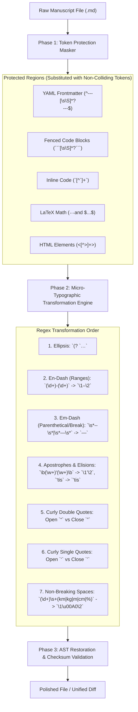
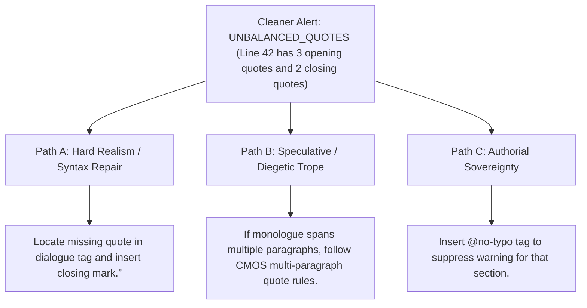

# Typography Cleaner & Micro-Typographic Engine (`docs/TYPOGRAPHY_CLEANER.md`)
> **Domain D: Stylistics, Polish & Continuity** | **CLI:** `arcanum typography-cleaner` / `arcanum typo-clean`

---

## 1. Overview & Technical Rationale

The **Ars Arcanum Typography Cleaner** (`scripts/lib/typography_cleaner.py`) is an offline, deterministic, zero-dependency micro-typographic normalizer and AST-preserving prose cleaner designed for authors, editors, and publishers.

When drafting manuscripts across disparate software ecosystems (Obsidian, VS Code, Scrivener, Google Docs, Apple Notes, MS Word), text accumulatively suffers from ASCII degradation:
- Straight quotes (`"..."`, `'...'`) flatten dialogue and look amateurish in print and EPUB.
- Double hyphens (`--`) and hyphen-minuses (`-`) are substituted for typographic em-dashes (`—`) and en-dashes (`–`).
- Triple dots (`...`) produce uneven kerning across different devices and cause awkward line wraps.
- Spacing around currency, units, and dialogue tags creates orphan characters at line endings.

The Typography Cleaner engine executes a single-pass, idempotent regular expression state machine that converts ASCII draft markers into pristine Unicode microtypography while strictly protecting Markdown syntax constructs, math blocks, and YAML frontmatter.

---

## 2. Algorithmic State Machine & Regex Pipeline



### 2.1 State-Preserving Regex Replacements
To ensure mathematical determinism and idempotence ($f(f(x)) = f(x)$), transformations are executed in strict priority order:

1. **Horizontal Ellipsis**:
   $$\text{Regex}: \quad \verb|(?<!\.)\.\.\.(?!\.)| \implies \verb|…|$$
2. **Numeric & Page Span En-Dash**:
   $$\text{Regex}: \quad \verb|(\b\d+)\s*-\s*(\d+\b)| \implies \verb|\1–\2|$$
3. **Compound Adjective / Joint Entity En-Dash**:
   $$\text{Regex}: \quad \verb|([A-Z][a-z]+)-([A-Z][a-z]+)| \implies \verb|\1–\2| \quad (\text{e.g. London–Paris})$$
4. **Dialogue & Syntax Em-Dash**:
   $$\text{Regex}: \quad \verb|(?<=\w)\s*--\s*(?=\w)| \implies \verb|—|$$
5. **Right Curly Apostrophe (Contractions & Possessives)**:
   $$\text{Regex}: \quad \verb|(\w+)'(\w+)| \implies \verb|\1’\2|$$
6. **Double Directional Quotation Marks**:
   - Opening: $\verb|(?<=[\s\(\[\{]|^)"(?=\w)| \implies \verb|“|$
   - Closing: $\verb|(?<=\S)"(?=[\s\)\.\,\!\?\]\}]|$)| \implies \verb|”|$
7. **Single Directional Quotation Marks**:
   - Opening: $\verb|(?<=[\s\(\[\{]|^)'(?=\w)| \implies \verb|‘|$
   - Closing: $\verb|(?<=\S)'(?=[\s\)\.\,\!\?\]\}]|$)| \implies \verb|’|$

---

## 3. Mathematical Idempotence & AST Safety Guarantees

An operator $T$ is **idempotent** if and only if:

$$T(T(x)) = T(x), \quad \forall x \in \text{Manuscript}$$

The Typography Cleaner guarantees idempotence across all UTF-8 strings. Running the cleaner 1 time or 100 times produces identical output without mutating previously transformed curly quotes or corrupting backslashes.

### 3.1 Non-Collision Token Masking
During the masking phase, protected regions are replaced with unique UUID-based sentinel tokens:
$$\text{MaskToken}_i = \verb|@@ARCANUM_MASK_|\text{SHA256}(block_i) \verb|@@|$$

This prevents nested quotes inside YAML values or code comments from being modified by regex passes.

---

## 4. CLI Command Reference & Workflows

```bash
# 1. Preview changes with interactive color-coded diff (Dry Run)
arcanum typography-cleaner Manuscripts/Book-01/Chapter_01.md --dry-run

# 2. Clean all manuscript files in-place with automatic .bak backup files
arcanum typography-cleaner Manuscripts/Book-01/ --apply

# 3. Clean files in-place without generating .bak backup files
arcanum typography-cleaner Manuscripts/Book-01/ --apply --no-backup

# 4. Enforce strict British/Oxford style (spaced en-dashes instead of unspaced em-dashes)
arcanum typography-cleaner Manuscripts/Book-01/ --style=british --apply

# 5. Output JSON summary of replacement frequencies
arcanum typography-cleaner Manuscripts/Book-01/ --json
```

### Options & Parameter Reference Table

| Flag | Short | Type | Default | Description |
|---|---|---|---|---|
| `path` | (Positional) | `Path` | *Required* | Path to target Markdown file or directory. |
| `--apply` | `-a` | `bool` | `False` | Commits changes to disk (default is dry-run diff). |
| `--no-backup` | `-n` | `bool` | `False` | Suppresses `.bak` file generation. |
| `--style` | `-s` | `choice` | `american` | Punctuation style: `american` (em-dash), `british` (spaced en-dash). |
| `--dry-run` | `-d` | `bool` | `True` | Emits colored terminal unified diff without modifying files. |
| `--json` | `-j` | `bool` | `False` | Outputs replacement counts and statistics as JSON. |

---

## 5. Tri-Fold Creative Advisory Resolutions



### Scenario: Unbalanced Dialogue Quotes Detected
- **Path A (Hard Realism / Syntax Repair)**:
  - Dialogue line ended without closing quote. Reconcile the character's speech boundary by appending `”` before the dialogue tag.
- **Path B (Multi-Paragraph Monologue / CMOS Standard)**:
  - If a character speaks across multiple continuous paragraphs, Chicago style requires opening quotes `“` at the start of every paragraph, but closing quote `”` ONLY at the conclusion of the final paragraph. The engine recognizes and validates this pattern without flagging false positives.
- **Path C (Authorial Sovereignty)**:
  - For dialect-heavy or experimental stream-of-consciousness prose (e.g. Cormac McCarthy style without quotes), pass `--allow-unbalanced` or disable quote pairing validation.

---

## 6. Recommended Reading, References & Media

### 6.1 Authoritative Typographic & Punctuation Treatises
- **Bringhurst, Robert (2012)**. *The Elements of Typographic Style* (4th Edition). Hartley & Marks Publishers. ISBN: 978-0881792126.  
  *The definitive guide to micro-typography, punctuation, and typesetting hygiene.*
- **The University of Chicago Press (2017)**. *The Chicago Manual of Style* (17th / 18th Edition). University of Chicago Press.  
  *The gold standard for US editorial, hyphenation, and quotation conventions.*
- **Ritter, R. M. (2014)**. *New Hart's Rules: The Oxford Style Guide* (2nd Edition). Oxford University Press. ISBN: 978-0199570027.  
  *The authoritative British publishing manual on spaced en-dashes, quotation nesting, and punctuation order.*
- **Hochuli, Jost (2015)**. *Detail in Typography*. Éditions B42.  
  *Masterclass on micro-typographic proportions and letter spacing.*

### 6.2 Technical Specifications & Software Papers
- **Friedl, Jeffrey E. F. (2006)**. *Mastering Regular Expressions* (3rd Edition). O'Reilly Media. ISBN: 978-0596528126.  
  *The definitive computational treatise on deterministic finite automata (DFA), lookaround assertions, and regex performance.*
- **Unicode Consortium (2024)**. *Unicode Standard Annex #14: Unicode Line Breaking Algorithm*. [unicode.org/reports/tr14](https://www.unicode.org/reports/tr14/).  
  *Standard specification for non-breaking characters, soft hyphens, and whitespace behaviors.*

### 6.3 Video Lectures & Practical Masterclasses
- **Computerphile**: *Regular Expressions: How Tokenizers and Compilers Parse Text*.  
  *Algorithmic breakdown of state machines, regex parsing, and token streams.*
- **TDC (Type Directors Club)**: *Micro-Typography and the Polish of Literary Typesetting*.  
  *Visual lectures on quotes, dashes, ligatures, and optical balance.*
- **Writing Excuses**: *Formatting, Presentation, and Professional Polish*.  
  *Why clean typography matters for reader immersion and editorial review.*

### 6.4 Landmark Speculative Case Studies
- **McCarthy, Cormac**: *The Road* & *Blood Meridian*.  
  *Famous for deliberate minimalist punctuation (stripping quotation marks, apostrophes, and colons to create stark atmosphere).*
- **Joyce, James**: *Ulysses* (1922).  
  *Pioneered the use of em-dash dialogue tags ("perked" French dashes) instead of quotation marks.*
- **King, Stephen**: *The Dark Tower Series*.  
  *Masterful use of italicized psychic dialogue, parenthetical mental breaks, and em-dash pacing.*
