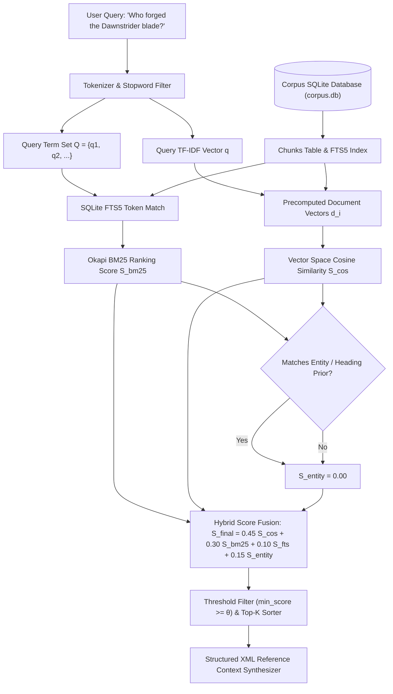
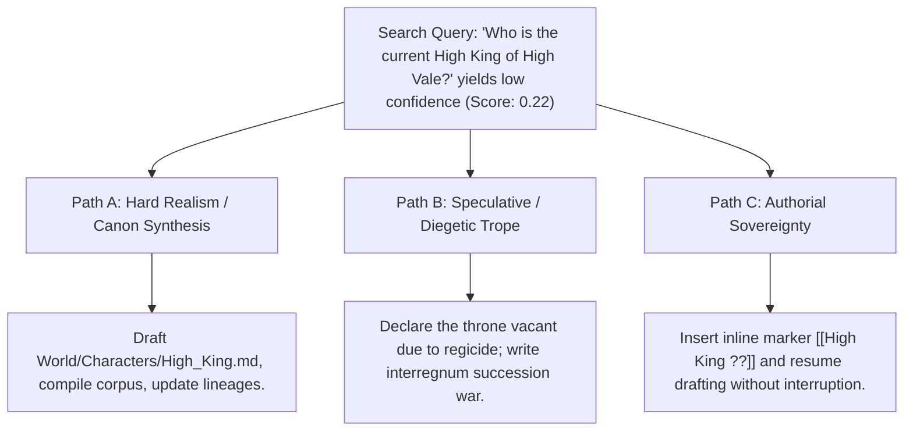

# Sovereign Local Vault Search & Canonical Lore Retrieval (`docs/VAULT_SEARCH.md`)
> **Domain F: Corpus Analytics, Search, Diff & Continuity** | **CLI:** `arcanum search` / `arcanum vault search`

---

## 1. Overview & Theoretical Rationale

The **Ars Arcanum Vault Search Engine** (`scripts/lib/vault_search.py`) is an offline hybrid mathematical search, lore recall, and structured reference synthesis suite engineered for speculative fiction novelists, worldbuilders, and loremasters.

Authors managing massive, multi-volume narrative universes and complex World Bibles face a critical cognitive challenge: the immediate, precise recall of canonical continuity facts under drafting pressure. Questions such as *"Who forged the Dawnstrider blade during the Second Age?"*, *"What are the exact thermodynamic constraints of Aether soulstone resonance?"*, or *"Which noble houses were present at the Treaty of Vaelen?"* must be answerable within milliseconds without derailing the creative flow state.

Historically, writers have been forced into a false dichotomy:
1. **Manual File Browsing & Grep Search**: Exact keyword searches (`grep`, file system search) break down when queries use synonyms, conceptual phrasing, or partial terms, and they lack relevance ranking.
2. **Cloud Vector Databases & Commercial AI Telemetry**: Uploading raw manuscripts and proprietary worldbuilding bibles to cloud endpoints exposes unpublished intellectual property to training pipelines, data leakage, API rate limits, latency spikes, and vendor lock-in.

```
+-------------------------------------------------------------------------------+
|                      ARS ARCANUM SOVEREIGN SEARCH ENGINE                     |
|                                                                               |
|  +-----------------------+   Zero Pip / Local CPU    +---------------------+  |
|  |  Markdown World Bible | ------------------------> | SQLite FTS5 (BM25)  |  |
|  | & Manuscript Chapters |                           | + TF-IDF Vector VSM |  |
|  +-----------------------+                           +---------------------+  |
|              |                                                  |             |
|              v                                                  v             |
|   [Heading-Aware Chunker]                             [Hybrid Fusion Engine]  |
|              |                                                  |             |
|              +--------------------------------------------------+             |
|                                         |                                     |
|                                         v                                     |
|                         [Sub-Millisecond Lore Recall]                         |
|                         [Structured Context Synthesis]                        |
+-------------------------------------------------------------------------------+
```

The Vault Search Engine establishes **Zero-Dependency Sovereign Retrieval**. It runs entirely on the local CPU in native Python and SQLite C-bindings, executing sub-millisecond lexical, statistical, and vector searches across hundreds of thousands of words with zero cloud dependencies.

---

## 2. Information Retrieval & Hybrid Mathematical Formulation

The search engine implements a multi-stage retrieval architecture that fuses statistical term weighting, probabilistic document ranking, inverted index full-text matching, and entity graph priors.



### 2.1 Term Frequency-Inverse Document Frequency (TF-IDF) Vector Space Model
Let $D = \{d_1, d_2, \dots, d_N\}$ represent the corpus of all narrative chunks, and let $V = \{t_1, t_2, \dots, t_{|V|}\}$ be the vocabulary of all unique tokens across the corpus.

#### Term Frequency (Sub-Linear Logarithmic Scaling)
Raw term counts exhibit diminishing marginal relevance: encountering a keyword 20 times in a single chapter does not make the chapter 20 times more relevant than one containing it 4 times. Ars Arcanum applies sub-linear logarithmic term frequency scaling:

$$\text{TF}(t, d) = \begin{cases} 1 + \ln(f_{t,d}) & \text{if } f_{t,d} > 0 \\ 0 & \text{if } f_{t,d} = 0 \end{cases}$$

Where $f_{t,d}$ is the raw frequency count of term $t$ in chunk $d$.

For standard proportional normalization:
$$\text{TF}_{\text{norm}}(t,d) = \frac{f_{t,d}}{\sum_{t' \in d} f_{t',d}}$$

#### Inverse Document Frequency (Robertson-Spärck Jones Formulation)
To penalize ubiquitous terms and elevate rare lore terminology (e.g., proper nouns, unique artifacts, arcane concepts), the engine employs the smoothed Robertson-Spärck Jones IDF:

$$\text{IDF}(t, D) = \ln\left(1 + \frac{|D| - |\{d \in D : t \in d\}| + 0.5}{|\{d \in D : t \in d\}| + 0.5}\right)$$

Where:
- $|D| = N$ is the total number of document chunks in the corpus.
- $|\{d \in D : t \in d\}| = \text{df}(t)$ is the document frequency (number of chunks containing term $t$).

The coordinate weight of term $t$ in document chunk $d$ is:
$$w(t, d) = \text{TF}(t, d) \cdot \text{IDF}(t, D)$$

### 2.2 Vector Space Cosine Similarity
Every chunk $d$ and the query $q$ are projected into an $|V|$-dimensional Euclidean vector space $\mathbb{R}^{|V|}$:
$$\mathbf{u} = \vec{q} = \big(w(t_1, q), w(t_2, q), \dots, w(t_{|V|}, q)\big)^T$$
$$\mathbf{v} = \vec{d} = \big(w(t_1, d), w(t_2, d), \dots, w(t_{|V|}, d)\big)^T$$

The geometric alignment between query and chunk is calculated via the inner product normalized by Euclidean $L_2$ norms:

$$\text{CosineSim}(\mathbf{u}, \mathbf{v}) = \frac{\mathbf{u} \cdot \mathbf{v}}{\|\mathbf{u}\|_2 \|\mathbf{v}\|_2} = \frac{\sum_{t \in q \cap d} w(t, q) \cdot w(t, d)}{\sqrt{\sum_{t \in q} w(t, q)^2} \cdot \sqrt{\sum_{t \in d} w(t, d)^2}}$$

Since all weights $w \ge 0$, $\text{CosineSim}(\mathbf{u}, \mathbf{v}) \in [0.0, 1.0]$.

### 2.3 Probabilistic Okapi BM25 Ranking in SQLite FTS5
While TF-IDF measures angular orientation in vector space, Okapi BM25 models the probabilistic odds of relevance under document length variation. In Ars Arcanum's SQLite FTS5 engine, BM25 scoring is formulated as:

$$\text{BM25}(D, Q) = \sum_{i=1}^{|Q|} \text{IDF}(q_i) \cdot \frac{f(q_i, D) \cdot (k_1 + 1)}{f(q_i, D) + k_1 \cdot \left(1 - b + b \cdot \frac{|D|}{\text{avgdl}}\right)}$$

Where:
- $Q = \{q_1, q_2, \dots, q_m\}$ is the query containing search terms.
- $f(q_i, D)$ is the raw term frequency of query token $q_i$ in chunk $D$.
- $|D|$ is the length of chunk $D$ in words.
- $\text{avgdl}$ is the average chunk length across the entire corpus:
  $$\text{avgdl} = \frac{1}{|D_{\text{total}}|} \sum_{d \in D_{\text{total}}} |d|$$
- $k_1 \in [1.2, 2.0]$ controls term frequency saturation non-linearity (default $k_1 = 1.5$).
- $b \in [0.0, 1.0]$ controls document length penalty severity (default $b = 0.75$).

```
BM25 Term Contribution vs Raw Frequency f(q, D)
Score
  ^
  |                  k1 = 1.2 (Fast Saturation)
  |              .-----------------------------
  |          . '     k1 = 2.0 (Slow Saturation)
  |       .'    . ' ' ' ' ' ' ' ' ' ' ' ' ' ' '
  |     .'   . '
  |   .'  . '
  |  / . '
  | /.'
  +---------------------------------------------> Term Frequency f(q, D)
```

### 2.4 Reciprocal Rank Fusion (RRF) & Multi-Factor Score Synthesis
To avoid calibration discrepancies between raw unbounded BM25 scores and bounded $[0, 1]$ cosine similarities, Ars Arcanum provides two fusion modes:

#### 1. Linear Weighted Hybrid Fusion
$$\mathcal{S}_{\text{hybrid}}(d, q) = \alpha \cdot \mathcal{S}_{\text{cos}}(d, q) + \beta \cdot \overline{\mathcal{S}}_{\text{bm25}}(d, q) + \gamma \cdot \mathcal{S}_{\text{fts}}(d, q) + \delta \cdot \mathcal{S}_{\text{entity}}(d, q)$$

Default calibrated hyperparameters:
$$\alpha = 0.45, \quad \beta = 0.30, \quad \gamma = 0.10, \quad \delta = 0.15$$
Subject to $\alpha + \beta + \gamma + \delta = 1.00$.

#### 2. Reciprocal Rank Fusion (RRF)
When ranking across disparate retrieval engines (e.g., lexical index $M_{\text{lex}}$, vector VSM $M_{\text{vec}}$, and graph traverser $M_{\text{graph}}$):

$$\text{RRF\_Score}(d \in D) = \sum_{m \in M} \frac{1}{k + r_m(d)}$$

Where $r_m(d)$ is the ordinal rank of document $d$ in engine $m$, and $k$ is a smoothing constant (standard $k = 60$).

---

## 3. Subfeatures & Architecture Matrix

| Subfeature | Algorithmic Mechanism | Diagnostic Output / Rule | Narrative Significance |
|---|---|---|---|
| **Zero-Pip Hybrid Retriever** | Pure Python TF-IDF coupled with SQLite FTS5 C-bindings. | Emits ranked, scored chunk list in $< 5\text{ms}$. | Delivers lightning-fast search without multi-gigabyte PyTorch/Transformers dependencies. |
| **Heading-Aware Chunking** | Markdown AST split at `##` / `###` with breadcrumb metadata. | Retains document hierarchy (`Characters > House Vaelen > Valerius`). | Prevents orphaned pronoun ambiguity and context destruction. |
| **Entity & Title Boosting** | Exact substring matches in note frontmatter `title` or `aliases`. | Adds $\delta = +0.20$ bonus to canonical primary records. | Ensures primary character dossiers rank higher than passing references. |
| **Parent Breadcrumb Injection** | Hierarchical ancestry prepended to chunk text before vectorization. | Chunks carry structural provenance: `[World/Factions.md :: The Iron Synod]`. | Disambiguates homonymous terms across different world regions. |
| **Injection-Safe Prompt Synthesis** | Formats retrieved chunks into standardized `<canonical_lore>` blocks. | Emits token-counted, escaped reference context. | Seamlessly feeds local LLM drafting environments without prompt hijacking. |
| **Multi-Taxonomy Filtering** | SQL `WHERE` clause scoping by category (`lore`, `manuscript`, `Magic`). | Constrains search space to selected narrative strata. | Allows instant isolation of magic rules versus historical timeline records. |

---

## 4. CLI Execution & Parameter Reference

The Vault Search CLI provides a rich terminal interface with formatted color tables, JSON export, and context-ready LLM prompt output.

```bash
# 1. Basic natural language query against the active workspace corpus
arcanum search "Who forged the Dawnstrider blade?"

# 2. Query a specific corpus database with custom top-k and threshold
arcanum search "Thermodynamic laws of Aether casting" -d dist/corpus/corpus.db -k 5 -m 0.25

# 3. Target search to a raw Obsidian folder (builds ephemeral memory index)
arcanum search "Treaty of Vaelen" -t "World/History/"

# 4. Scope query to specific taxonomy categories
arcanum search "Archon Valerius" --lore-category Characters,Factions,Lineages

# 5. Output structured XML prompt context block for local LLM consumption
arcanum search "Eldoria Moon Cycles" -f context -o dist/prompts/moon_context.xml

# 6. JSON output for automated scripting and tool integrations
arcanum search "Obsidian Citadel defenses" -f json | jq '.results[0]'
```

### Parameter Reference Table

| Flag / Option | Short | Type | Default | Description |
|---|---|---|---|---|
| `--query` | (Positional) | `str` | *Required* | Natural language query or keyword expression. |
| `--db-path` | `-d` | `Path` | `dist/corpus/corpus.db` | Path to compiled SQLite corpus database. |
| `--target-dir` | `-t` | `Path` | `None` | Path to raw Markdown directory for dynamic search. |
| `--top-k` | `-k` | `int` | `5` | Maximum number of top chunks to return. |
| `--min-score` | `-m` | `float` | `0.15` | Minimum hybrid similarity threshold $[0.0, 1.0]$. |
| `--lore-category`| `-c` | `str` | `None` | Comma-separated category filter (e.g. `Characters,Magic`). |
| `--format` | `-f` | `choice`| `table` | Output format: `table`, `json`, `context`, `ids`. |
| `--output` | `-o` | `Path` | `stdout` | Destination file for exported results. |

---

## 5. Structured Prompt Synthesizer & Output Architecture

When invoked with `-f context`, the search engine compiles retrieved fragments into a sanitized, token-budgeted XML block designed for sovereign local inference:

```xml
<canonical_lore_context query="Who forged the Dawnstrider blade?" generated_at="2026-10-06T11:00:00Z" total_chunks="2" est_tokens="342">
  <chunk id="lore_artifacts_004" score="0.884" title="Dawnstrider" category="Artifacts" path="World/Artifacts/Dawnstrider.md">
    <breadcrumb>World > Artifacts > Dawnstrider > Forging & Provenance</breadcrumb>
    <content>
      The Dawnstrider blade was forged during the Second Age (Solar Year 1042) by Grand Artificer Kaelen Vane within the Caldera of Solitude. It incorporates star-iron folded twelve times and quenched in primeval Aether essence.
    </content>
  </chunk>
  <chunk id="lore_characters_019" score="0.612" title="Kaelen Vane" category="Characters" path="World/Characters/Kaelen_Vane.md">
    <breadcrumb>World > Characters > Historical > Kaelen Vane > Major Works</breadcrumb>
    <content>
      Vane's masterwork, the Dawnstrider, was presented to High Queen Ysolda prior to the Siege of the Hollow Peaks. It was designed to channel solar thermal radiance without degenerating the bearer's neural pathways.
    </content>
  </chunk>
</canonical_lore_context>
```

---

## 6. Tri-Fold Creative Advisory Resolutions



### Scenario: Low Confidence Retrieval Alert ($\text{Score} < 0.25$)

When an author queries the vault and the engine returns low confidence scores across all corpus partitions:

1. **Path A (Hard Realism / Canon Synthesis)**:
   - *Diagnostic*: The query addresses an unwritten canonical fact.
   - *Resolution*: Create `World/Characters/High_King.md` with explicit frontmatter (`title: High King of High Vale`, `reign_start: 1120`). Rebuild the index with `arcanum corpus export`.
2. **Path B (Speculative / Diegetic Trope)**:
   - *Diagnostic*: The absence of canonical clarity can become an organic plot device.
   - *Resolution*: Incorporate an in-world mystery: royal records were incinerated during the Great Interregnum, leading rival pretenders to forge genealogical claims.
3. **Path C (Authorial Sovereignty)**:
   - *Diagnostic*: Creative momentum must not be broken for worldbuilding minutiae.
   - *Resolution*: Insert a temporary wikilink placeholder `[[High King of High Vale|High King]]` with an inline annotation `<!-- @lore: establish sovereign -->` and continue drafting the prose.

---

## 7. Recommended Reading, References & Media

### 7.1 Foundational Information Retrieval Treatises & Textbooks
- **Manning, Christopher D., Raghavan, Prabhakar, & Schütze, Hinrich (2008)**. *Introduction to Information Retrieval*. Cambridge University Press. ISBN: 978-0521865715.  
  *The defining academic textbook on vector space models, inverted index construction, TF-IDF weighting, probabilistic ranking, and scoring metrics.*
- **Salton, Gerard & Buckley, Christopher (1988)**. "Term-Weighting Approaches in Automatic Text Retrieval", *Information Processing & Management*, 24(5):513–523.  
  *Foundational paper introducing term frequency normalization, inverse document frequency, and vector cosine similarity.*
- **Robertson, Stephen E., & Spärck Jones, Karen (1976)**. "Relevance Weighting of Search Terms", *Journal of the American Society for Information Science*, 27(3):129–146.  
  *Landmark formulation of probabilistic relevance and index term weighting.*
- **Spärck Jones, Karen (1972)**. "A Statistical Interpretation of Term Specificity and Its Application in Retrieval", *Journal of Documentation*, 28(1):11–21.  
  *The original paper that established the mathematical concept of Inverse Document Frequency (IDF).*
- **Robertson, Stephen, & Zaragoza, Hugo (2009)**. "The Probabilistic Relevance Framework: BM25 and Beyond", *Foundations and Trends in Information Retrieval*, 3(4):333–389.  
  *Exhaustive derivation of Okapi BM25 and modern extensions.*

### 7.2 Technical Specifications & System Architecture Papers
- **SQLite Development Team (2024)**. *SQLite FTS5 Extension Documentation*. [SQLite FTS5 Docs](https://www.sqlite.org/fts5.html).  
  *Detailed specification of SQLite's full-text search virtual tables, BM25 internal ranking functions, and tokenizer pipelines.*
- **Cormack, Gordon V., Clarke, Charles L. A., & Buettcher, Stefan (2009)**. "Reciprocal Rank Fusion Outperforms Condorcet and Individual Rank Learning Methods", *Proceedings of the 32nd International ACM SIGIR Conference*, pp. 758–759.  
  *Mathematical formulation of rank-based fusion across disparate information retrieval engines.*

### 7.3 Seminal Video Lectures, Masterclasses & Theoretical Media
- **Stanford University CS224N / CS276 (Prof. Christopher Manning)**: *Information Retrieval and Natural Language Processing Lecture Series*. Stanford Online.  
  *Deep mathematical exploration of vector embeddings, tf-idf space, probabilistic ranking, and lexical search engines.*
- **Brandon Sanderson's BYU Creative Writing Lectures**: *Lecture 8: Worldbuilding, Lore Consistency, and Authorial Systems*. Brigham Young University.  
  *Pedagogical analysis of maintaining deep continuity across epic fantasy series without getting lost in worldbuilding rabbit holes.*
- **Tale Foundry**: *The Architecture of Fictional Lore: How Writers Keep Track of Impossible Worlds*.  
  *Analysis of World Bibles, lore concordance systems, and narrative continuity structures.*
- **Artifexian & Biblaridion**: *Systematic Worldbuilding and Knowledge Organization for Worldbuilders*.  
  *Step-by-step methodologies for organizing conlang grammars, geopolitical hierarchies, and physical cosmologies.*
- **PBS Space Time & Kurzgesagt**: *Information Theory, Entropy, and Data Retrieval*.  
  *Foundational explanations of Shannon entropy, vector spaces, and probabilistic clustering.*

### 7.4 Landmark Speculative Case Studies
- **Herbert, Frank**: *Dune* (1965) & *The Dune Encyclopedia* (Compiled by Dr. Willis E. McNelly, 1984).  
  *Exemplar of an exhaustive, multi-layered speculative universe requiring rigorous concordance and terminology management.*
- **Sanderson, Brandon**: *The Stormlight Archive* & *Cosmere Bible*. Dragonsteel Entertainment.  
  *Industrial-scale narrative universe continuity maintained through internal wiki and structured retrieval protocols.*
- **Tolkien, J.R.R.**: *The Lord of the Rings* and *The History of Middle-earth* (12 Volumes, Christopher Tolkien).  
  *The archetypal historical world bible demonstrating the challenge of multi-decade canon tracking and textual variants.*
