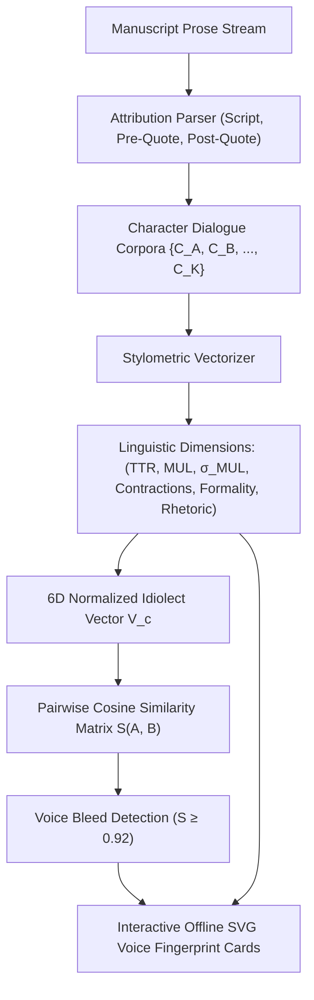
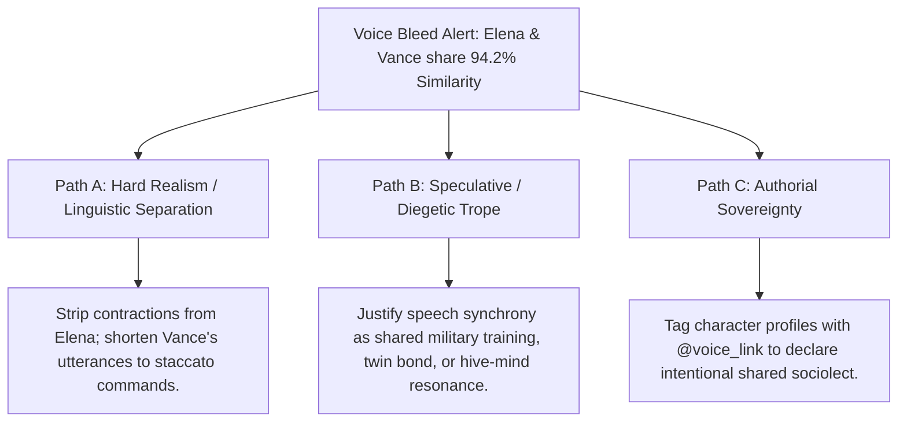

# Character Voice Profiler & Idiolect Fingerprint Architecture (`docs/VOICE.md`)
> **Domain B: Linguistics, Conlang, Idioms & Stylistics** | **CLI:** `arcanum voice` / `arcanum dialogue`

---

## 1. Overview & Theoretical Rationale

The **Ars Arcanum Voice Engine** (`scripts/lib/voice.py`) is an offline computational stylometry, sociolinguistic profiler, and dialogue fingerprinting suite designed for speculative fiction novelists and dramatists.

In ensemble storytelling, distinct character voices are the primary mechanism through which personality, social class, cultural origin, and psychological state are conveyed to the reader. When all characters in a cast share the author's personal linguistic habits, sentence structures, and lexical preferences, the manuscript suffers from **Voice Bleed (Character Homogeneity)**—breaking immersion and diminishing dramatic tension.

The Voice Engine automatically extracts character-attributed dialogue across chapters, computes quantifiable linguistic metrics (Type-Token Ratio, Mean Utterance Length, Contraction Frequency, Heylighen-Dewaele Formality Index, and Punctuation Rhetoric), constructs multi-dimensional idiolect feature vectors, and computes pairwise cosine similarity matrices to detect voice bleed deterministically.

---

## 2. Computational Stylometry & Mathematical Formulation



### 2.1 Lexical Richness & Type-Token Ratio
For a character's dialogue corpus containing $N$ total words (tokens) and $V$ distinct unique words (types):

$$\text{TTR} = \frac{V}{N}, \qquad \text{Root TTR (Guiraud's R)} = \frac{V}{\sqrt{N}}$$

- **High TTR ($> 0.65$)**: Indicates an erudite, polymathic, or formal vocabulary.
- **Low TTR ($< 0.40$)**: Indicates taciturn, repetitive, uneducated, or military-focused speech patterns.

### 2.2 Utterance Length Cadence & Dispersion
Let character $c$ speak $M$ utterances with word lengths $U = [u_1, u_2, \dots, u_M]$:

$$\mu_U = \frac{1}{M} \sum_{i=1}^M u_i, \qquad \sigma_U = \sqrt{\frac{1}{M} \sum_{i=1}^M (u_i - \mu_U)^2}$$

- **High $\mu_U$ ($> 25$ words)**: Oratorical, pedantic, aristocratic, or monologuing characters.
- **Low $\mu_U$ ($< 8$ words)**: Pragmatic soldiers, curt operatives, or evasive suspects.
- **High $\sigma_U$**: Emotionally volatile, dramatic speakers; **Low $\sigma_U$**: Methodical, calm, or robotic speakers.

### 2.3 Formality & Contraction Indices
Based on the Heylighen & Dewaele Formality Metric adapted for dialogue:

$$\text{Formality Index } F = \min\left(100.0, \, \max\left(0.0, \, 50.0 + 2.5 \times (\bar{L}_{\text{word}} - 4.5) - 2.0 \times \text{ContractionRate}\right)\right)$$

Where $\text{ContractionRate} = \frac{N_{\text{contractions}}}{N_{\text{words}}} \times 100$.

### 2.4 Punctuation Rhetoric Vector
The emotional and interrogative posture of speech is captured via a 4-element punctuation ratio vector $\vec{P}$:
$$\vec{P} = \left[ \frac{N_?}{M}, \, \frac{N_!}{M}, \, \frac{N_{\dots}}{M}, \, \frac{N_{\text{—}}}{M} \right] \quad (\text{Interrogative, Exclamatory, Hesitant/Trailing, Interrupted/Aggressive})$$

### 2.5 Normalized Idiolect Vector & Voice Bleed Matrix
Each character $c$ with $> 30$ dialogue words is mapped into a normalized 6-dimensional stylometric feature vector $\vec{V}_c$:

$$\vec{V}_c = \left[ \text{TTR}_c, \, \frac{\mu_{U, c}}{30.0}, \, \frac{\sigma_{U, c}}{15.0}, \, \frac{\text{ContractionRate}_c}{20.0}, \, \frac{F_c}{100.0}, \, \frac{N_{?, c} + N_{!, c}}{M_c} \right]$$

The pairwise voice similarity between character $A$ and character $B$ is the cosine similarity:

$$\text{Sim}(A, B) = \cos(\theta) = \frac{\vec{V}_A \cdot \vec{V}_B}{\|\vec{V}_A\|_2 \|\vec{V}_B\|_2}$$

$$\text{Voice Bleed Trigger} \iff \text{Sim}(A, B) \ge 0.92 \quad (\text{Characters sound indistinguishable})$$

---

## 3. Subfeatures Matrix

| Subfeature | Algorithmic Mechanism | Diagnostic Output / Rule | Narrative Craft Significance |
|---|---|---|---|
| **Multi-Format Dialogue Attribution** | Regex state machine parsing script, pre-quote, and post-quote speech. | Attributed dialogue strings linked to character entity names. | Collects pure character speech free of narrative prose contamination. |
| **Idiolect Vectorizer** | Computes 6D stylometric metrics per character corpus. | Emits quantitative fingerprint profile (TTR, MUL, Formality). | Establishes mathematically verifiable benchmarks for character distinctiveness. |
| **Voice Bleed & Homogeneity Alert** | Calculates pairwise cosine similarity across all character vectors. | Flags `VOICE_BLEED_WARNING` if $\text{Sim}(A, B) \ge 0.92$. | Alerts author when two distinct viewpoint characters share identical speech habits. |
| **Distinctive TF-IDF Lexicon** | Evaluates term frequencies per character against the manuscript corpus. | Emits Top-5 idiosyncratic signature vocabulary words per character. | Highlights favorite catchphrases, technical jargon, or swear words. |
| **Punctuation Rhetoric Profiler** | Measures ratios of questions, exclamations, ellipses, and em-dashes. | Visualizes conversational posture (Aggressive, Hesitant, Interrogative). | Reveals whether a character drives the scene or constantly yields ground. |

---

## 4. Author Extension & Configuration Guide

### 4.1 Dialogue Attribution Conventions (Markdown)
The Voice Engine automatically extracts dialogue formatted in any of the three major fiction styles:

```markdown
<!-- Style 1: Script Directives -->
Elena: "We must reach the vault before the eclipse."
Vance: "I don't think that's possible, Elena."

<!-- Style 2: Standard Fiction Post-Attribution -->
"We must reach the vault before the eclipse," said Elena.
"I don't think that's possible," muttered Vance.

<!-- Style 3: Action-Lead Pre-Attribution -->
Elena whispered, "The runes are glowing."
Vance shouted, "Fall back to the archway!"
```

### 4.2 Voice Profiling Manifest (`characters.yaml`)
Authors can specify expected idiolect targets to catch drift during drafting:

```yaml
characters:
  Elena:
    target_formality: 85       # Formal scholar / aristocrat
    allow_contractions: false   # Never uses "can't", "don't"
    min_ttr: 0.60              # Rich academic vocabulary
    preferred_lexicon: ["indeed", "hypothesis", "resonance", "anomaly"]
  
  Vance:
    target_formality: 25       # Gritty mercenary
    allow_contractions: true    # Frequent contractions
    target_mul: 7.5            # Short, clipped tactical speech
    preferred_lexicon: ["scrap", "hell", "haul", "creed"]
```

### 4.3 Pure Python API Usage
```python
from lib.voice import analyze_manuscript_voices, generate_voice_report

# Run voice extraction across manuscript
report = analyze_manuscript_voices("Manuscript/")

for char, profile in report.characters.items():
    print(f"Character: {char}")
    print(f"  Word Count: {profile.total_words} | Lines: {profile.utterance_count}")
    print(f"  TTR: {profile.ttr:.3f} | Mean Length: {profile.mean_utterance_len:.1f} words")
    print(f"  Formality Score: {profile.formality_score:.1f}/100")
    print(f"  Signature Words: {', '.join(profile.signature_words[:5])}")

# Check similarity pairs
for pair in report.bleed_warnings:
    print(f"WARNING: Voice Bleed between {pair.char_a} and {pair.char_b} (Sim: {pair.similarity:.3f})")
```

---

## 5. Command-Line Interface (CLI) Reference

```bash
# Scan full manuscript character voices and print terminal fingerprint cards
arcanum voice Manuscript/

# Filter voice audit to specific major characters
arcanum voice Manuscript/ --characters Elena,Vance,Corvo

# Export standalone offline interactive HTML report with similarity heatmap
arcanum voice Manuscript/ --html reports/voice_report.html

# Output raw JSON voice metrics for external visualization
arcanum voice Manuscript/ --json

# Query stylometric mathematics and Heylighen-Dewaele formulas
arcanum doc voice --math --why
```

---

## 6. Tri-Fold Creative Advisory Resolutions



### Scenario: Voice Bleed Warning between Elena and Vance ($\text{Sim} = 0.942$)
- **Path A (Hard Realism / Distinct Sociolinguistic Profiles)**:
  - Differentiate along the Formality axis: strip all contractions (`can't` $\to$ `cannot`) from Elena's dialogue to emphasize her aristocratic upbringing.
  - Truncate Vance's utterances to $\le 6$ words and introduce colloquial phrasing or military brevity.
- **Path B (Speculative / Diegetic Trope)**:
  - Justify their linguistic convergence as an in-universe phenomenon: they spent ten years in the same monastic order, underwent neural telepathic coupling, or are mirroring each other's speech as an unconscious sign of growing romance.
- **Path C (Authorial Sovereignty)**:
  - Declare a shared regional dialect or sociolect by configuring `shared_sociolect: ["Elena", "Vance"]` in `characters.yaml` to suppress similarity warnings.

---

## 7. Content Security Policy & Offline Isolation

All generated voice reports and SVG similarity matrices are 100% offline and compliant with the Ars Arcanum security manifesto:

```html
<meta http-equiv="Content-Security-Policy" content="default-src 'none'; style-src 'unsafe-inline'; script-src 'unsafe-inline'; img-src data:; media-src data: blob:;">
```
