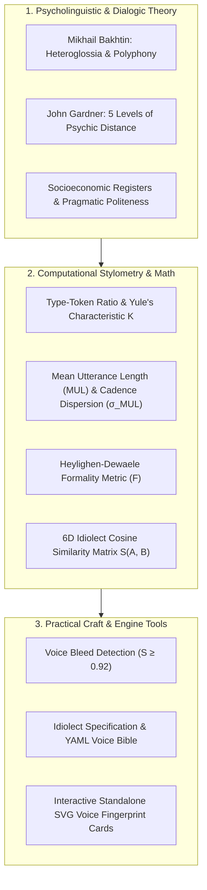
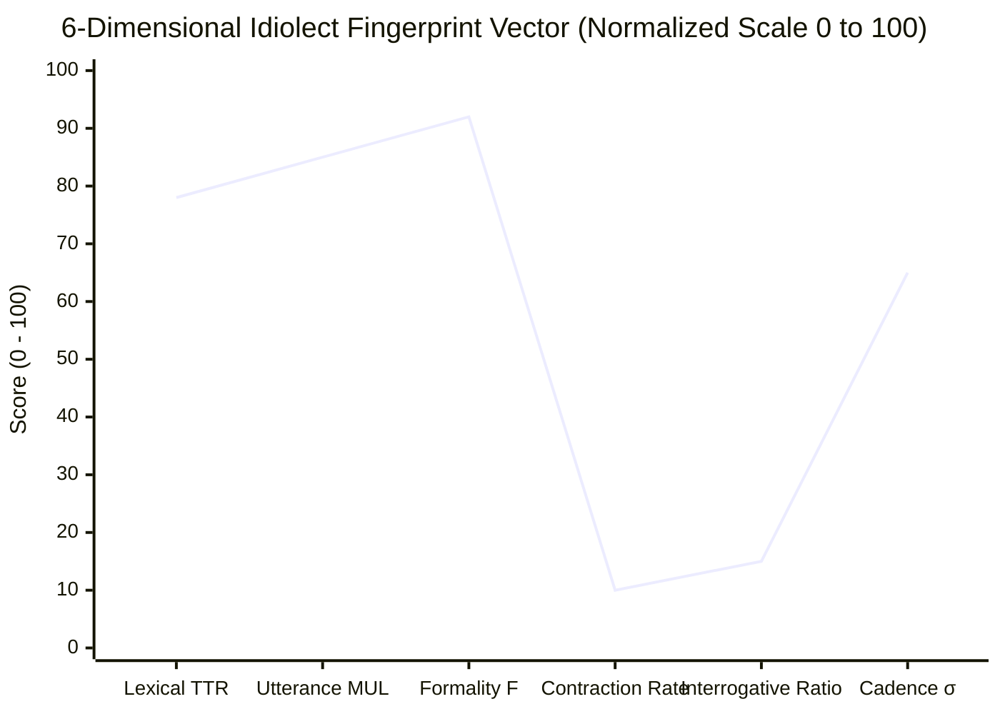

# Character Voice Profiler & Idiolect Fingerprint Architecture (`docs/VOICE.md`)
> **Domain B: Linguistics, Conlang, Idioms & Stylistics** | **CLI Commands:** `arcanum voice` / `arcanum dialogue` | **Module:** `scripts/lib/voice.py`

---

## 1. Overview & Theoretical Rationale

The **Ars Arcanum Voice Engine** (`scripts/lib/voice.py`) is an offline computational stylometry, sociolinguistic profiler, and dialogue fingerprinting suite engineered for speculative fiction novelists, dramatists, and narrative architects.

In ensemble storytelling, distinct character voices are the primary conduit through which personality, social hierarchy, psychological trauma, cultural origin, and intellectual posture are conveyed to the reader. When every character in a cast shares the author's subconscious linguistic habits, sentence lengths, and vocabulary distribution, the manuscript suffers from **Voice Bleed (Character Homogeneity)**—shattering immersion and collapsing dramatic tension into a single flat monologue.



---

## 2. Theoretical Foundations of Character Voice & Dialogic Polyphony

### 2.1 Mikhail Bakhtin's Theory of Heteroglossia and Polyphony
In *The Dialogic Imagination: Four Essays* (1981), Russian literary theorist Mikhail Bakhtin demonstrated that the novel is inherently **polyphonic** (multi-voiced). Unlike poetry, which historically strives for a unified authorial register, the masterclass novel is a battleground of **Heteroglossia** (the coexistence of multiple, conflicting social dialects, professional jargons, generational slang, and ideological idioms):

- **Centripetal Forces**: Forces that push toward linguistic uniformity, central authority, and standardized grammar (e.g., the high-court lexicon of an empire).
- **Centrifugal Forces**: Forces that decentralize and stratify language into street vernacular, underworld cants, technical jargon, and rebellious patois.

In a vital fantasy or sci-fi ensemble, characters do not simply say different things; they inhabit radically different socio-ideological speech worlds.

### 2.2 John Gardner's 5 Levels of Psychic Distance
In *The Art of Fiction* (1983), John Gardner codified **Psychic Distance**—the degree of cognitive proximity between the narrator's lens and the character's internal sensory reality:

```
[ LEVEL 1: Omniscient Cinematic Overview ]
"It was winter of the year 1853. A carriage rolled into the town of Oakhaven."

[ LEVEL 2: Neutral Third-Person Observation ]
"Miller stepped out of the coach, carrying his leather satchel."

[ LEVEL 3: Close Third-Person / Focalized ]
"The wind bit Miller's neck. He pulled his collar tight against the freezing sleet."

[ LEVEL 4: Free Indirect Discourse ]
"God, what a wretched hole of a village. Why had he ever accepted this contract?"

[ LEVEL 5: Pure Stream of Consciousness / First-Person Visceral ]
"Freezing mud. Fingers numb. Two hours till dawn. Got to find the key."
```

Masterclass character voice requires conscious calibration of psychic distance: high-status or emotionally detached characters maintain Levels 1–3, while visceral, traumatized, or impulsive characters operate at Levels 4–5.

### 2.3 The Anatomy of an Idiolect
An **Idiolect** is the unique linguistic fingerprint of an individual speaker. It is determined by five structural components:
1. **Lexical Domain**: The primary metaphor reservoirs the character draws from (a blacksmith speaks using metallurgical metaphors: *quenched, tempered, slag*; a void-navigator speaks in vectors and orbital harmonics).
2. **Syntactic Complexity**: Preference for short, blunt paratactic clauses vs. sweeping, subordinate hypotactic periods.
3. **Formality & Contraction Posture**: Strict aversion to contractions (*"I cannot permit this"*) signaling aristocratic pride or non-native formal training vs. heavy contraction density (*"Ain't no way we're makin' it"*) signaling street pragmatism.
4. **Interrogative / Rhetorical Stance**: Frequency of trailing thoughts ($\dots$), assertive interruptions ($—$), leading questions ($?$), or exclamatory commands ($!$).
5. **Speech Latency & Subtext**: What the character *refuses* to state directly. Taciturn characters communicate through subtextual evasion and tactical monosyllables.

---

## 3. Computational Stylometry & Mathematical Formulations



### 3.1 Type-Token Ratio (TTR) & Lexical Breadth
For a character's dialogue corpus containing $N$ total tokens and $V$ distinct unique word types:

$$\text{TTR} = \frac{V}{N}, \qquad \text{Guiraud's Root Index } R = \frac{V}{\sqrt{N}}$$

- **High TTR ($> 0.65$)**: Academic, polymath, deific, or high-court orator.
- **Low TTR ($< 0.40$)**: Grunt soldier, uneducated laborer, or stoic guardian.

### 3.2 Yule's Characteristic $K$ (Length-Invariant Lexical Richness)
Because standard TTR decreases as sample size $N$ increases, the engine computes **Yule's Characteristic $K$**, which is mathematically independent of text length:

$$K = 10^4 \cdot \frac{\sum_{m=1}^{\infty} m^2 \cdot V(m, N) - N}{N^2}$$

Where $V(m, N)$ is the number of word types occurring exactly $m$ times in the corpus of $N$ tokens.

- High $K$ ($> 140$): Highly repetitive, formulaic, or obsessively focused speaker.
- Low $K$ ($< 60$): Rich, varied, expansive vocabulary with low repetition.

### 3.3 Utterance Length Cadence & Dispersion
Let character $c$ produce $M$ spoken dialogue utterances with word lengths $U = [u_1, u_2, \dots, u_M]$:

$$\mu_U = \frac{1}{M} \sum_{i=1}^M u_i, \qquad \sigma_U = \sqrt{\frac{1}{M} \sum_{i=1}^M (u_i - \mu_U)^2}$$

### 3.4 Heylighen & Dewaele Formality Metric ($F$)
Adapted for dialogue analysis to measure grammatical formality:

$$F = \min\left(100.0, \, \max\left(0.0, \, 50.0 + 2.5 \cdot (\bar{L}_{\text{word}} - 4.5) - 2.0 \cdot \text{ContractionRate} + 1.5 \cdot \text{SubordinationRate}\right)\right)$$

Where $\bar{L}_{\text{word}}$ is the mean word length in characters, and $\text{ContractionRate} = \frac{N_{\text{contractions}}}{N_{\text{words}}} \times 100$.

### 3.5 Pairwise Idiolect Cosine Similarity Matrix ($S$)
Every character's speech is projected into a normalized $6\text{D}$ feature vector:
$$\vec{V}_c = \left[ \text{TTR}_c, \, \mu_{U, c}, \, \sigma_{U, c}, \, F_c, \, \text{ContractionRate}_c, \, \text{RhetoricRatio}_c \right]$$

The voice bleed similarity between Character $A$ and Character $B$:

$$S(A, B) = \cos(\theta) = \frac{\vec{V}_A \cdot \vec{V}_B}{\|\vec{V}_A\| \|\vec{V}_B\|} = \frac{\sum_{k=1}^6 V_{A, k} V_{B, k}}{\sqrt{\sum_{k=1}^6 V_{A, k}^2} \sqrt{\sum_{k=1}^6 V_{B, k}^2}}$$

- **Distinct Idiolects ($S < 0.80$)**: Strong voice separation; characters sound unmistakably different.
- **Moderate Similarity ($0.80 \le S < 0.92$)**: Acceptable overlap if characters share social class or military rank.
- **Voice Bleed Alarm ($S \ge 0.92$)**: Severe homogeny; characters share identical cadences, lengths, and vocabularies.

---

## 4. Ars Arcanum Engine & CLI Architecture


### 4.1 CLI Command Reference

```powershell
# Profile all character voices across the manuscript
arcanum voice Manuscript/

# Compare two specific characters for voice bleed
arcanum voice Manuscript/ --compare "Valeria" "Inquisitor Vane"

# Generate interactive SVG voice fingerprint cards
arcanum voice Manuscript/ --html reports/voice_fingerprints.html

# Audit dialogue mechanics and said-bookism density
arcanum dialogue Manuscript/
```

### 4.2 Diagnostic Codes Matrix

| Code | Severity | Description | Remediating Action |
|---|---|---|---|
| `VOI-101` | **CRITICAL** | Voice Bleed Detected ($S(A, B) \ge 0.92$) | Differentiate sentence lengths, contraction rates, and metaphor vocabularies between the two characters. |
| `VOI-102` | **HIGH** | Register Inconsistency (Aristocrat using street slang, or rogue speaking Latinate periods) | Realign dialogue with the character's defined sociolect in the Voice Bible. |
| `VOI-103` | **MEDIUM** | Monotonous Utterance Length ($\sigma_U \le 2.0$) | Vary character line lengths between terse 1-word replies and multi-clause statements. |
| `VOI-104` | **LOW** | Excessive Dialogue Tag Adverbs (*"she said angrily"*) | Eliminate adverb crutches; replace with physical action beats or subtextual dialogue. |
| `VOI-105` | **MEDIUM** | Said-Bookism Gluttony (*"he ejaculated, she opined, they bellowed"*) | Use invisible default tags (*"said"*, *"asked"*) or physical action beats. |
| `VOI-106` | **HIGH** | Low Lexical Distinctiveness (Character TTR indistinguishable from narrator) | Infuse character speech with specialized domain jargon, cultural idioms, or unique verbal tics. |

---

## 5. Practical Authorial Worksheets & Worked Masterclass Examples

### 5.1 Step-by-Step 3-Way Dialogue Transformation Case Study

#### Flawed Amateur Draft (Voice Bleed, Identical Formality, Said-Bookisms):
> "We must hurry because the imperial fleet is approaching the perimeter," said Valeria fearfully.  
> "I agree that we need to evacuate the civilians immediately," opined Marcus loudly.  
> "The security blast doors are already malfunctioning and will not hold," shouted Jax nervously.  
> "What is our plan to survive this terrible catastrophe?" queried Valeria passionately.

**Engine Diagnostics:**
- Pairwise Cosine Similarity: $S(\text{Valeria}, \text{Marcus}) = 0.96$, $S(\text{Valeria}, \text{Jax}) = 0.95$ (**SEVERE VOICE BLEED — VOI-101**).
- Universal medium sentence length ($10 - 12\text{ words}$). Zero contraction variation. Terrible said-bookisms (*opined, queried*).

#### Masterclass Revision (Differentiated Idiolects, Sociolect Registers, Action Beats):
> Valeria gripped the tactical hololith, her eyes locked on the crimson transponder signatures. "Fleet vanguard drops out of warp in ninety seconds. Clear the civilian transports first." *(High-status commander: concise, imperative, low contraction rate)*  
> 
> Marcus spat on the grated decking. "Transports? Ain't no transports liftin' off with the primary mag-locks frozen shut, Commander. We're sittin' ducks." *(Underdeck engineer: heavy slang, contractions, mechanical metaphors)*  
> 
> Jax didn't look up from his data-slate. "Seventeen seconds until localized orbital bombardment. If we divert coolant from the auxiliary thrusters, we bypass the mag-locks with thirty-four percent thermal margin." *(Data-obsessed technician: precise metrics, zero emotion, Latinate technical jargon)*  
> 
> "Do it," Valeria said. "Now."

**Stylometric Improvements:**
- Pairwise Cosine Similarity: $S(\text{Valeria}, \text{Marcus}) = 0.64$, $S(\text{Marcus}, \text{Jax}) = 0.52$ (**EXEMPLARY IDIOLECT SEPARATION**).
- Tags stripped; character physical beats and distinct acoustic registers established.

---

### 5.2 Character Voice Bible Specification (YAML Schema)

```yaml
---
character_id: "INQUISITOR_VANE"
full_name: "Inquisitor Malakor Vane"
social_class: "Imperial High Judiciary"
primary_domain_lexicon: "Theological law, anatomical dissection, metallurgical purity"

idiolect_profile:
  target_ttr: 0.72
  target_mean_utterance_length: 22.5
  cadence_dispersion_sigma: 8.5
  formality_index: 94.0
  contraction_allowance: "STRICTLY_PROHIBITED" # Never uses "don't", "can't", "it's"

syntactic_habits:
  dominant_sentence_type: "Periodic / Hypotactic (leading subordinate clauses)"
  rhetorical_posture: "Rhetorical questions, calculated silence, icy understatement"
  forbidden_words: ["gonna", "yeah", "stuff", "maybe", "okay"]
  signature_phrases:
    - "The balance of the scales is non-negotiable."
    - "Heretics always mistake mercy for hesitation."

dialogue_action_beats:
  physical_tics:
    - "Smooths the silver embroidery of his judicial stole"
    - "Never blinks while posing an interrogation premise"
    - "Speaks in a measured whisper that forces listeners to lean in"
---
```

---

## 6. Recommended Reading, References & Media

### 6.1 Foundational Craft & Academic Books
- **Bakhtin, Mikhail (1981)**. *The Dialogic Imagination: Four Essays* (trans. Caryl Emerson & Michael Holquist). University of Texas Press. ISBN: 978-0292715349.  
  *The foundational philosophical text defining polyphony, heteroglossia, chronotopes, and the dialogic struggle of voices.*
- **Gardner, John (1983)**. *The Art of Fiction: Notes on Craft for Young Writers*. Alfred A. Knopf. ISBN: 978-0679734031.  
  *Introduced the 5 Levels of Psychic Distance and the masterclass mechanics of free indirect style.*
- **Wood, James (2008)**. *How Fiction Works*. Farrar, Straus and Giroux. ISBN: 978-0312428471.  
  *Brilliant exploration of free indirect discourse, character voice blending, and the microscopic music of dialogic perspective.*
- **Le Guin, Ursula K. (1998)**. *Steering the Craft: A Twenty-First-Century Guide to Sailing the Sea of Story*. Eighth Mountain Press. ISBN: 978-0933377462.  
  *Essential masterclasses on voice, point of view, dialect moderation, and the sound of sentence cadence.*
- **Lukeman, Noah (2000)**. *The First Five Pages: A Writer's Guide to Staying Out of the Rejection Pile*. Fireside / Simon & Schuster. ISBN: 978-0684857435.  
  *Authoritative triage of dialogue flaws: said-bookisms, speech mannerisms, melodrama, and voice bleed.*

### 6.2 Landmark Lectures, Video Masterclasses & Essays
- **Wallace, David Foster (2001)**. "Authority and American Usage". In *Consider the Lobster and Other Essays*. Little, Brown and Company.  
  *Seminal essay on sociolinguistics, Standard Written English vs. Demotic dialects, and the politics of literary register.*
- **Sanderson, Brandon (2020)**. *BYU Creative Writing Lecture 6: Character Voice and Dialogue Mechanics*. Brigham Young University / YouTube.  
  *Techniques for ensuring characters do not sound like the author; idiolect matrices and verbal tick management.*
- **Writing Excuses (2012–2020)**. *Season 7 & Season 15: Deep Character Voice, Idiolects, and Subtext in Dialogue*. Hosted by Mary Robinette Kowal, Brandon Sanderson, Howard Tayler, and Dan Wells.  
  *Live breakdowns of dialogue subtext, speech rhythms, and status dynamics.*

### 6.3 Landmark Speculative Fiction Case Studies
- **Wolfe, Gene (1980)**. *The Book of the New Sun (The Shadow of the Torturer)*. Simon & Schuster.  
  *The gold standard of deeply stylized, high-TTR first-person voice (Severian's eidetic, archaic, theological vocabulary).*
- **Jemisin, N.K. (2015)**. *The Fifth Season*. Orbit.  
  *Virtuosic modulation of psychic distance across second-person and third-person free indirect registers.*
- **Abercrombie, Joe (2006)**. *The Blade Itself*. Gollum / Orion.  
  *Exemplary ensemble idiolect separation: Sand dan Glokta's cynical crippled internal monologue vs. Logen Ninefingers' practical barbarian fatalism.*
