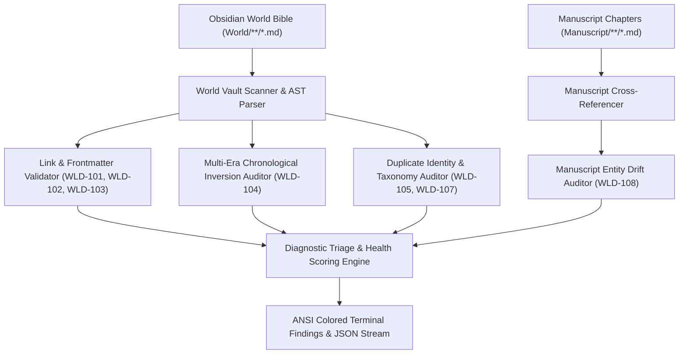
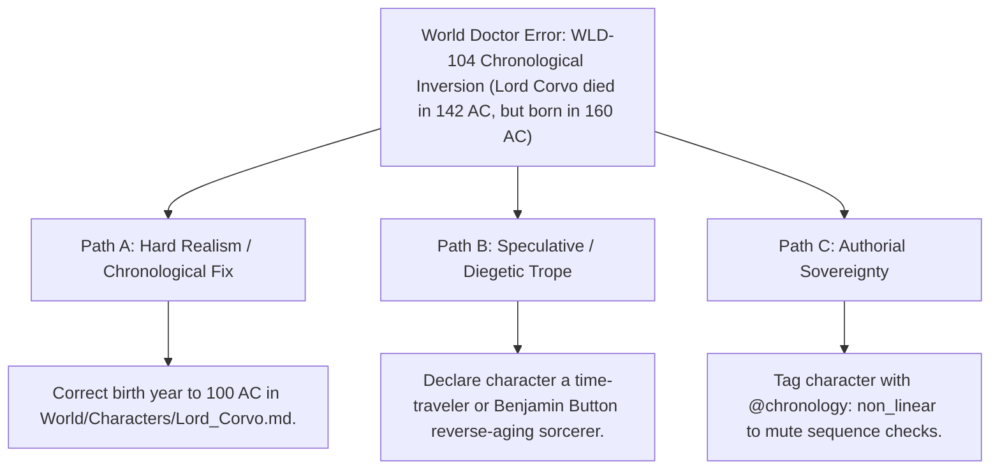

# World Doctor & Cosmos Integrity Diagnostics (`docs/WORLD_DOCTOR.md`)
> **Domain F: Corpus Analytics, Diff, Continuity, RAG & Search** | **CLI:** `arcanum doctor` / `arcanum check-world`

---

## 1. Overview & Theoretical Rationale

The **Ars Arcanum World Doctor** (`scripts/lib/world_doctor.py`) is an offline multi-engine diagnostic scanner, cross-domain integrity auditor, and lore inconsistency triage suite designed for speculative fiction worldbuilders and series architects.

As World Bibles grow over years of drafting to encompass hundreds of characters, locations, factions, magic systems, and manuscript chapters, entropy inevitably accumulates:
1. **Broken Wikilinks (`WLD-101`)**: References pointing to deleted or renamed notes.
2. **Dangling Typed Frontmatter (`WLD-102`)**: Metadata fields linking to unregistered factions or non-existent dynasties.
3. **Missing Schema Attributes (`WLD-103`)**: Entity notes lacking mandatory taxonomy fields (e.g. character files lacking `name` or `role`).
4. **Chronological Inversions (`WLD-104`)**: Characters dying before they are born, or historical events placed out of sequence across multi-era calendars.
5. **Duplicate Identity Claims (`WLD-105`)**: Multiple files claiming the same canonical character or location name.
6. **Manuscript Entity Drift (`WLD-108`)**: Manuscript scenes referencing names never documented in the World Bible.

World Doctor performs deterministic graph traversal, syntax linting, chronological verification, and manuscript cross-referencing—diagnosing cosmos health with zero external dependencies.

---

## 2. Multi-Engine Diagnostic Architecture & Validation Graph



### 2.1 Cosmos Health Score ($\mathcal{C}_{\text{health}} \in [0, 100\%]$)
Let $N_{\text{notes}}$ be total world notes, $E_{\text{fatal}}$ be count of errors (`WLD-101` to `WLD-106`), and $W_{\text{warn}}$ be count of warnings (`WLD-107`, `WLD-108`):

$$\mathcal{C}_{\text{health}} = \max\left(0.0, \, 100.0 - \left( \frac{15.0 \cdot E_{\text{fatal}} + 3.0 \cdot W_{\text{warn}}}{N_{\text{notes}} + 1} \times 10 \right) \right)$$

### 2.2 Multi-Era Chronology Normalization
The engine normalizes dates across disparate fictional and historical conventions to continuous decimal years $t \in \mathbb{R}$:

$$\text{Normalize}(D) = \begin{cases}
-Y & \text{for } Y\text{ BCE / BC} \\
+Y & \text{for } Y\text{ CE / AD} \\
E \cdot 10,000 + Y & \text{for } Y \text{ in Era } E \text{ (e.g. '1422 3E' } \to 31,422.0) \\
Y + \frac{M - 1}{12} + \frac{D - 1}{365} & \text{for ISO dates 'YYYY-MM-DD'}
\end{cases}$$

---

## 3. Diagnostic Codes Reference Matrix

| Code | Category | Severity | Description | Actionable Remediation |
|:---|:---|:---:|:---|:---|
| **`WLD-101`** | Link Integrity | **ERROR** | **Broken Wiki-Link**: `[[Target]]` points to a missing file. | Create the missing note in `World/` or fix the wikilink spelling. |
| **`WLD-102`** | Frontmatter | **ERROR** | **Dangling Frontmatter Reference**: Typed YAML field references unknown entity. | Add entity to World Bible or correct frontmatter link. |
| **`WLD-103`** | Schema | **ERROR** | **Missing Mandatory Field**: Entity lacks required fields for its `type`. | Populate required YAML keys (`name`, `type`, `role`). |
| **`WLD-104`** | Chronology | **ERROR** | **Chronological Inversion**: Death date precedes birth date, or historical sequence inverted. | Correct chronological dates in note frontmatter. |
| **`WLD-105`** | Identity | **ERROR** | **Duplicate Identity Claim**: Two files claim identical entity name. | Rename one entity or merge redundant profile notes. |
| **`WLD-106`** | Syntax | **ERROR** | **YAML Syntax Error**: Unclosed delimiters or malformed YAML. | Fix frontmatter delimiter syntax (`---`). |
| **`WLD-107`** | Taxonomy | **WARNING**| **Orphan Lore Note**: Note has 0 incoming or outgoing links/mentions. | Integrate note into world taxonomy or archive note. |
| **`WLD-108`** | Cross-Ref | **WARNING**| **Manuscript Entity Drift**: Scene mentions entity absent from lore. | Document entity in World Bible or correct spelling in prose. |

---

## 4. Author Extension & Configuration Guide

### 4.1 CLI Command Reference
```bash
# Deep audit of World Bible integrity
arcanum doctor World/

# Cross-validate World Bible against manuscript for entity drift (WLD-108)
arcanum doctor World/ -m Manuscript/

# Accelerate audit using fast mtime-keyed in-memory cache
arcanum doctor World/ --fast

# Output machine-readable JSON report for CI/CD quality gates
arcanum doctor World/ --json

# Query World Doctor diagnostic theory and health score math
arcanum doc world_doctor --math --why
```

---

## 5. Tri-Fold Creative Advisory Resolutions



### Scenario: Chronological Inversion Warning (`WLD-104`)
- **Path A (Hard Realism / Temporal Accuracy)**:
  - Correct the birth year to precede the death year in the character's frontmatter.
- **Path B (Speculative / Diegetic Trope)**:
  - Establish an intentional metaphysical condition: the character is a chronomancer living backwards in time, or exists inside a time-dilation bubble.
- **Path C (Authorial Sovereignty)**:
  - Add `time_direction: reverse` in YAML frontmatter to bypass standard temporal validation.

---

## 6. Content Security Policy & Offline Isolation

World Doctor performs all diagnostics locally in-memory with strict deterministic safety guarantees:

```html
<meta http-equiv="Content-Security-Policy" content="default-src 'none'; style-src 'unsafe-inline'; script-src 'unsafe-inline'; img-src data:; media-src data: blob:;">
```
