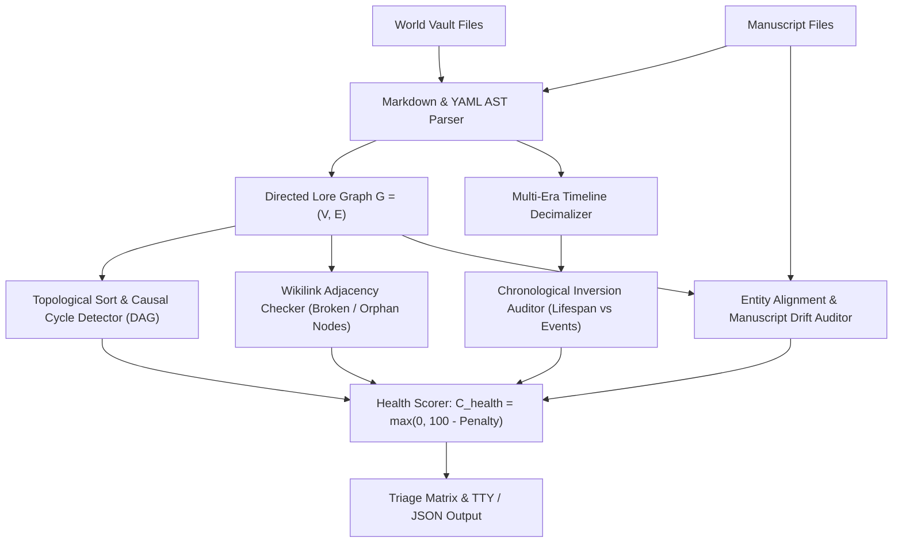
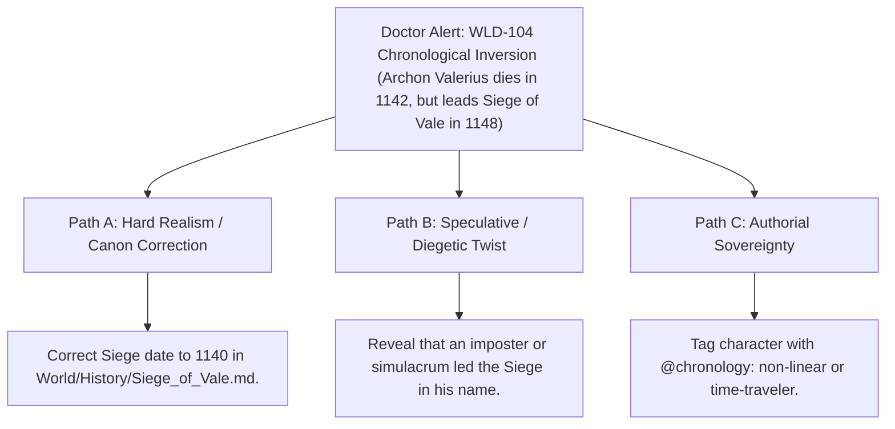

# World Doctor, Lore Graph Integrity & Cosmos Diagnostics (`docs/WORLD_DOCTOR.md`)
> **Domain F: Corpus Analytics, Diff, Continuity, RAG & Search** | **CLI:** `arcanum doctor` / `arcanum check-world`

---

## 1. Overview & Theoretical Rationale

The **Ars Arcanum World Doctor** (`scripts/lib/world_doctor.py`) is an offline cross-domain integrity auditor, knowledge graph validator, chronological causality engine, and manuscript drift detector engineered for speculative fiction worldbuilders, novelists, and narrative designers.

As a fictional universe expands over years of drafting across hundreds of characters, factions, geographic regions, magic disciplines, and manuscript chapters, entropy progressively degrades narrative coherence:
1. **Broken Wikilinks & Ghost Entities (`WLD-101`)**: Wikilinks pointing to deleted, renamed, or unwritten notes.
2. **Dangling Typed Frontmatter (`WLD-102`)**: YAML relationship fields referencing non-existent factions or dead dynasties.
3. **Temporal Inversions & Causal Paradoxes (`WLD-104`)**: Characters participating in battles after their recorded deaths, or inventing artifacts centuries before the underlying magical discovery.
4. **Manuscript Entity Drift (`WLD-108`)**: Characters, cities, or spells appearing in manuscript prose that were never documented in the World Bible (or conversely, spelled differently).

```
+-------------------------------------------------------------------------------+
|                    ARS ARCANUM WORLD DOCTOR PIPELINE                          |
|                                                                               |
|  +--------------------+     AST Knowledge Graph       +--------------------+  |
|  | Obsidian World     | ----------------------------> | Entity Nodes &     |  |
|  | Bible (World/)     |                               | Relational Edges   |  |
|  +--------------------+                               +--------------------+  |
|            |                                                    |             |
|            v                                                    v             |
|  [Manuscript Cross-Ref]                               [DAG Topological Sort]  |
|  (Prose vs Lore Match)                                (Causal Inversion Check)|
|            |                                                    |             |
|            +----------------------------------------------------+             |
|                                     |                                         |
|                                     v                                         |
|                   +-----------------------------------+                       |
|                   |  Cosmos Health Score C_health     |                       |
|                   |  8-Code Diagnostic Triage Engine  |                       |
|                   |  In-Memory MTime Acceleration     |                       |
|                   +-----------------------------------+                       |
|                                     |                                         |
|                                     v                                         |
|                     [Terminal ANSI Diagnostic Report]                         |
|                     [Machine-Readable JSON Health Log]                        |
+-------------------------------------------------------------------------------+
```

World Doctor executes deterministic graph traversal, chronological timeline modeling, and cross-vault entity alignment to guarantee worldbuilding integrity with zero external runtime dependencies.

---

## 2. Mathematical Formalism & Knowledge Graph Validation



### 2.1 The Directed Lore Graph & Acyclic Causal Verification
A fictional universe is formalized as a directed attributed multigraph $G = (V, E)$:
- $V = \{v_1, v_2, \dots, v_n\}$: Entity nodes (characters, places, items, events).
- $E = \{(u, v, \tau)\}$: Directed edges annotated with relationship type $\tau$ (e.g., `allied_with`, `parent_of`, `slain_by`, `located_in`).

For historical timelines, events form a temporal sub-graph $G_T \subseteq G$. The engine executes Kahn's topological sorting algorithm to ensure $G_T$ is a Directed Acyclic Graph (DAG):

$$\text{If } \exists \text{ cycle } C = \langle e_1, e_2, \dots, e_k, e_1 \rangle \implies \text{Flag Causal Paradox (WLD-104)}$$

### 2.2 Cosmos Health Score Metric ($\mathcal{C}_{\text{health}}$)
Given total world note count $N_{\text{notes}}$, count of fatal errors $E_{\text{fatal}}$ (`WLD-101` to `WLD-106`), and warnings $W_{\text{warn}}$ (`WLD-107`, `WLD-108`):

$$\mathcal{C}_{\text{health}} = \max\left(0.0, \, 100.0 - \left( \frac{20.0 \cdot E_{\text{fatal}} + 4.0 \cdot W_{\text{warn}}}{N_{\text{notes}} + 1} \times 10 \right) \right)$$

- $\mathcal{C}_{\text{health}} \ge 95.0\%$: Sovereign Canon (Pristine).
- $80.0\% \le \mathcal{C}_{\text{health}} < 95.0\%$: Minor Lore Drift (Review Recommended).
- $\mathcal{C}_{\text{health}} < 80.0\%$: Critical Incoherence (Compilation Blocked).

### 2.3 Multi-Era Decimal Year Normalization
To evaluate chronological consistency across fictional calendars and historical epochs:

$$\text{DecimalYear}(D, E) = \begin{cases}
-Y & \text{for } Y\text{ BCE / Before Fall} \\
+Y & \text{for } Y\text{ CE / After Convergence} \\
E_{\text{offset}}(E) + Y + \frac{M - 1}{12} + \frac{D - 1}{365} & \text{for Era-based calendars}
\end{cases}$$

An inversion error (`WLD-104`) is committed if:
$$\text{DecimalYear}(\text{Death}) < \text{DecimalYear}(\text{Birth}) \quad \lor \quad \text{DecimalYear}(\text{Event}) < \text{DecimalYear}(\text{Prerequisite})$$

### 2.4 Manuscript Entity Drift Index ($J_{\text{drift}}$)
Let $\mathcal{E}_{\text{world}}$ be the set of all documented entities and $\mathcal{E}_{\text{ms}}$ be the set of proper noun entities extracted from manuscript dialogue and exposition:

$$J_{\text{drift}} = 1.0 - \frac{|\mathcal{E}_{\text{world}} \cap \mathcal{E}_{\text{ms}}|}{|\mathcal{E}_{\text{ms}}|}$$

A high drift index ($J_{\text{drift}} > 0.20$) indicates that significant lore elements introduced in drafting have not been cataloged in the World Bible.

---

## 3. Diagnostic Codes & Triage Reference Matrix

| Code | Severity Tier | Category | Diagnostic Description | Authorial Remediation Strategy |
|---|---|---|---|---|
| **`WLD-101`** | **`CANON_ERROR`** | Link Integrity | **Broken Wikilink**: `[[Target]]` points to a non-existent note. | Create missing note in `World/` or fix spelling in link. |
| **`WLD-102`** | **`CANON_ERROR`** | Frontmatter | **Dangling YAML Link**: Typed field references unregistered entity. | Register target entity or correct YAML property value. |
| **`WLD-103`** | **`CANON_ERROR`** | Schema | **Missing Mandatory Field**: Node lacks required keys (`name`, `role`).| Fill missing keys using `arcanum frontmatter --interactive`. |
| **`WLD-104`** | **`RULE_CONFLICT`** | Chronology | **Chronological Inversion**: Death precedes birth, or causal clash. | Align dates in timeline frontmatter or character dossier. |
| **`WLD-105`** | **`CANON_ERROR`** | Identity | **Duplicate Identity Claim**: Multiple files claim identical entity name. | Disambiguate names (e.g. `Valerius I` vs `Valerius II`) or merge files. |
| **`WLD-106`** | **`CANON_ERROR`** | Syntax | **Malformed YAML Delimiters**: Syntax errors in frontmatter. | Repair unclosed quotes or bad indentation in YAML header. |
| **`WLD-107`** | **`OBSERVATION`** | Taxonomy | **Orphan Lore Note**: Node has 0 incoming/outgoing wikilinks. | Connect node to parent faction/region or move to `Archive/`. |
| **`WLD-108`** | **`OBSERVATION`** | Manuscript | **Manuscript Entity Drift**: Entity in prose missing from World Bible. | Scaffold new lore note using `arcanum scaffold` or fix prose typo. |

---

## 4. CLI Execution & Option Reference

```bash
# 1. Full diagnostic scan of World Bible
arcanum doctor World/

# 2. Cross-reference World Bible against manuscript to catch entity drift (WLD-108)
arcanum doctor World/ -m Manuscripts/Book-01/

# 3. Accelerated audit utilizing mtime-keyed in-memory caching
arcanum doctor World/ --fast

# 4. Strict exit mode (returns non-zero exit code if any ERROR or WARN is found)
arcanum doctor World/ --strict

# 5. Output machine-readable JSON health report for CI/CD pipelines
arcanum doctor World/ --json -o dist/doctor_report.json
```

### Parameter Reference Table

| Flag / Option | Short | Type | Default | Description |
|---|---|---|---|---|
| `world_dir` | (Positional) | `Path` | `World/` | Root directory of the World Bible. |
| `--manuscript-dir`| `-m` | `Path` | `None` | Manuscript path for cross-vault drift detection. |
| `--fast` | `-f` | `bool` | `False` | Enables mtime-keyed incremental parsing cache. |
| `--strict` | `-s` | `bool` | `False` | Treats warnings as build-failing errors. |
| `--json` | `-j` | `bool` | `False` | Emits structured JSON summary to stdout. |

---

## 5. Tri-Fold Creative Advisory Resolutions



### Scenario: High-Severity Chronological Inversion Detected
- **Path A (Hard Realism / Historical Alignment)**:
  - The date mismatch was an authorial oversight. Adjust the Siege of Vale date in the historical timeline to Solar Year 1140.
- **Path B (Speculative / Diegetic Mystery)**:
  - Transform the paradox into an in-world mystery: Archon Valerius was indeed assassinated in 1142, but the High Council deployed an Aether-forged flesh simulacrum to maintain military morale during the Siege.
- **Path C (Authorial Sovereignty)**:
  - If the character exists in a relativistic time dilation zone or non-linear time stream, annotate the dossier frontmatter with `timeline_mode: non_linear` to disable standard chronology verification.

---

## 6. Recommended Reading, References & Media

### 6.1 Worldbuilding Theory & Ontological Systems
- **Sanderson, Brandon (2007)**. *Sanderson's First, Second, and Third Laws of Magics and Worldbuilding Systems*. [brandonsanderson.com](https://www.brandonsanderson.com/).  
  *The foundational principles of consistency, limitations over powers, and deep cultural integration in speculative fiction.*
- **Tolkien, J.R.R. (1947)**. "On Fairy-Stories". *Essays Presented to Charles Williams*, Oxford University Press.  
  *The seminal philosophical formulation of Secondary Worlds, Sub-creation, and Inner Consistency of Reality.*
- **Wolf, Mark J.P. (2012)**. *Building Imaginary Worlds: The Theory and History of Subcreation*. Routledge. ISBN: 978-0415631204.  
  *The definitive academic treatise on imaginary worlds, completeness, consistency, and invention across media franchises.*

### 6.2 Graph Theory, Knowledge Graphs & Data Integrity
- **Robinson, Ian, Webber, Jim, & Eifrem, Emil (2015)**. *Graph Databases: New Opportunities for Connected Data* (2nd Edition). O'Reilly Media. ISBN: 978-1491930892.  
  *Graph modeling, traversal algorithms, and relationship integrity across complex networks.*
- **Cormen, Thomas H., et al. (2009)**. *Introduction to Algorithms* (3rd Edition). MIT Press.  
  *Topological sorting, cycle detection, and directed acyclic graph (DAG) theory.*

### 6.3 Video Lectures, Masterclasses & Worldbuilding Media
- **Artifexian**: *Worldbuilding Masterclass: Climate, Geography, Calendars, and Historical Timelines*.  
  *Step-by-step mathematical worldbuilding tutorials.*
- **Biblaridion**: *Designing Civilizations: From Proto-Cultures to Imperial Dynasties*.  
  *Deep historical worldbuilding methodology and geopolitical tracking.*
- **Hello Future Me (Tim Hickson)**: *On Writing and Worldbuilding (Volumes 1 & 2)*.  
  *Practical video masterclasses on magic system limits, empire collapse, and continuity management.*
- **Isaac Arthur (SFIA - Science & Futurism with Isaac Arthur)**: *Megastructures, Worldbuilding, and Space Colonization*.  
  *Hard-science constraints and physical plausibility in science fiction worlds.*

### 6.4 Landmark Speculative Case Studies
- **Sanderson, Brandon**: *The Cosmere Continuity Architecture*. Dragonsteel Entertainment.  
  *The modern gold standard of cross-novel worldbuilding consistency and magic system physics.*
- **Tolkien, J.R.R.**: *The Lord of the Rings & The Silmarillion*.  
  *Archetypal secondary world characterized by absolute mythological and linguistic consistency.*
- **Herbert, Frank**: *Dune*. Chilton Books.  
  *Masterclass in ecological, religious, and political interconnectedness within an imaginary cosmos.*
