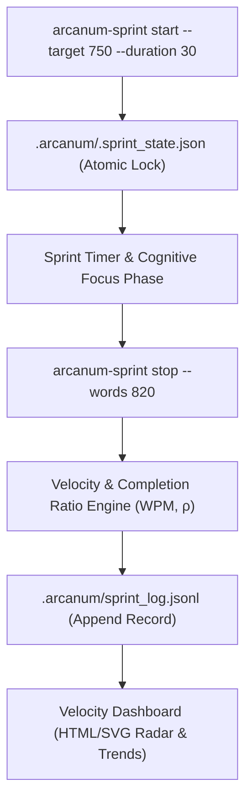

# Sovereign Craft Analytics & High-Velocity Writing Sprints (`docs/WRITING_SPRINT.md`)
> **Domain A: Drafting Ergonomics, Sprint Telemetry & Cognitive Velocity** | **CLI:** `arcanum-sprint` / `arcanum sprint`

---

## 1. Overview & Theoretical Rationale

The **Ars Arcanum Writing Sprint Engine** (`scripts/lib/writing_sprint.py`) is an offline, zero-dependency authorial productivity timer, velocity analytics logger, and habit consistency tracker engineered for novelists, screenwriters, and researchers.

Prose drafting frequently collapses under psychological friction:
1. **The Hyperactive Internal Editor**: Prematurely editing sentences while trying to compose raw first drafts, resulting in agonizingly slow output ($< 150\text{ WPH}$) and creative paralysis.
2. **Binge-Writing Exhaustion Cycles**: Writing 6,000 words in a manic 10-hour marathon followed by three weeks of creative burnout and zero output.
3. **Unmeasured Drafting Velocity**: Lacking empirical data on personal words-per-minute (WPM) capacity, peak productive hours of the day, and optimal session durations.
4. **Cloud SaaS Subscription Enclosure**: Commercial writing trackers lock habit metrics behind paid SaaS walls and harvest user writing activity telemetry.

The Sprint Engine provides sovereign, local-first sprint tracking stored in plain-text JSONL records inside the manuscript repository (`.arcanum/sprint_log.jsonl`), calculating velocity curves, daily streaks, and compiling interactive offline HTML analytics dashboards.



---

## 2. Drafting Psychology: Pomodoro Cadence, Ultradian Rhythms & Free-Writing

```
+-----------------------------------------------------------------------------------+
|                        THE HIGH-VELOCITY DRAFTING CYCLE                           |
+-------------------+-------------------------------+-------------------------------+
| 1. POMODORO FOCUS | 2. ULTRADIAN RECOVERY         | 3. INTERNAL EDITOR SEPARATION |
| 25-50 min burst   | 5-15 min complete cognitive   | First draft: Raw generation.  |
| of uninterrupted  | disengagement (Kleitman BRAC  | Revision: Analytical polish.  |
| forward prose.    | 90-minute biological cycles). | Never mix the two modes.      |
+-------------------+-------------------------------+-------------------------------+
```

### 2.1 Overcoming the Internal Editor (Peter Elbow & Dorothea Brande)
The human brain employs two distinct neurological modes during writing:
- **Generative Mode (Right Hemisphere / Associative)**: Intuitive, associative, visual, and fast-flowing. Responsible for raw character voices, sensory descriptions, and spontaneous plot connections.
- **Critical Mode (Left Hemisphere / Analytical)**: Evaluative, grammatical, structural, and cautious. Responsible for word choice, syntax, and plot logic.

When the Critical Mode is active during initial drafting, it strangles Generative flow. Writing sprints enforce strict **Generative Dominance**: the writer is forbidden from hitting `Backspace` or polishing prose during the active sprint timer.

### 2.2 Ultradian Rhythm & Cognitive Depletion Curves (Kleitman BRAC)
Human attentional focus operates on an **Ultradian Basic Rest-Activity Cycle (BRAC)** of approximately $90\text{ minutes}$, followed by a $15\text{ to }20\text{ minute}$ trough of metabolic fatigue. Sprinting within discrete $25\text{ or }50\text{ minute}$ blocks aligned with BRAC cycles maximizes long-term creative stamina without triggering burnout.

---

## 3. Mathematical Velocity Formulations & Metrics

### 3.1 Instantaneous & Session Velocity
Let a writing sprint begin at timestamp $t_{\text{start}}$ and conclude at $t_{\text{end}}$ (with elapsed duration $\Delta T = t_{\text{end}} - t_{\text{start}}$ in minutes).

Let initial word count be $W_{\text{start}}$ and final word count be $W_{\text{end}}$, producing net words written $\Delta W = W_{\text{end}} - W_{\text{start}}$:

$$\text{Session Average Velocity}: \quad \bar{V}_{\text{wpm}} = \frac{\Delta W}{\Delta T} \quad (\text{Words Per Minute})$$

$$\text{Hourly Equivalent Velocity}: \quad \bar{V}_{\text{wph}} = \bar{V}_{\text{wpm}} \times 60 \quad (\text{Words Per Hour})$$

### 3.2 Target Completion Ratio ($\rho$)
For a planned target goal of $W_{\text{target}}$ words:

$$\rho = \frac{\Delta W}{W_{\text{target}}} \in [0.0, \infty)$$

- $\rho \ge 1.0$: Target Achieved / Exceeded.
- $0.75 \le \rho < 1.0$: Strong Progress.
- $\rho < 0.50$: Stalled Sprint (Signals fatigue, plotting block, or excessive external distraction).

### 3.3 Sprint Fatigue Degradation Model
During extended marathon drafting without rest, instantaneous velocity $V(t)$ decays exponentially:

$$V(t) = V_0 \cdot \exp\left( -\kappa \cdot t \right) + V_{\text{floor}}$$

Where $\kappa \approx 0.015\text{ min}^{-1}$ is the cognitive fatigue coefficient. A 90-minute uninterrupted sprint typically suffers a $45\%$ drop in drafting velocity between minute 10 and minute 80.

```
Drafting Velocity (WPM)
40 |    * Peak (Minutes 5-25)
30 |   / \________
20 |  /           \_______
10 | /                    \_____ * Fatigue Drop (Marathon Binge)
 0 +-+------------+-------+-----+----> Elapsed Sprint Minutes (t)
    0            25      50    90
```

### 3.4 Daily Streak Consistency Index ($\mathcal{S}$)
For a historical logging window of $D$ days:

$$\mathcal{S}_{\text{streak}} = \sum_{d=0}^{D-1} \mathbb{I}\left( \Delta W(d) \ge W_{\text{daily\_threshold}} \right)$$

---

## 4. Subfeatures Matrix & Diagnostic Telemetry

| Diagnostic Flag | Trigger Condition | Cognitive Interpretation | Recommended Action |
|---|---|---|---|
| `SPRINT_VELOCITY_PEAK` | $\bar{V}_{\text{wpm}} \ge 35.0$ ($> 2,100\text{ WPH}$). | Peak flow state achieved. | Note time of day, environment, and scene type for replication. |
| `SPRINT_STALL` | $\bar{V}_{\text{wpm}} \le 8.0$ ($< 480\text{ WPH}$). | Plot roadblock or high cognitive fatigue. | Pause sprint; do a 5-minute character motivation brainstorm in Lore Vault. |
| `BURNOUT_RISK` | Active drafting time $> 4.5\text{ hours}$ in a single 24-hour window. | Severe cognitive depletion imminent. | Enforce mandatory 24-hour restorative rest period. |
| `STREAK_MILESTONE` | Consecutive active writing days reaches 7, 14, 30, 100. | Habit automaticity solidified. | Celebrate milestone; preserve routine momentum. |

---

## 5. Storage Schemas & CLI Commands

### 5.1 Active Sprint State Lock (`.arcanum/.sprint_state.json`)
```json
{
  "session_id": "sprint_20261006_093012",
  "start_time": 1791279012.45,
  "target_words": 750,
  "planned_duration_min": 30,
  "manuscript_dir": "/projects/novel_draft",
  "chapter_target": "Chapter-12.md"
}
```

### 5.2 Historical Sprint Log (`.arcanum/sprint_log.jsonl`)
```json
{"session_id": "sprint_20261006_093012", "timestamp": "2026-10-06T09:30:12Z", "duration_min": 30.0, "words_written": 845, "wpm": 28.17, "target": 750, "completion_ratio": 1.127, "chapter": "Chapter-12.md"}
{"session_id": "sprint_20261006_101500", "timestamp": "2026-10-06T10:15:00Z", "duration_min": 25.0, "words_written": 610, "wpm": 24.40, "target": 500, "completion_ratio": 1.220, "chapter": "Chapter-12.md"}
```

### 5.3 CLI Invocations
```bash
# Start default 25-minute Pomodoro sprint with 500-word goal
arcanum-sprint start

# Start 45-minute sprint with 1,000-word target on specific manuscript
arcanum-sprint start /path/to/novel --target 1000 --duration 45

# Query status of currently running sprint timer
arcanum-sprint status

# Stop sprint and record 860 words written
arcanum-sprint stop --words 860

# View historical velocity metrics and streak statistics
arcanum-sprint stats

# Generate offline interactive HTML velocity dashboard
arcanum-sprint report --html reports/sprint_analytics.html
```

---

## 6. Worked Step-by-Step Example

### Scenario: 7-Day Sprint Telemetry Analysis for a Fantasy Novelist
1. **Raw Log Ingestion**: 14 sprints logged across 7 days ($2\text{ sprints/day}$, averaging $30\text{ minutes/sprint}$).
2. **Computed Aggregates**:
   - Total Net Words: $10,450\text{ words}$.
   - Total Drafting Time: $420\text{ minutes}$ ($7.0\text{ hours}$).
   - Overall Average Velocity: $\bar{V} = \frac{10,450}{420} = 24.88\text{ WPM}$ ($1,493\text{ WPH}$).
   - Best Sprint: Day 4 Morning ($36.2\text{ WPM}$ / $2,172\text{ WPH}$ during an action combat sequence).
   - Lowest Sprint: Day 6 Evening ($12.4\text{ WPM}$ during a complex political negotiation scene).
3. **Actionable Insights Generated by Engine**:
   - Morning sessions ($08:00\text{--}10:30$) yield $+42\%$ higher velocity than evening sessions ($20:00\text{--}22:00$).
   - 30-minute durations maintain a $15\%$ higher average WPM than 60-minute marathons due to zero fatigue degradation.

### 6.1 In-Vault Sprint & Drafting Tooling: Obsidian Writing Goals & Typewriter Mode
- **Obsidian Writing Goals**: Visual progress rings, daily sprint targets, and folder-level word velocity tracking directly in Obsidian's side pane. See [Writing Goals Guide](file:///docs/guides/EXTERNAL_TOOLS_AND_PLUGINS.md#7-writing-goals).
- **Obsidian Typewriter Mode**: Centered-screen drafting focus and active-line highlighting to eliminate distraction and silence the internal editor. See [Typewriter Mode Guide](file:///docs/guides/EXTERNAL_TOOLS_AND_PLUGINS.md#6-typewriter-mode).

---

## 7. Recommended Reading, References & Media

### 7.1 Foundational Craft & Academic Books
- **Cirillo, Francesco (2006)**. *The Pomodoro Technique: The Acclaimed Time-Management System That Has Transformed How We Work*. Currency / Penguin. ISBN: 978-1524760700.  
  *The original text codifying 25-minute focused bursts, short recovery intervals, and tracking mental effort.*
- **Fox, Chris (2016)**. *5,000 Words Per Hour: Write Faster, Write Smarter*. CreateSpace. ISBN: 978-1533500755.  
  *Practical craft guide on tracking writing velocity metrics, identifying distraction patterns, and optimizing drafting speed.*
- **Newport, Cal (2016)**. *Deep Work: Rules for Focused Success in a Distracted World*. Grand Central Publishing. ISBN: 978-1455586691.  
  *Detailed exploration of scheduling deep work blocks, eliminating shallow tasks, and habituating intense focus.*
- **Elbow, Peter (1973)**. *Writing Without Teachers*. Oxford University Press. ISBN: 978-0195120165.  
  *Pioneered the 'freewriting' technique to completely detach generative composition from critical evaluation.*
- **Brande, Dorothea (1934)**. *Becoming a Writer*. J.P. Tarcher / Penguin. ISBN: 978-0874771640.  
  *Classic psychological treatise on cultivating the dual personality of the author (the receptive child artist vs the critical adult editor).*
- **Clear, James (2018)**. *Atomic Habits: An Easy & Proven Way to Build Good Habits & Break Bad Ones*. Avery. ISBN: 978-0735211292.  
  *The definitive modern behavioral psychology guide on habit loops, identity-based habits, and daily micro-streaks.*
- **Fogg, B.J. (2019)**. *Tiny Habits: The Small Changes That Change Everything*. Houghton Mifflin Harcourt. ISBN: 978-0358003328.  
  *Behavioral model ($B = MAP$) explaining why tiny, friction-free daily goals prevent creative avoidance and burnout.*

### 7.2 Landmark Scientific / Worldbuilding Papers & Textbooks
- **Kleitman, Nathaniel (1963)**. *Sleep and Wakefulness*. University of Chicago Press. ISBN: 978-0226440736.  
  *The landmark sleep research textbook discovering the 90-minute Basic Rest-Activity Cycle (BRAC) during waking hours.*
- **Ericsson, K. Anders (1993)**. "The Role of Deliberate Practice in the Acquisition of Expert Performance", *Psychological Review*, 100(3), 363–406.  
  *Foundational research demonstrating that expert performers limit intense deliberate practice to 3–4 hours daily in focused intervals.*

### 7.3 Seminal Video Lectures, Masterclasses & Channels
- **Brandon Sanderson (2020)**. *Lecture #1: Introduction & Daily Writing Habits*, BYU Creative Writing Lectures. YouTube.  
  *Sanderson details his famous daily word count quotas (2,000 words/day), sprint routines, and career longevity.*
- **Chris Fox (2016–Present)**. *Writing Sprints, Habit Tracking & Word Velocity*. YouTube.  
  *Visual breakdowns of logging sprint spreadsheets, optimizing drafting velocity, and beating writer's block.*
- **Writing Excuses (2012)**. *Season 7, Episode 48: Writing Sprints and Word Wars*. Podcast.  
  *Techniques for running competitive and collaborative writing sprints.*

### 7.4 Landmark Speculative Case Studies
- **Stephen King, *On Writing* (2000)**: King's daily routine of 2,000 words every morning without exception, producing 60+ bestselling novels.
- **Brandon Sanderson's Drafting Output**: Consistently generating 300,000+ words per year across epic fantasy manuscripts using structured, disciplined daily sprint blocks.
- **NaNoWriMo (National Novel Writing Month)**: The global 50,000-word November marathon proving the psychological power of sprint constraints and daily velocity targets.
