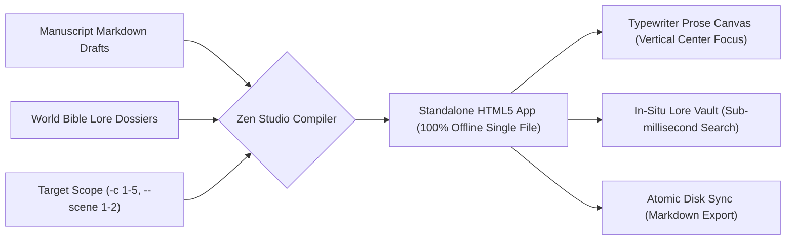

# Sovereign Zen Drafting Studio & Flow State Environment (`docs/ZEN_STUDIO.md`)
> **Distraction-Free Offline Drafting Studio & Lore Inspector** | **CLI:** `arcanum studio` / `arcanum zen`

---

## 1. Overview & Architectural Doctrine

The **Ars Arcanum Zen Studio** (`scripts/lib/zen_studio.py`) is an air-gapped, zero-dependency distraction-free prose drafting environment, cognitive flow engine, and in-situ worldbuilding inspector compiled directly to a standalone client-side HTML5 application.

Professional prose drafting demands sustained deep cognitive focus. Traditional cloud-based word processors and multi-window developer editors induce severe cognitive friction:
1. **Context-Switching Penalties**: Switching between a manuscript editor, a browser tab, and a worldbuilding wiki destroys working memory. Cognitive science demonstrates that recovering full immersion after an interruption requires $15\text{ to }23\text{ minutes}$ of cognitive re-orientation.
2. **Visual Ergonomic Strain**: Dynamic layout shifting, jerky cursor jumps, and bottom-of-screen typing cause neck strain and disrupt drafting rhythm.
3. **Telemetry & Privacy Intrusion**: Modern cloud writing platforms log telemetry, index creative text for cloud AI models, and require continuous internet connectivity.

Zen Studio solves these failure modes by providing a single, sovereign offline interface featuring **Typewriter-Scrolling Ergonomics**, an **In-Situ Lore Vault Drawer**, and real-time **Literary Telemetry**.



---

## 2. The Cognitive Psychology of Flow in Creative Writing

```
+-----------------------------------------------------------------------------------+
|                        CSIKSZENTMIHALYI FLOW MATRIX IN DRAFTING                   |
+------------------------------------+----------------------------------------------+
| CHALLENGE (Narrative Complexity)   | SKILL / ERGONOMIC MASTERY                    |
| High Challenge + Low Friction      | Optimal Flow Channel: Action and awareness   |
| High Challenge + High Friction     | Anxiety & Procrastination (System over-load) |
| Low Challenge + Low Friction       | Boredom & Stagnation                         |
+------------------------------------+----------------------------------------------+
```

### 2.1 The 4 Pillars of Creative Writing Flow (Mihaly Csikszentmihalyi)
1. **Challenge-Skill Equilibrium**: The drafting task pushes the author's narrative capabilities while tooling friction is reduced to zero.
2. **Immediate Unambiguous Feedback**: Live word count velocity, paragraph cadence, and structural metrics update silently without intrusive popups.
3. **Action-Awareness Merging**: The barrier between the author's thoughts and the digital page dissolves through instantaneous keystroke rendering.
4. **Elimination of Cognitive Distractions**: Zero notifications, zero network pings, zero spellcheck red squiggles interrupting the intuitive drafting phase.

### 2.2 Cognitive Load Theory (Sweller) & Context Switching
Let total working memory capacity be $\mathcal{C}_{\text{WM}}$. When drafting:

$$\mathcal{C}_{\text{WM}} = L_{\text{intrinsic}}(\text{Plot/Prose}) + L_{\text{germane}}(\text{Voice/Theme}) + L_{\text{extraneous}}(\text{Tool Friction})$$

Zen Studio forces $L_{\text{extraneous}} \to 0$ by keeping lore lookups in-situ and locking visual focus:

$$T_{\text{recovery}} = \tau_0 \cdot \exp\left( \frac{L_{\text{extraneous}}}{\mathcal{C}_{\text{WM}}} \right)$$

---

## 3. Typographic Ergonomics & Telemetry Mathematics

### 3.1 Typewriter Scrolling Geometry
In standard word processors, the cursor drifts to the bottom edge of the screen as text fills the page, forcing the writer's gaze downward. Zen Studio enforces **Typewriter Vertical Centering**:

$$y_{\text{cursor}} \equiv 0.50 \cdot H_{\text{viewport}} \pm 1.5\text{ lines}$$

As the author presses `Enter`, the text document smoothly scrolls upward via CSS transforms, keeping the active line locked at natural eye level.

### 3.2 Typographic Column Dimensions
To minimize saccadic eye fatigue during long drafting sprints, line lengths obey classical typography standards:
- **Optimal Line Measure**: $60\text{ to }75\text{ characters per line}$ ($35\text{ to }42\text{ rem}$).
- **Line Height (Leading)**: $1.65\text{ to }1.80\times$ font size.
- **Color Palettes**:
  - *Obsidian Dark*: Background `#0f141c`, Text `#d1d5db`, Accent `#38bdf8`.
  - *Parchment Sepia*: Background `#fbf7ee`, Text `#2d261e`, Accent `#b45309`.
  - *Solar Light*: Background `#ffffff`, Text `#1f2937`, Accent `#2563eb`.

### 3.3 Real-Time Telemetry Formulations
- **Silent Reading Time ($T_{\text{read}}$)**:
  $$T_{\text{read}} = \frac{W_{\text{total}}}{200\text{ WPM}} \quad (\text{Standard Adult Reading Velocity})$$
- **Audiobook Narration Time ($T_{\text{speak}}$)**:
  $$T_{\text{speak}} = \frac{W_{\text{total}}}{150\text{ WPM}} \quad (\text{Professional Voice Actor Cadence})$$
- **Keystroke Velocity ($V_k$)**:
  $$V_k(t) = \frac{\Delta \text{Words}}{\Delta t_{\text{active}}} \quad (\text{Excludes idle pauses } > 10\text{s})$$

---

## 4. Subfeatures Matrix & Interface Architecture

| Subfeature | Technical Implementation | Cognitive Craft Benefit |
|---|---|---|
| **Typewriter Focus Mode** | CSS `scroll-margin` + JavaScript dynamic offset lock. | Eliminates neck strain and maintains forward momentum. |
| **In-Situ Lore Vault** | Slide-out side drawer with sub-millisecond client-side substring indexing. | Eliminates application context-switching and wiki tab hunting. |
| **Active Doc Metadata Inspector** | Real-time frontmatter HUD (POV, timeline date, location, thematic thread, word target). | Maintains narrative immersion and continuity tracking without leaving editor. |
| **Multi-Tier Outline Drawer** | Hierarchical manuscript tree navigator (Volumes, Acts, Chapters, Scenes) with live status tags. | Seamless random-access navigation across complex novel structures. |
| **Acoustic Haptic Clicks** | WebAudio procedural mechanical keyclick synthesis ($100\%$ offline). | Provides tactile acoustic feedback reinforcing rhythmic typing flow. |
| **Focus Soundscapes** | WebAudio procedural ambient noise generators (rain, brown noise, fire, coffee shop). | Masks environmental distractions without external media players or network streaming. |
| **Local Storage Guard** | HTML5 `localStorage` atomic autosave every 500ms with dirty-state indicator. | Zero risk of lost prose during accidental browser closure. |
| **Target Scoping** | CLI compiler scopes bundle to specific chapter ranges (`-c 1-5`, `--scope`). | Prevents distraction from past or future unfinished scenes. |
| **ARIA Accessibility** | Semantic landmarks (`role="main"`, `banner`, `region`, `contentinfo`), `role="tabpanel"`, and `aria-live="polite"`. | Full screen reader and assistive technology compliance. |
| **Dyslexia Typography** | Accessible font selector supporting OpenDyslexic and Atkinson Hyperlegible. | Reduces letter-confusion and eye strain for neurodivergent authors. |
| **Keyboard Dismissal** | Global `Escape` key listeners and modal focus traps. | Immediate, low-friction keyboard control without mouse targeting. |

---

## 5. CLI Invocation & Configuration Schema

### 5.1 CLI Commands
```bash
# Launch Zen Studio for active manuscript with World Bible lore
arcanum studio Manuscript/ -w World/

# Launch Zen Studio scoped strictly to Chapters 10 through 15
arcanum studio Manuscript/ -c 10-15 -w World/

# Launch Zen Studio with Sepia theme and 45-minute sprint timer
arcanum studio Manuscript/ -c 18 --theme sepia --timer 45 --audio-click

# Export all local browser draft modifications back to markdown files
arcanum studio --export-drafts Manuscript/
```

### 5.2 Studio Configuration (`.arcanum/studio_config.yaml`)
```yaml
zen_studio:
  default_theme: "obsidian_dark" # obsidian_dark | parchment_sepia | solar_light
  font_family: "Equity, Georgia, Charter, serif"
  font_size_px: 19
  line_width_rem: 38
  typewriter_scrolling: true
  webaudio_keyclick: true
  telemetry:
    reading_wpm: 200
    speaking_wpm: 150
  autosave_interval_ms: 500
```

---

## 6. Worked Step-by-Step Example

### Scenario: A 2-Hour Deep Work Drafting Session (Chapter 18)
1. **Launch**: Author runs `arcanum studio Manuscript/ -c 18 -w World/ --theme obsidian_dark`.
2. **Immersion**:
   - Browser opens to a pristine, centered text canvas containing Chapter 18's opening paragraph.
   - Screen displays: `Words: 412 | Read Time: 2m | Speak Time: 2m 45s`.
3. **Mid-Draft Lore Lookup**:
   - Author needs the name of the high priest's ancestral poison.
   - Author presses `Ctrl+Space` $\to$ Lore Vault slides out smoothly.
   - Author types `pois` $\to$ Instantly filters to *Viper's Tear* dossier with symptom notes.
   - Author presses `Esc` $\to$ Lore Vault slides shut; cursor returns immediately to the active line.
   - **Context-Switch Time**: $3.2\text{ seconds}$ (vs $4\text{ minutes}$ opening external apps).
4. **Conclusion**:
   - Author writes 1,650 words in 90 minutes.
   - Author clicks "Save to Disk", cleanly updating `Manuscript/Chapter-18.md` with zero metadata corruption.

---

## 7. Recommended Reading, References & Media

### 7.1 Foundational Craft & Academic Books
- **Csikszentmihalyi, Mihaly (1990)**. *Flow: The Psychology of Optimal Experience*. Harper & Row. ISBN: 978-0061339202.  
  *The landmark psychological text formulating flow states, optimal performance, and attentional focus.*
- **Newport, Cal (2016)**. *Deep Work: Rules for Focused Success in a Distracted World*. Grand Central Publishing. ISBN: 978-1455586691.  
  *The definitive analysis of cognitive context-switching, network tools, and attentional hygiene.*
- **Boice, Robert (1990)**. *Professors as Writers: A Self-Help Guide to Productive Writing*. New Forums Press. ISBN: 978-0925290106.  
  *Empirical behavioral psychology research on overcoming writer's block, binge-writing fatigue, and establishing automaticity.*
- **Sweller, John (1988)**. "Cognitive Load During Problem Solving: Effects on Learning", *Cognitive Science*, 12(2), 257–285.  
  *Foundational paper establishing Cognitive Load Theory and extraneous cognitive friction.*
- **Tufte, Edward R. (2001)**. *The Visual Display of Quantitative Information* (2nd ed.). Graphics Press. ISBN: 978-0961392147.  
  *Principles of data-ink maximization and elimination of non-functional screen clutter (chartjunk).*

### 7.2 Landmark Scientific / Worldbuilding Papers & Textbooks
- **Bringhurst, Robert (1992)**. *The Elements of Typographic Style*. Hartley & Marks. ISBN: 978-0881792126.  
  *The authoritative masterwork on typographic measure, vertical grid rhythm, and legibility ergonomics.*
- **Mark, Gloria, Gudith, Daniela, & Klocke, Ulrich (2008)**. "The Cost of Interrupted Work: More Speed and Stress", *CHI '08 Proceedings*, 107–110. DOI: 10.1145/1357054.1357072.  
  *Empirical quantification of the 23-minute cognitive recovery cost of digital interruptions.*

### 7.3 Seminal Video Lectures, Masterclasses & Channels
- **Cal Newport (2020–Present)**. *Deep Questions: Attention, Focus & Deep Work Habits*. Podcast / YouTube.  
  *Practical workflows for structuring distraction-free creative routines and air-gapped writing studios.*
- **Ali Abdaal (2021)**. *How to Enter Flow State on Demand: The Science of Focus*. YouTube.  
  *Neuroscientific breakdown of environmental triggers and cognitive friction reduction.*
- **Writing Excuses (2014)**. *Season 9, Episode 1: The Writing Environment & Minimizing Distraction*. Podcast.  
  *Brandon Sanderson, Mary Robinette Kowal, and Howard Tayler on crafting sustainable daily drafting ergonomics.*

### 7.4 Landmark Speculative Case Studies
- **George R.R. Martin's Air-Gapped WordStar 4.0 Machine**: The legendary sovereign writing setup running on DOS with zero internet connection, protecting ASOIAF from distraction and telemetry.
- **Neil Gaiman's Fountain Pen Notebooks**: Drafting complete novels (*Stardust*, *The Graveyard Book*) entirely by hand in leather-bound notebooks to preserve flow before digital typesetting.
- **Cormac McCarthy's Olivetti Lettera 32 Typewriter**: The composition of *Blood Meridian* and *The Road* on a purely mechanical typewriter, demonstrating the timeless power of focused physical prose generation.

---

## 8. Atmospheric Visual Presets & Procedural Typewriter Sound Immersion

Zen Studio and the Velocity Sprint Studio embed the **Ars Arcanum UI Theme & Procedural Sound Engine** (`scripts/lib/ui_theme_engine.py`):
- **11 Visual Presets**: `Retro` (Amber CRT), `Futuristic` (Neon Cyan), `Retrofuturistic` (Synthwave), `Fantastical` (Parchment & Gold), `Grim` (Ash & Iron), `Edgy` (Acid Cyberpunk), `Cozy` (Warm Sage & Latte), `SciFi` (Laser Blue HUD), `Horror` (Abyssal Crimson), `Sovereign Dark` (Starfield Navy), and `Classic Light` (Editorial Linen).
- **10 Procedural Typewriter Sound Models**: Synthesized on-the-fly in pure JavaScript via the Web Audio API with zero external audio files. Keystrokes generate acoustic micro-transients, pitch jitter ($\pm 4\%$), deep spacebar chassis resonance, and carriage return brass bell chimes on `Enter`.
- **Keyboard Shortcuts**: Press `Ctrl+Alt+T` or click the floating palette icon to open the **Theme & Sound Control Center Modal**. Press `Ctrl+Alt+M` to quickly mute/unmute typing audio.
