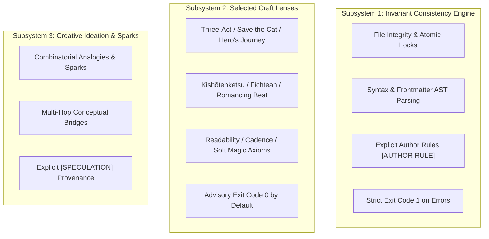

# ADR 0001: Demotion of Normative Evaluators and Formal Separation of Three Subsystems

- **Status**: Accepted
- **Date**: 2026-10-08
- **Authors**: Ars Arcanum Engineering Architecture & Creative Autonomy Council
- **Deciders**: Sovereign Authoring System Architects

---

## 1. Context and Problem Statement

An extensive architectural audit of Ars Arcanum (*Ars Arcanum — A Creative-Autonomy Audit*, Findings `F-01` through `F-14`) identified critical areas where deterministic, technical file safety invariants were being conflated with subjective, normative literary evaluations:

1. **Normative Composite Scores**: The system computed reductive composite scores (`Structural Harmony Score: 85.0%`, hardcoded `Thematic Resonance Score: 92%`, `Preflight Compliance Score: 100/100`, and `Catastrophic Domain Penalty` letter grades) that imposed monocultural, commercial three-act formulas as absolute software correctness.
2. **Moralizing Diagnostics**: Revision churn engines and prophecy trackers issued judgmental findings (`REV-101: rewriting instability / procrastination`, `PRP-101: unfulfilled prophecy error`) that penalized deliberate artistic choices and non-linear discovery drafting.
3. **Ontology & Metadata Overhead**: Universal character file classes mandated magic system parameters (`magic_tier`, `catalyst`), while craft engines defaulted to `exit code 1` on mere stylistic observations, causing false CI build failures.

## 2. Decision Drivers

* **Creative Sovereignty**: The author retains 100% intellectual autonomy over narrative structure, pacing, magic rules, and character psychology.
* **Deterministic Technical Safety**: File locks, atomic writes, SHA-256 integrity, frontmatter AST parsers, and explicit author rules must remain uncompromisingly rigid.
* **Epistemic Clarity**: Advisory craft models must never masquerade as software errors or absolute mathematical truths.

---

## 3. Considered Options

* **Option 1 (Status Quo)**: Retain composite scores with minor disclaimer notes. *(Rejected: Disclaimers do not eliminate the psychological authority of a numeric score or false exit-code failures).*
* **Option 2 (Pure Freeform without Structure)**: Remove all structure analysis engines and narrative frameworks entirely. *(Rejected: Authors actively benefit from comparative structural telemetry and milestone window overlays when explicitly requested).*
* **Option 3 (Architectural Demotion & Three-Subsystem Separation — Selected)**: Eliminate all composite scores and letter grades. Reorganize all engine capabilities into three strictly bounded subsystems with distinct execution and exit-code semantics.

---

## 4. Decision Outcome

We formally adopted **Option 3**, establishing the **Three-Subsystem Architecture** across the Ars Arcanum codebase:

### Concrete Architectural Contracts:
1. **No Composite Normative Scoring**: Output descriptive milestone positions, window tolerances, and word count distributions (`Ref: 50% | Win: 45-55% | Ch 4 (50%) | [ON TARGET]`) instead of percentage grades.
2. **Subsystem Execution Semantics**:
   - **Subsystem 1 (Invariants)**: Deterministic file operations. May exit with code 1 in `--strict` mode when disk reads fail or author-declared invariants are violated.
   - **Subsystem 2 (Craft Lenses)**: Multi-tradition analytical overlays. Always defaults to `exit code 0`.
   - **Subsystem 3 (Ideation)**: Generative brainstorming. Always annotated with `[SPECULATION]` provenance tags.
3. **Universal `@intent: deliberate` Immunity**: Authors may tag files with frontmatter `intent: deliberate` or inline `<!-- @intent: deliberate -->` to permanently bypass any stylistic, continuity, or anachronism diagnostic.
4. **Ontology Decoupling**: Universal character templates are decoupled from genre-specific magic fields. Framework-free (`--paradigm none`) modes provide clean chapter telemetry without imposing narrative archetypes.

---

## 5. Consequences & Verification

* **Positive**: 
  - Restores absolute creative sovereignty to authors across all fiction traditions (western, non-western, mythic, literary, commercial, non-linear).
  - Eliminates false-positive CI failures caused by stylistic exploration.
  - Hardens technical failure modes (e.g. zero-input errors fail fast with actionable guidance instead of returning fake 0.0% scores).
* **Negative / Trade-offs**:
  - Existing scripts expecting JSON fields `"harmony_score"` or `"thematic_resonance_score"` must transition to per-beat telemetry maps or export coverage dictionaries.
* **Verification**:
  - Full Python test discovery suite passes with **911 tests, 0 failures, 0 errors**.
  - New test suites [`tests/test_epistemic_safety.py`](file:///tests/test_epistemic_safety.py) and [`tests/test_story_canvas_semantics.py`](file:///tests/test_story_canvas_semantics.py) enforce all 14 epistemic safety invariants in automated CI.
