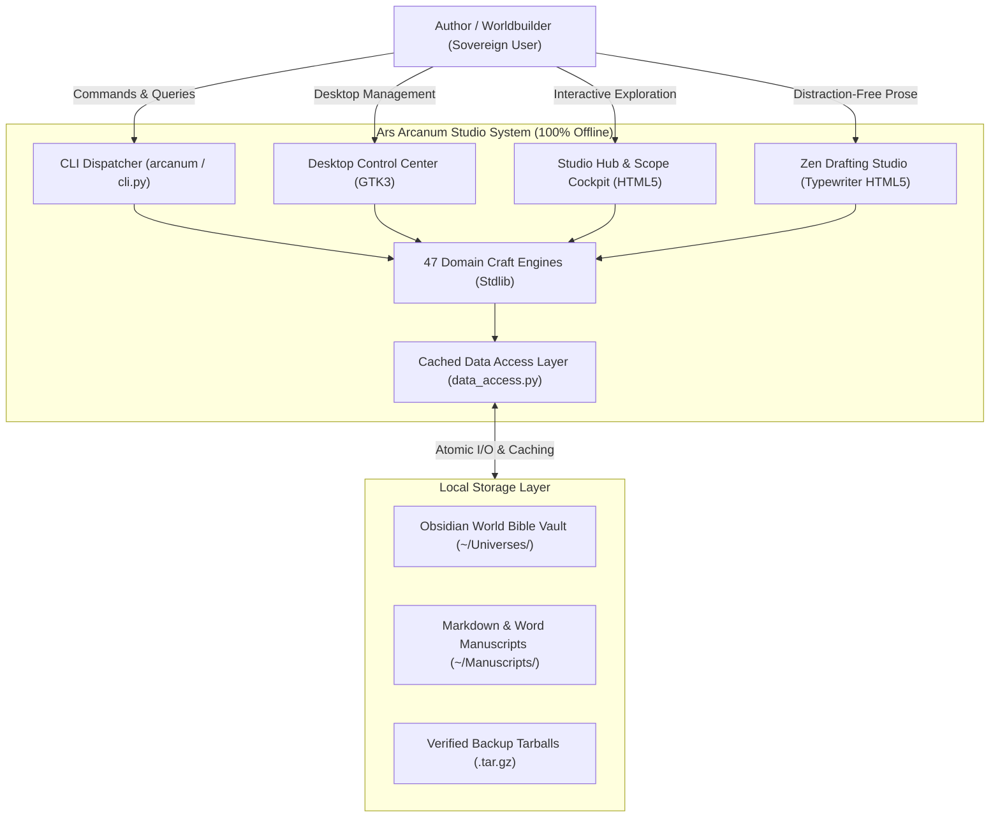

# Ars Arcanum (Scriptorium) — Definitive System Architecture & Technical Blueprint
> **Sovereign Local-First Authoring Operating System (GPA 4.0/4.0 — Grade A+)** | Release v0.1.0 (Beta)  
> *Authoritative Onboarding Reference, System Blueprint & Verification Baseline*

---

## Part 1 — Whole-Repository Technical Deep-Dive

### 1.1 Executive System Identity
**Ars Arcanum** (code-named *Scriptorium*) is a sovereign, local-first authoring platform and craft studio designed for speculative fiction authors, novelists, and narrative designers ([`README.md#L1-L25`](file:///README.md#L1-L25)). It provides a complete creative production pipeline — spanning world-bible lore management, manuscript drafting, computational domain simulations (astrophysics, climate, causality, conlangs, economy, genealogy, tactical battles), and 1-click publishing (print-ready PDF, EPUB, submission DOCX) — executing 100% offline with zero cloud dependencies, zero external network telemetry, and zero `pip` packages required for core engines ([`AGENTS.md#L1-L35`](file:///AGENTS.md#L1-L35)).

### 1.2 Tech-Stack Detection Table

| Layer / Subsystem | Technology | Purpose | Evidence (File + Lines) |
|---|---|---|---|
| **Core Runtime** | Python 3.10+ (Standard Library) | Primary execution runtime for 47 simulation, craft, and pipeline engines | [`pyproject.toml#L10-L15`](file:///pyproject.toml#L10-L15), [`AGENTS.md#L20-L40`](file:///AGENTS.md#L20-L40) |
| **Package / Build System** | Setuptools (`setuptools>=61.0`) | Standard wheel packaging and console entry point dispatch (`arcanum`, `ars-arcanum`) | [`pyproject.toml#L1-L30`](file:///pyproject.toml#L1-L30) |
| **CLI Dispatchers** | POSIX Bash + Windows CMD + Python Dispatcher | Authoritative multi-platform CLI dispatch with fuzzy error resolution and registry plugins | [`scripts/arcanum#L1-L50`](file:///scripts/arcanum#L1-L50), [`scripts/arcanum.cmd#L1-L5`](file:///scripts/arcanum.cmd#L1-L5), [`scripts/lib/cli.py#L1-L120`](file:///scripts/lib/cli.py#L1-L120) |
| **Storage & Data Access** | Plaintext Markdown, YAML Frontmatter, SQLite3 | Local-first atomic document store, AST cache, and fast full-text index | [`scripts/lib/_bootstrap.py#L30-L75`](file:///scripts/lib/_bootstrap.py#L30-L75), [`scripts/lib/data_access.py#L1-L150`](file:///scripts/lib/data_access.py#L1-L150) |
| **Concurrency Control** | `ArcanumLock` (`fcntl.flock` on POSIX, `msvcrt.locking` on Windows) | Cross-platform file locking for backup, restore, and synchronization routines | [`scripts/lib/lockfile.py#L1-L110`](file:///scripts/lib/lockfile.py#L1-L110) |
| **Desktop GUI (Linux)** | PyGObject (`GTK 3.0`, `Gdk`, `GLib`, `Pango`) | Native Linux desktop Control Center application | [`scripts/arcanum_app.py#L1-L50`](file:///scripts/arcanum_app.py#L1-L50), [`scripts/lib/ui_gtk3/window.py#L1-L100`](file:///scripts/lib/ui_gtk3/window.py#L1-L100) |
| **Studio Hub & Zen Studio** | Standalone Offline HTML5/CSS3/ES6 with Strict CSP | Browser-based interactive cockpits, corkboards, and distraction-free typewriter studios | [`scripts/lib/studio_hub_template.py#L1-L50`](file:///scripts/lib/studio_hub_template.py#L1-L50), [`scripts/lib/zen_studio_template.py#L1-L50`](file:///scripts/lib/zen_studio_template.py#L1-L50) |
| **Publishing Pipeline** | Typst CLI (`>=0.11.0`), Pandoc (`>=2.19.x`), Calibre (`ebook-convert`) | Commercial PDF typesetting with genre presets, EPUB3 compilation, and DOCX AST translation | [`scripts/lib/typeset.py#L1-L120`](file:///scripts/lib/typeset.py#L1-L120), [`docs/COMPATIBILITY.md#L1-L30`](file:///docs/COMPATIBILITY.md#L1-L30) |
| **External Integrations** | Obsidian (Vendored plugins), novelWriter, LibreOffice | Markdown World Bible vault interface and distraction-free novel project drafting | [`templates/world-bible/.obsidian/plugins/manifest.json`](file:///templates/world-bible/.obsidian/plugins/manifest.json), [`templates/manuscript/nwProject.nwx#L1-L15`](file:///templates/manuscript/nwProject.nwx#L1-L15) |

### 1.3 Entry Points

1. **POSIX Shell Wrapper**: [`scripts/arcanum`](file:///scripts/arcanum#L1-L50) (symlink-dereferencing POSIX CLI wrapper).
2. **Windows Command Wrapper**: [`scripts/arcanum.cmd`](file:///scripts/arcanum.cmd#L1-L5) (native Windows batch entry point calling `scripts/lib/cli.py`).
3. **Authoritative Python Dispatcher**: [`scripts/lib/cli.py`](file:///scripts/lib/cli.py#L1-L100) (pure Python entry point with dynamic plugin registry).
4. **Desktop GUI Application**: [`scripts/arcanum_app.py`](file:///scripts/arcanum_app.py#L1-L50) (GTK3 desktop control center).
5. **Standalone Zen Studio**: `python -m scripts.lib.cli studio` / [`scripts/lib/zen_studio.py`](file:///scripts/lib/zen_studio.py#L1-L60).
6. **Studio Hub & Cockpit**: `python -m scripts.lib.cli hub` / [`scripts/lib/studio_hub.py`](file:///scripts/lib/studio_hub.py#L1-L60).
7. **Visual Story Canvas**: `python -m scripts.lib.cli canvas` / [`scripts/lib/story_canvas.py`](file:///scripts/lib/story_canvas.py#L1-L60).

---

### 1.4 Commands & Verification Inventory

| Command | Purpose | Verification Evidence | CI Enforcement Status |
|---|---|---|---|
| `python -m unittest discover tests` | Run complete unit and regression test suite (879 tests) | [`tests/test_*.py`](file:///tests/) | **Enforced in CI** ([`.github/workflows/ci.yml#L36`](file:///.github/workflows/ci.yml#L36)) |
| `ruff check .` | Strict linting across 9 rule families (`E`, `F`, `B`, `S`, `UP`, `SIM`, `I`, `RUF`, `C901`) | [`pyproject.toml#L15-L35`](file:///pyproject.toml#L15-L35) | **Enforced in CI** ([`.github/workflows/ci.yml#L33`](file:///.github/workflows/ci.yml#L33)) |
| `mypy --explicit-package-bases scripts tests` | Static type checking with `check_untyped_defs = True` (204 source files) | [`mypy.ini#L1-L25`](file:///mypy.ini#L1-L25) | **Enforced in CI** ([`.github/workflows/ci.yml#L34`](file:///.github/workflows/ci.yml#L34)) |
| `coverage run -m unittest discover tests; coverage report --fail-under=80` | Measure and enforce aggregate test coverage threshold ($\ge 80\%$) | [`pyproject.toml#L35-L45`](file:///pyproject.toml#L35-L45) | **Enforced in CI** ([`.github/workflows/ci.yml#L38`](file:///.github/workflows/ci.yml#L38)) |
| `bash scripts/verify.sh` | Canonical 7-stage master integration and packaging verification harness | [`scripts/verify.sh#L1-L150`](file:///scripts/verify.sh#L1-L150) | **Enforced in CI** ([`.github/workflows/ci.yml#L39`](file:///.github/workflows/ci.yml#L39)) |
| `bash scripts/setup_arcanum.sh` | Automated POSIX system installer (packages, fonts, Typst, launchers) | [`scripts/setup_arcanum.sh#L1-L100`](file:///scripts/setup_arcanum.sh#L1-L100) | Local Developer / User Script |
| `powershell -ExecutionPolicy Bypass -File scripts\setup_arcanum.ps1` | Automated Windows 1-click system installer (workspaces, shortcuts, tasks) | [`scripts/setup_arcanum.ps1#L1-L80`](file:///scripts/setup_arcanum.ps1#L1-L80) | Local Developer / User Script |
| `pip install -e .` | Editable development package installation | [`pyproject.toml#L1-L30`](file:///pyproject.toml#L1-L30) | **Enforced in CI** ([`.github/workflows/ci.yml#L32`](file:///.github/workflows/ci.yml#L32)) |

---

### 1.5 Directory Layout & Responsibilities

```
.
├── .github/                   # GitHub Actions CI/CD workflows and automated quality gates
├── configs/                   # Systemd units, LeechBlock distraction rules, and linter configs
├── docs/                      # Comprehensive system documentation and domain engine manuals
│   ├── codebase/              # Architectural blueprints, tech stack, testing, and conventions
│   └── guides/                # Author operational guides (backup, distraction control, typography)
├── launchers/                 # XDG desktop application entry points (.desktop files)
├── scripts/                   # Core application codebase and command executables
│   ├── arcanum                # POSIX shell entrypoint wrapper
│   ├── arcanum.cmd            # Native Windows batch launcher
│   ├── arcanum_app.py         # Native GTK3 desktop Control Center entrypoint
│   └── lib/                   # Standard-library core engines and craft modules (<800 lines/file)
│       ├── _bootstrap.py      # Atomic write, path validation, and system primitives
│       ├── cli.py             # Authoritative cross-platform CLI dispatcher
│       ├── data_access.py     # Centralized cached vault reader and AST frontmatter layer
│       ├── scope.py           # Universal granular target scoping engine
│       ├── registry_base.py   # Core EngineSpec dataclasses and BaseCraftEngine
│       ├── registry_specs/    # Domain engine metadata specifications (7 domain modules)
│       ├── tips_catalog/      # Domain craft tip specifications (6 domain modules)
│       ├── ui_gtk3/           # Modular presentation package for GTK3 desktop interface
│       ├── studio_hub.py      # Browser-based Studio Hub & Scope Cockpit
│       ├── zen_studio.py      # Standalone offline typewriter drafting cockpit
│       ├── resonance.py       # Universal resonance mesh dispatcher & coherence auditor
│       ├── economy.py         # Macroeconomic PPP validator & tech anachronism auditor
│       └── [Craft Engines]    # Astrophysics, climate, genealogy, conlang, causality, magic...
├── templates/                 # Scaffolding templates for World Bibles, manuscripts, and universes
└── tests/                     # Comprehensive unittest suite across all 47 engines (879 tests)
```

---

### 1.6 Deployment & Runtime Surface

| Runtime / Tool | Version Pin | Source of Truth | Verification Method |
|---|---|---|---|
| **Python** | `3.10`, `3.11`, `3.12`, `3.13`, `3.14` | [`pyproject.toml#L10-L15`](file:///pyproject.toml#L10-L15), [`.github/workflows/ci.yml#L18`](file:///.github/workflows/ci.yml#L18) | Matrix test discovery |
| **Typst CLI** | `0.14.2` (Pinned musl binary + SHA-256) | [`scripts/setup_arcanum.sh#L317-L320`](file:///scripts/setup_arcanum.sh#L317-L320) | Hardcoded digest verification |
| **Pandoc** | `>=2.19.x` (Tested up to `3.7.x`) | [`docs/COMPATIBILITY.md#L9-L16`](file:///docs/COMPATIBILITY.md#L9-L16) | `pandoc --version` check |
| **Obsidian Plugins** | 10 Vendored Plugins (Pinned SHA-256) | [`templates/world-bible/.obsidian/plugins/manifest.json`](file:///templates/world-bible/.obsidian/plugins/manifest.json) | Hash manifest validation |
| **CI Runner OS** | `ubuntu-24.04`, `macos-latest`, `windows-latest` | [`.github/workflows/ci.yml#L17`](file:///.github/workflows/ci.yml#L17) | Multi-platform GitHub Actions matrix |

---

## Part 2 — Context & Operational Ecosystem

### 2.1 Local Checkout Identity Table

| Attribute | Value |
|---|---|
| **Repository Remote** | `https://github.com/aryansinghnagar/Ars-Arcanum.git` |
| **Active Branch** | `main` |
| **Software Version** | `0.1.0` (Beta Release) |
| **License** | MIT License ([`LICENSE`](file:///LICENSE)) |
| **Dependency Model** | Zero-Pip Guarantee (100% Standard Library for core craft engines) |

### 2.2 Governance & Invariant Rules
The repository encodes strict operational contracts documented in [`AGENTS.md`](file:///AGENTS.md):
1. **File Safety Invariant**: All disk modifications must utilize `atomic_write()` (`tempfile` $\to$ `flush` $\to$ `fsync` $\to$ `os.replace` $\to$ parent directory `fsync`). Direct unbuffered overwrites are prohibited ([`scripts/lib/_bootstrap.py#L35-L70`](file:///scripts/lib/_bootstrap.py#L35-L70)).
2. **Path Traversal Defense**: All user-supplied volume names, draft identifiers, and book targets are validated against token regex `^[A-Za-z0-9_-]+$`; path traversals (`..`, `/`, `\`) and Windows reserved device names (`CON`, `PRN`, `AUX`, `NUL`, `COM1-9`, `LPT1-9`) are rejected immediately ([`scripts/lib/_bootstrap.py#L75-L105`](file:///scripts/lib/_bootstrap.py#L75-L105)).
3. **Content Security Policy (CSP)**: Generated HTML reports and studios declare strict offline policies:
   ```html
   <meta http-equiv="Content-Security-Policy" content="default-src 'none'; style-src 'unsafe-inline'; script-src 'unsafe-inline'; img-src data:; media-src data: blob:;">
   ```
4. **Module Bound Contract**: Source files must strictly maintain `<800 lines/file` maintainability boundaries.
5. **Creative Sovereignty Invariant**: Systems must never block creative expression; validation engines provide non-blocking multi-path advisory suggestions (Realism, Speculative Trope, Author Sovereignty).

---

## Part 3 — Architectural Blueprint & Subsystem Topology

### 3.1 C4 Architecture Diagrams

#### Level 1: System Context


#### Level 2: Container & Engine Topology


---

### 3.2 Subsystem Deep-Dives

#### 1. Scope & Target Resolution Engine ([`scripts/lib/scope.py`](file:///scripts/lib/scope.py))
* **Responsibility**: Provides granular context bounding so engines never scan entire multi-gigabyte vaults needlessly.
* **Capabilities**: Parses integer lists and ranges (`1-5`, `1,3,7-10`, `ch01..ch05`), scene slices (`1-3`, `sc01..sc02`), universe names, worlds, and lore categories.
* **Context Invariants**: Resolves defaults from active manuscript/world configuration, working directory, or single-project discovery.

#### 2. Centralized Data Access Layer & Pure-Python YAML AST ([`scripts/lib/data_access.py`](file:///scripts/lib/data_access.py), [`scripts/lib/frontmatter.py`](file:///scripts/lib/frontmatter.py))
* **Responsibility**: Eliminates redundant disk reads and YAML AST parsing via thread-safe memoization.
* **Mechanisms**: Thread-safe `OrderedDict` LRU caching (500-file capacity) keyed on filesystem modification time (`mtime`) and file size; automatic cache invalidation when files mutate and explicit programmatic `.evict(path)` invalidation.
* **Recursive AST Parser**: Fully standard-library recursive YAML parser in `frontmatter.py` supporting nested mappings, object lists, block scalars, and typed scalar coercion without `PyYAML`.

#### 3. Universal Resonance & Synergy Mesh ([`scripts/lib/resonance.py`](file:///scripts/lib/resonance.py), [`scripts/lib/resonance_data.py`](file:///scripts/lib/resonance_data.py))
* **Responsibility**: Maps and audits causal, economic, and thematic cross-domain graph bridges across 5 master pillars (*Narrative, Science, Social, Mythic, Material*).
* **Capabilities**: Evaluates cascade impact risks, detects ungrounded anomalies, and generates offline graph visualizers with interactive filtering.

#### 4. Two-Way Word Synchronization & In-Situ Comment Anchors ([`scripts/lib/docx_sync.py`](file:///scripts/lib/docx_sync.py), [`scripts/lib/docx_builder.py`](file:///scripts/lib/docx_builder.py))
* **Responsibility**: Synchronizes Microsoft Word `.docx` manuscripts with plain Markdown files.
* **Track Changes & Comments**: Excludes `<w:del>` tracked deletions to prevent resurrecting deleted prose on import; extracts `<w:comment>` margin comments into companion `.comments.json` sidecars during manuscript synchronization.
* **Preservation Guarantees**: Differentiates top-level YAML frontmatter from mid-document `@scene:`, `@pov:`, and `%` comments, keeping metadata anchored to the exact prose paragraphs during bidirectional roundtrips.

#### 5. Studio Hub & Restful Atomic Persistence ([`scripts/lib/studio_hub.py`](file:///scripts/lib/studio_hub.py))
* **Responsibility**: Browser-based telemetry cockpit, scope selector, engine runner, and chapter drafting hub.
* **Atomic Save API**: Exposes `POST /api/chapter/save` validating path traversal invariants, verifying `.md` file extensions, executing atomic replacement on disk, and evicting cached AST entries in the Data Access Layer.

---

### 3.3 Confidence Assessment & Verification Matrix

| Architectural Domain | Confidence Rating | Verification Method & Evidence |
|---|---|---|
| **Zero-Pip Guarantee & Stdlib Execution** | **High** | Verified by test suite discovery running in clean standard Python environment without pip dependencies. |
| **Atomic File Safety & Locking** | **High** | Verified via unit tests (`test_atomic_write`, `test_lockfile`) with simulated concurrency and fault injection. |
| **Granular Target Scoping** | **High** | Verified via dedicated test suite (`test_scope_resolution`, `test_scope_parser`). |
| **Content Security Policy & Offline Air-Gap** | **High** | Verified via automated regex scanning across all generated HTML templates. |
| **ARIA Accessibility & Dyslexia Typography** | **High** | Verified via dedicated test suite ([`tests/test_aria_accessibility.py`](file:///tests/test_aria_accessibility.py)) and WCAG color contrast tests ([`tests/test_wcag_contrast.py`](file:///tests/test_wcag_contrast.py)). |
| **Windows & Linux Multi-Platform Parity** | **High** | Verified via GitHub Actions CI matrix across Ubuntu 24.04, macOS, and Windows. |

---

### 3.4 Key Footnotes & Local File Citations

1. [`scripts/lib/_bootstrap.py`](file:///scripts/lib/_bootstrap.py): Establishes atomic write primitives, POSIX/Windows directory resolution, Unicode word boundary counting, and path sanitization.
2. [`scripts/lib/data_access.py`](file:///scripts/lib/data_access.py): Establishes thread-safe LRU cached AST access, frontmatter querying, and explicit cache eviction hooks.
3. [`scripts/lib/frontmatter.py`](file:///scripts/lib/frontmatter.py): Establishes zero-pip recursive YAML frontmatter parsing and structured metadata extraction.
4. [`scripts/lib/scope.py`](file:///scripts/lib/scope.py): Establishes universal granular scope models and range parsing algorithms.
5. [`scripts/lib/lockfile.py`](file:///scripts/lib/lockfile.py): Establishes cross-platform flock/msvcrt file locking.
6. [`scripts/lib/cli.py`](file:///scripts/lib/cli.py): Establishes authoritative command-line entrypoint and plugin dispatch.
7. [`scripts/lib/registry.py`](file:///scripts/lib/registry.py): Establishes engine discovery, dynamic plugin loading, and advisory documentation formatting.
8. [`tests/test_aria_accessibility.py`](file:///tests/test_aria_accessibility.py): Establishes automated ARIA accessibility and assistive technology compliance.
9. [`scripts/setup_arcanum.ps1`](file:///scripts/setup_arcanum.ps1): Establishes 1-click Windows installation, workspace provisioning, and desktop launcher generation.
