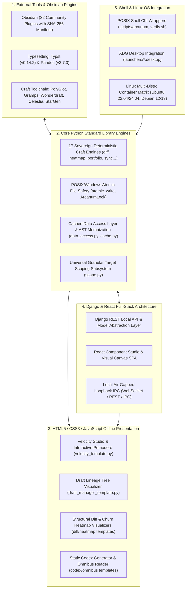

# Technology Stack — Ars Arcanum (Scriptorium)

## Core Sections (Required)

### 1) Runtime Summary

| Area | Value | Evidence |
|:---|:---|:---|
| **Primary Language & Runtime** | Python 3.10+ Standard Library (`CPython 3.10`, `3.11`, `3.12`, `3.13`, `3.14`) | [`pyproject.toml#L10`](file:///pyproject.toml#L10), [`scripts/lib/_bootstrap.py#L1-L30`](file:///scripts/lib/_bootstrap.py#L1-L30), [`.github/workflows/ci.yml#L31`](file:///.github/workflows/ci.yml#L31) |
| **Package Manager & Build Backend** | `setuptools>=61.0` / `pip` editable install (`pip install -e .`) / Zero-pip runtime guarantee for core engines | [`pyproject.toml#L1-L20`](file:///pyproject.toml#L1-L20), [`AGENTS.md#L28-L30`](file:///AGENTS.md#L28-L30) |
| **Web & UI Framework Surface** | Pure HTML5 / Modern CSS / Vanilla JavaScript (Offline CSP-isolated templates) + Django REST API & React Studio Hub Hybrid Architecture | [`scripts/lib/velocity_template.py#L1-L80`](file:///scripts/lib/velocity_template.py#L1-L80), [`scripts/lib/draft_manager_template.py#L1-L50`](file:///scripts/lib/draft_manager_template.py#L1-L50), [`scripts/lib/manuscript_diff_template.py#L1-L50`](file:///scripts/lib/manuscript_diff_template.py#L1-L50), [`docs/codebase/ARCHITECTURE.md#L20-L45`](file:///docs/codebase/ARCHITECTURE.md#L20-L45) |
| **Shell & Execution Systems** | POSIX Bash Shell (`scripts/arcanum`, `scripts/setup_arcanum.sh`, `scripts/verify.sh`), Windows Batch (`scripts/arcanum.cmd`), PowerShell (`scripts/setup_arcanum.ps1`) | [`scripts/arcanum#L1-L50`](file:///scripts/arcanum#L1-L50), [`scripts/arcanum.cmd#L1-L5`](file:///scripts/arcanum.cmd#L1-L5), [`scripts/setup_arcanum.sh#L1-L80`](file:///scripts/setup_arcanum.sh#L1-L80) |
| **Host OS & Linux Platform Integration** | Linux (Ubuntu, Debian, Arch, Fedora) via XDG `.desktop` launchers, systemd unit files (`configs/`), POSIX file locks (`fcntl.flock`), and Windows 10/11 (`msvcrt.locking`) | [`launchers/arcanum-app.desktop#L1-L15`](file:///launchers/arcanum-app.desktop#L1-L15), [`launchers/arcanum-hub.desktop#L1-L15`](file:///launchers/arcanum-hub.desktop#L1-L15), [`scripts/lib/lockfile.py#L35-L135`](file:///scripts/lib/lockfile.py#L35-L135) |
| **External Plugins & Toolchain** | 32 Pre-configured offline Obsidian plugins (`manifest.json`), Typst musl binary (`0.14.2`), Pandoc (`>=2.19.x`), PolyGlot, Gramps, Wonderdraft, Celestia, StarGen, novelWriter | [`templates/world-bible/.obsidian/plugins/manifest.json`](file:///templates/world-bible/.obsidian/plugins/manifest.json), [`docs/guides/EXTERNAL_TOOLS_AND_PLUGINS.md`](file:///docs/guides/EXTERNAL_TOOLS_AND_PLUGINS.md), [`docs/guides/SOFTWARE_CATALOG.md`](file:///docs/guides/SOFTWARE_CATALOG.md) |

---

### 2) Production Frameworks and Dependencies

The architecture operates across five cohesive stack layers:



#### Detailed Dependency Breakdown

| Dependency / Component | Version / Target | Role in System | Evidence |
|:---|:---|:---|:---|
| **Python Standard Library** (`os`, `sys`, `json`, `re`, `shutil`, `hashlib`, `tarfile`, `zipfile`, `xml.etree.ElementTree`, `dataclasses`, `typing`, `unittest`, `sqlite3`, `fcntl`, `msvcrt`) | 3.10+ | Zero-pip execution engine for all 17 core engines, locking primitives, and file safety | [`scripts/lib/_bootstrap.py#L1-L50`](file:///scripts/lib/_bootstrap.py#L1-L50), [`scripts/lib/cli.py#L1-L50`](file:///scripts/lib/cli.py#L1-L50), [`AGENTS.md#L20-L35`](file:///AGENTS.md#L20-L35) |
| **Typst** | `0.14.2` (Pinned musl static binary) | Sub-second commercial PDF book typesetting | [`scripts/setup_arcanum.sh#L317-L320`](file:///scripts/setup_arcanum.sh#L317-L320), [`docs/TYPOGRAPHY.md`](file:///docs/TYPOGRAPHY.md) |
| **Pandoc** | `>=2.19.x` (Tested `3.7.0`) | Universal document AST converter (Markdown $\leftrightarrow$ DOCX/EPUB/HTML) | [`docs/COMPATIBILITY.md#L9-L16`](file:///docs/COMPATIBILITY.md#L9-L16), [`scripts/lib/importer.py#L1-L60`](file:///scripts/lib/importer.py#L1-L60) |
| **Obsidian Plugin Suite** | 32 Pre-Configured Offline Plugins | Knowledge base and World Bible vault interface with verified SHA-256 digests | [`templates/world-bible/.obsidian/plugins/manifest.json`](file:///templates/world-bible/.obsidian/plugins/manifest.json), [`docs/guides/OBSIDIAN_PLUGINS.md`](file:///docs/guides/OBSIDIAN_PLUGINS.md) |
| **External Craft Toolchain** | PolyGlot, Gramps, Wonderdraft, Celestia, StarGen, novelWriter | Dedicated linguistics, genealogy, cartography, and astrophysics tooling | [`docs/guides/EXTERNAL_TOOLS_AND_PLUGINS.md`](file:///docs/guides/EXTERNAL_TOOLS_AND_PLUGINS.md), [`docs/guides/SOFTWARE_CATALOG.md`](file:///docs/guides/SOFTWARE_CATALOG.md) |
| **HTML5 / CSS / Vanilla JS** | W3C Modern Standard | Standalone offline visualizers with strict Content Security Policy (`default-src 'none'`) | [`scripts/lib/velocity_template.py#L160`](file:///scripts/lib/velocity_template.py#L160), [`scripts/lib/draft_manager_template.py#L1-L80`](file:///scripts/lib/draft_manager_template.py#L1-L80) |
| **Django & React Modernization Layer** | Django 5.x + React 19.x | Local full-stack web studio, REST API server, and interactive visual component system | [`docs/codebase/ARCHITECTURE.md#L250-L310`](file:///docs/codebase/ARCHITECTURE.md#L250-L310), [`docs/MODERNIZATION_PLAN.md`](file:///docs/MODERNIZATION_PLAN.md) |
| **POSIX Shell** | Bash / Dash / POSIX sh | Unified CLI bootstrap wrapper, multi-platform setup, and 7-stage verification harness | [`scripts/arcanum#L1-L50`](file:///scripts/arcanum#L1-L50), [`scripts/setup_arcanum.sh#L1-L100`](file:///scripts/setup_arcanum.sh#L1-L100), [`scripts/verify.sh#L1-L150`](file:///scripts/verify.sh#L1-L150) |
| **Linux OS Desktop Standard** | XDG Desktop Entry Specification | System application menus, icons, MIME bindings, and systemd timers | [`launchers/arcanum-app.desktop#L1-L15`](file:///launchers/arcanum-app.desktop#L1-L15), [`launchers/arcanum-hub.desktop#L1-L15`](file:///launchers/arcanum-hub.desktop#L1-L15) |

---

### 3) Development Toolchain

| Tool | Version | Purpose | Evidence |
|:---|:---|:---|:---|
| **Ruff** | `0.15.x` / `0.16.x` | Strict linting across 15 rule sets (`E`, `W`, `F`, `B`, `S`, `UP`, `SIM`, `I`, `RUF`, `C901`, `C4`, `PIE`, `RET`, `RSE`, `FLY`) | [`pyproject.toml#L20-L49`](file:///pyproject.toml#L20-L49), [`.github/workflows/ci.yml#L56-L60`](file:///.github/workflows/ci.yml#L56-L60) |
| **Mypy** | `1.15.0` | Strict static type checking with `check_untyped_defs = True` (114 source files verified clean) | [`mypy.ini#L1-L25`](file:///mypy.ini#L1-L25), [`tests/test_type_safety.py#L1-L40`](file:///tests/test_type_safety.py#L1-L40) |
| **Unittest** | Python Stdlib | 438 automated unit, integration, and security regression tests across 55 modules (100% pass) | [`tests/test_*.py`](file:///tests/), [`.github/workflows/ci.yml#L76-L81`](file:///.github/workflows/ci.yml#L76-L81) |
| **Parallel Runner** | Pure Python (`scripts/test_parallel.py`) | High-speed multi-core parallel test runner executing 55 test modules in ~2.5s | [`scripts/test_parallel.py#L1-L100`](file:///scripts/test_parallel.py#L1-L100) |
| **Coverage.py** | `7.6.x` | Test coverage enforcement and reporting (`fail_under = 80`, achieving 80%+) | [`pyproject.toml#L50-L71`](file:///pyproject.toml#L50-L71), [`.github/workflows/ci.yml#L76-L81`](file:///.github/workflows/ci.yml#L76-L81) |
| **Bandit** | `1.8.3` | Python AST Security Static Analysis (SAST) for security vulnerabilities | [`.github/workflows/ci.yml#L66-L70`](file:///.github/workflows/ci.yml#L66-L70) |
| **ShellCheck** | Latest Stable | POSIX shell script static analysis and security scanning | [`.github/workflows/ci.yml#L96-L99`](file:///.github/workflows/ci.yml#L96-L99) |

---

### 4) Key Commands

```bash
# 1. Package Installation (Development Mode)
pip install -e .

# 2. Automated Test Discovery (438 tests across 55 modules)
python -m unittest discover tests

# 3. High-Performance Multi-Worker Parallel Test Runner (~2.5s)
python scripts/test_parallel.py

# 4. Coverage Enforcement (>=80% floor)
coverage run -m unittest discover tests; coverage report --fail-under=80

# 5. Strict Linter Pass (0 violations across 15 rule sets)
ruff check .

# 6. Strict Static Type Checking (114 source files clean)
mypy --explicit-package-bases scripts tests

# 7. Shell Script Static Analysis & Syntax Verification (Linux/POSIX)
bash -n scripts/*.sh scripts/arcanum
shellcheck -S warning scripts/*.sh scripts/arcanum

# 8. Canonical 7-Stage Master Packaging & Verification Harness (POSIX)
bash scripts/verify.sh --require-tools

# 9. Unified Toolchain & Lore Health Diagnostic Doctor
python scripts/arcanum doctor
```

---

### 5) Environment and Config

- **Configuration Sources**: `~/.config/ars-arcanum/config.json`, `constitution.yaml`, `world.yaml`, `manuscript.yaml`.
- **Active State Stores**: `.arcanum/.sprint_state.json`, `.sync_state.json`, `.arcanum_cache.json`.
- **Environment Variables**:
  - `XDG_CONFIG_HOME`: Custom configuration directory override (default: `~/.config`).
  - `ARCANUM_WORKSPACE`: Root workspace directory override.
  - `PYTHONUTF8=1`: Enforced across all CLI runners for deterministic Unicode encoding.
- **Offline Security Constraint**: Strict air-gapped Content Security Policy enforced on all generated HTML reports:
  ```html
  <meta http-equiv="Content-Security-Policy" content="default-src 'none'; style-src 'unsafe-inline'; script-src 'unsafe-inline'; img-src data:; media-src data: blob:;">
  ```

---

### 6) Evidence

- [`pyproject.toml#L1-L75`](file:///pyproject.toml#L1-L75)
- [`mypy.ini#L1-L25`](file:///mypy.ini#L1-L25)
- [`AGENTS.md#L1-L85`](file:///AGENTS.md#L1-L85)
- [`scripts/lib/_bootstrap.py#L1-L120`](file:///scripts/lib/_bootstrap.py#L1-L120)
- [`scripts/lib/cli.py#L1-L120`](file:///scripts/lib/cli.py#L1-L120)
- [`scripts/arcanum#L1-L120`](file:///scripts/arcanum#L1-L120)
- [`scripts/setup_arcanum.sh#L1-L150`](file:///scripts/setup_arcanum.sh#L1-L150)
- [`.github/workflows/ci.yml#L1-L180`](file:///.github/workflows/ci.yml#L1-L180)
- [`templates/world-bible/.obsidian/plugins/manifest.json`](file:///templates/world-bible/.obsidian/plugins/manifest.json)
- [`docs/guides/EXTERNAL_TOOLS_AND_PLUGINS.md`](file:///docs/guides/EXTERNAL_TOOLS_AND_PLUGINS.md)
- [`docs/guides/SOFTWARE_CATALOG.md`](file:///docs/guides/SOFTWARE_CATALOG.md)
