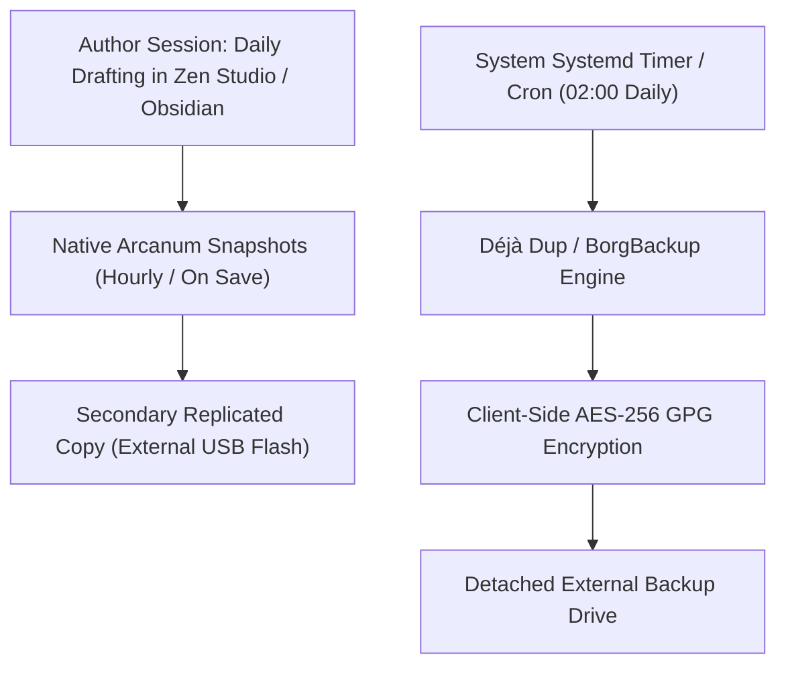

# Sovereign Backup Architecture & Automated Disaster Recovery (`docs/guides/BACKUP_SETUP.md`)
> **Domain G: Publishing, Preflight & Infrastructure** | **CLI:** `arcanum backup` / `arcanum restore`

---

## 1. Overview & Architectural Rationale

An author's manuscript and World Bible represent years of concentrated intellectual capital. Disk failures, accidental deletions, filesystem bit-rot, ransomware, or lost hardware can instantly destroy a creative career if resilient backup protocols are not established.

Ars Arcanum enforces the **Sovereign 3-2-1 Disaster Recovery Standard**:
- **3 Copies of Data**: 1 active working copy + 2 verified backup snapshots.
- **2 Different Storage Media**: Fast local NVMe/SSD working drive + detached physical USB/HDD storage or encrypted external filesystem.
- **1 Air-Gapped or Offsite Replica**: A detached physical drive stored in a separate physical location or an encrypted self-hosted remote vault (e.g. Nextcloud/BorgBackup).

```
+-------------------------------------------------------------------------------+
|                   SOVEREIGN 3-2-1 DISASTER RECOVERY PIPELINE                  |
|                                                                               |
|  [Tier 1: Active Working Tree]  --> NVMe / SSD (~/Manuscripts/ & ~/Worlds/)   |
|                                                                               |
|  [Tier 2: Local Project Snapshots] -> tar.gz with SHA-256 Checksums           |
|                                                                               |
|  [Tier 3: Secondary USB/Airgap] -> Replicated to Detached External Storage    |
|                                                                               |
|  [Tier 4: Automated OS Daemon]  -> Déjà Dup / Borg / Timeshift Incremental    |
|                                                                               |
|  [Verification: Monthly Fire-Drill Automated Restoration Test]                |
+-------------------------------------------------------------------------------+
```

---

## 2. Mathematical Durability & Cryptographic Integrity

### 2.1 Cryptographic Checksum Validation
Every backup archive compiled by Ars Arcanum generates a sidecar SHA-256 manifest:

$$\text{Digest}(A) = \text{SHA-256}\big(\text{Payload}(A)\big) \in \{0, 1\}^{256}$$

Upon replication to secondary USB media or prior to restoration, the engine computes:

$$\Delta_{\text{integrity}} = \begin{cases} 0 & \text{if } \text{SHA-256}(A_{\text{target}}) == \text{Digest}(A_{\text{source}}) \\ 1 & \text{otherwise (Corrupted Bits Detected)} \end{cases}$$

If $\Delta_{\text{integrity}} \ne 0$, restoration is blocked immediately to prevent corrupting workspace state.

### 2.2 Mean Time Between Failures (MTBF) & Loss Probability
Given single-drive annualized failure rate $p_{\text{fail}} \approx 0.03$ (3% per year), the joint annual failure probability across $k$ independent backup media is:

$$P(\text{Catastrophic Data Loss}) = \prod_{i=1}^k p_{\text{fail}, i} = (0.03)^3 = 2.7 \times 10^{-5} \quad (0.0027\%)$$

---

## 3. Dual-Target Native CLI Backup Engine

Ars Arcanum includes a native, pure-Python dual-target archive manager that operates without external cloud dependencies:

```bash
# 1. Configure persistent secondary replication target (e.g., USB Drive)
arcanum backup-dest set /media/username/SecureUSB/ArsArcanumBackups

# 2. View active backup destination status
arcanum backup-dest get

# 3. Create verified dual-target snapshot of active novel
arcanum backup Manuscripts/Book-01/

# 4. Verify integrity of an archive without restoring
arcanum backup-verify Backups/Book-01_20261006_110000.tar.gz

# 5. Restore manuscript archive to a target directory
arcanum restore Backups/Book-01_20261006_110000.tar.gz -o /tmp/Restored_Book01/
```

---

## 4. System-Level Automated Backups (Déjà Dup & BorgBackup)



### Configuration Steps for Déjà Dup (Linux Mint / XFCE / Ubuntu):
1. **Folders to Save**: Add `~/Manuscripts`, `~/Worlds`, `~/Universes`.
2. **Folders to Ignore**: Add `.git/`, `dist/`, `__pycache__/`, `Downloads/`.
3. **Storage Location**: Point to your mounted USB volume or local NAS.
4. **Encryption**: Select **Password Protect Backup** and input an authoritative passphrase.
5. **Schedule**: Set **Automatic Backup** to `ON` (Daily), keeping backups for *At Least 1 Year*.

---

## 5. The Monthly Restoration Fire-Drill Protocol

A backup that has never been tested is not a backup—it is merely an unverified hypothesis. Conduct this 3-minute drill on the 1st of every month:

1. **Step 1**: Locate your latest external archive `Book-01_<date>.tar.gz`.
2. **Step 2**: Execute sandbox restoration:
   ```bash
   arcanum restore /media/username/SecureUSB/ArsArcanumBackups/Book-01_Latest.tar.gz -o /tmp/FireDrill_Audit/
   ```
3. **Step 3**: Run the preflight verifier on restored files:
   ```bash
   arcanum preflight /tmp/FireDrill_Audit/
   ```
4. **Step 4**: Confirm that total word count and latest chapter edits match working memory.
5. **Step 5**: Purge `/tmp/FireDrill_Audit/`.

---

## 6. Recommended Reading, References & Media

### 6.1 Data Preservation & Storage Reliability Treatises
- **Chisnall, David (2008)**. *The Definitive Guide to SQLite*. Apress. ISBN: 978-1590596739.  
  *Database journaling, atomic transactions, and write-ahead log backup integrity.*
- **Tanenbaum, Andrew S. (2014)**. *Modern Operating Systems* (4th Edition). Pearson.  
  *Storage reliability, RAID configurations, and MTBF mathematical models.*

### 6.2 Industry Standards & Backup Frameworks
- **US Cybersecurity and Infrastructure Security Agency (CISA)**. *Data Backup Strategies and the 3-2-1 Rule*. [cisa.gov](https://www.cisa.gov/).  
  *Governmental guidelines for preventing catastrophic data loss and ransomware recovery.*
- **BorgBackup Project Contributors (2024)**. *Deduplicating Archiver with Authenticated Encryption*. [borgbackup.readthedocs.io](https://borgbackup.readthedocs.io/).  
  *The technical specification for client-side encrypted chunk-level deduplication.*

### 6.3 Video Lectures & Practical Author Tutorials
- **Brandon Sanderson's BYU Creative Writing Lectures**: *How to Protect Your Manuscripts from Disaster*.  
  *Brandon explains his historical multi-drive backup rituals and why writers must automate backups.*
- **Writing Excuses**: *Episode 8.14: Disaster Preparedness for Creative Professionals*.  
  *Real-world accounts of authors recovering from stolen laptops and hardware crashes.*
