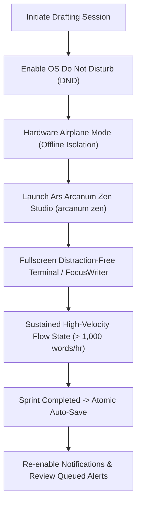

# Sovereign Distraction Control, Cognitive Flow & Deep Drafting Guide (`docs/guides/DISTRACTION_CONTROL.md`)
> **Domain E: Manuscript Drafting, Focus & Output** | **CLI:** `arcanum zen` / `arcanum sprint`

---

## 1. Overview & Cognitive Flow Rationale

The primary bottleneck in literary production is rarely typing speed; it is **attention fragmentation**. Modern computing operating systems are engineered to harvest user attention through notifications, ambient banners, audio pings, and background sync badges.

In speculative fiction drafting, an author must sustain a complex multi-dimensional simulation in working memory: tracking five character motivations, acoustic dialogue rhythms, atmospheric light, geographic layout, and thematic subtext simultaneously. A single notification ping collapses this mental simulation.

```
+-------------------------------------------------------------------------------+
|                    THE COST OF COGNITIVE ATTENTION FRAGMENTATION              |
|                                                                               |
|  [Deep Simulation State]  --> 100% Focused Working Memory (Flow: 1,200 wph)   |
|         |                                                                     |
|         v (Notification Ping: 3-second interruption)                          |
|  [Context Collapse]       --> Working memory flushed to zero                  |
|         |                                                                     |
|         v (Attention Residue: Gloria Mark Curve)                              |
|  [Recovery Lag]           --> 23.25 minutes required to rebuild mental model  |
|                                                                               |
|  [Result: 3 pings per hour destroys 100% of deep drafting capacity]           |
+-------------------------------------------------------------------------------+
```

Ars Arcanum provides an air-gapped, zero-telemetry writing environment designed to protect the author's psychological **Flow State** (Csikszentmihalyi) and enable sustained **Deep Work** (Newport).

---

## 2. Mathematical Formalism of Cognitive Switching Penalties

### 2.1 Attention Residue & Recovery Lag (Gloria Mark Formula)
Empirical human-computer interaction studies (Mark et al., UC Irvine) show that resuming complex cognitive tasks after an interruption requires an average recovery duration $T_{\text{recovery}} \approx 23.25\text{ minutes}$.

Let $N_{\text{interruptions}}$ be the number of distraction events per hour:

$$\text{Effective Deep Work Time} = \max\left(0.0, \; 60 - N_{\text{interruptions}} \times 23.25\right) \text{ minutes/hour}$$

If an author experiences just 3 notification pings in an hour:
$$\text{Deep Time} = \max(0, 60 - 3 \times 23.25) = 0.0\text{ minutes}$$
The author remains permanently trapped in fragmented shallow recovery mode.

```
Working Memory Depth vs Time:
Depth
  ^
10|           [Flow State Reached]
  |              .----------------.
  |          . '                    \ (Interruption!)
  |       .'                         \
  |     .'                            ' . . . . . . . . . [Attention Residue Lag]
  |   .'                                                 \
  |  /                                                    \__________
  +--+----------------------------------------------------+----------+------> Time (min)
     0                       25                           45         60
```

---

## 3. System-Level Distraction Suppression Workflows



### 3.1 Linux Mint / XFCE / Ubuntu Do Not Disturb Setup
1. **System Tray Notification Toggle**:
   - Click the **Notification Icon** (bell) in the panel tray.
   - Toggle **Do Not Disturb** to `ON`. All visual alerts and chimes are suppressed and queued silently for post-session review.
2. **Dedicated One-Touch DND Keyboard Shortcut**:
   - Open **Settings** $\to$ **Keyboard** $\to$ **Application Shortcuts**.
   - Add command: `xfconf-query -c xfce4-notifyd -p /do-not-disturb -T`
   - Bind to `Super + D` or `Ctrl + Alt + D`.

### 3.2 FocusWriter & Zen Studio Fullscreen Mode
- **FocusWriter**: Press `F11` for true fullscreen drafting with customizable background canvas and ambient mechanical typing acoustics.
- **Ars Arcanum Zen Studio**:
  ```bash
  # Launch distraction-free terminal drafting canvas with 25-minute sprint timer
  arcanum zen Manuscripts/Book-01/Chapter_01.md --sprint 25
  ```

---

## 4. Recommended Reading, References & Media

### 4.1 Foundational Psychology & Deep Work Treatises
- **Csikszentmihalyi, Mihaly (1990)**. *Flow: The Psychology of Optimal Experience*. Harper & Row. ISBN: 978-0061339202.  
  *The landmark psychological treatise defining flow states, autotelic focus, and peak creative output.*
- **Newport, Cal (2016)**. *Deep Work: Rules for Focused Success in a Distracted World*. Grand Central Publishing. ISBN: 978-1455586691.  
  *The defining modern analysis of attention economics, attention residue, and the competitive advantage of distraction-free cognitive focus.*
- **Mark, Gloria (2023)**. *Attention Span: A Groundbreaking Way to Restore Balance, Happiness and Productivity*. Hanover Square Press. ISBN: 978-1335449412.  
  *Empirical research on workplace interruptions, cognitive switching costs, and focus recovery times.*

### 4.2 Video Lectures, Masterclasses & Creative Focus Media
- **Brandon Sanderson's BYU Creative Writing Lectures**: *Maintaining Focus: The Habit and Routine of Professional Authors*.  
  *How Brandon structures 4-hour uninterrupted drafting blocks to produce 1 million words per year.*
- **Writing Excuses**: *Episode 9.18: Establishing a Sacred Writing Routine*.  
  *Techniques for defending authorial time and mental space from external intrusion.*
- **Andrew Huberman (Huberman Lab)**: *The Science of Focus, Attention, and Flow States*.  
  *Neurobiological mechanisms of dopamine, acetylcholine, and circadian focus intervals.*

### 4.3 Landmark Speculative Case Studies
- **Martin, George R.R.**: *Air-Gapped DOS Machine Drafting Ritual*.  
  *Why George R.R. Martin writes on a dedicated machine without internet access or modern notifications.*
- **King, Stephen**: *On Writing* ("The Closed Door Rule").  
  *Writing with the door closed (first draft for yourself) versus writing with the door open (revisions for readers).*
